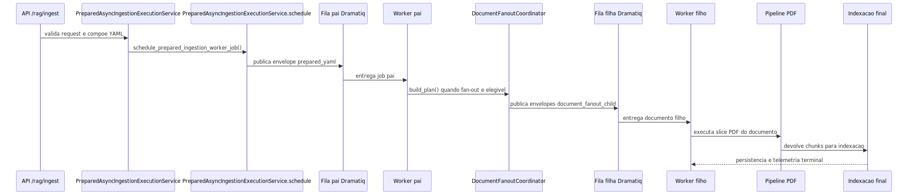
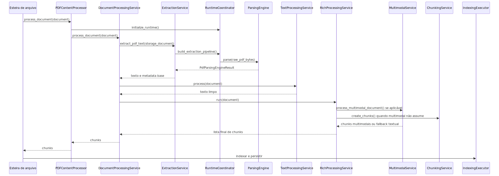

# Manual técnico do pipeline de ingestão de PDF

## 1. O que este documento cobre

Este manual técnico explica o comportamento real do pipeline de PDF no código lido. O foco aqui não é vender a capacidade nem resumir o tema. O foco é seguir a ordem de execução, entender o contrato YAML que altera o comportamento, explicar os principais branches e deixar claro como diagnosticar o ponto exato onde um PDF falhou.

## 2. Entry point e boundary real

O ponto de entrada do slice PDF é o `PDFContentProcessor`, mas o boundary oficial de processamento do documento não fica concentrado nele. O método `process_document` do processor delega para `PdfDocumentProcessingApplicationService`, que faz a sequência canônica:

1. validar se o document realmente é processável pelo processor;
2. registrar log estruturado de início;
3. chamar `pre_process_hook`;
4. executar o fluxo rico do PDF;
5. chamar `post_process_hook`;
6. registrar outcome final;
7. limpar recursos do runtime no `finally`.

Isso é relevante porque o `PDFContentProcessor` funciona mais como host de serviços do que como lugar onde toda a inteligência mora.

### 2.1. Boundary HTTP que agenda o job pai

No produto real, o PDF quase nunca nasce direto no `PDFContentProcessor`. Antes disso, a requisição pública entra em `POST /rag/ingest`, registrado por `src/api/routers/rag_ingestion_router.py` e orquestrado por `src/api/routers/rag_runtime_ingestion_compat.py`.

O fluxo confirmado nesse boundary é este:

1. normalizar `correlation_id` e montar `task_id` derivado;
2. identificar `user_email` efetivo;
3. compor o YAML com `load_yaml_config_with_session`;
4. resolver `document_parallelism` efetivo;
5. forçar `execution_mode` suportado para `direct_async`;
6. delegar para `schedule_prepared_ingestion_worker_job`.

Em linguagem simples: a API pública não executa o PDF. Ela prepara o contexto, publica um job pai na fila oficial e devolve um contrato HTTP de acompanhamento.

### 2.2. Envelope canônico que sai da API

O slice lido confirma três envelopes distintos para ingestão assíncrona:

- `prepared_yaml`: usado quando a API já resolveu o YAML e publica o job pai pronto para execução no worker;
- `resolve_on_worker`: usado quando o payload sobe criptografado e a resolução do YAML acontece no worker;
- `document_fanout_child`: usado somente para filho de fan-out por documento, sempre com `dispatch_mode=document_fanout_child` e `document_parallelism=1`.

O detalhe importante é que esses envelopes não são equivalentes. O pai transporta o lote e a decisão operacional. O filho transporta uma unidade documental específica já inventariada pelo pai.

### 2.3. Runtime do worker e topologia física

O processo worker oficial sobe por `app/worker_main.py` e delega para `app/runners/worker_runner.py`. Nesse bootstrap, o runtime exige explicitamente `consumer_runtime=dramatiq` e backend `rabbitmq` antes de iniciar `WorkerProcessRuntime`.

Dentro de `src/api/services/async_job_dramatiq.py`, o runtime assíncrono registra actors separados para filas de papel diferente. O contrato observado no código é:

- fila pai para ingestão preparada e resolve-on-worker;
- fila filha para `document_fanout_child`;
- pools isolados por role, para que o consumo do pai não concorra com o consumo do filho no mesmo slot lógico.

Isso é relevante porque o paralelismo do PDF não acontece por thread mágica dentro do mesmo método. Ele acontece por publicação explícita de envelopes filhos em fila separada, consumidos por workers filhos dedicados.

### 2.4. Papel do job pai e do job filho

O job pai não existe para parsear PDF. Ele existe para orquestrar o lote.

No caminho atual, `IngestionParentJobHandler` delega para a execução assíncrona de ingestão. Quando o fan-out documental é elegível, `IngestionService` chama `DocumentFanoutCoordinator.build_plan`, inventaria os documentos e publica filhos até o limite operacional disponível.

O job filho, por sua vez, entra por `IngestionDocumentJobHandler` e delega para `DocumentFanoutChildExecutorService`. É ele quem executa uma unidade documental real, consulta a gate canônica de execução, respeita cancelamento cooperativo, persiste estado terminal e só então reconhece a mensagem como concluída.

O ponto operacional mais importante é este:

- pai coordena e publica;
- filho processa documento;
- PDF local em filesystem não compartilhado não entra em fan-out paralelo real;
- fan-out só faz sentido para fontes remotas replayable e compartilháveis entre processos.

### 2.5. Sequência ponta a ponta do PDF assíncrono

Esse diagrama resume a fronteira correta: o pipeline PDF continua existindo, mas ele roda dentro do job filho quando o lote foi quebrado por documento. O job pai prepara a estrada; o filho percorre a estrada.

## 3. Configuração que governa o runtime

### 3.1. Caminho canônico do YAML

O resolvedor central de configuração de PDF lê o contrato canônico em `ingestion.content_profiles.type_specific.pdf`. O código rejeita caminhos legados como `content_profiles.type_specific.pdf`, `ingestion.pdf` e `pdf` na raiz.

Isso significa que a origem de verdade do runtime PDF é o bloco tipado da ingestão, não um atalho espalhado no YAML.

### 3.2. Defaults confirmados no código

O resolvedor define uma base interna para PDF com blocos de:

- parsing;
- chunking;
- cleaning;
- tables;
- OCR por página e document-level;
- preprocessing;
- references;
- page classification;
- multimodalidade;
- quality filters;
- attachments;
- metadata.

Esses defaults existem para o runtime nascer com um contrato mínimo coerente. Eles não substituem o YAML do cliente, mas mostram qual comportamento o processor espera se nada for sobrescrito.

### 3.3. Contratos removidos ou proibidos

O código falha explicitamente quando encontra contratos antigos ou proibidos em pontos críticos. Exemplos confirmados:

- `processing.parsing.engine` foi removido; o core exige `processing.parsing.base.options`.
- `processing.ocr.engine` não é aceito; o core exige `processing.ocr.base.options`.
- `processing.tables.fallback` não é aceito; o contrato é `processing.tables.base.options`.
- `processing.ocr.document_preprocessing.fallback_enabled` não é aceito; a fila document-level não expõe fallback por engine.

Esse fail-fast é importante porque evita que o runtime aceite caminhos velhos e pareça funcionar por sorte.

### 3.4. Gate canônica de admissão do fan-out documental

Quando o pipeline PDF roda com paralelismo por documento, RabbitMQ e Dramatiq fazem apenas o transporte do envelope. Eles podem reentregar mensagem antiga, atrasar mensagem ou acordar um job filho depois que o pai já terminou. Isso não é bug da fila. Isso é comportamento normal de transporte assíncrono.

Quem decide se o filho ainda pode trabalhar é o plano de controle durável no PostgreSQL. No código atual, essa decisão fica centralizada em `DocumentFanoutExecutionGate`, em `src/services/document_fanout_execution_gate.py`.

A gate consulta duas visões canônicas do pai antes de liberar o filho:

- `fetch_run_record`, para ler o run pai em `ingestion_runs`.
- `fetch_document_fanout_runtime_state`, para ler o estado agregado do fan-out.

Se qualquer uma dessas consultas críticas falhar, o comportamento correto é falhar fechado. Em linguagem simples: se o sistema não consegue confirmar no banco que o pai ainda está executável, o filho não baixa PDF, não faz OCR, não parseia e não republica outro filho.

O contrato mínimo real da decisão é este:

- `allowed`: diz se o filho pode executar ou publicar.
- `reason_code`: explica por que a gate liberou ou bloqueou.
- `route`: informa se a decisão foi tomada para `execute`, `auto_recovery`, `auto_promotion` ou `dispatch_candidate`.
- `parent_status`: mostra o status canônico do pai usado na decisão.
- `child_status`: mostra o status conhecido do filho no momento da consulta.
- `cancel_requested`: informa se o pai já entrou em cancelamento cooperativo.
- `result_status`: indica o status terminal padrão esperado quando a rota é bloqueada.

Na prática, isso impede a família de bugs de job filho fantasma. Se uma mensagem antiga acordar depois que o pai ficou `cancelled`, `cancelling`, `completed` ou `failed`, a gate registra o motivo e o trabalho caro para ali.

Essa gate precisa ser a única autoridade de admissão. O executor do filho, o auto-recovery, o auto-promotion e a promoção do próximo `queued` podem ter validações locais de infraestrutura, mas não devem manter regras paralelas para decidir se o pai ainda aceita execução.

## 3.1 O que “cancelar” significa de verdade no fan-out PDF

Neste pipeline, cancelamento é cooperativo e durável. Isso quer dizer que o plano de controle registra o cancelamento, bloqueia novos trabalhos e deixa rastreável o que ainda está em drenagem.

Na prática:

- `queued` e `retrying` devem ser cancelados sem iniciar OCR, parsing ou republicação;
- mensagens antigas do broker continuam sendo tratadas como transporte atrasado, não como autorização para trabalhar;
- `running` e `processing` só param quando chegam a um checkpoint de cancelamento ou quando o estado ativo fica stale e entra em reconciliação;
- `broker_drain_status=unsupported_bounded` significa limitação de observabilidade física por run, não falha da regra de cancelamento.

Essa distinção é importante para operação. Se ainda existe drenagem, isso não quer dizer que o cancelamento falhou. Quer dizer apenas que o sistema já neutralizou o trabalho novo e está encerrando, de forma segura, o que tinha começado antes do pedido de cancelamento.

## 4. Bootstrap do runtime PDF

O bootstrap é centralizado por `PdfRuntimeCoordinator.initialize_runtime`. A ordem observada é esta:

1. fixa `ContentType.PDF` como tipo suportado;
2. configura logging auxiliar de pdfminer;
3. resolve todas as seções do runtime por `resolve_pdf_runtime_snapshot`;
4. inicializa parâmetros de chunking;
5. inicializa OCR por página e OCR document-level;
6. inicializa runtime de tabelas;
7. inicializa filtros de qualidade e classificação;
8. inicializa metadata, imagens e anexos;
9. monta os serviços de suporte ao parsing;
10. constrói pipelines explícitos de extração e texto;
11. inicializa flags multimodais;
12. aplica overrides de domínio e registra resumo final do runtime.

Em outras palavras, antes de tocar num PDF específico, o processor já resolveu qual mundo operacional será usado.

O detalhe pouco visível, mas importante, é que esse bootstrap conversa com o mesmo sistema central de domain processing usado por outros tipos de conteúdo. Primeiro `_setup_domain_processing` cria `DomainProcessingResolver`. Depois `_apply_domain_overrides` percorre os domínios habilitados e faz merge de `pdf_overrides` quando `apply_globally=true`. Na prática, o domínio não serve apenas para enriquecer chunks no fim; ele também pode ajustar o runtime PDF antes da extração, desde que o YAML mande isso explicitamente.

## 5. Builder do runtime de parsing

`PdfParsingRuntimeBuilder.build` monta o bundle principal do parsing PDF.

- `PdfReferenceDetector`
- `PdfOcrService`
- `PdfDocumentOcrService`
- `PdfTableService`
- `PdfPagesInfoBuilder`
- `PdfMetadataBuilder`
- `PymupdfPdfParsingEngine`
- engine final resolvida por `PdfParsingEngineResolver`

O detalhe técnico importante é que o builder sempre monta uma implementação PyMuPDF local e depois pede ao resolvedor para decidir se ela será usada diretamente ou se será encapsulada como uma opção dentro da fila determinística.

## 6. OCR document-level antes do parsing

### 6.1. Quando ele existe

O OCR document-level é governado por `PdfDocumentOcrService`. Ele não é o OCR leve de imagens isoladas. Ele é um pré-processamento do PDF inteiro, pensado para melhorar documentos com cara de scan ou com texto suspeito.

### 6.2. Como a decisão é tomada

O serviço usa `PdfDocumentOcrAnalyzer`, que abre o PDF com PyMuPDF e mede sinais heurísticos em páginas amostradas.

- quantidade de texto por página;
- densidade de texto;
- razão de páginas vazias;
- razão de páginas com pouco texto;
- suspeita de texto ruim via alpha ratio;
- sparsidade geral de páginas com texto.

Com isso, ele constrói uma decisão consolidada.

- `apply=True` se os sinais justificarem o custo.
- `apply=False` se o texto nativo parecer suficiente.

### 6.3. Engine permitida

O contrato de `processing.ocr.document_preprocessing.base.options` aceita apenas `ocrmypdf` no slice lido. Isso reduz pluralidade, mas aumenta previsibilidade do estágio documental.

### 6.4. Runtime preflight

Antes de rodar, o serviço verifica se o runtime está pronto. Se a infraestrutura obrigatória não estiver disponível, ele registra falha de prontidão, aciona circuit breaker do escopo document-level e devolve resumo operacional sem tentar OCR.

### 6.5. Implicação prática

Esse estágio tenta resolver um problema anterior ao parsing. Ele pergunta: vale a pena melhorar o PDF antes de escolher a engine que vai extrair o conteúdo?

## 7. Pipeline de extração

O pipeline de extração é criado por `PdfRuntimeCoordinator.build_extraction_pipeline` com quatro stages explícitos.

### 7.1. `ValidatePdfBytesStage`

Valida duas coisas obrigatórias.

- o arquivo precisa ter bytes;
- os bytes precisam começar com a assinatura `%PDF`.

Se falhar aqui, o pipeline interrompe de forma explícita. Não existe parsing de PDF sem PDF real.

### 7.2. `ApplyDocumentOcrStage`

Executa `PdfDocumentOcrService.maybe_preprocess_pdf`. O retorno pode manter os bytes originais ou substituí-los pelos bytes pré-processados, sempre com resumo operacional da decisão.

### 7.3. `ParseViaEngineStage`

Executa a engine final de parsing. Esse stage registra início, duração, engine usada, tamanho dos bytes e quantidade de caracteres retornados. Se a engine lança exceção ou devolve `None`, o stage aborta a extração.

### 7.4. `ApplyEngineResultStage`

Transforma o resultado da engine em um `persistence_payload` final com texto, engine result e resumo do OCR documental. A persistência de metadata só acontece no final, não no meio do stage.

## 8. Resolvedor determinístico de engines

### 8.1. Contrato de options

O resolvedor de parsing usa `processing.parsing.base.options`. Cada option define:

- engine;
- mode;
- trigger com mínimo de caracteres e densidade.

Os modes aceitos no parser comum são estes:

- `default`, quando a engine faz parte da fila padrão e deve permanecer elegível como opção regular da composição;
- `auto`, quando a engine depende dos gatilhos objetivos de texto e densidade para entrar;
- `always`, quando a option é obrigatória e a indisponibilidade deve falhar fechado;
- `never`, quando a option permanece declarada, mas é intencionalmente desativada.

### 8.2. Engines suportadas confirmadas

- `pymupdf`
- `pymupdf4llm`
- `docling`
- `pypdf`
- `pdfplumber`
- `unstructured`
- `gmft`
- `marker`

### 8.3. Disponibilidade e modes

Antes de instanciar algumas engines opcionais, o resolvedor verifica dependências externas. Se a engine estiver indisponível:

- `mode=default` ou `mode=always` causam falha explícita;
- outros modes podem gerar uma `DisabledPdfParsingEngine` respeitando a política de disponibilidade.

### 8.4. Orquestrador determinístico

`DeterministicLegoPdfParsingEngine` tenta as engines na ordem do YAML. A próxima só entra quando a anterior falha, devolve resultado insuficiente ou não alcança sucesso formal.

Além disso, o engine determinístico:

- normaliza o contrato canônico do resultado;
- tenta detectar criptografia do PDF por `fitz` ou `pypdf` quando necessário;
- mantém score do melhor resultado parcial;
- aplica `strict_first_success` ou `best_effort` ao final.

### 8.5. Por que isso e uma arquitetura plug-and-play

Tecnicamente, o comportamento plug-and-play nasce da combinação de quatro peças coesas.

- `PdfBaseOptionsParser` valida e normaliza a fila ordenada de options em um contrato comum.
- `PdfParsingEngineResolver` recebe cada option e faz o wiring apenas das engines suportadas pelo runtime.
- `DeterministicLegoPdfParsingEngine` executa a composição na ordem do YAML, carregando contexto da tentativa anterior, motivo do handoff e política de falha.
- `PdfParsingRuntimeBuilder` e `PdfRuntimeCoordinator` consomem a engine final resolvida sem reescrever o fluxo principal por nome de engine.

Esse arranjo tem uma consequência prática importante: trocar a ordem entre `docling`, `pymupdf4llm`, `pdfplumber` ou outra engine suportada não exige mudar o core do pipeline. O que muda é a fila declarada em `processing.parsing.base.options`. O orquestrador permanece neutro e só executa o contrato.

O limite também precisa ficar explícito. Plug-and-play, aqui, não quer dizer aceitação automática de qualquer engine externa. A engine precisa estar suportada no resolvedor, respeitar o contrato de parsing PDF e passar pela política de disponibilidade do runtime.

### 8.6. Consequência operacional

Isso transforma o parsing em um runtime governado, não em uma decisão fixa. O YAML controla a fila; o core apenas executa e observa.

Também elimina fallback escondido por conveniência. Quando uma engine indisponível está em `mode=default` ou `mode=always`, o runtime pode falhar fechado. Quando a option permite indisponibilidade, a engine vira uma `DisabledPdfParsingEngine` observável, e não um desvio silencioso.

### 8.7. Contrato canônico enriquecido (v2) e coleta de estrutura governada por YAML

> Estado comprovado em runtime (run real Docling sobre PDFs reais). Recursos estruturais
> permanecem **desligados por default**: nada disto muda o comportamento de hoje enquanto o YAML não
> ligar os flags.

**O que é o contrato canônico.** Toda engine de parsing devolve o mesmo objeto tipado,
`PdfParsingEngineResult` (em `src/ingestion_layer/pdf_tools/pdf_parsing_engine_contract.py`). É sobre
ele que o pipeline trabalha — o core nunca toca `DoclingDocument` ou `Element` do Unstructured
diretamente. A versão do contrato é registrada em `metadata_contract_version`, hoje **2**.

**Campos estruturais (novos, opcionais, aditivos — contrato v2).** Além dos campos atuais (texto,
tabelas, sumários, qualidade), o resultado pode transportar, **quando os recursos estão ligados por
YAML**:

- `structured_blocks`: blocos/elementos tipados (texto + categoria + página + bbox + ordem de leitura
  + provenance);
- `sections`: hierarquia de seções (título + nível + página);
- `structured_images`: imagens estruturadas (página + bbox + tipo);
- `engine_provenance`: engine + versão + configuração efetivamente aplicada;
- `extraction_issues`: erros/avisos da extração;
- `PdfParsedTable.bbox`: posição da tabela na página.

Todos têm default vazio (`()`/`None`): se o recurso estiver desligado, o objeto é idêntico ao de
hoje. Os tipos são dataclasses imutáveis (frozen+slots), o que permite que a estrutura atravesse o
subprocesso do Docling por serialização JSON sem perda (ver 8.8).

**Coleta governada por YAML, simétrica entre engines.** A estrutura só é coletada quando o YAML liga
o recurso da engine:

- **Docling** — `processing.parsing.docling.do_table_structure` (TableFormer), `do_ocr`,
  `force_backend_text`, `generate_picture_images`. Com `force_backend_text=true` e tudo desligado (o
  default), o Docling usa o caminho rápido só-texto e **não** coleta estrutura. Quando algum recurso
  é ligado, o caminho rico coleta blocos/seções/imagens do `DoclingDocument` e mapeia tabelas com
  bbox.
- **Unstructured** — `processing.parsing.unstructured.infer_table_structure` (default `false`). Lido
  por `get_pdf_unstructured_config`, simétrico a `get_pdf_docling_config`. Quando ligado, coleta
  `category`/`coordinates`/`text_as_html` e produz a mesma estrutura canônica do Docling.

As duas engines produzem **os mesmos tipos** do contrato — não há pipeline paralelo. A leitura de
config é tipada nos dois lados (sem navegação de dict cru).

**Capacidade declarada x efetiva (sem mentir).** O perfil de capacidade de cada engine declara o que
ela **sabe** entregar; o resultado também reporta o que a execução **de fato** entregou:
`engine_effective_output_mode` (`text_only`/`text_plus_tables`/`structured`) e
`engine_effective_capabilities`. Assim, uma execução que não produziu estrutura (ex.: PDF escaneado
sem OCR) é reportada como `text_only` mesmo que o perfil declare `text_plus_tables`.

### 8.8. Travessia do subprocesso do Docling

O Docling roda isolado em subprocesso. O processo filho serializa o resultado com `asdict` (todos os
campos do contrato, inclusive os estruturais novos); o processo pai reconstrói o objeto em
`_rebuild_result` (`docling_pdf_parsing_subprocess.py`), campo a campo, incluindo blocos, seções,
imagens, provenance, erros e o bbox de cada tabela. Provado em runtime: a estrutura coletada in-process
chega íntegra ao processo pai (sem perda na ponte).

### 8.9. Propagação ao metadata e observabilidade da estrutura

`PdfExtractionApplicationService.apply_engine_result_to_metadata` propaga os campos estruturais ao
`storage_document.metadata` de forma **aditiva** (só grava o que existe; estrutura vazia não altera o
metadata de hoje). Em seguida emite o evento canônico **`ingestion.pdf.structure.persistence`**, que
compara, por tipo, a estrutura **detectada** pela engine com a **preservada** no metadata
(`structure_detected` x `structure_preserved`, `structure_loss`, `decision_reason`). Esse evento torna
visível, no log, a perda silenciosa de estrutura que antes não aparecia.

O log `ingestion.pdf.metadata.pages_info.updated` foi corrigido para reportar a contagem **real** de
imagens (`structured_images`, não o resumo legado vazio), as seções reais (`sections_detected`) e o
**modo efetivo** ao lado do declarado — evitando que o log engane o operador.

### 8.10. `merge_strategy` removida (config morta)

A chave `processing.parsing.merge_strategy` (valor `nao_perde_sinal`) era lida mas **não tinha
consumidor de runtime** (não havia fusão multi-engine). Foi removida de todos os YAMLs e do código. O
orquestrador escolhe **uma** engine vencedora por `failure_policy`/`mode`/score; não funde saídas.
Fusão multi-engine real, se um dia for desejada, é uma decisão à parte.

### 8.11. Limitação conhecida — PDF escaneado precisa de OCR

A estrutura textual completa (texto, tabelas, seções) só é extraída de **PDF nativo** (com camada de
texto). Em **PDF escaneado/imagem** (sem camada de texto), o Docling enxerga o layout e as imagens,
mas o texto e as tabelas só aparecem com **`do_ocr=true`** — que continua **desligado por default**.
O OCR é pesado (na ordem de dezenas de segundos por página) e, no preset atual, perde acentuação em
português. A política de detecção de PDF escaneado e de qualidade de OCR é uma decisão de produto
(tratada à parte); enquanto não decidida, o comportamento conservador é não rodar OCR
automaticamente.

## 9. Manifesto e retomada de extração

`PdfExtractionApplicationService.extract_pdf_text` é o coração operacional da extração.

Ele executa três comportamentos importantes além do parsing.

### 9.1. Retomada por manifesto

Antes de rodar, o serviço carrega `PdfResumeRuntimeState`. Se o documento pode ser retomado e o estágio solicitado depende de artefato de extração, o serviço tenta restaurar o artefato `extraction_state` em vez de reexecutar tudo.

### 9.2. Persistência do manifesto por estágio

Depois do sucesso, o serviço usa `PdfExecutionManifestService` para registrar etapas como:

- `document_ocr`
- `parsing`
- `page_ocr`
- `tables`
- `image_extraction`
- `multimodal_ocr`
- `image_description`
- `vision_embedding`

### 9.3. Artefato de extração

O serviço persiste um artefato canônico `pdf_extraction_state` com texto extraído, snapshot de metadata e lista de estágios multimodais compatíveis com retomada tardia.

## 10. Pós-processamento textual

`PdfTextProcessingApplicationService.process` executa a limpeza textual depois da extração.

O pipeline textual contém três stages.

### 10.1. `PreserveStructureStage`

Preserva a estrutura do PDF e normaliza marcadores de página.

### 10.2. `RemoveBasicArtifactsStage`

Remove `form feed` e consolida whitespace básico.

### 10.3. `FixSimpleOcrArtifactsStage`

Corrige ruídos simples de OCR, como letras separadas indevidamente por espaços.

Esse serviço também persiste checkpoint operacional próprio em `pdf_text_processing`.

## 11. Fluxo rico depois da extração

`PdfRichProcessingApplicationService.run` monta o comportamento macro do documento já extraído.

A ordem confirmada é esta:

1. resolver conteúdo base do PDF;
2. atribuir esse conteúdo ao documento;
3. executar processamento textual;
4. decidir se o OCR básico complementar deve rodar;
5. se necessário, executar OCR leve sobre imagens do PDF;
6. mesclar texto OCR ao conteúdo existente sem duplicar o que já estava útil;
7. decidir se o multimodal deve rodar;
8. se sim, delegar ao serviço multimodal;
9. se não, chamar chunking direto.

Essa orquestração é importante porque mostra que o PDF não vai do parsing direto ao chunking. Há uma camada explícita de consolidação de conteúdo antes disso.

## 12. OCR básico complementar

### 12.1. Critério de ativação

`_should_run_basic_ocr` ativa OCR básico quando o conteúdo processado está vazio ou quando `ocr_on_empty_pages` foi habilitado.

### 12.2. Origem visual obrigatória

O OCR básico só roda se existir uma fonte visual resolvível por `PdfImageSource`, seja por arquivo local PDF válido, seja por bytes em memória.

### 12.3. Como ele trabalha

O serviço constrói:

- um `PDFImageExtractor` com configuração derivada do bloco multimodal;
- um processador de OCR por imagem;
- uma lista de imagens extraídas do PDF;
- métricas de imagens encontradas, tentadas e com texto.

Se o OCR retorna texto, o processor mescla esse texto ao conteúdo anterior usando `append_unique`, evitando duplicação simples.

### 12.4. Limite técnico

Esse estágio já mostra um ponto de acoplamento pragmático do pipeline: o OCR complementar usa infraestrutura do runtime multimodal para descobrir imagens, mesmo não sendo o fluxo multimodal completo.

## 13. Decisão multimodal

`PdfMultimodalApplicationService.should_run_multimodal` só devolve `True` quando três condições são verdadeiras.

- multimodalidade está habilitada;
- o documento é realmente PDF visual;
- existe uma fonte visual resolvível.

Isso evita executar o pipeline visual por conveniência em documentos que não têm de onde extrair imagem útil.

## 14. Pipeline multimodal do PDF

### 14.1. Ordem lógica

O serviço multimodal opera sobre um stage order uniforme:

- `image_extraction`
- `multimodal_ocr`
- `image_description`
- `vision_embedding`

### 14.2. Situações iniciais tratadas explicitamente

Antes de processar imagens, o serviço lida com vários cenários de forma explícita.

- multimodal desabilitado;
- documento não PDF;
- fonte visual ausente;
- processador multimodal indisponível.

Em todos esses casos ele registra status, stage reports e decide entre abortar e cair para texto conforme `strict_mode`.

### 14.3. Processamento normal

Se o processador multimodal existe, o serviço chama `process_document(pdf_source, processed_content)`. Depois ele:

- lê o status multimodal final;
- persiste stage reports no manifesto;
- persiste artefatos como `image_selection` quando disponíveis;
- tenta criar `base_chunks` textuais;
- delega ao processador a criação dos `multimodal_chunks`.

### 14.4. Strict mode

Se `strict_mode=true`, falhas relevantes no multimodal não retornam fallback textual. O serviço aborta.

Se `strict_mode=false`, várias falhas levam a fallback textual explícito, sempre com `multimodal_status_details` persistido.

## 15. Chunking do PDF

`PdfChunkingService.create_chunks` é o último estágio especializado do processor.

### 15.1. Entrada e early return

Se o texto final estiver vazio, o serviço devolve lista vazia e registra que nenhum chunk foi criado.

### 15.2. Parâmetros adaptativos

O serviço pede ao host parâmetros adaptativos de `chunk_size` e `chunk_overlap` com base no documento e no conteúdo final.

### 15.3. Estratégias ordenadas

O host cria estratégias em ordem.

- `PageBasedChunkingStrategy` quando respeitar limites de página e preservar estrutura faz sentido;
- `SectionBasedChunkingStrategy`;
- `ParagraphBasedChunkingStrategy`;
- `SentenceBasedChunkingStrategy`.

### 15.4. Laço de execução

Cada estratégia pode:

- rejeitar o conteúdo;
- falhar ao gerar chunks brutos;
- gerar chunks inválidos;
- gerar `ContentChunk` válidos.

A primeira estratégia que produzir chunks válidos vence.

### 15.5. Finalização

Depois da estratégia vencedora, o processor:

- aplica `DomainProcessingResolver` se houver processamento de domínio habilitado;
- propaga metadata de seção de `pages_info` para os chunks;
- registra resumo operacional do PDF;
- calcula métricas de chunk e OCR.

Tecnicamente, `_apply_domain_processing` segue um contrato bem definido.

- se `domain_processing_enabled=false`, devolve os chunks originais sem desvio escondido;
- se o resolver não existe, registra warning e devolve os chunks originais;
- se o resolver existe, chama `apply_processing(document, chunks)` e usa `outcome.applied_domains` para contar o que realmente foi aplicado;
- se houver exceção estrutural durante esse enriquecimento, o código registra `exception` e relança o erro em vez de fingir sucesso parcial.

Esse comportamento é importante porque diferencia duas situações que costumam se confundir em troubleshooting: domínio simplesmente não aplicável e falha real do mecanismo de enriquecimento.

### 15.6. Fallback simples

Se nenhuma estratégia gerar chunks válidos, o serviço usa `_create_fallback_chunks` e registra `strategy_used=fallback`.

Esse é um fallback local do chunking, confirmado no código, e não um fallback engine escondido no parsing.

## 16. Metadados relevantes produzidos pelo pipeline

O slice lido confirma vários grupos de metadados importantes.

### 16.1. Parsing e páginas

- `total_pages`
- `processed_pages`
- `pages_parsed`
- `pages_examined`
- `empty_pages`
- `pages_failed`
- `pages_with_ocr`
- `pages_info`

### 16.2. Tabelas, imagens e anexos

- `tabelas_detectadas`
- `imagens_detectadas`
- `anexos_detectados`
- `tables_summary`
- `images_summary`
- `attachments_summary`

### 16.3. Multimodal

- `multimodal_status`
- `multimodal_status_details`
- `multimodal_images_found`
- `multimodal_images_processed`
- `multimodal_fallback_to_text`

### 16.4. Operacional

- `operational_controls.execution_manifest`
- `operational_controls.execution_artifacts`
- `ocr_basic_metrics`
- `strategy_used`
- `library_used`
- `domain_processing_enabled`
- `enabled_domain_processors`

## 17. Integração com a esteira comum de ingestão

Depois que o processor devolve chunks, o `DocumentIndexingExecutor.finalize` da esteira genérica faz o fechamento:

1. calcula hashes do documento;
2. injeta metadata canônica em cada chunk;
3. indexa chunks no vector store;
4. persiste o documento processado;
5. registra telemetria de sucesso.

Para PDFs, esse executor ainda constrói um `pdf_runtime_summary` e completa `strategy_used` e `library_used` se esses campos ainda estiverem vazios.

## 18. O que acontece em caso de sucesso

No caminho feliz, os sinais de sucesso técnico são:

- `ingestion.pdf.extraction.completed` com `stages_executed` coerentes;
- manifesto operacional populado;
- `strategy_used` definido no resumo do PDF;
- chunks indexados com sucesso no vector store;
- documento persistido pela esteira comum.

## 19. O que acontece em caso de erro

### 19.1. Antes do parsing

- bytes ausentes;
- assinatura inválida;
- runtime de OCR documental indisponível quando necessário.

### 19.2. Durante parsing

- engine indisponível em modo obrigatório;
- exceção da engine de parsing;
- resultado `None` da engine;
- política `strict_first_success` sem engine vencedora.

### 19.3. Depois do parsing

- documento sem conteúdo base para o fluxo rico;
- erro na extração de imagens para OCR básico;
- erro no processador multimodal;
- criação de chunks multimodais falhando;
- nenhuma estratégia de chunking conseguindo gerar conteúdo útil.

### 19.4. Na retomada

- `PdfResumeArtifactMissingError` quando o runtime promete retomar a partir de artefato que não existe.

## 20. Observabilidade e diagnóstico

### 20.1. Onde olhar primeiro

1. logs do boundary HTTP de `POST /rag/ingest`, para confirmar composição do YAML, `task_id` e `document_parallelism` efetivo;
2. logs de `schedule_prepared_ingestion_worker_job` e da reserva de `worker_execution_correlation_id`, para confirmar que o job pai realmente foi publicado;
3. logs do worker pai, para confirmar se o envelope caiu na fila correta e se houve decisão de fan-out;
4. telemetria durável do run pai e de `ingestion_run_documents`, para confirmar quantos filhos foram inventariados, enfileirados e finalizados;
5. logs do worker filho e da `DocumentFanoutExecutionGate`, para diferenciar execução autorizada, cancelamento cooperativo e mensagem atrasada do broker;
6. só depois disso olhar os logs internos de `process_document`, OCR documental, parsing, `execution_manifest`, `multimodal_status_details` e chunking.

### 20.2. Como diferenciar causas

Erro de entrada:
documento sem bytes ou sem assinatura `%PDF`.

Erro de configuração:
uso de caminho YAML removido ou valor incompatível com o contrato.

Erro de boundary assíncrono:
requisição aceita sem contexto mínimo, `user_email` ausente ou conflito operacional no `vectorstore_id`.

Erro de enqueue:
falha ao reservar execução do worker, falha de telemetria durável ou publicação do envelope pai.

Erro de roteamento no worker:
envelope publicado em fila incompatível com o role consumidor ou payload incompatível com o `dispatch_mode` esperado.

Erro de gate documental:
filho recebido, mas bloqueado porque o run pai já encerrou, entrou em cancelamento ou perdeu integridade no plano de controle.

Erro de runtime de engine:
dependência ausente, engine desabilitada, exceção durante parse.

Erro de conteúdo:
texto insuficiente, documento visual sem origem visual disponível, chunking sem material útil.

Erro de persistência:
vector store recusando chunks ou falha ao persistir documento processado.

## 21. Troubleshooting

### Sintoma: a API devolveu 202, mas o lote nunca saiu do lugar

Causa provável: o problema está antes do slice PDF, no boundary assíncrono, no enqueue ou no worker pai.

Como confirmar: revisar `task_id`, `correlation_id`, `worker_log_file_name`, publicação do envelope `prepared_yaml` e se o worker pai estava ativo no runtime Dramatiq.

Ação recomendada: confirmar primeiro a publicação do job pai e a inicialização do processo worker. Sem esse passo, não faz sentido depurar OCR, parsing ou chunking.

### Sintoma: o lote rodou, mas não houve jobs paralelos por documento

Causa provável: a fonte não era elegível para fan-out documental ou `document_parallelism` efetivo caiu para execução simples.

Como confirmar: revisar o plano montado por `DocumentFanoutCoordinator`, o snapshot de paralelismo e o tipo de fonte documental.

Ação recomendada: confirmar se a origem é remota e compartilhável entre processos. PDF local em filesystem não compartilhado deve permanecer fora do fan-out.

### Sintoma: PDF entrou, mas não gerou texto útil

Causa provável: parsing não extraiu conteúdo suficiente e OCR complementar não conseguiu recuperar texto.

Como confirmar: verificar `extracted_text`, `ocr_basic_metrics`, `pages_with_ocr` e `multimodal_status_details`.

Ação recomendada: revisar a fila de engines, qualidade do PDF e se OCR document-level está habilitado para o cenário.

### Sintoma: PDF falha logo no início

Causa provável: bytes ausentes ou assinatura inválida.

Como confirmar: buscar os logs de `ValidatePdfBytesStage`.

Ação recomendada: validar a origem do arquivo antes do processor.

### Sintoma: multimodal sempre cai para texto

Causa provável: feature flag desligada, documento não visual, fonte visual ausente ou processador multimodal indisponível.

Como confirmar: revisar `multimodal_status_details.reason`.

Ação recomendada: revisar contrato multimodal do PDF e disponibilidade do runtime visual.

### Sintoma: resume falha depois de uma execução parcial

Causa provável: manifesto pede retomada de estágio compatível com artefato, mas `extraction_state` não existe.

Como confirmar: presença de `PdfResumeArtifactMissingError` e ausência de `operational_controls.execution_artifacts.extraction_state`.

Ação recomendada: corrigir a coerência entre manifesto e artefatos persistidos antes de retomar.

### Sintoma: chunks existem, mas a busca fica ruim

Causa provável: extração textual ruim, estratégia inadequada ou seções e páginas não propagadas corretamente.

Como confirmar: revisar `strategy_used`, `page_metrics`, `pages_info` e o resumo final do PDF.

Ação recomendada: revisar a ordem das estratégias e o estado do texto final antes do chunking.

## 22. Como colocar para funcionar

O código confirma que o pipeline PDF roda dentro da esteira oficial de ingestão assíncrona. O que está confirmado no slice lido é este caminho mínimo de validação:

1. a API precisa expor `POST /rag/ingest`;
2. o processo worker precisa subir `WorkerProcessRuntime` com Dramatiq + RabbitMQ;
3. a requisição deve devolver `task_id`, `correlation_id`, `polling_url`, `stream_url` e `worker_log_file_name`;
4. o status deve mostrar progresso do job pai e, quando elegível, evolução agregada do fan-out;
5. o documento só entra no slice PDF depois que um worker filho consome o envelope documental e chama o executor especializado.

Para validar o cenário paralelo real, o contrato observado no código pede uma fonte remota replayable. Se a origem estiver presa a filesystem não compartilhado, o comportamento correto é não criar jobs filhos paralelos.

O que não ficou confirmado no slice lido é um comando isolado e oficial exclusivo para rodar apenas o pipeline PDF, fora da esteira pública de ingestão e sem o boundary HTTP/worker do produto.

## 23. Lacunas reais observadas

### 23.1. Nem toda configuração inválida falha fechado da mesma forma

O core rejeita alguns contratos legados de forma explícita, mas parte dos parâmetros numéricos de tabelas, chunking e qualidade ainda cai em default com warning quando o valor é malformado. Isso cria uma mistura entre fail-fast e degradação controlada.

### 23.2. Slice multimodal externo completo não foi todo lido

O serviço do PDF multimodal foi lido por inteiro, mas não toda a implementação interna de cada engine visual. Portanto, o documento confirma a orquestração e o contrato do pipeline, não a qualidade intrínseca de cada provider visual específico.

### 23.3. Comando dedicado de execução isolada do PDF não foi confirmado

O comportamento do processor dentro da ingestão está confirmado. Um entrypoint operacional exclusivo para o pipeline PDF, fora da esteira comum, não foi confirmado no código lido.

## 24. Diagrama técnico de responsabilidades

O diagrama evidencia o que mais importa do ponto de vista técnico: o PDF é um subpipeline especializado dentro da esteira maior de ingestão. O processor resolve a parte documental; a esteira comum resolve o fechamento do acervo.

## 25. Checklist de entendimento

- Entendi qual é o entrypoint lógico e qual é o boundary real do PDF.
- Entendi onde o YAML controla parsing, OCR, multimodal e chunking.
- Entendi o papel do OCR document-level.
- Entendi a fila determinística de engines.
- Entendi a função do manifesto operacional e do artefato de extração.
- Entendi a diferença entre OCR complementar e multimodalidade.
- Entendi como o PDF volta para a esteira comum de indexação.
- Entendi como diagnosticar se a falha aconteceu antes do parsing, durante parsing ou depois do parsing.

## 26. Evidências no código

- `src/api/routers/rag_ingestion_router.py`
  - Motivo da leitura: registrar o endpoint público de ingestão.
  - Símbolo relevante: `build_router`.
  - Comportamento confirmado: expõe `POST /rag/ingest` e o slice público de status operacional da ingestão.

- `src/api/routers/rag_runtime_ingestion_compat.py`
  - Motivo da leitura: boundary HTTP real da ingestão assíncrona.
  - Símbolo relevante: `PreparedAsyncIngestionExecutionService.__call__`.
  - Comportamento confirmado: compõe YAML com sessão, resolve paralelismo, agenda o job pai e devolve URLs de acompanhamento.

- `src/api/services/ingestion_http_prepared_async_service.py`
  - Motivo da leitura: agendamento do job pai preparado.
  - Símbolo relevante: `schedule_prepared_ingestion_worker_job`.
  - Comportamento confirmado: reserva run pai, valida telemetria durável, previne conflito no vectorstore e publica envelope `prepared_yaml`.

- `src/api/services/ingestion_async_enqueue_support.py`
  - Motivo da leitura: contratos dos envelopes assíncronos.
  - Símbolo relevante: `build_prepared_ingestion_job_envelope`, `build_resolve_on_worker_ingestion_job_envelope`, `build_document_fanout_child_ingestion_job_envelope`.
  - Comportamento confirmado: diferencia job pai preparado, job pai resolve-on-worker e job filho documental.

- `src/api/services/async_job_dramatiq.py`
  - Motivo da leitura: topologia real das filas e actors.
  - Símbolo relevante: `DramatiqAsyncJobWorkerRuntime.start` e `_build_async_job_actors`.
  - Comportamento confirmado: cria consumidores separados para pai e filho, com contrato versionado e falha fechada para payload em fila errada.

- `src/api/services/async_job_worker_payload_executor.py`
  - Motivo da leitura: despacho do envelope assíncrono dentro do worker.
  - Símbolo relevante: `IngestionParentJobHandler`, `IngestionDocumentJobHandler` e `AsyncJobCommandFactory`.
  - Comportamento confirmado: pai executa ingestão assíncrona do lote; filho delega ao executor especializado por documento.

- `src/api/services/worker_process_runtime.py`
  - Motivo da leitura: runtime unificado do processo worker.
  - Símbolo relevante: `build_worker_process_runtime` e `WorkerProcessRuntime.start`.
  - Comportamento confirmado: exige Dramatiq + RabbitMQ, sobe control plane e runtime assíncrono e expõe `fan_out_active` no ready log.

- `app/runners/worker_runner.py`
  - Motivo da leitura: bootstrap do processo worker.
  - Símbolo relevante: `run_worker_process`.
  - Comportamento confirmado: prepara ambiente, valida infraestrutura, sobe bootstrap multicanal e inicia o runtime oficial do worker.

- `src/services/ingestion_service.py`
  - Motivo da leitura: decisão operacional entre execução simples e fan-out.
  - Símbolo relevante: `_build_document_fanout_plan` e `_build_document_fanout_coordinator`.
  - Comportamento confirmado: o pai delega o plano paralelo ao coordenador especializado e injeta publisher, telemetria e snapshots de paralelismo.

- `src/services/document_fanout_coordinator.py`
  - Motivo da leitura: coordenação do lote paralelo por documento.
  - Símbolo relevante: `build_plan` e `_dispatch_plan_internal`.
  - Comportamento confirmado: inventaria documentos, persiste estados iniciais e publica envelopes filhos somente para fontes elegíveis.

- `src/services/document_fanout_child_executor_service.py`
  - Motivo da leitura: execução real do documento filho.
  - Símbolo relevante: `DocumentFanoutChildExecutorService.execute`.
  - Comportamento confirmado: consulta gate canônica, respeita cancelamento cooperativo, executa um documento por vez e persiste estado terminal antes do ACK.

- `tests/integration/test_03-01-08_async_job_dramatiq_real_flow.py`
  - Motivo da leitura: evidência executável do fluxo assíncrono.
  - Símbolo relevante: `test_runtime_real_consumes_parent_and_child_queues`.
  - Comportamento confirmado: valida consumo real de envelopes pai e filho em filas Dramatiq separadas.

- `src/ingestion_layer/processors/pdf_processor.py`
  - Motivo da leitura: host principal do runtime PDF.
  - Símbolo relevante: `PDFContentProcessor`.
  - Comportamento confirmado: bootstrap, OCR básico, multimodal, chunking, summary e checkpoint.

- `src/ingestion_layer/processors/pdf_runtime_coordinator.py`
  - Motivo da leitura: bootstrap e criação dos pipelines.
  - Símbolo relevante: `PdfRuntimeCoordinator.initialize_runtime`.
  - Comportamento confirmado: ordem de inicialização do runtime e criação dos pipelines explícitos.

- `src/ingestion_layer/processors/pdf_parsing_runtime_builder.py`
  - Motivo da leitura: montagem do bundle de parsing.
  - Símbolo relevante: `PdfParsingRuntimeBuilder.build`.
  - Comportamento confirmado: instancia serviços de OCR, tabelas, pages info, metadata e engine final.

- `src/ingestion_layer/processors/pdf_document_ocr_service.py`
  - Motivo da leitura: heurística e execução de OCR document-level.
  - Símbolo relevante: `PdfDocumentOcrAnalyzer` e `PdfDocumentOcrService.maybe_preprocess_pdf`.
  - Comportamento confirmado: análise por sinais, preflight e decisão de OCR documental.

- `src/ingestion_layer/processors/pdf_pipeline/pdf_extraction_stages.py`
  - Motivo da leitura: stages oficiais da extração.
  - Símbolo relevante: `ValidatePdfBytesStage`, `ApplyDocumentOcrStage`, `ParseViaEngineStage`, `ApplyEngineResultStage`.
  - Comportamento confirmado: validação, OCR documental, parse e preparação do payload final.

- `src/ingestion_layer/processors/pdf_extraction_application_service.py`
  - Motivo da leitura: manifesto e retomada.
  - Símbolo relevante: `PdfExtractionApplicationService.extract_pdf_text`.
  - Comportamento confirmado: carrega resume state, executa pipeline, persiste manifesto e artefato de extração.

- `src/ingestion_layer/processors/pdf_parsing_engine_resolver.py`
  - Motivo da leitura: seleção e wrapping das engines.
  - Símbolo relevante: `PdfParsingEngineResolver.resolve`.
  - Comportamento confirmado: monta fila de engines, valida disponibilidade e aplica policy por mode.

- `src/ingestion_layer/pdf_tools/deterministic_lego_pdf_parsing_engine.py`
  - Motivo da leitura: semântica da fila determinística.
  - Símbolo relevante: `DeterministicLegoPdfParsingEngine`.
  - Comportamento confirmado: handoff entre engines, score de melhor resultado e failure policy final.

- `src/ingestion_layer/processors/pdf_text_processing_application_service.py`
  - Motivo da leitura: pipeline textual pós-extração.
  - Símbolo relevante: `PdfTextProcessingApplicationService.process`.
  - Comportamento confirmado: limpeza textual e checkpoint próprio.

- `src/ingestion_layer/processors/pdf_multimodal_application_service.py`
  - Motivo da leitura: execução multimodal do PDF.
  - Símbolo relevante: `PdfMultimodalApplicationService.process_multimodal_document`.
  - Comportamento confirmado: decisão multimodal, fallback textual, stage reports e artifacts.

- `src/ingestion_layer/processors/pdf_chunking_service.py`
  - Motivo da leitura: chunking final.
  - Símbolo relevante: `PdfChunkingService.create_chunks`.
  - Comportamento confirmado: Strategy Pattern, finalização dos chunks e fallback simples.

- `src/ingestion_layer/file_pipeline_services.py`
  - Motivo da leitura: integração com a esteira comum.
  - Símbolo relevante: `DocumentIndexingExecutor.finalize`.
  - Comportamento confirmado: indexação vetorial, persistência e telemetria final do documento.

- `src/utils/pdf_config_resolver.py`
  - Motivo da leitura: contrato canônico de configuração.
  - Símbolo relevante: `validate_pdf_yaml_contract` e defaults internos do PDF.
  - Comportamento confirmado: caminhos canônicos, rejeição de legado e base default do runtime.
