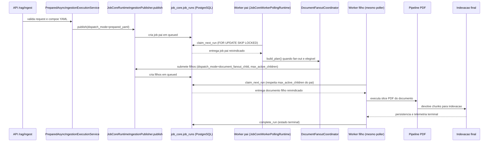
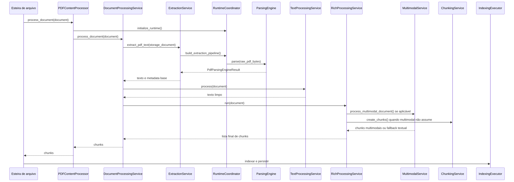

# Manual técnico do pipeline de ingestão de PDF

## 0. Contexto 101 — o que é ingerir um PDF e por que é difícil

### 0.1. O que significa "ingerir" um PDF

Ingerir um PDF é o processo de transformar um arquivo estático e opaco em conteúdo pesquisável por IA. O objetivo final é que o sistema consiga responder perguntas usando trechos extraídos de documentos reais — mas para isso o arquivo precisa virar texto limpo, ser partido em pedaços gerenciáveis (chunks), ter esses pedaços convertidos em vetores numéricos (embeddings) e ser armazenado num banco vetorial (Qdrant) e, opcionalmente, em índice de texto completo (BM25).

O fluxo macro é este:

```
PDF bruto
  → extração de texto, tabelas e imagens
  → limpeza e normalização do conteúdo
  → divisão em chunks com metadados
  → geração de embeddings por chunk
  → armazenamento no vector store + índice BM25
  → documento disponível para busca semântica
```

Cada seta esconde um problema real.

### 0.2. Por que é difícil

**PDF não é texto.** Ao contrário de um arquivo `.txt` ou `.md`, o PDF é um formato de apresentação visual, não de dados. O que está "dentro" pode ser: texto nativo com camada de busca (PDF digital), imagem rasterizada de páginas escaneadas (PDF scan), combinação dos dois, ou até um PDF com texto mas com codificação corrompida que torna a extração ilegível.

**Cada tipo de PDF exige uma abordagem diferente.** Um PDF de contrato digital limpo pode ser extraído com uma biblioteca simples e rápida como PyMuPDF. Um PDF escaneado de manual técnico exige OCR (reconhecimento ótico de caracteres) — que é um processo muito mais caro, sujeito a erros de acentuação e dependente de qualidade de digitalização. Um PDF com tabelas de dados técnicos exige engines especializadas (como Docling ou pdfplumber) para não perder a estrutura tabular.

**A extração pode retornar lixo.** Mesmo quando o parser "funciona", o resultado pode conter cabeçalhos, rodapés, numeração de páginas, artefatos de OCR (letras separadas, palavras inventadas), hifenização errada ou saltos de linha no meio de frases. Tudo isso precisar ser detectado e limpo antes de virar chunk.

**Tabelas são estrutura, não texto.** Uma tabela de coeficientes técnicos num PDF visual parece simples para um humano ler, mas para um parser é um conjunto de caixas com coordenadas. Extrair isso como tabela em vez de misturá-la ao texto contínuo exige engines específicas (Unstructured, pdfplumber, GMFT) e regras de validação para descartar o que virou ruído.

**Imagens carregam informação que o texto não captura.** Plantas baixas, diagramas, fluxogramas e fotos técnicas são frequentes em documentos de engenharia. Para que a IA possa explicar o que está numa imagem, é preciso extrair a imagem, aplicar OCR se houver texto embutido, e/ou usar um modelo de visão (LLM multimodal) para descrever o conteúdo visual em linguagem natural.

**O tamanho importa para o custo.** Um chunk muito grande confunde o modelo de recuperação (é difícil saber qual parte é relevante). Um chunk muito pequeno perde o contexto da frase (não dá para entender a resposta sem o parágrafo inteiro). Encontrar o tamanho certo é uma decisão de configuração que afeta diretamente a qualidade das respostas do RAG.

**Embeddings custam dinheiro e tempo.** Cada chunk precisa ser convertido em vetor por um modelo de embedding (como `text-embedding-3-large` da OpenAI). Documentos longos com muitas páginas geram dezenas ou centenas de chunks, o que significa dezenas ou centenas de chamadas ao provider de embedding. Por isso a ingestão é assíncrona, em paralelo por documento, com controle de paralelismo e heartbeat.

**Falhas parciais precisam ser recuperáveis.** Se o processo cair no meio da ingestão de um lote de 200 PDFs, o sistema precisa conseguir retomar de onde parou — não reingestir tudo do zero. Daí vêm o manifesto operacional, os artefatos de extração persistidos e a lógica de retomada por estágio.

### 0.3. Onde este pipeline se encaixa no sistema

O pipeline de ingestão de PDF é uma parte especializada da esteira de ingestão genérica do produto. A esteira genérica sabe lidar com vários tipos de fonte (páginas web, Confluence, banco de dados, JSON, planilhas). O pipeline de PDF é o executor especializado que entra em cena quando a esteira detecta um arquivo `.pdf`.

A responsabilidade deste pipeline começa quando o arquivo já foi baixado e acaba quando chunks indexados foram entregues ao vector store. Tudo antes (autenticação, seleção de fontes, download) e tudo depois (resposta ao usuário, busca semântica, geração de resposta) é responsabilidade de outras camadas.

### 0.4. Onde este pipeline difere de uma ingestão ingênua

Uma ingestão ingênua de PDF cabe em três linhas de código: abrir o arquivo com uma biblioteca de
extração, cortar o texto a cada N caracteres, gerar os vetores. Ela funciona em demonstração e falha
de maneiras específicas em acervo real — quase sempre **em silêncio**, que é o que a torna cara.

A tabela confronta camada a camada. Cada item da coluna da direita é um mecanismo descrito neste
manual, com a seção onde ele é detalhado.

| Camada | Ingestão ingênua | Este pipeline |
|---|---|---|
| **Escolha do extrator** | uma biblioteca, para todo documento | catálogo de engines atrás de um contrato único, escolhidas por configuração — inclusive **por documento nomeado** (§8.2, §8.2.2) |
| **PDF escaneado** | sai vazio, ou é ignorado | estágio de OCR próprio antes do parse, com decisão página a página; e política explícita para o documento que continua sem texto (§6) |
| **Teto de tempo** | valor fixo, ou nenhum | teto de parede por documento e, na engine que suporta, teto **proporcional ao número de páginas** (§29.3) |
| **Extração cortada** | publicada como sucesso | gate de truncamento que reprova na origem nas engines que o têm; nas demais, o documento é publicado **marcado como inconsistente**, nunca como sucesso (§18.5) |
| **Recorte** | corte cego a cada N caracteres | estratégias ordenadas que respeitam página, seção e parágrafo, com tabela em trecho dedicado e âncora de identidade (§15) |
| **Tabela** | vira texto corrido e perde a grade | esteira própria de extração, com modo preciso disponível por documento (§29.5, §8.2.2) |
| **Página** | número da folha do arquivo, quando há | dupla numeração — física e a **impressa no rodapé**, que é a que o leitor procura (§16.5) |
| **Reprocesso** | reingerir tudo, ou não reingerir | impressão digital de política por documento: muda a configuração de um, reprocessa só ele (§16.6) |
| **Reingestão** | acumula gerações e serve conteúdo duplicado | substituição de geração por chave que inclui conteúdo **e** política (§16.7) |
| **Execução** | script que roda até cair | jobs duráveis com ledger, retomada, cancelamento real e paralelismo governado (§2, §3.4) |
| **Desfecho** | "terminou sem exceção" = sucesso | classificador único de completude que separa perda real de descarte deliberado (§18) |
| **Observabilidade** | log de início e fim | decisão de cada estágio registrada, incluindo o que **não** executou e por quê (§20) |

Três dessas linhas concentram a maior parte do valor, e nenhuma delas aparece em tutorial:

- **Extração cortada nunca é publicada como sucesso.** Uma biblioteca que estoura o próprio teto de
  tempo tende a devolver o que conseguiu, com um status de sucesso parcial. Aceitar isso publica um
  manual de centenas de páginas com poucos caracteres por página, marcado como íntegro — e ninguém
  descobre até o acervo responder mal. A regra aqui é falhar e avisar (§18.1).
- **Reprocesso é cirúrgico.** Numa base grande, "mudei uma configuração" e "reprocessar tudo" são
  ordens de grandeza diferentes de custo. A impressão digital de política é o que permite mudar a
  configuração de um documento sem tocar nos demais (§16.6).
- **A página impressa.** É o detalhe que parece burocrático e determina se o leitor consegue conferir
  a resposta. Um manual técnico numera o rodapé de forma independente da folha do arquivo, e é o
  número do rodapé que o sumário e a citação usam (§16.5).

## 1. O que este documento cobre

Este manual técnico explica o comportamento real do pipeline de PDF no código lido. O foco aqui não é vender a capacidade nem resumir o tema. O foco é seguir a ordem de execução, entender o contrato YAML que altera o comportamento, explicar os principais branches e deixar claro como diagnosticar o ponto exato onde um PDF falhou.

## 2. Entry point e boundary real

O ponto de entrada do slice PDF é o `PDFContentProcessor`, mas o boundary oficial de processamento do documento não fica concentrado nele. O método `process_document` do processor delega para `PdfDocumentProcessingApplicationService`, que faz a sequência canônica:

1. validar se o document realmente é processável pelo processor;
2. registrar log estruturado de início;
3. chamar `pre_process_hook`;
4. executar o fluxo rico do PDF;
5. chamar `post_process_hook`;
6. registrar outcome final;
7. limpar recursos do runtime no `finally`.

Isso é relevante porque o `PDFContentProcessor` funciona mais como host de serviços do que como lugar onde toda a inteligência mora.

### 2.1. Boundary HTTP que agenda o job pai

No produto real, o PDF quase nunca nasce direto no `PDFContentProcessor`. Antes disso, a requisição pública entra em `POST /rag/ingest`, registrado por `src/api/routers/rag_ingestion_router.py` e orquestrado por `src/api/routers/rag_runtime_ingestion_compat.py`.

O fluxo confirmado nesse boundary é este:

1. normalizar `correlation_id` e montar `task_id` derivado;
2. identificar `user_email` efetivo;
3. compor o YAML com `load_yaml_config_with_session`;
4. resolver `document_parallelism` efetivo;
5. forçar `execution_mode` suportado para `direct_async`;
6. delegar ao publisher único `JobCoreRuntimeIngestionPublisher.publish` (`src/api/services/ingestion_job_executor.py`).

Em linguagem simples: a API pública não executa o PDF. Ela prepara o contexto, publica um job pai na fila oficial e devolve um contrato HTTP de acompanhamento.

### 2.2. Envelope canônico que sai da API

O slice lido confirma três envelopes distintos para ingestão assíncrona:

- `prepared_yaml`: usado quando a API já resolveu o YAML e publica o job pai pronto para execução no worker;
- `resolve_on_worker`: usado quando o payload sobe criptografado e a resolução do YAML acontece no worker;
- `document_fanout_child`: usado somente para filho de fan-out por documento, sempre com `dispatch_mode=document_fanout_child` e `document_parallelism=1`.

O detalhe importante é que esses envelopes não são equivalentes. O pai transporta o lote e a decisão operacional. O filho transporta uma unidade documental específica já inventariada pelo pai.

### 2.3. Runtime do worker e topologia física

O processo worker oficial sobe por `app/worker_main.py` e delega para `app/runners/worker_runner.py`. Nesse bootstrap, `build_worker_process_runtime` (`src/api/services/worker_process_runtime.py`) exige explicitamente `ASYNC_JOB_CONSUMER_RUNTIME='job_core_polling'` (qualquer outro valor levanta `RuntimeError`) e valida o schema do Job Core em modo somente leitura — sem DDL, sem criar nem alterar tabela no startup — antes de iniciar `WorkerProcessRuntime`. **Não existe mais RabbitMQ nem Dramatiq no transporte de jobs**: `src/api/services/async_job_dramatiq.py` e toda a topologia de actors/filas RabbitMQ foram removidas do produto antes deste manual ser sincronizado (limpeza de 13/07/2026, anterior ao plano de simplificação do Job Core). O único consumidor oficial é `JobCoreWorkerPollingRuntime` (`src/api/services/job_core_worker_runtime.py`), montado por `build_async_job_worker_runtime` (`src/api/services/async_job_worker_runtime_factory.py`).

Não existe fila física separada para pai e filho. Pai e filho são a mesma tabela `job_core.job_runs`: o poller reivindica linhas com `claim_next_run` usando `FOR UPDATE SKIP LOCKED` e o `route_kind + dispatch_mode` resolve um `JobProcessDescriptor` no registry único — não existe handler de lifecycle, pool de actor nem canal de broker por papel.

Isso é relevante porque o paralelismo do PDF não acontece por thread mágica dentro do mesmo método nem por fila de mensagens com redelivery. Ele acontece por publicação explícita de envelopes filhos como novas linhas em `job_core.job_runs` (`dispatch_mode=document_fanout_child`), reivindicadas de forma atômica e exclusiva por qualquer worker compatível — cada linha só pode ser reivindicada por um worker, uma única vez, até terminar ou ser reconciliada.

### 2.4. Papel do job pai e do job filho

O job pai não existe para parsear PDF. Ele existe para orquestrar o lote.

No caminho atual, `IngestionParentProcess` recebe o input tipado e `ProcessContext`. Quando o
fan-out documental é elegível, a ingestão devolve um `ChildWorkPlan`; o executor do Job Core valida
todo o plano e materializa os filhos no ledger. O domínio não publica, polla nem terminaliza jobs.

O filho entra por `DocumentFanoutChildProcess`. Ele cria um `ProcessHostReporter` sobre
`context.host`, delega uma unidade documental ao `DocumentFanoutChildExecutorService` e devolve
somente o outcome funcional. Cancelamento, status, heartbeat e terminalização continuam
encapsulados no host do Job Core.

Essa dupla já materializa a separação normativa: pai e filho são processos nominais e
host-transparentes. Nenhum deles recebe `JobEnvelope`, store, token PostgreSQL ou callback de
lifecycle.

O ponto operacional mais importante é este:

- pai coordena e publica;
- filho processa documento;
- PDF local em filesystem não compartilhado não entra em fan-out paralelo real;
- fan-out só faz sentido para fontes remotas replayable e compartilháveis entre processos.

### 2.5. Sequência ponta a ponta do PDF assíncrono



Esse diagrama resume a fronteira correta: o pipeline PDF continua existindo, mas ele roda dentro do job filho quando o lote foi quebrado por documento. O job pai prepara a estrada; o filho percorre a estrada.

## 3. Configuração que governa o runtime

### 3.1. Caminho canônico do YAML

O resolvedor central de configuração de PDF lê o contrato canônico em `ingestion.content_profiles.type_specific.pdf`. O código rejeita caminhos legados como `content_profiles.type_specific.pdf`, `ingestion.pdf` e `pdf` na raiz.

Isso significa que a origem de verdade do runtime PDF é o bloco tipado da ingestão, não um atalho espalhado no YAML.

### 3.1.1. Significado exato de `vector_store.if_exists` no PDF

`vector_store.if_exists` nao governa OCR, parsing nem chunking. No pipeline de PDF, a mesma chave e consumida em dois niveis e a ordem e obrigatoria.

1. No bootstrap do lote, `prepare_batch_vector_store_bootstrap()` prepara o vector store e aplica `DatasetLifecycleOrchestrator.apply_if_exists_policy()` ao alvo fisico.
2. Somente depois do bootstrap, cada PDF e avaliado no manifesto por `document_identity_key`.

No primeiro nivel, se a collection/index ja existe:

- `skip` lanca erro de lifecycle. A excecao impede o retorno e o agendamento dos work items e termina o job inteiro em erro;
- `update` mantem o alvo fisico sem limpeza e permite que o lote continue;
- `overwrite` remove e recria o alvo uma vez no bootstrap do lote e permite que o lote continue.

No segundo nivel, o runtime resolve `document_identity_key` a partir da identidade estavel da origem: prefere `source_system + external_document_id` (no Google Drive, `file_id`) e usa a URI canonica como fallback. O manifesto e consultado por `tenant_code + vectorstore_id + document_identity_key`; quando encontra o documento, o runtime compara a versao por `pdf_binary_sha256` ou, na ausencia dele, `document_hash`.

No fan-out por documento, o job pai inclui no contexto de cada worker a origem comprovada
(`source_system`, `source_uri` canonica e `external_document_id`). O dominio do projeto, como
`dnit`, nao substitui a origem documental, como `google_drive`. A publicacao replica essa
procedencia em `vector_active_documents` e grava nos chunks do Qdrant a identidade logica e a
versao ativa (`document_identity_key` e `vector_document_key`). Com isso, uma futura pergunta RAG
pode receber os `active_document_id` escolhidos na API de listagem, resolve-los no servidor e
limitar Qdrant, FTS e BM25 ao mesmo conjunto de documentos.

A rastreabilidade usa eventos canonicos em cada fronteira: o binding do worker registra
`job_remote_pdf_source_identity_bound`; a resolucao registra
`ingestion.telemetry.document_identity.resolved`; a publicacao registra
`ingestion.telemetry.vector_active_publish.persisted`; e a limpeza de versoes antigas registra
`ingestion.document.vector_supersession.cleaned`. Identificadores sensiveis nao precisam ser
repetidos nesses eventos de decisao: fingerprints permitem comparar as etapas. A checagem
`ingestion.vector.document.integrity.checked` confirma, por PDF, chunks esperados e gravados,
referencias no Qdrant, FTS pronto e maior metadata persistida.

- `skip` pula somente o PDF encontrado no manifesto;
- `update` pula o PDF inalterado **e completo** e reprocessa o PDF cuja versao mudou **ou que nao terminou completo**;
- `overwrite` reprocessa o PDF mesmo quando a versao e igual.

**Hash igual nao basta mais para pular (regra atual).** O `pdf_binary_sha256` prova que os *bytes* nao
mudaram — nao prova que a ingestao daquele PDF terminou inteira. Antes, um PDF que perdeu paginas ou
figuras ficava preso: toda reingestao sob `update` o pulava pelo hash, e ele nunca se completava. Hoje o
`update` so pula quando **as duas** condicoes valem: o fingerprint bate **e** o desfecho anterior gravado
no documento ativo (`metadata.document_completeness_status`) e `success`. Desfecho `partial_success` ou
`failed` com hash igual e **reprocessado**, com o evento canonico
`ingestion.document.evaluation.reprocess_due_to_incomplete_outcome`.

Documento **sem** o campo (ingerido antes desta mudanca) conta como completo — de proposito: tratar
ausencia como incompletude reprocessaria o acervo inteiro no dia do deploy. `overwrite` continua
reprocessando tudo, sem olhar desfecho.

O segundo comportamento de `skip` nao anula o primeiro. Em uma ingestao normal com collection existente, o job para no bootstrap e nunca alcanca o lookup documental. Assim, carga incremental sobre acervo existente exige `if_exists=update`.

Dentro de cada nivel, `skip` e `update` consultam a mesma condicao de existencia: alvo fisico no primeiro e entrada de manifesto no segundo. O erro da interpretacao anterior era tratar apenas o lookup documental como se ele fosse toda a politica.

### 3.2. Defaults confirmados no código

O resolvedor define uma base interna para PDF com blocos de:

- parsing;
- chunking;
- cleaning;
- tables;
- OCR document-level e configuração residual do antigo OCR por página;
- preprocessing;
- references;
- page classification;
- multimodalidade;
- quality filters;
- attachments;
- metadata.

Esses defaults existem para o runtime nascer com um contrato mínimo coerente. Eles não substituem o YAML do cliente, mas mostram qual comportamento o processor espera se nada for sobrescrito.

### 3.3. Contratos removidos ou proibidos

O código falha explicitamente quando encontra contratos antigos ou proibidos em pontos críticos. Exemplos confirmados:

- `processing.parsing.base.options` foi removido; o core exige `processing.parsing.engine` (esquema `{type, config}`, UMA engine determinística, sem fila/fallback).
- `processing.ocr.engine` não é aceito; `processing.ocr.base.options` ainda é validado no bootstrap, mas sua antiga fila de OCR por página não é executada no caminho atual.
- `processing.tables.fallback` não é aceito; o contrato é `processing.tables.base.options`.
- `processing.ocr.document_preprocessing.fallback_enabled` não é aceito; a fila document-level não expõe fallback por engine.

Esse fail-fast é importante porque evita que o runtime aceite caminhos velhos e pareça funcionar por sorte.

### 3.4. Quem admite e quem cancela um filho do fan-out documental (arquitetura atual)

Esta seção descreveu, em versão anterior, uma `DocumentFanoutExecutionGate` própria da ingestão que decidia se um filho podia executar. Essa classe foi removida do produto (plano `investigacao-simplificacao-job-core`, tarefa T10, entregue em 2026-07-17): não existe mais `src/services/document_fanout_execution_gate.py`, `fetch_document_fanout_runtime_state`, auto-recovery, auto-promotion nem promoção de `queued` fora do Job Core. A admissão e o cancelamento do filho hoje têm dois donos diferentes e nenhum deles vive na ingestão:

**Admissão (quem entra em execução):** é decidida pelo próprio Job Core no momento do claim, não por uma consulta prévia da ingestão. O envelope do filho carrega `dispatch_mode=document_fanout_child` e o pai carrega `max_active_children` (`JobEnvelope.max_active_children`, `src/core/job_core/models.py`); o `claim_next_run` do store só libera um filho novo se o número de filhos ativos daquele pai estiver abaixo do limite — no PostgreSQL essa contagem e a reivindicação acontecem na mesma consulta atômica (`src/core/job_core/postgres_store.py`). Não existe fila de mensagens com redelivery neste caminho (ver 2.3): a linha do filho em `job_core.job_runs` só pode ser reivindicada uma vez.

**Cancelamento cooperativo (quem para um filho que já começou):** o processo só consulta
`ProcessContext.host.is_cancellation_requested()` ou `raise_if_cancelled()`. O executor do Job Core
encapsula o token concreto e o store; `ProcessHostReporter` adapta essa porta mínima para os
checkpoints funcionais do `DocumentFanoutChildExecutorService`. A ingestão não consulta
`job_core.job_runs` diretamente e não recebe callback de lifecycle.

Se o pai não terminar de forma limpa (worker morto, heartbeat expirado), quem encerra a run órfã é o reconciliador cancel-only do Job Core (`OperationalRunReconciliationService.cancel_orphaned_run`, ver o README técnico do Job Core), nunca uma reconciliação local da ingestão. Não existe mais `auto_recovery` nem `auto_promotion` que tentem salvar ou reencaminhar um filho.

Em linguagem simples: antes, a ingestão perguntava "o pai ainda deixa eu trabalhar?" a cada filho.
Hoje, se o filho foi reivindicado é porque o Job Core já decidiu que ele pode rodar; se houver
cancelamento, o processo enxerga apenas o aviso pelo host.

## 3.1 O que “cancelar” significa de verdade no fan-out PDF

Neste pipeline, cancelamento é cooperativo e durável. Isso quer dizer que o plano de controle registra o cancelamento, bloqueia novos trabalhos e deixa rastreável o que ainda está em drenagem.

Na prática:

- um filho ainda `queued` no ledger do Job Core é cancelado diretamente, sem nunca ser reivindicado e sem iniciar OCR, parsing ou republicação;
- não existe broker nem redelivery neste transporte (ver 2.3): a linha do filho só é reivindicada uma vez, então não há "mensagem atrasada" tentando trabalhar depois do cancelamento — só existe a checagem cooperativa pelo host durante a execução (ver 3.4);
- um filho já `running` só para quando `ProcessContext.host` observa
  `cancel_requested`/`cancelled` num checkpoint cooperativo, ou quando o worker morre e o
  reconciliador cancel-only do Job Core (`cancel_orphaned_run`) encerra a run órfã diretamente como
  `cancelled` — nunca por retry, replay ou reenfileiramento.

Essa distinção é importante para operação. Se ainda existe drenagem, isso não quer dizer que o cancelamento falhou. Quer dizer apenas que o sistema já neutralizou o trabalho novo e está encerrando, de forma segura, o que tinha começado antes do pedido de cancelamento.

## 4. Bootstrap do runtime PDF

O bootstrap é centralizado por `PdfRuntimeCoordinator.initialize_runtime`. A ordem observada é esta:

1. fixa `ContentType.PDF` como tipo suportado;
2. configura logging auxiliar de pdfminer;
3. resolve todas as seções do runtime por `resolve_pdf_runtime_snapshot`;
4. inicializa parâmetros de chunking;
5. lê a configuração residual de OCR por página e constrói o OCR document-level;
6. inicializa runtime de tabelas;
7. inicializa filtros de qualidade e classificação;
8. inicializa metadata, imagens e anexos;
9. monta os serviços de suporte ao parsing;
10. constrói pipelines explícitos de extração e texto;
11. inicializa flags multimodais;
12. aplica overrides de domínio e registra resumo final do runtime.

Em outras palavras, antes de tocar num PDF específico, o processor já resolveu qual mundo operacional será usado.

O detalhe pouco visível, mas importante, é que esse bootstrap conversa com o mesmo sistema central de domain processing usado por outros tipos de conteúdo. Primeiro `_setup_domain_processing` cria `DomainProcessingResolver`. Depois `_apply_domain_overrides` percorre os domínios habilitados e faz merge de `pdf_overrides` quando `apply_globally=true`. Na prática, o domínio não serve apenas para enriquecer chunks no fim; ele também pode ajustar o runtime PDF antes da extração, desde que o YAML mande isso explicitamente.

## 5. Builder do runtime de parsing

`PdfParsingRuntimeBuilder.build` monta o bundle principal do parsing PDF.

- `PdfReferenceDetector`
- `PdfDocumentOcrService`
- `PdfTableService`
- `PdfPagesInfoBuilder`
- `PdfMetadataBuilder`
- engine final resolvida por `PdfParsingEngineResolver` (a partir de `processing.parsing.engine: {type, config}`)

Detalhe técnico importante: **não há mais privilégio do PyMuPDF**. A antiga god-class `PymupdfPdfParsingEngine` não é mais construída nem selecionável — toda engine nasce determinística pelo YAML. O builder consome a engine ÚNICA que o resolvedor resolve, sem montar implementação local nem fila de engines.

## 6. OCR document-level antes do parsing

### 6.1. Quando ele existe

O OCR document-level é governado por `PdfDocumentOcrService`. Ele não é o OCR leve de imagens isoladas. Ele é um pré-processamento do PDF inteiro, pensado para melhorar documentos com cara de scan ou com texto suspeito.

### 6.2. Como a decisão é tomada

O serviço usa `PdfDocumentOcrAnalyzer`, que abre o PDF com PyMuPDF, percorre **todas as páginas** e
decide cada página de forma independente.

- quantidade de texto por página;
- densidade de texto;
- razão de páginas vazias;
- razão de páginas com pouco texto;
- suspeita de texto ruim via alpha ratio;
- sparsidade geral de páginas com texto.

Uma página é selecionada quando está vazia e contém sinal visual, ou quando uma imagem cobre pelo
menos metade da página e há menos de 400 caracteres. Página vazia sem imagem/desenho e página com
texto nativo suficiente ficam fora. `force_ocr=true` seleciona todas. O resumo documental agrega
essas decisões, mas não substitui a verdade página a página.

### 6.3. Engine permitida

O contrato de `processing.ocr.document_preprocessing.base.options` aceita apenas `ocrmypdf` no slice lido. Isso reduz pluralidade, mas aumenta previsibilidade do estágio documental.

### 6.4. Runtime preflight

Antes de rodar, o serviço verifica se o runtime está pronto. Se a infraestrutura obrigatória não estiver disponível, ele registra falha de prontidão, aciona circuit breaker do escopo document-level e devolve resumo operacional sem tentar OCR.

### 6.5. Implicação prática

Esse estágio tenta resolver um problema anterior ao parsing. Ele pergunta: vale a pena melhorar o PDF antes de escolher a engine que vai extrair o conteúdo?

### 6.6. As flags de OCR não formam uma hierarquia

No runtime atual, não existe uma chave-mãe que precise estar ligada para liberar as demais. Há dois controles executáveis independentes e uma chave residual:

| Chave | Efeito executável atual | Relação com as demais |
|---|---|---|
| `processing.parsing.engine.config.ocr` | Liga o OCR interno da engine de parsing escolhida. Com `pipeline: pymupdf4llm`, vira `use_ocr=True`; a própria biblioteca decide página a página quando precisa de OCR. | Independente do bloco `processing.ocr`. |
| `processing.ocr.document_preprocessing.enabled` | Liga a análise heurística e, quando necessário, regrava o PDF inteiro com OCRmyPDF antes do parsing. | Independente de `processing.ocr.enabled` e executado antes da engine. |
| `processing.ocr.enabled` | Hoje não liga nem desliga uma etapa de OCR. O valor é lido em `_ocr_enabled` e aparece em metadata de bootstrap, mas não governa o OCR documental, o OCR interno da engine nem o OCR complementar. | Resíduo do antigo `PdfOcrService`, removido do caminho executável. Não deve ser tratado como chave-mãe. |

Consequência direta: **não é necessário ligar as três flags**. Ligar ou desligar `processing.ocr.enabled` não altera o comportamento de OCR comprovado no runtime atual.

### 6.7. Combinações reais para `pymupdf4llm`

Esta é a matriz que deve orientar a operação. Ela considera apenas as duas flags que efetivamente executam OCR.

| OCRmyPDF antes do parsing | OCR interno do `pymupdf4llm` | Comportamento |
|---|---|---|
| desligado | desligado | Nenhuma camada de OCR textual atua. PDF digital é lido normalmente; PDF só-scan termina sem texto. O resultado final depende de `skip_scanned_pdf`. |
| desligado | ligado | O `pymupdf4llm` faz OCR seletivo nas páginas que julgar necessárias. É o caminho mais simples, mas o wrapper atual não repassa `ocr_language`; portanto, a engine usa o default da biblioteca, hoje `eng`. |
| ligado | desligado | OCRmyPDF analisa e, quando necessário, adiciona uma camada textual ao documento; depois o parser apenas lê essa camada. Evita uma segunda estratégia de OCR, mas fica sem recuperação caso o pré-processamento esteja indisponível ou a heurística não o acione. |
| ligado | ligado | Defesa em profundidade. OCRmyPDF tenta preparar o documento primeiro; depois o `pymupdf4llm` mantém OCR seletivo como segunda proteção. Como `force_ocr` não é usado, o parser normalmente pula páginas que já receberam texto, evitando re-OCR generalizado. |

### 6.8. Recomendação para o DNIT

Para o acervo DNIT em produção, que mistura PDF digital e scan em português, a configuração robusta é:

```yaml
processing:
  parsing:
    engine:
      type: pipeline
      config:
        pipeline: pymupdf4llm
        ocr: true
        skip_scanned_pdf: false
  ocr:
    languages: ["por", "eng"]
    document_preprocessing:
      enabled: true
      base:
        options:
          - engine: ocrmypdf
            mode: default
      deskew: true
      clean: false
      clean_final: false
      force_ocr: false
      jobs: 1
      optimize: 0
```

`skip_text` e `redo_ocr` foram removidos do contrato e geram erro explícito. O runtime deriva o
modo do OCRmyPDF da seleção página a página: `force` quando `force_ocr=true`; caso contrário,
`redo`, preservando texto nativo e recuperando conteúdo visual selecionado.

O ganho de manter as duas camadas executáveis ligadas é tolerância a falha: OCRmyPDF usa os idiomas configurados em `processing.ocr.languages`, enquanto o `pymupdf4llm` pode recuperar páginas que ainda chegarem sem texto. O custo é maior complexidade operacional e duas dependências de OCR.

Se a prioridade for reduzir custo e aceitar menor resiliência, use **uma** camada:

- para scans em português, prefira `document_preprocessing.enabled: true` e `engine.config.ocr: false`;
- para um caminho simples e predominantemente digital, use `document_preprocessing.enabled: false` e `engine.config.ocr: true`;
- para excluir scans, desligue ambas e use `skip_scanned_pdf: true`.

### 6.9. O papel de `skip_scanned_pdf`

`skip_scanned_pdf` não faz OCR. Ele decide o que acontece **depois** que a engine termina sem texto:

- `true`: o PDF só-scan é pulado de forma limpa e produz zero chunks;
- `false`: a ausência de texto é tratada como falha estrita do documento.

Para a intenção "PDFs escaneados precisam ser processados", use `skip_scanned_pdf: false`. Isso impede falso sucesso por descarte, mas também faz a ingestão falhar quando todas as camadas de OCR estiverem indisponíveis ou não recuperarem texto.

### 6.10. Dívida de configuração confirmada

A separação entre OCR documental e OCR interno da engine é intencional. A confusão vem de uma dívida real: `processing.ocr.enabled` e `processing.ocr.base.options` pertenciam ao antigo OCR por página (`PdfOcrService`), removido do bundle e deletado. O bootstrap ainda lê esse bloco e registra parte dele, mas a fila não executa OCR por página no caminho atual.

O OCR complementar posterior também não usa essa fila. Ele é selecionado quando o texto fica vazio ou quando `processing.chunking.ocr_on_empty_pages` está ativo, e cria o processador a partir de `pdf.multimodal.ocr`. Portanto, a documentação e a operação não devem chamar `processing.ocr.enabled` de controle do OCR complementar.

## 7. Pipeline de extração

O pipeline de extração é criado por `PdfRuntimeCoordinator.build_extraction_pipeline` com quatro stages explícitos.

### 7.1. `ValidatePdfBytesStage`

Valida duas coisas obrigatórias.

- o arquivo precisa ter bytes;
- os bytes precisam começar com a assinatura `%PDF`.

Se falhar aqui, o pipeline interrompe de forma explícita. Não existe parsing de PDF sem PDF real.

### 7.2. `ApplyDocumentOcrStage`

Executa `PdfDocumentOcrService.maybe_preprocess_pdf`. O retorno pode manter os bytes originais ou substituí-los pelos bytes pré-processados, sempre com resumo operacional da decisão.

### 7.3. `ParseViaEngineStage`

Executa a engine final de parsing. Esse stage registra início, duração, engine usada, tamanho dos bytes e quantidade de caracteres retornados. Se a engine lança exceção ou devolve `None`, o stage aborta a extração.

### 7.4. `ApplyEngineResultStage`

Transforma o resultado da engine em um `persistence_payload` final com texto, engine result e resumo do OCR documental. A persistência de metadata só acontece no final, não no meio do stage.

## 8. Resolvedor determinístico de engines

### 8.1. Contrato da engine de parsing (`engine: {type, config}`)

O resolvedor de parsing lê o bloco canônico `processing.parsing.engine` (via `resolve_pdf_parsing_engine_spec`), que tem dois campos:

- `type`: o tipo da engine. Contrato `EngineType = {pipeline, custom}` (dispatch por tipo; tipo fora desse conjunto falha fechado).
- `config`: a configuração da engine. Em `type: pipeline`, `config.pipeline` nomeia **qual** engine determinística usar; os toggles (`ocr`, `tables`, `structured_chunking`, `skip_scanned_pdf`) também vivem aqui.

É **uma engine determinística por acervo, sem fila e sem fallback** entre engines (regra R3). O caminho antigo `processing.parsing.base.options` — uma fila ordenada de várias engines com `mode` (`default`/`auto`/`always`/`never`) e fallback entre elas — **foi REMOVIDO** (zero legado, sem dual-read em runtime). YAML sem o bloco `engine` falha fechado (`ValueError`). **Atenção:** `base.options` ainda existe, mas **só para OCR** (sob `processing.ocr.*`) — não confundir com parsing.

### 8.2. Engines de pipeline confirmadas

Engines que podem ocupar `config.pipeline` quando `type: pipeline`:

| `config.pipeline` | Natureza | Onde ela ganha |
|---|---|---|
| `pymupdf4llm` | rápida, com OCR seletivo da própria biblioteca | caminho padrão; preserva marcador de página e hierarquia; única com teto de tempo proporcional a páginas (§29.3) |
| `docling` | pesada, baseada em modelos | reconstrução de tabela (modo preciso) e enriquecimento de fórmula; é a única que oferece esses dois recursos |
| `opendataloader` | determinística, sem IA e **sem OCR** | tabela íntegra a custo muito baixo, preservando a numeração de página impressa |
| `unstructured` | generalista | estratégias e inferência de estrutura de tabela próprias |

(`type: custom` não usa `config.pipeline` — usa a engine de receita; ver 8.5.)

**Os toggles aceitos são fechados por engine, e chave fora do conjunto falha explícito.** Isso evita
o erro clássico de declarar uma opção que a engine escolhida simplesmente ignora, e achar que ela
está ligada:

| Engine | Toggles obrigatórios | Toggles opcionais |
|---|---|---|
| `docling` | `ocr`, `tables`, `structured_chunking`, `skip_scanned_pdf` | `subprocess_timeout_seconds`, `document_timeout_seconds`, `table_mode`, `do_formula_enrichment` |
| `pymupdf4llm` | `ocr`, `skip_scanned_pdf` | `subprocess_timeout_seconds`, `subprocess_timeout_per_page_seconds` |
| `opendataloader` | `skip_scanned_pdf` | `subprocess_timeout_seconds` |
| `unstructured` | `strategy`, `languages`, `infer_table_structure`, `skip_scanned_pdf` | `subprocess_timeout_seconds` |

Note que **`opendataloader` não aceita `ocr`**: ela é determinística e não faz reconhecimento de
imagem. Um documento 100% escaneado sai dela sem texto, e o desfecho passa a ser decidido pela
política do documento (§6.9).

### 8.2.1. `table_mode` e `do_formula_enrichment` (apenas `docling`)

Dois recursos avançados de extração, ambos desligados por default porque **custam caro**:

- **`table_mode`** — default `fast`. Em `accurate`, a reconstrução da grade separa linhas que o modo
  rápido funde. É a diferença entre uma célula normativa legível e uma célula com palavras coladas.
- **`do_formula_enrichment`** — default `false`. Converte a fórmula que é imagem em notação
  matemática textual, tornando-a indexável e pesquisável. O custo medido é da ordem de **86 a 134
  segundos por página**, o que torna o uso indiscriminado proibitivo em acervo grande — e é
  exatamente por isso que a chave existe **por documento** (§8.2.2).

### 8.2.2. `engine_overrides` — curadoria nominal por documento

Este é o mecanismo que torna a estratégia multi-engine operável sem transformar cada decisão numa
reingestão do acervo inteiro.

```yaml
processing:
  parsing:
    engine:                       # bloco base: vale para todo documento não nomeado abaixo
      type: pipeline
      config:
        pipeline: pymupdf4llm
        ocr: true
        skip_scanned_pdf: false
    engine_overrides:             # exceções curadas, por nome de arquivo
      - engine: docling
        config:
          ocr: true
          tables: true
          structured_chunking: true
          skip_scanned_pdf: false
          table_mode: accurate    # separa linhas coladas neste documento
          subprocess_timeout_seconds: 14400.0
          document_timeout_seconds: 10800.0
        documents:
          - "manual_com_quadro_normativo.pdf"
```

Regras reais do contrato:

- **`documents` casa por nome de arquivo normalizado**, sem diferenciar maiúsculas de minúsculas.
- **Um documento em duas entradas falha explícito.** Ambiguidade de curadoria é erro de
  configuração, não algo a resolver por precedência implícita.
- **`config` no override aceita apenas os toggles** da engine escolhida; declarar `pipeline`, `name`
  ou `steps` ali é recusado.
- **Override ausente herda o bloco base** — não é preciso repetir a configuração inteira.
- É **fonte única** tanto para o runtime quanto para a impressão digital de política (§16.6): a
  configuração que executa é a mesma que decide se o documento precisa ser reprocessado.

> **A escolha da engine é curadoria declarada, não classificação automática.** A plataforma tem um
> classificador de tipo de documento, mas hoje ele **alimenta metadata** — ele não escolhe a engine.
> A decisão de qual programa lê qual documento vem do YAML: o bloco base para o acervo, e
> `engine_overrides` para as exceções que um especialista identificou. Roteamento automático por
> classe de documento é evolução planejada, e este manual não a descreve como capacidade atual.

### 8.3. Disponibilidade da engine

Antes de instanciar a engine declarada, o resolvedor verifica dependências externas. Se a engine estiver indisponível, o runtime **falha fechado** — não há outra engine para assumir, porque não há fila. A indisponibilidade vira erro observável, não um desvio silencioso.

**Disjuntor (*circuit breaker*) por engine.** Existe um registro em memória, por processo, que pode
marcar temporariamente uma engine como indisponível depois de falhas repetidas, evitando insistir num
componente comprovadamente quebrado. A distinção que ele faz é a parte importante do desenho:
**esgotamento de recurso — estouro de teto de tempo ou de memória — NÃO abre o disjuntor.** Um
documento que precisou de mais tempo do que o configurado é uma condição *daquele documento*, não uma
prova de que a engine está incapaz. Confundir as duas coisas tiraria de operação uma engine saudável
por causa de um único documento grande.

### 8.4. Como o resolvedor constrói a engine

O resolvedor faz **dispatch por tipo** (`pipeline`/`custom`) e, nos dois casos, finaliza pelo mesmo caminho comum, devolvendo **UM** `DeterministicLegoPdfParsingEngine` com **exatamente uma** opção (`mode=default`). A classe `DeterministicLegoPdfParsingEngine` é reaproveitada do desenho anterior, mas hoje é sempre instanciada com **uma única engine** — ou seja, **não orquestra fila nem fallback**; executa a engine única resolvida pelo YAML.

Além disso, o runtime de parsing:

- normaliza o contrato canônico do resultado;
- detecta criptografia do PDF (`fitz`/`pypdf`) quando necessário;
- aplica `skip_scanned_pdf` (PDF só-scan é pulado de forma limpa: logado, não ingerido, sem lixo no índice).

### 8.5. Os dois tipos de engine (`pipeline` e `custom`)

- **`pipeline`** (`_build_pipeline_engine`): uma engine determinística da lista (8.2), escolhida em `config.pipeline`.
- **`custom`** (`_build_custom_engine`): a engine de **receita** (`custom_pdf_parsing_engine`), que compõe *tools* internas (ex.: `fitz_text_tool` para texto, `pdfplumber_tables_tool` para tabelas) conforme a `config`. É o caminho para combinações específicas que não correspondem a uma engine de pipeline pronta.

Trocar a engine de parsing = mudar `type` (pipeline↔custom) ou `config.pipeline` (qual engine de pipeline). O orquestrador permanece **neutro**: não conhece regra por nome de engine; só executa o que o YAML declara.

### 8.6. Consequência operacional

O parsing é um runtime governado por YAML: o YAML declara **uma** engine; o core a constrói, executa e observa. Não há fila de fallback escondida — se a engine declarada falha ou está indisponível, o runtime falha fechado (ou pula o documento, conforme `skip_scanned_pdf`/política), de forma observável, em vez de tentar silenciosamente outra engine.

### 8.7. Contrato canônico enriquecido (v2) e coleta de estrutura governada por YAML

> Estado comprovado em runtime (run real Docling sobre PDFs reais). Recursos estruturais
> permanecem **desligados por default**: nada disto muda o comportamento de hoje enquanto o YAML não
> ligar os flags.

**O que é o contrato canônico.** Toda engine de parsing devolve o mesmo objeto tipado,
`PdfParsingEngineResult` (em `src/ingestion_layer/pdf_tools/pdf_parsing_engine_contract.py`). É sobre
ele que o pipeline trabalha — o core nunca toca `DoclingDocument` ou `Element` do Unstructured
diretamente. A versão do contrato é registrada em `metadata_contract_version`, hoje **2**.

**Campos estruturais (novos, opcionais, aditivos — contrato v2).** Além dos campos atuais (texto,
tabelas, sumários, qualidade), o resultado pode transportar, **quando os recursos estão ligados por
YAML**:

- `structured_blocks`: blocos/elementos tipados (texto + categoria + página + bbox + ordem de leitura
  + provenance);
- `sections`: hierarquia de seções (título + nível + página);
- `structured_images`: imagens estruturadas (página + bbox + tipo);
- `engine_provenance`: engine + versão + configuração efetivamente aplicada;
- `extraction_issues`: erros/avisos da extração;
- `PdfParsedTable.bbox`: posição da tabela na página.

Todos têm default vazio (`()`/`None`): se o recurso estiver desligado, o objeto é idêntico ao de
hoje. Os tipos são dataclasses imutáveis (frozen+slots), o que permite que a estrutura atravesse o
subprocesso do Docling por serialização JSON sem perda (ver 8.8).

**Coleta governada por YAML, simétrica entre engines.** A estrutura só é coletada quando o YAML liga
o recurso da engine:

- **Docling** — `processing.parsing.docling.do_table_structure` (TableFormer), `do_ocr`,
  `force_backend_text`, `generate_picture_images`. Com `force_backend_text=true` e tudo desligado (o
  default), o Docling usa o caminho rápido só-texto e **não** coleta estrutura. Quando algum recurso
  é ligado, o caminho rico coleta blocos/seções/imagens do `DoclingDocument` e mapeia tabelas com
  bbox.
- **Unstructured** — `processing.parsing.unstructured.infer_table_structure` (default `false`). Lido
  por `get_pdf_unstructured_config`, simétrico a `get_pdf_docling_config`. Quando ligado, coleta
  `category`/`coordinates`/`text_as_html` e produz a mesma estrutura canônica do Docling.

As duas engines produzem **os mesmos tipos** do contrato — não há pipeline paralelo. A leitura de
config é tipada nos dois lados (sem navegação de dict cru).

**Capacidade declarada x efetiva (sem mentir).** O perfil de capacidade de cada engine declara o que
ela **sabe** entregar; o resultado também reporta o que a execução **de fato** entregou:
`engine_effective_output_mode` (`text_only`/`text_plus_tables`/`structured`) e
`engine_effective_capabilities`. Assim, uma execução que não produziu estrutura (ex.: PDF escaneado
sem OCR) é reportada como `text_only` mesmo que o perfil declare `text_plus_tables`.

### 8.8. Travessia do subprocesso do Docling

O Docling roda isolado em subprocesso. O processo filho serializa o resultado com `asdict` (todos os
campos do contrato, inclusive os estruturais novos); o processo pai reconstrói o objeto em
`_rebuild_result` (`docling_pdf_parsing_subprocess.py`), campo a campo, incluindo blocos, seções,
imagens, provenance, erros e o bbox de cada tabela. Provado em runtime: a estrutura coletada in-process
chega íntegra ao processo pai (sem perda na ponte).

### 8.9. Propagação ao metadata e observabilidade da estrutura

`PdfExtractionApplicationService.apply_engine_result_to_metadata` propaga os campos estruturais ao
`storage_document.metadata` de forma **aditiva** (só grava o que existe; estrutura vazia não altera o
metadata de hoje). Em seguida emite o evento canônico **`ingestion.pdf.structure.persistence`**, que
compara, por tipo, a estrutura **detectada** pela engine com a **preservada** no metadata
(`structure_detected` x `structure_preserved`, `structure_loss`, `decision_reason`). Esse evento torna
visível, no log, a perda silenciosa de estrutura que antes não aparecia.

O log `ingestion.pdf.metadata.pages_info.updated` foi corrigido para reportar a contagem **real** de
imagens (`structured_images`, não o resumo legado vazio), as seções reais (`sections_detected`) e o
**modo efetivo** ao lado do declarado — evitando que o log engane o operador.

### 8.10. `merge_strategy` removida (config morta)

A chave `processing.parsing.merge_strategy` (valor `nao_perde_sinal`) era lida mas **não tinha
consumidor de runtime** (não havia fusão multi-engine). Foi removida de todos os YAMLs e do código. O
orquestrador escolhe **uma** engine vencedora por `failure_policy`/`mode`/score; não funde saídas.
Fusão multi-engine real, se um dia for desejada, é uma decisão à parte.

### 8.11. Limitação conhecida — PDF escaneado precisa de OCR

No caminho **interno do Docling**, PDF escaneado precisa de `do_ocr=true` para que essa engine
recupere texto e tabelas; esse toggle do Docling continua desligado por default. Isso não é uma
regra global do pipeline: o OCR documental por OCRmyPDF roda antes da engine quando
`processing.ocr.document_preprocessing.enabled=true`, e outras engines têm seus próprios toggles.
O custo e a qualidade precisam ser avaliados na combinação efetivamente declarada no YAML.

## 9. Manifesto e retomada de extração

`PdfExtractionApplicationService.extract_pdf_text` é o coração operacional da extração.

Ele executa três comportamentos importantes além do parsing.

### 9.1. Retomada por manifesto

Antes de rodar, o serviço carrega `PdfResumeRuntimeState`. Se o documento pode ser retomado e o estágio solicitado depende de artefato de extração, o serviço tenta restaurar o artefato `extraction_state` em vez de reexecutar tudo.

### 9.2. Persistência do manifesto por estágio

Depois do sucesso, o serviço usa `PdfExecutionManifestService` para registrar etapas como:

- `document_ocr`
- `parsing`
- `page_ocr`
- `tables`
- `image_extraction`
- `multimodal_ocr`
- `image_description`
- `vision_embedding`

### 9.3. Artefato de extração

O serviço persiste um artefato canônico `pdf_extraction_state` com texto extraído, snapshot de metadata e lista de estágios multimodais compatíveis com retomada tardia.

## 10. Pós-processamento textual

`PdfTextProcessingApplicationService.process` executa a limpeza textual depois da extração.

O pipeline textual contém três stages.

### 10.1. `PreserveStructureStage`

Preserva a estrutura do PDF e normaliza marcadores de página.

### 10.2. `RemoveBasicArtifactsStage`

Remove `form feed` e consolida whitespace básico.

### 10.3. `FixSimpleOcrArtifactsStage`

Corrige ruídos simples de OCR, como letras separadas indevidamente por espaços.

Esse serviço também persiste checkpoint operacional próprio em `pdf_text_processing`.

## 11. Fluxo rico depois da extração

`PdfRichProcessingApplicationService.run` monta o comportamento macro do documento já extraído.

A ordem confirmada é esta:

1. resolver conteúdo base do PDF;
2. atribuir esse conteúdo ao documento;
3. executar processamento textual;
4. decidir se o OCR básico complementar deve rodar;
5. se necessário, executar OCR leve sobre imagens do PDF;
6. mesclar texto OCR ao conteúdo existente sem duplicar o que já estava útil;
7. decidir se o multimodal deve rodar;
8. se sim, delegar ao serviço multimodal;
9. se não, chamar chunking direto.

Essa orquestração é importante porque mostra que o PDF não vai do parsing direto ao chunking. Há uma camada explícita de consolidação de conteúdo antes disso.

## 12. OCR básico complementar

### 12.1. Critério de ativação

`_should_run_basic_ocr` ativa OCR básico quando o conteúdo processado está vazio ou quando `ocr_on_empty_pages` foi habilitado.

### 12.2. Origem visual obrigatória

O OCR básico só roda se existir uma fonte visual resolvível por `PdfImageSource`, seja por arquivo local PDF válido, seja por bytes em memória.

### 12.3. Como ele trabalha

O serviço constrói:

- um `PDFImageExtractor` com configuração derivada do bloco multimodal;
- um processador de OCR por imagem;
- uma lista de imagens extraídas do PDF;
- métricas de imagens encontradas, tentadas e com texto.

Se o OCR retorna texto, o processor mescla esse texto ao conteúdo anterior usando `append_unique`, evitando duplicação simples.

### 12.4. Limite técnico

Esse estágio já mostra um ponto de acoplamento pragmático do pipeline: o OCR complementar usa infraestrutura do runtime multimodal para descobrir imagens, mesmo não sendo o fluxo multimodal completo.

## 13. Decisão multimodal

`PdfMultimodalApplicationService.should_run_multimodal` só devolve `True` quando três condições são verdadeiras.

- multimodalidade está habilitada;
- o documento é realmente PDF visual;
- existe uma fonte visual resolvível.

Isso evita executar o pipeline visual por conveniência em documentos que não têm de onde extrair imagem útil.

## 14. Pipeline multimodal do PDF

### 14.1. Ordem lógica

O serviço multimodal opera sobre um stage order uniforme:

- `image_extraction`
- `multimodal_ocr`
- `image_description`
- `vision_embedding`

### 14.2. Situações iniciais tratadas explicitamente

Antes de processar imagens, o serviço lida com vários cenários de forma explícita.

- multimodal desabilitado;
- documento não PDF;
- fonte visual ausente;
- processador multimodal indisponível.

Em todos esses casos ele registra status, stage reports e decide entre abortar e cair para texto conforme `strict_mode`.

### 14.3. Processamento normal

Se o processador multimodal existe, o serviço chama `process_document(pdf_source, processed_content)`. Depois ele:

- lê o status multimodal final;
- persiste stage reports no manifesto;
- persiste artefatos como `image_selection` quando disponíveis;
- tenta criar `base_chunks` textuais;
- delega ao processador a criação dos `multimodal_chunks`.

### 14.4. Strict mode

Se `strict_mode=true`, falhas relevantes no multimodal não retornam fallback textual. O serviço aborta.

Se `strict_mode=false`, várias falhas levam a fallback textual explícito, sempre com `multimodal_status_details` persistido.

## 15. Chunking do PDF

`PdfChunkingService.create_chunks` é o último estágio especializado do processor.

### 15.1. Entrada e early return

Se o texto final estiver vazio, o serviço devolve lista vazia e registra que nenhum chunk foi criado.

### 15.2. Parâmetros adaptativos

O serviço pede ao host parâmetros adaptativos de `chunk_size` e `chunk_overlap` com base no documento e no conteúdo final.

### 15.3. Estratégias ordenadas

O host cria estratégias em ordem.

- `PageBasedChunkingStrategy` quando respeitar limites de página e preservar estrutura faz sentido;
- `SectionBasedChunkingStrategy`;
- `ParagraphBasedChunkingStrategy`;
- `SentenceBasedChunkingStrategy`.

### 15.4. Laço de execução

Cada estratégia pode:

- rejeitar o conteúdo;
- falhar ao gerar chunks brutos;
- gerar chunks inválidos;
- gerar `ContentChunk` válidos.

A primeira estratégia que produzir chunks válidos vence.

### 15.5. Finalização

Depois da estratégia vencedora, o processor:

- aplica `DomainProcessingResolver` se houver processamento de domínio habilitado;
- propaga metadata de seção de `pages_info` para os chunks;
- registra resumo operacional do PDF;
- calcula métricas de chunk e OCR.

Tecnicamente, `_apply_domain_processing` segue um contrato bem definido.

- se `domain_processing_enabled=false`, devolve os chunks originais sem desvio escondido;
- se o resolver não existe, registra warning e devolve os chunks originais;
- se o resolver existe, chama `apply_processing(document, chunks)` e usa `outcome.applied_domains` para contar o que realmente foi aplicado;
- se houver exceção estrutural durante esse enriquecimento, o código registra `exception` e relança o erro em vez de fingir sucesso parcial.

Esse comportamento é importante porque diferencia duas situações que costumam se confundir em troubleshooting: domínio simplesmente não aplicável e falha real do mecanismo de enriquecimento.

### 15.6. Fallback simples

Se nenhuma estratégia gerar chunks válidos, o serviço usa `_create_fallback_chunks` e registra `strategy_used=fallback`.

Esse é um fallback local do chunking, confirmado no código, e não um fallback engine escondido no parsing.

### 15.7. Chunking de tabela digitalizada dentro de transcrição de figura (desde 2026-08-14)

`PdfChunkingService.create_chunks` virou um wrapper fino: antes de rodar o laço de estratégias
(15.3), ele deriva os blocos de **transcrição de figura** (o texto que a trilha multimodal/visão
insere no documento, delimitado pelos marcadores canônicos de
`acervo_figure_transcription_stage`) e só então chama o corpo antigo do chunking
(`_create_content_chunks`) sobre o texto **sem** esses blocos. Os chunks derivados são anexados
depois. Módulo novo e puro (sem I/O, sem log):
`src/ingestion_layer/processors/pdf_figure_transcription_chunks.py::derive_figure_transcription_chunks`.

**Problema real que motivou a mudança:** um bloco de transcrição de figura é texto longo (média
medida: 12.445 caracteres por bloco, no acervo DNIT) que pode conter uma ou mais tabelas
digitalizadas em markdown. Caindo no corte genérico por tamanho (`RecursiveCharacterTextSplitter`,
~7k chars), a tabela às vezes é cortada no meio e a fatia resultante perde toda a identidade — vira
uma grade nua (`| Age (months) | Faulting (in.) |`) sem saber a qual documento, página ou figura
pertence. Medição no acervo vivo: 469 de 721 chunks derivados de transcrição de figura (65%) tinham
uma seção de template mas **não** o cabeçalho com documento/página/figura — eram órfãos. Isso fazia
o valor fino que respondia à pergunta nunca aparecer no top-8 do rerank/busca.

**Como o módulo resolve:**

1. Localiza os blocos de transcrição pelos delimitadores canônicos (não por regex paralela nem por
   template do prompt, que varia).
2. Separa, dentro de cada bloco, o que é tabela markdown (`extract_markdown_structure`, fonte única
   de reconhecimento de tabela — o mesmo extrator já usado para tabelas normais de PDF) do que é
   descrição em texto corrido.
3. Materializa **um chunk por tabela, inteiro** (`chunk_type: "table"`), com uma âncora textual
   prefixada — reaproveitando `resolve_pdf_table_anchor`/`PdfTableAnchor`
   (`src/ingestion_layer/processors/pdf_table_chunk_anchor.py`), sem alterar esse módulo
   compartilhado. A âncora carrega o documento, "Transcrição de figura — página N" e a legenda (o
   cabeçalho markdown imediatamente acima da tabela, ex. "Curva: d = 1.375 in.").
4. Corta a descrição (o texto que não é tabela) em chunk(s) próprios (`chunk_type: "text"`) com o
   mesmo splitter já configurado pelo serviço — mas **prefixando a mesma âncora em cada fatia**. É
   este passo que elimina as fatias órfãs: mesmo uma descrição longa, cortada em várias fatias,
   nunca perde a identidade.
5. Remove o bloco do texto original antes do corte genérico (mesmo padrão de `_dedup_tables_from_text`
   para tabela normal) — o que já virou chunk dedicado não é indexado duas vezes.

**Metadata: zero campo novo.** `chunk_type` continua descrevendo a forma (`table`/`text`); o vínculo
com a figura de origem viaja em `page_number` e na âncora textual, ambos já suportados. Nenhuma
chave YAML nova — o comportamento é consequência de `ingestion.figure_transcription` já existir.

**O que NÃO foi tocado:** a geração da transcrição em si (prompt de visão, DPI, orçamento de
figuras) — a mudança é exclusivamente de segmentação, depois que o texto da transcrição já existe.

Observabilidade: evento `ingestion.pdf.chunking.figure_transcription.split`, sempre em `info`, com
`blocks_found`, `unclosed_blocks` (bloco sem marcador de fechamento, contabilizado e não descartado),
`table_chunks`, `description_chunks` e `other_chunks`.

**Proteção contra regressão:** a implementação é coberta por testes unitários, incluindo a invariante
de que **nenhuma linha do bloco original se perde** na separação — a garantia que impede a
segmentação de virar uma forma silenciosa de descartar conteúdo.

## 16. Metadados, identidade e proveniência do documento

Esta seção cobre o que o pipeline **sabe e registra** sobre cada documento: os metadados que ele
produz (§16.1 a §16.4), a proveniência de página (§16.5), e as duas chaves de identidade que
governam reprocesso e substituição de geração (§16.6 e §16.7).

O slice lido confirma vários grupos de metadados importantes.

### 16.1. Parsing e páginas

- `total_pages`
- `processed_pages`
- `pages_parsed`
- `pages_examined`
- `empty_pages`
- `pages_failed`
- `pages_with_ocr`
- `pages_info`
- `page_number` — a página **física** do arquivo, sempre presente
- `printed_page_number` e `printed_page_number_status` — a página **impressa** no rodapé e a
  qualidade dessa derivação (§16.5)
- `page_failure_observability` — a engine **declara** se ela consegue distinguir pagina que falhou:
  `observed` (o contador vale) ou `unavailable` (a engine e cega para isso). `unavailable` nao significa
  "documento completo", significa "nao da para saber" — e por isso a etapa entra como **nao verificavel**
  no desfecho, em vez de sumir do radar. Existe porque o `unstructured` publicava `failed_pages=[]` como
  se fosse "nenhuma pagina falhou", quando na verdade ele nunca preenchia esse contador.

### 16.2. Tabelas, imagens e anexos

- `tabelas_detectadas`
- `imagens_detectadas`
- `anexos_detectados`
- `tables_summary`
- `images_summary`
- `attachments_summary`

### 16.3. Multimodal

- `multimodal_status`
- `multimodal_status_details`
- `multimodal_images_found`
- `multimodal_images_processed`
- `multimodal_fallback_to_text`

### 16.4. Operacional

- `operational_controls.execution_manifest`
- `operational_controls.execution_artifacts`
- `ocr_basic_metrics`
- `strategy_used`
- `library_used`
- `domain_processing_enabled`
- `enabled_domain_processors`
- `extraction_policy_fingerprint` (§16.6)

### 16.5. Proveniência de página: física e impressa

Um manual técnico tem **duas** numerações de página, e elas quase nunca coincidem. A **física** é a
folha do arquivo PDF. A **impressa** é o número no rodapé — que é a que o sumário do documento usa, a
que a norma cita e a que o leitor procura. Entre uma e outra há um deslocamento causado por capa,
folha de rosto e sumário.

Citar só a página física produz uma resposta tecnicamente correta cujo endereço o leitor não
encontra. Por isso o acervo guarda as duas.

**Como a impressa é apurada.** A convenção é `deslocamento = física − impressa`. O pipeline injeta um
marcador de página no texto antes do recorte; o número que o extrator capturou do rodapé fica ao lado
desse marcador. Comparar os dois, trecho a trecho, dá pares (física, impressa) — e o deslocamento
dominante do documento sai da consolidação desses pares. Há duas fontes de par reconhecidas: o
marcador de página junto ao rodapé, e a indicação de página visível dentro de transcrição de figura.

**A derivação recusa quando não tem confiança**, e essa é a parte que importa:

| Confiança | Regra |
|---|---|
| Alta | ao menos 10 pares **e** ao menos 95% deles no mesmo deslocamento |
| Média | ao menos 3 pares **e** ao menos 90% deles no mesmo deslocamento |
| Insuficiente | há pares, mas eles não sustentam uma decisão automática |

O deslocamento só é aplicado com confiança **alta ou média** e desde que o documento **não** tenha
faixa secundária de numeração — um anexo que recomeça a contagem própria invalida a constante única,
e nesse caso o pipeline prefere não carimbar a arriscar carimbar errado.

**Como é gravado.** O deslocamento é derivado **uma vez por documento** e carimbado por trecho num
ponto único, que cobre todos os construtores de chunk. A página física **nunca** é substituída: o
campo `printed_page_number` é acrescentado ao lado dela, e `printed_page_number_status` declara o
que aconteceu:

- `derived` — a página impressa foi apurada para este trecho;
- `unavailable` — o documento não sustenta a constante, ou o trecho está numa folha anterior ao
  início da numeração impressa (caso em que não existe número impresso a citar).

Como a citação consome esses campos é assunto do lado da resposta — ver
[README-TECNICO-RAG-PIPELINE-COMPLETO.md](README-TECNICO-RAG-PIPELINE-COMPLETO.md) §11.1.

> **Estado do acervo, dito com precisão.** Os dois campos passaram a integrar a lista de campos
> gravados no payload do vector store em **31/08/2026**. Daqui em diante, toda ingestão os grava. No
> acervo já existente, eles estão presentes por **carga direta posterior** (*backfill*) — o que
> significa que um acervo ingerido antes dessa data e reprocessado **com a versão anterior do
> pipeline** os perderia. Com a versão atual, a reingestão os preserva.

### 16.6. `extraction_policy_fingerprint` — reprocesso cirúrgico

Reprocessar um acervo grande custa dezenas de horas. Reprocessar os poucos documentos cuja
configuração mudou custa uma janela noturna. A peça que permite escolher é a **impressão digital da
política de extração**: um valor calculado a partir da configuração que governa a extração daquele
documento — o bloco de PDF, os parâmetros de recorte compatíveis e, quando existe, o
`engine_overrides` daquele documento específico.

A regra é simples: **se a impressão digital muda, o documento precisa ser reprocessado; se não muda,
ele é pulado.** O mesmo valor participa da chave de geração (§16.7), de modo que a configuração que
executa é a mesma que decide o reprocesso e a mesma que identifica a geração — sem três verdades
paralelas.

**O que fica deliberadamente FORA do cálculo**, e o porquê de cada exclusão:

| Excluído | Motivo |
|---|---|
| `api_key` | segredo não pode governar reprocesso, nem circular em hash de política |
| `timeout_seconds`, `retry_attempts`, `retry_wait_min`, `retry_wait_max`, `jobs` | parâmetros operacionais: mudam desempenho, não o conteúdo extraído |
| `field_sources`, `legacy_field_sources` | mapeamento de leitura, sem efeito na extração |
| **`engine_overrides`** | **a exclusão mais importante**: curadoria de um documento não pode forçar o reprocesso de todos os outros. O override entra no cálculo **do documento que ele nomeia** (§8.2.2), e não no dos demais |
| `table_quality_gate` | auditoria de qualidade, ortogonal ao conteúdo extraído |

Endpoint, região, versão de API e modelo ficam **dentro** do cálculo, de propósito: trocar de
provedor de extração muda o resultado e deve reprocessar.

**Um portão no código, não uma recomendação:** o cálculo **falha explicitamente** se sobrar qualquer
variável de ambiente não expandida (`${VARIAVEL}`) na configuração. Calcular a impressão digital
sobre a variável crua produz um valor diferente do real — e o efeito prático seria um arquivo de
ambiente não carregado mandar o acervo inteiro para reprocesso, em silêncio.

> **Onde a chave mora muda o escopo do reprocesso.** `table_mode: accurate` declarado no bloco base
> altera a impressão digital de **todos** os documentos; declarado dentro de `engine_overrides`,
> altera a **dos documentos nomeados**. A diferença entre as duas é uma janela de horas contra uma
> janela de dias.

### 16.7. Substituição de geração: um acervo vivo é um acervo reprocessado

Quando um documento é reingerido, a geração anterior precisa sair do vector store. Caso contrário o
acervo serve **duas versões do mesmo documento ao mesmo tempo** — e a busca pode devolver a antiga.

**A chave que identifica uma geração tem três componentes:**

1. a **identidade lógica** do documento (estável entre versões);
2. a **impressão digital do conteúdo** (os bytes do arquivo);
3. a **impressão digital da política de extração** (§16.6).

A terceira componente é o que torna a limpeza correta. Sem ela, reprocessar **o mesmo arquivo** com
uma configuração diferente produzia a mesma chave — e a limpeza, que remove "tudo deste documento
exceto a geração ativa", não encontrava nada para remover. O resultado era conteúdo morto convivendo
com conteúdo vivo, indistinguível para a busca.

**Como a limpeza funciona:**

- um **predicado único** define o que é geração superada: mesma identidade de documento **e** chave
  de geração diferente da ativa. Pontos legados que não carregam a chave casam a segunda condição e
  saem junto, que é o comportamento correto;
- a limpeza roda **depois** da publicação confirmada. Se houver divergência entre o que foi publicado
  e o que o registro conhece, ela é **adiada** em vez de executada às cegas — apagar com base numa
  leitura inconsistente é o erro caro deste caminho;
- a operação tem **prova de vida**: a contagem de pontos superados é medida antes e depois, e
  qualquer resíduo é tratado como **falha**, não como sucesso silencioso;
- o filtro de limpeza é protegido por teste de arquitetura, que reprova a build se alguém
  reintroduzir uma variante do predicado.

> **Ressalva registrada:** o teste de arquitetura protege o **filtro** de limpeza. A **fórmula** da
> chave de geração é protegida hoje pela assinatura do próprio construtor, que obriga a declarar
> explicitamente a componente de política — não por um teste dedicado. É uma proteção mais fraca, e
> está dita como tal.

## 17. Integração com a esteira comum de ingestão e indexação vetorial

Depois que o processor devolve chunks, o `DocumentIndexingExecutor.finalize` da esteira genérica faz o fechamento:

1. calcula hashes do documento;
2. injeta metadata canônica em cada chunk;
3. indexa chunks no vector store (veja seção 17.1 abaixo);
4. persiste o documento processado;
5. registra telemetria de sucesso.

Para PDFs, esse executor ainda constrói um `pdf_runtime_summary` e completa `strategy_used` e `library_used` se esses campos ainda estiverem vazios.

### 17.1. O que acontece dentro de "indexar no vector store": busca híbrida, vetores esparsos e o multivetor de rerank

Este é o momento mais importante para entender como o sistema consegue depois encontrar documentos com precisão. A indexação no vector store não é só "guardar o texto no banco". Desde 2026-08-14, para cada chunk o sistema gera **três** tipos de vetor e os grava juntos no Qdrant (antes eram dois — o terceiro é o multivetor de rerank ColBERT).

#### 17.1.1. Por que três tipos de vetor?

Existem três formas complementares de encontrar/ordenar informação:

- **Busca semântica (vetor denso)**: entende o *significado* da pergunta. Funciona bem para perguntas conceituais como "quais são os critérios de aceitação de fundações?". Não importa se as palavras exatas aparecem no texto — o que importa é que o significado é parecido.
- **Busca por palavras exatas (vetor esparso/BM25)**: localiza termos literais. Funciona bem para códigos, siglas, números de norma, nomes técnicos. "NBR 6122:2022 seção 5.3" vai achar exatamente isso, mesmo que o sistema não entenda o que significa.
- **Multivetor de rerank (late interaction ColBERT, `<primary>_late`)**: não participa da busca inicial — ele só **reordena** os candidatos que a fusão dense+sparse já trouxe. Em vez de resumir o chunk inteiro num único vetor, guarda **um vetor por token** do texto (`RERANKER_DEFAULT_MODEL_VECTOR_SIZE = 96` dimensões cada, `src/qa_layer/rag_engine/config_utils.py`). Na hora da busca, o Qdrant casa cada token da pergunta com o token mais parecido do trecho (MaxSim) e soma os melhores casamentos — mais caro e mais preciso, por isso só roda sobre um conjunto pequeno de candidatos, nunca sobre o acervo inteiro. Detalhe de configuração: `hnsw_config(m=0)` (não é indexado — o Qdrant só o lê para rescorear), `on_disk=True` e quantização binária (cópia adicional comprimida, não substitui o vetor original).

Guardar os três vetores por chunk permite depois fazer uma busca híbrida (dense+sparse, fundida por DBSF) e, quando o tenant habilitar `qa_system.reranker.enabled`, reordenar o topo por ColBERT — sem nenhum modelo rodando nos containers da plataforma (a tokenização e o rescore acontecem no Cloud Inference do próprio Qdrant). Comportamento de busca completo: `docs/tecnico/README-TECNICO-RAG-PIPELINE-COMPLETO.md` §5.7/§10.4.

#### 17.1.2. Fluxo confirmado de geração e gravação

A entrada no vector store acontece por `QdrantVectorStore.index_chunks()`, que cria um `UpsertStrategy` e delega para `QdrantUpsertStrategy.upsert_chunks()`. Dentro desse método, a ordem real é:

**Passo 1 — Verificação de duplicatas**

`DuplicationManager.check_batch_duplication()` calcula um hash do conteúdo de cada chunk. Se o chunk já estiver indexado com o mesmo conteúdo, ele é marcado como `skip` e não é regravado. Isso é importante para ingestões parciais e retomadas.

**Passo 2 — Verificação da capacidade híbrida do provider**

O adapter confirma a configuração dense+sparse da coleção Qdrant. A representação lexical pertence ao provider e usa o modelo server-side `qdrant/bm25`; a aplicação não prepara vocabulário nem índice PostgreSQL paralelo.

**Passo 3 — Geração dos embeddings densos em lote**

`_compute_chunk_embeddings()` chama o provider de embedding configurado em `llm.embeddings` (por exemplo, `text-embedding-3-large` da OpenAI) para todos os chunks do lote de uma vez. O resultado é uma lista de vetores numéricos de tamanho fixo (por exemplo, 1536 dimensões). Cada número no vetor representa uma "coordenada" no espaço semântico.

**Passo 4 — Preparação do documento sparse pelo provider**

Para cada chunk, o adapter monta um `models.Document` com o texto, o modelo `qdrant/bm25` e o idioma português. O Qdrant produz a representação sparse no servidor usando o mesmo contrato aplicado depois à consulta.

**Passo 4b — Preparação do documento ColBERT pelo provider (multivetor de rerank, desde 2026-08-14)**

Quando a coleção tem o rerank nativo habilitado (`_should_enable_native_late_interaction()`), o mesmo molde do sparse se repete para o vetor `<primary>_late`: `_build_native_late_interaction_document()` (`src/ingestion_layer/vector_stores/qdrant_client.py`) monta um `models.Document(text=chunk.content, model=RERANKER_DEFAULT_MODEL)` — sem `options`, porque late interaction não tem parâmetro de idioma. Texto vazio falha explícito (não grava multivetor de nada). O Qdrant tokeniza e gera a matriz token-a-token no servidor; nenhum modelo é baixado ou executado no container. Se a coleção não tiver o vetor ColBERT habilitado, este passo é pulado e o chunk segue só com dense+sparse.

**Passo 5 — Montagem do ponto Qdrant**

`build_point_vectors()` monta o objeto `PointStruct` que será gravado no Qdrant. Ele contém:

- O vetor denso (embedding semântico).
- O documento sparse provider-native BM25.
- O documento ColBERT provider-native (multivetor de rerank), quando a coleção o suporta.
- O payload (metadados do chunk).

**Passo 6 — Upsert em lotes no Qdrant**

`_batch_upsert_points()` envia os pontos para o Qdrant em lotes com retry. Cada ponto fica persistido fisicamente no Qdrant com seus dois vetores e seus metadados.

**Passo 7 — Fechamento da indexação**

A aplicação não persiste corpus, vocabulário nem snapshot BM25 paralelo. O Qdrant mantém a representação sparse junto do vetor dense; o Azure Search mantém o contrato textual no índice configurado com BM25.

#### 17.1.3. Campos do payload gravados em cada ponto Qdrant

Cada ponto no Qdrant carrega os seguintes campos no payload:

- `content` — texto do chunk
- `page_id` — ID do documento de origem
- `chunk_index` — posição do chunk dentro do documento
- `content_hash` — hash do conteúdo (usado para deduplicação)
- `embedding_signature` — assinatura do vetor denso
- `hybrid_fingerprint` — hash combinado para controle de integridade
- `indexed_at` — timestamp da indexação (UTC)
- `upsert_operation` — `"insert"`, `"update"` ou `"skip"`
- `embedding_id` — UUID v5 do ponto no Qdrant
- `embedding_model` — modelo de embedding usado
- `source_type` — tipo da fonte do documento
- Todos os campos de `chunk.metadata` dentro de `ChunkMetadataReducer.ALLOWED_FIELDS`

Para chunks multimodais (imagens), acrescentam-se `has_visual_content`, `visual_complexity`, `images` e `total_images`.

**A lista de campos permitidos é uma allowlist, e isso tem uma consequência que vale conhecer.** Um
campo novo produzido por uma etapa do pipeline **não chega ao payload** enquanto não for acrescentado
a essa lista — e o descarte é silencioso: a gravação segue verde. Foi exatamente o que aconteceu com
a numeração de página impressa, calculada corretamente e descartada antes de gravar. A lição virou
prática: **campo novo exige teste de contrato que falhe se ele sumir do payload**.

#### 17.1.3.1. Índices de payload no Qdrant

Sete campos recebem índice do tipo *keyword*, todos ligados a **identidade e versão** do documento:

`content_hash`, `page_id`, `document_identity_key`, `document_version_id`, `vector_document_key`,
`embedding_signature`, `hybrid_fingerprint`.

É o que torna a substituição de geração (§16.7) uma consulta indexada, e não uma varredura.

> **Limite a declarar:** `page_number` e `printed_page_number` **não têm índice**. Filtrar a busca
> por página seria uma varredura da coleção. Isso é coerente com o uso real — página é informação de
> **citação**, não critério de filtro —, mas quem planejar um filtro por página precisa saber que ele
> não é barato hoje.

#### 17.1.4. Contrato único de documento e consulta, para sparse e para ColBERT

Documento e consulta usam o mesmo builder provider-native — modelo `qdrant/bm25` e idioma português para o sparse, `RERANKER_DEFAULT_MODEL` (`answerdotai/answerai-colbert-small-v1`) para o multivetor de rerank. Essa simetria impede que a aplicação indexe com uma tokenização e consulte com outra. Se o vetor sparse obrigatório não estiver configurado, o runtime falha fechado; não existe fallback dense-only silencioso. O multivetor ColBERT tem uma assimetria deliberada: na **ingestão**, coleção sem o vetor falha explícito ao tentar `update` incremental (ver 17.1.5); na **busca**, coleção sem o vetor apenas pula o estágio de rerank e segue com o ranking DBSF — falhar a busca inteira por causa de um acervo defasado seria pior que devolver sem reordenar (`docs/tecnico/README-TECNICO-RAG-PIPELINE-COMPLETO.md` §10.4).

#### 17.1.5. Erros comuns a evitar

**"Mudei o texto de um chunk mas o vetor esparso não atualizou"**: o `DuplicationManager` usa o hash do conteúdo para pular chunks já indexados. Se o conteúdo mudou mas o hash não foi recalculado corretamente, o chunk antigo permanece. A solução é forçar reingestão com hash diferente ou apagar o ponto antes de reinserir.

**"A coleção não possui sparse"**: a busca híbrida falha fechada. Corrija a coleção no lifecycle oficial e reingira o acervo; não habilite um fallback dense-only para esconder a incompatibilidade.

**"Ingestão `update` falhou pedindo `overwrite` por causa do vetor ColBERT"**: a coleção foi criada antes do rerank nativo existir e não tem o vetor `<primary>_late`. O Qdrant não permite acrescentar um vetor denso novo a uma coleção existente — `_assert_late_interaction_vector_available()` detecta isso e falha explícito, citando `vector_store.if_exists='overwrite'` na mensagem. Não é bug: é a proteção contra deixar o acervo pela metade (chunks novos rerankeáveis, antigos não). A correção é reingerir o acervo inteiro com `overwrite`.

**Requisito de acervo:** este 3º vetor só existe em coleções ingeridas (ou reingeridas) depois que o
rerank nativo passou a existir. Coleção anterior a isso continua funcionando — a busca simplesmente
pula o estágio de rerank e entrega a ordem da fusão DBSF, com a decisão registrada em `info`. Habilitar
o rerank sobre um acervo antigo exige reingestão com `vector_store.if_exists: overwrite`, porque o
Qdrant não acrescenta um vetor denso novo a uma coleção existente.

## 18. Desfecho do documento: `success`, `partial_success` e `failed`

No caminho feliz, os sinais de sucesso técnico são:

- `ingestion.pdf.extraction.completed` com `stages_executed` coerentes;
- manifesto operacional populado;
- `strategy_used` definido no resumo do PDF;
- chunks indexados com sucesso no vector store;
- documento persistido pela esteira comum.

### 18.1. Por que "terminou sem exceção" deixou de ser sinônimo de sucesso

Um PDF podia perder páginas, tabelas, figuras ou chunks e mesmo assim ser publicado com o mesmo carimbo
de um documento íntegro. Ninguém mentia de propósito: é que ninguém contava o que saiu e comparava com o
que entrou. Na prática, o operador não tinha como saber de qual documento desconfiar quando o RAG
respondia estranho.

Hoje existe **um único** classificador de completude — `derive_document_completeness`
(`src/ingestion_layer/core/document_completeness.py`). Ele é **derivação pura**: não mede nada, não grava
nada e não consulta banco. Recebe os fatos que cada etapa já publica no metadata do documento, mais o
resultado real da gravação vetorial, e decide na hora:

| Desfecho | Quando | Status da filha no Job Core |
|---|---|---|
| `success` | nenhuma etapa reportou perda | `succeeded` |
| `partial_success` | pelo menos uma perda, **com conteúdo gravado** | `partial_success` |
| `failed` | havia chunk para gravar, nenhum entrou e nenhum foi pulado de propósito | `failed` |

`failed` é deliberadamente estreito: marcar como falha um documento que **tem** conteúdo no acervo faria o
sistema esconder conteúdo real — o oposto da regra do produto ("prefiro alguma coisa gravada do que nada
gravado").

### 18.2. A fronteira que sustenta tudo: perda × descarte deliberado

**Só é perda o que foi selecionado pela regra e impedido por erro.** O que a regra deliberadamente não
selecionou não mancha o documento. Errar para esse lado é o pior resultado possível: todo documento
viraria `partial_success`, o marcador viraria ruído e o operador pararia de olhar — pior que o estado
anterior.

| Etapa | **Perda** (mancha o documento) | **Descarte deliberado** (não mancha) |
|---|---|---|
| Página | a extração da página levantou exceção (`pages_failed`) | página em branco (`empty_pages`) — é fato do PDF, não falha |
| OCR | a invocação do `ocrmypdf` falhou (`ocr_document_preprocessing_reason=ocr_failed`) | página que não precisava de OCR (texto nativo, página sem conteúdo visual); `force_ocr` desligado |
| Tabela | erro de extração reportado em `extraction_issues` | — (não existe descarte por qualidade neste caminho) |
| Figura/ábaco | `confirmed` − `transcribed` > 0: o classificador confirmou e a transcrição não veio | `screened` − `confirmed`: o classificador **rejeitou** a candidata; teto de orçamento |
| Chunk | `failed_chunks > 0` | `skipped_chunks`: pulado por hash igual sob `if_exists=update` |
| Registro no acervo | os vetores gravaram e o registro do documento falhou (fábrica de ponto órfão) | — |

Quando a engine declara `page_failure_observability=unavailable`, a etapa "página" não vira perda **nem**
sucesso: entra como **não verificável** no payload do desfecho. "Não sei" nunca é publicado como "está
completo".

### 18.3. `chunks_indexed` mudou de significado: agora é o que foi GRAVADO

`IVectorStore.index_chunks` devolvia `bool`. O número real de chunks gravados morria dentro do adapter, e
quem decidia o desfecho só sabia "deu certo / não deu" — um documento que produziu 667 chunks e gravou 651
era publicado como sucesso pleno. Hoje o contrato devolve `ChunkIndexingResult`, com quatro números que
**não se confundem**: `total_chunks` (o que o chunker entregou), `written_chunks` (o que de fato entrou),
`skipped_chunks` (pulado de propósito por dedup) e `failed_chunks` (o que era para entrar e não entrou —
**este** é o que mancha).

Consequência para quem lê telemetria: `chunks_indexed` e `chunk_count` agora significam **gravado**, não
"produzido". Não existe coluna nova, contador materializado nem reconciliador: o desfecho é derivado na
leitura e vai para o log; só o **status** é persistido no documento ativo, porque a regra de dedup do
`update` precisa dele (§3.1.1).

### 18.4. Onde o desfecho aparece

O veredito viaja no próprio evento terminal do documento (`ingestion.document.completed`), que o
`log_analyzer` já lê — nenhuma segunda fonte foi criada. Do evento saem o rótulo e a frase pronta do
motivo ("perdeu páginas e figuras e ábacos") que a tela de ingestão de PDF exibe por documento. O backend
entrega o texto pronto; o navegador só mapeia campo → elemento.

### 18.5. Gates de truncamento na extração — o que reprova e o que é publicado marcado

Esta seção precisa ser lida com atenção, porque a resposta correta é **"depende da engine e do
caminho"**, e generalizar seria enganoso.

O problema que os gates atacam: uma biblioteca de extração que estoura o próprio teto interno tende
a devolver o que conseguiu com um status de **sucesso parcial**. Aceitar isso como válido publica um
documento truncado com o mesmo carimbo de um documento íntegro.

**Onde existe gate de truncamento que REPROVA a extração:**

| Engine / caminho | Gate | Como ele decide |
|---|---|---|
| `docling`, caminho completo (com tabelas/OCR/estrutura ligados) | sim | só o status de conversão **plenamente bem-sucedido** segue; o status de sucesso parcial da biblioteca **reprova** |
| `opendataloader` | sim | compara os marcadores de página emitidos contra a contagem de páginas obtida por uma **biblioteca independente** — a engine não avaliza o próprio corte |
| `pymupdf4llm` | **não** | não há guarda de truncamento nesta engine |
| `unstructured` | **não** | não há guarda de truncamento nesta engine |
| `docling`, **fast path** textual (a configuração default, com os recursos pesados desligados) | **não** | mede falha **por página** e rotula o documento como sucesso parcial, em vez de reprovar |

Quando o gate reprova, ele levanta um erro **de tipo próprio** (`PdfConversionIncompleteError`), que
é deliberadamente distinto do erro de esgotamento de recurso — truncamento e "documento precisou de
mais tempo do que o configurado" são diagnósticos diferentes e não devem ser confundidos.

**O que acontece com o documento marcado como sucesso parcial: ele é publicado, de propósito.** Isso
é uma decisão de projeto, não um descuido. Quando a extração já gravou vetores no acervo, esconder o
documento seria pior: o conteúdo está lá e responderia às buscas de qualquer forma, só que sem
registro. A publicação preserva a verdade operacional — e o estado registrado **nunca é "sucesso"**:

| Desfecho do documento | Estado registrado |
|---|---|
| `success` | concluído |
| `partial_success` | **inconsistente** |
| `failed` | erro |

O estado *inconsistente* existe justamente para não ter que escolher entre duas mentiras: marcar
como sucesso esconderia a perda; marcar como erro pintaria como falha total um documento que tem
conteúdo útil no acervo. Sob `if_exists: update`, é esse desfecho gravado que faz o documento ser
**reprocessado** na próxima ingestão mesmo com o conteúdo do arquivo inalterado (§3.1.1).

> **O limite honesto desta seção.** Não existe hoje detector de *colapso* de extração — algo que
> compare o volume de texto obtido com o que seria esperado para aquela quantidade de páginas. O
> corte atual é praticamente binário entre "zero caractere" e "íntegro", e é na faixa intermediária
> que moram os documentos truncados pelas engines que não têm gate. Este é o principal ponto cego
> conhecido do pipeline, e está registrado como tal em vez de omitido.

## 19. O que acontece em caso de erro

### 19.1. Antes do parsing

- bytes ausentes;
- assinatura inválida;
- runtime de OCR documental indisponível quando necessário.

### 19.2. Durante parsing

- engine indisponível em modo obrigatório;
- exceção da engine de parsing;
- resultado `None` da engine;
- política `strict_first_success` sem engine vencedora.

### 19.3. Depois do parsing

- documento sem conteúdo base para o fluxo rico;
- erro na extração de imagens para OCR básico;
- erro no processador multimodal;
- criação de chunks multimodais falhando;
- nenhuma estratégia de chunking conseguindo gerar conteúdo útil.

### 19.4. Na retomada

- `PdfResumeArtifactMissingError` quando o runtime promete retomar a partir de artefato que não existe.

### 19.5. Erro de etapa não aborta mais o documento (mudança de comportamento)

A regra do produto é explícita: **nenhum erro de etapa aborta a ingestão do PDF**. O documento vai até o
fim, grava o que conseguiu e a perda vira marcação, não silêncio nem interrupção. O que mudou:

- **Tabela:** falha de extração deixou de derrubar o documento inteiro. Ela é capturada de forma estreita
  e nomeada (nunca `except Exception`), publicada em `extraction_issues` e vira incompletude marcada.
  Erro estrutural e cancelamento cooperativo continuam **não** sendo engolidos.
- **Fan-out por documento:** os dois `except` do executor filho paravam de distinguir erro de pulo — toda
  exceção virava `skipped`, e `skipped` era agregado como sucesso pelo pai. Agora erro real produz
  `failed` (ou `partial_success` quando há conteúdo gravado), e o rótulo `skip_processing_error` deixou de
  existir. O isolamento continua igual: erro de um documento **nunca** aborta o lote.
- **Telemetria de sucesso:** falhar ao registrar o documento depois de os vetores já estarem gravados
  deixou de ser tratado como "documento processado". É exatamente a condição que fabrica ponto órfão —
  conteúdo respondendo no RAG sem documento publicado — e por isso entra como perda da etapa `telemetry`.
- **Ledger do Job Core:** a política de retry passou pelo mecanismo central (`run_with_external_retry`),
  com **orçamento de tempo total** além do teto de tentativas. `PoolTimeout` custava 5 tentativas × 30 s
  (≈157 s de documento congelado por ocorrência); com orçamento de 25 s — menor que o timeout de 30 s do
  pool — a primeira falha já esgota o tempo e não há segunda tentativa. Falha transitória barata
  (conexão derrubada) continua com as 5 tentativas.

## 20. Observabilidade e diagnóstico

### 20.1. Onde olhar primeiro

1. logs do boundary HTTP de `POST /rag/ingest`, para confirmar composição do YAML, `task_id` e `document_parallelism` efetivo;
2. logs do publisher único `JobCoreRuntimeIngestionPublisher.publish` (`src/api/services/ingestion_job_executor.py`) e da reserva de `worker_execution_correlation_id`, para confirmar que o job pai realmente foi publicado no ledger do Job Core;
3. logs do worker pai (claim/execução em `job_core.job_runs`), para confirmar se o envelope foi reivindicado e se houve decisão de fan-out;
4. telemetria durável do run pai e de `vector_ingestion_run_documents`, para confirmar quantos filhos foram inventariados, publicados e finalizados — lembrando que essas tabelas guardam só fatos/resultado do PDF, não fila nem claim (ver README técnico do Job Core);
5. logs do processo filho e dos checkpoints do `ProcessContext.host`, para diferenciar execução
   autorizada, cancelamento cooperativo e cancelamento por orfandade decidido pelo reconciliador do
   Job Core;
6. só depois disso olhar os logs internos de `process_document`, OCR documental, parsing, `execution_manifest`, `multimodal_status_details` e chunking.

### 20.2. Como diferenciar causas

Erro de entrada:
documento sem bytes ou sem assinatura `%PDF`.

Erro de configuração:
uso de caminho YAML removido ou valor incompatível com o contrato.

Erro de boundary assíncrono:
requisição aceita sem contexto mínimo, `user_email` ausente ou conflito operacional no `vectorstore_id`.

Erro de enqueue:
falha ao reservar execução do worker, falha de telemetria durável ou publicação do envelope pai.

Erro de roteamento no worker:
envelope publicado em fila incompatível com o role consumidor ou payload incompatível com o `dispatch_mode` esperado.

Erro de gate documental:
filho recebido, mas bloqueado porque o run pai já encerrou, entrou em cancelamento ou perdeu integridade no plano de controle.

Erro de runtime de engine:
dependência ausente, engine desabilitada, exceção durante parse.

Erro de conteúdo:
texto insuficiente, documento visual sem origem visual disponível, chunking sem material útil.

Erro de persistência:
vector store recusando chunks ou falha ao persistir documento processado.

## 21. Troubleshooting

### Sintoma: a API devolveu 202, mas o lote nunca saiu do lugar

Causa provável: o problema está antes do slice PDF, no boundary assíncrono, no enqueue ou no worker pai.

Como confirmar: revisar `task_id`, `correlation_id`, `worker_log_file_name`, a submissão do job pai e se o worker estava ativo no runtime do worker (`consumer_runtime='job_core_polling'`).

Ação recomendada: confirmar primeiro a publicação do job pai e a inicialização do processo worker. Sem esse passo, não faz sentido depurar OCR, parsing ou chunking.

### Sintoma: o lote rodou, mas não houve jobs paralelos por documento

Causa provável: a fonte não era elegível para fan-out documental ou `document_parallelism` efetivo caiu para execução simples.

Como confirmar: revisar o plano montado por `DocumentFanoutCoordinator`, o snapshot de paralelismo e o tipo de fonte documental.

Ação recomendada: confirmar se a origem é remota e compartilhável entre processos. PDF local em filesystem não compartilhado deve permanecer fora do fan-out.

### Sintoma: PDF entrou, mas não gerou texto útil

Causa provável: parsing não extraiu conteúdo suficiente e OCR complementar não conseguiu recuperar texto.

Como confirmar: verificar `extracted_text`, `ocr_basic_metrics`, `pages_with_ocr` e `multimodal_status_details`.

Ação recomendada: revisar a engine de parsing declarada (`processing.parsing.engine`), a qualidade do PDF e se o OCR document-level está habilitado para o cenário.

### Sintoma: PDF falha logo no início

Causa provável: bytes ausentes ou assinatura inválida.

Como confirmar: buscar os logs de `ValidatePdfBytesStage`.

Ação recomendada: validar a origem do arquivo antes do processor.

### Sintoma: multimodal sempre cai para texto

Causa provável: feature flag desligada, documento não visual, fonte visual ausente ou processador multimodal indisponível.

Como confirmar: revisar `multimodal_status_details.reason`.

Ação recomendada: revisar contrato multimodal do PDF e disponibilidade do runtime visual.

### Sintoma: resume falha depois de uma execução parcial

Causa provável: manifesto pede retomada de estágio compatível com artefato, mas `extraction_state` não existe.

Como confirmar: presença de `PdfResumeArtifactMissingError` e ausência de `operational_controls.execution_artifacts.extraction_state`.

Ação recomendada: corrigir a coerência entre manifesto e artefatos persistidos antes de retomar.

### Sintoma: o documento entrou "com sucesso", mas o acervo responde mal sobre ele

Causa provável: extração truncada. O documento tem conteúdo — só que muito menos do que deveria.

Como confirmar: comparar o número de caracteres extraídos com o número de páginas do documento. Uma
razão da ordem de dezenas de caracteres por página, num manual de texto, é sinal forte de
truncamento. Verificar em seguida o desfecho registrado (`success` × `partial_success`) e qual engine
processou aquele documento — se foi uma engine sem gate de truncamento (§18.5), o corte não teria
reprovado.

Ação recomendada: revisar os tetos de tempo daquele documento (§29.3). Em `pymupdf4llm`, conferir se
`subprocess_timeout_per_page_seconds` está declarado — sem essa chave, um manual de centenas de
páginas recebe o mesmo teto de um documento de cinco. Depois de corrigir, o reprocesso é dirigido:
declarar a correção em `engine_overrides` muda a impressão digital de política **daquele documento**
e ele volta sozinho na próxima ingestão sob `if_exists: update` (§16.6).

### Sintoma: a resposta cita uma página que não bate com o rodapé do manual

Causa provável: o documento não teve a numeração impressa apurada, e a citação está usando a página
física do arquivo.

Como confirmar: verificar `printed_page_number_status` nos trechos daquele documento. `unavailable`
significa que a derivação não alcançou confiança suficiente ou que o documento tem faixa secundária
de numeração (§16.5).

Ação recomendada: nenhuma correção de configuração resolve — a apuração depende de o extrator ter
capturado o rodapé. Vale verificar se a engine usada preserva o marcador de página; migrar um
documento para uma engine que não o preserva **apaga** a numeração impressa dele.

### Sintoma: chunks existem, mas a busca fica ruim

Causa provável: extração textual ruim, estratégia inadequada ou seções e páginas não propagadas corretamente.

Como confirmar: revisar `strategy_used`, `page_metrics`, `pages_info` e o resumo final do PDF.

Ação recomendada: revisar a ordem das estratégias e o estado do texto final antes do chunking.

## 22. Como colocar para funcionar

O código confirma que o pipeline PDF roda dentro da esteira oficial de ingestão assíncrona. O que está confirmado no slice lido é este caminho mínimo de validação:

1. a API precisa expor `POST /rag/ingest`;
2. o processo worker precisa subir `WorkerProcessRuntime` com `JobCoreWorkerPollingRuntime` (`consumer_runtime='job_core_polling'`, polling durável sobre `job_core.job_runs`; sem RabbitMQ nem Dramatiq);
3. a requisição deve devolver `task_id`, `correlation_id`, `polling_url`, `stream_url` e `worker_log_file_name`;
4. o status deve mostrar progresso do job pai e, quando elegível, evolução agregada do fan-out;
5. o documento só entra no slice PDF depois que um worker filho consome o envelope documental e chama o executor especializado.

Para validar o cenário paralelo real, o contrato observado no código pede uma fonte remota replayable. Se a origem estiver presa a filesystem não compartilhado, o comportamento correto é não criar jobs filhos paralelos.

O que não ficou confirmado no slice lido é um comando isolado e oficial exclusivo para rodar apenas o pipeline PDF, fora da esteira pública de ingestão e sem o boundary HTTP/worker do produto.

## 23. Lacunas reais observadas

### 23.1. Nem toda configuração inválida falha fechado da mesma forma

O core rejeita alguns contratos legados de forma explícita, mas parte dos parâmetros numéricos de tabelas, chunking e qualidade ainda cai em default com warning quando o valor é malformado. Isso cria uma mistura entre fail-fast e degradação controlada.

### 23.2. Slice multimodal externo completo não foi todo lido

O serviço do PDF multimodal foi lido por inteiro, mas não toda a implementação interna de cada engine visual. Portanto, o documento confirma a orquestração e o contrato do pipeline, não a qualidade intrínseca de cada provider visual específico.

### 23.3. Comando dedicado de execução isolada do PDF não foi confirmado

O comportamento do processor dentro da ingestão está confirmado. Um entrypoint operacional exclusivo para o pipeline PDF, fora da esteira comum, não foi confirmado no código lido.

### 23.4. Não existe detector de colapso de extração

O pipeline distingue bem "zero caractere" de "íntegro", e as engines com gate de truncamento (§18.5)
cobrem o corte declarado pela própria biblioteca. O que **não** existe é uma verificação de
plausibilidade — comparar o volume de texto obtido com o esperado para aquela quantidade de páginas.
É nessa faixa intermediária que mora o documento truncado por uma engine sem gate. Esta é a lacuna
mais valiosa que o pipeline conhece sobre si mesmo.

### 23.5. Cobertura desigual dos gates de truncamento entre engines

Duas das quatro engines de pipeline têm gate de truncamento; duas não têm (§18.5). A consequência
prática é que a garantia "extração cortada não é publicada como sucesso" **depende da engine
escolhida** — e a engine padrão do acervo é uma das que não têm o gate, apoiando-se na marcação de
desfecho em vez da reprovação na origem.

### 23.6. Escolha de engine por classe de documento não é automática

A estratégia multi-engine descrita em §8.2.2 é operada por **curadoria**: um especialista identifica o
documento e o nomeia no YAML. O classificador de tipo de documento existente hoje alimenta metadata e
**não** direciona a engine. Roteamento automático por classe é evolução planejada.

### 23.7. Página não é campo indexado no vector store

`page_number` e `printed_page_number` não têm índice de payload (§17.1.3.1). Filtro de busca por
página seria varredura da coleção.

## 24. Diagrama técnico de responsabilidades



O diagrama evidencia o que mais importa do ponto de vista técnico: o PDF é um subpipeline especializado dentro da esteira maior de ingestão. O processor resolve a parte documental; a esteira comum resolve o fechamento do acervo.

## 25. Checklist de entendimento

- Entendi qual é o entrypoint lógico e qual é o boundary real do PDF.
- Entendi onde o YAML controla parsing, OCR, multimodal e chunking.
- Entendi o papel do OCR document-level.
- Entendi o resolvedor de engine ÚNICA (`engine: {type, config}`, sem fila/fallback).
- Entendi que a escolha de engine é **curadoria declarada no YAML**, não classificação automática, e sei usar `engine_overrides` para tratar um documento sem afetar os demais.
- Entendi a diferença entre os dois tetos de tempo e sei qual deles precisa ser maior.
- Entendi que o teto proporcional a páginas existe em uma engine só.
- Entendi quais engines têm gate de truncamento e o que significa um documento publicado como inconsistente.
- Entendi a função do manifesto operacional e do artefato de extração.
- Entendi a diferença entre OCR complementar e multimodalidade.
- Entendi por que existem duas numerações de página e quando a impressa não é aplicada.
- Entendi o que a impressão digital de política reprocessa e o que ela deliberadamente ignora.
- Entendi como o PDF volta para a esteira comum de indexação.
- Entendi como diagnosticar se a falha aconteceu antes do parsing, durante parsing ou depois do parsing.

## 26. Evidências no código

- `src/api/routers/rag_ingestion_router.py`
  - Motivo da leitura: registrar o endpoint público de ingestão.
  - Símbolo relevante: `build_router`.
  - Comportamento confirmado: expõe `POST /rag/ingest` e o slice público de status operacional da ingestão.

- `src/api/routers/rag_runtime_ingestion_compat.py`
  - Motivo da leitura: boundary HTTP real da ingestão assíncrona.
  - Símbolo relevante: `ingest_content` (função de orquestração deste arquivo; a classe `PreparedAsyncIngestionExecutionService`, boundary equivalente usado pelo `ingestion_runs_router`, vive em `ingestion_http_prepared_async_service.py`).
  - Comportamento confirmado: compõe YAML com sessão, resolve paralelismo, agenda o job pai e devolve URLs de acompanhamento.

- `src/api/services/ingestion_http_prepared_async_service.py`
  - Motivo da leitura: agendamento do job pai preparado.
  - Símbolo relevante: `PreparedAsyncIngestionExecutionService.__call__`, que delega ao publisher único `JobCoreRuntimeIngestionPublisher.publish` (`src/api/services/ingestion_job_executor.py`).
  - Comportamento confirmado: reserva run pai, valida telemetria durável, previne conflito no vectorstore e publica envelope `prepared_yaml`. A antiga função `schedule_prepared_ingestion_worker_job` foi removida (plano de simplificação do Job Core, T8, 2026-07-17): não existe mais um segundo publisher — `rag_runtime_ingestion_compat.ingest_content` e este serviço convergem para o mesmo `JobCoreRuntimeIngestionPublisher`.

- `src/api/services/ingestion_async_enqueue_support.py`
  - Motivo da leitura: contratos dos envelopes assíncronos.
  - Símbolo relevante: `build_prepared_ingestion_job_envelope`, `build_resolve_on_worker_ingestion_job_envelope`, `build_document_fanout_child_ingestion_job_envelope`.
  - Comportamento confirmado: diferencia job pai preparado, job pai resolve-on-worker e job filho documental.

- `src/api/services/async_job_worker_runtime_factory.py` e `src/api/services/job_core_worker_runtime.py`
  - Motivo da leitura: topologia real do consumo de jobs (substituiu o antigo `async_job_dramatiq.py`, removido do produto em 13/07/2026, antes do plano de simplificação do Job Core).
  - Símbolo relevante: `build_async_job_worker_runtime` e `JobCoreWorkerPollingRuntime`.
  - Comportamento confirmado: exige `consumer_runtime='job_core_polling'` (qualquer outro valor levanta `RuntimeError`); não existe RabbitMQ, Dramatiq, fila nem actor separado por papel — pai e filho são linhas de `job_core.job_runs` reivindicadas por `FOR UPDATE SKIP LOCKED` conforme `route_kind + dispatch_mode`.

- `src/api/services/ingestion_job_processes.py`
  - Motivo da leitura: processos nominais de ingestão registrados no Job Core.
  - Símbolo relevante: `IngestionParentProcess`, `DocumentFanoutChildProcess` e os três
    `JobProcessDescriptor` do domínio.
  - Comportamento confirmado: pai devolve `ChildWorkPlan`; filho executa uma unidade documental; os
    dois recebem somente input tipado e `ProcessContext`.

- `src/api/services/process_host_reporter.py`
  - Motivo da leitura: ponte entre progresso funcional da ingestão e host mínimo do Job Core.
  - Símbolo relevante: `ProcessHostReporter`.
  - Comportamento confirmado: progresso e cancelamento passam por `ProcessContext.host`, sem token,
    store ou lifecycle exposto ao domínio.

- `src/api/services/worker_process_runtime.py`
  - Motivo da leitura: runtime unificado do processo worker.
  - Símbolo relevante: `build_worker_process_runtime` e `WorkerProcessRuntime.start`.
  - Comportamento confirmado: exige `consumer_runtime='job_core_polling'`, valida o schema do Job Core em modo somente leitura (sem DDL no startup), sobe control plane e runtime assíncrono e expõe `fan_out_active` no ready log. Readiness deriva da saúde real do poller (`is_running`/`fatal_error`), não de flag histórica de start.

- `app/runners/worker_runner.py`
  - Motivo da leitura: bootstrap do processo worker.
  - Símbolo relevante: `run_worker_process`.
  - Comportamento confirmado: prepara ambiente, valida infraestrutura, sobe bootstrap multicanal e inicia o runtime oficial do worker.

- `src/services/ingestion_service.py`
  - Motivo da leitura: decisão operacional entre execução simples e fan-out.
  - Símbolo relevante: `_build_document_fanout_plan` e `_build_document_fanout_coordinator`.
  - Comportamento confirmado: o pai delega o plano paralelo ao coordenador especializado e injeta publisher, telemetria e snapshots de paralelismo.

- `src/services/document_fanout_coordinator.py`
  - Motivo da leitura: coordenação do lote paralelo por documento.
  - Símbolo relevante: `build_plan` e `_dispatch_plan_internal`.
  - Comportamento confirmado: inventaria documentos, persiste fatos iniciais e submete os filhos ao Job Core com o `max_active_children` desejado. Não existe mais slot lease, promoção nem enforcement de paralelismo no coordinator (removidos em T10 do plano de simplificação do Job Core, 2026-07-17): o controle de admissão é inteiramente do Job Core.

- `src/services/document_fanout_child_executor_service.py`
  - Motivo da leitura: execução real do documento filho.
  - Símbolo relevante: `DocumentFanoutChildExecutorService.execute`.
  - Comportamento confirmado: recebe o filho já admitido pelo Job Core, usa o reporter derivado do
    host como cancelamento cooperativo e executa um documento por vez. A terminalização pertence ao
    executor do Job Core.

- `tests/integration/test_03-01-23_job_core_runtime_durable_ledger.py`
  - Motivo da leitura: evidência executável do fluxo assíncrono real via Job Core (substituiu `test_03-01-08_async_job_rabbitmq_real_flow.py`, removido junto com a topologia RabbitMQ/Dramatiq).
  - Símbolo relevante: cobertura de `document_fanout_child` sobre `PostgresJobRunStore` real.
  - Comportamento confirmado: prova gravação real de pai/filho no schema `job_core` via polling PostgreSQL, sem broker de mensagens.

- `src/ingestion_layer/processors/pdf_processor.py`
  - Motivo da leitura: host principal do runtime PDF.
  - Símbolo relevante: `PDFContentProcessor`.
  - Comportamento confirmado: bootstrap, OCR básico, multimodal, chunking, summary e checkpoint.

- `src/ingestion_layer/processors/pdf_runtime_coordinator.py`
  - Motivo da leitura: bootstrap e criação dos pipelines.
  - Símbolo relevante: `PdfRuntimeCoordinator.initialize_runtime`.
  - Comportamento confirmado: ordem de inicialização do runtime e criação dos pipelines explícitos.

- `src/ingestion_layer/processors/pdf_parsing_runtime_builder.py`
  - Motivo da leitura: montagem do bundle de parsing.
  - Símbolo relevante: `PdfParsingRuntimeBuilder.build`.
  - Comportamento confirmado: instancia serviços de OCR, tabelas, pages info, metadata e engine final.

- `src/ingestion_layer/processors/pdf_document_ocr_service.py`
  - Motivo da leitura: heurística e execução de OCR document-level.
  - Símbolo relevante: `PdfDocumentOcrAnalyzer` e `PdfDocumentOcrService.maybe_preprocess_pdf`.
  - Comportamento confirmado: análise por sinais, preflight e decisão de OCR documental.

- `src/ingestion_layer/processors/pdf_pipeline/pdf_extraction_stages.py`
  - Motivo da leitura: stages oficiais da extração.
  - Símbolo relevante: `ValidatePdfBytesStage`, `ApplyDocumentOcrStage`, `ParseViaEngineStage`, `ApplyEngineResultStage`.
  - Comportamento confirmado: validação, OCR documental, parse e preparação do payload final.

- `src/ingestion_layer/processors/pdf_extraction_application_service.py`
  - Motivo da leitura: manifesto e retomada.
  - Símbolo relevante: `PdfExtractionApplicationService.extract_pdf_text`.
  - Comportamento confirmado: carrega resume state, executa pipeline, persiste manifesto e artefato de extração.

- `src/ingestion_layer/processors/pdf_parsing_engine_resolver.py`
  - Motivo da leitura: seleção e wrapping das engines.
  - Símbolo relevante: `PdfParsingEngineResolver.resolve`.
  - Comportamento confirmado: resolve a engine ÚNICA declarada (`engine: {type, config}`), valida disponibilidade e falha fechado se indisponível (sem fila/fallback).

- `src/ingestion_layer/pdf_tools/deterministic_lego_pdf_parsing_engine.py`
  - Motivo da leitura: semântica da resolução de engine única por YAML.
  - Símbolo relevante: `DeterministicLegoPdfParsingEngine`.
  - Comportamento confirmado: executa exatamente UMA engine (construtor rejeita mais de uma opção); erro real de parsing aborta sem handoff para outra engine (fila multi-opção removida); falha de `PdfParsingResourceExhaustedError`/`TimeoutError` relança para o boundary documental converter em `skipped` terminal; `failure_policy` é sempre `"strict_first_success"` (não existe mais `best_effort`).

- `src/ingestion_layer/processors/pdf_text_processing_application_service.py`
  - Motivo da leitura: pipeline textual pós-extração.
  - Símbolo relevante: `PdfTextProcessingApplicationService.process`.
  - Comportamento confirmado: limpeza textual e checkpoint próprio.

- `src/ingestion_layer/processors/pdf_multimodal_application_service.py`
  - Motivo da leitura: execução multimodal do PDF.
  - Símbolo relevante: `PdfMultimodalApplicationService.process_multimodal_document`.
  - Comportamento confirmado: decisão multimodal, fallback textual, stage reports e artifacts.

- `src/ingestion_layer/processors/pdf_chunking_service.py`
  - Motivo da leitura: chunking final.
  - Símbolo relevante: `PdfChunkingService.create_chunks`.
  - Comportamento confirmado: Strategy Pattern, finalização dos chunks e fallback simples.

- `src/ingestion_layer/processors/pdf_figure_transcription_chunks.py`
  - Motivo da leitura: chunking de tabela digitalizada dentro de transcrição de figura (§15.7).
  - Símbolo relevante: `derive_figure_transcription_chunks`.
  - Comportamento confirmado: separa bloco de transcrição em chunk(s) de tabela (âncora + grade
    completa) e chunk(s) de descrição (cada fatia com a mesma âncora), reaproveitando
    `resolve_pdf_table_anchor`/`PdfTableAnchor` sem alterá-lo.

- `src/ingestion_layer/vector_stores/qdrant_client.py`
  - Motivo da leitura: 3º vetor (multivetor de rerank ColBERT) na indexação (§17.1).
  - Símbolo relevante: `_build_vector_params`, `_build_native_late_interaction_document`,
    `_should_enable_native_late_interaction`, `_assert_late_interaction_vector_available`.
  - Comportamento confirmado: coleção nova nasce com vetor nomeado `<primary>_late`
    (`multivector_config=MAX_SIM`, `hnsw_config(m=0)`, `on_disk=True`, quantização binária);
    ingestão `update` sobre coleção sem esse vetor falha explícito pedindo `overwrite`.

- `src/ingestion_layer/file_pipeline_services.py`
  - Motivo da leitura: integração com a esteira comum.
  - Símbolo relevante: `DocumentIndexingExecutor.finalize`.
  - Comportamento confirmado: indexação vetorial, persistência e telemetria final do documento.

- `src/utils/pdf_config_resolver.py`
  - Motivo da leitura: contrato canônico de configuração.
  - Símbolo relevante: `validate_pdf_yaml_contract` e defaults internos do PDF.
  - Comportamento confirmado: caminhos canônicos, rejeição de legado e base default do runtime.

- `src/ingestion_layer/pdf_tools/pdf_engine_spec_parser.py`
  - Motivo da leitura: contrato de `engine` e `engine_overrides` (§8.2.2).
  - Comportamento confirmado: valida a estrutura da spec; casa `engine_overrides` por nome de arquivo
    normalizado sem diferenciar caixa; documento declarado em duas entradas falha explícito; `config`
    do override recusa `pipeline`/`name`/`steps`.

- `src/ingestion_layer/processors/pdf_parsing_engine_resolver.py`
  - Motivo da leitura: validação dos toggles por engine (§8.2).
  - Comportamento confirmado: conjuntos **fechados** de toggles por pipeline — chave fora do conjunto
    levanta erro; `table_mode` (default `fast`) e `do_formula_enrichment` (default `false`) existem
    apenas para `docling`; `opendataloader` não aceita `ocr`.

- `src/ingestion_layer/pdf_tools/opendataloader_pdf_parsing_engine.py`
  - Motivo da leitura: engine determinística de tabela (§8.2).
  - Comportamento confirmado: wrapper sobre executável Java, sem IA e sem OCR; separador de página
    nativo compatível com o marcador do produto, o que preserva a numeração impressa; gate próprio de
    truncamento por contagem independente de páginas; declara
    `page_failure_observability="unavailable"` em vez de reportar lista vazia de falhas.

- `src/ingestion_layer/pdf_tools/pymupdf4llm_pdf_parsing_engine.py`
  - Motivo da leitura: teto de tempo proporcional a páginas (§29.3.1).
  - Comportamento confirmado: `max(piso, páginas × orçamento por página)`, sem teto superior; falha na
    contagem de páginas mantém o teto fixo e registra a decisão.

- `src/ingestion_layer/pdf_tools/heavy_pdf_parse_budget.py`
  - Motivo da leitura: orçamento de concorrência de parse pesado (§29.3.2).
  - Comportamento confirmado: semáforo por processo governado por variável de ambiente, limitado por
    núcleos e pela quota de CPU do contêiner; resolução registrada em
    `ingestion.parallelism.budget.resolved`.

- `src/ingestion_layer/pdf_tools/engine_circuit_breaker.py`
  - Motivo da leitura: disjuntor por engine (§8.3).
  - Comportamento confirmado: registro em memória por processo; **esgotamento de recurso não abre o
    disjuntor**.

- `src/utils/pdf_extraction_policy_fingerprint.py`
  - Motivo da leitura: impressão digital da política de extração (§16.6).
  - Comportamento confirmado: hash sobre a configuração de PDF e o override do documento, com lista
    explícita de chaves excluídas — `engine_overrides` entre elas; falha fechada quando sobra variável
    de ambiente não expandida.

- `src/ingestion_layer/processors/pdf_pipeline/pdf_page_provenance.py`
  - Motivo da leitura: proveniência de página física e impressa (§16.5).
  - Comportamento confirmado: deslocamento consolidado por documento com faixas de confiança;
    aplicação recusada quando há faixa secundária de numeração; a página física nunca é substituída.

- `src/ingestion_layer/core/document_completeness.py`
  - Motivo da leitura: classificador único de desfecho (§18).
  - Símbolo relevante: `derive_document_completeness`.
  - Comportamento confirmado: derivação pura; separa perda real de descarte deliberado; estado
    adicional para etapa **não verificável** quando a engine declara não observar falha de página.

- `src/ingestion_layer/pdf_tools/docling_pdf_parsing_engine.py` e
  `src/ingestion_layer/pdf_tools/pdf_parsing_engine_contract.py`
  - Motivo da leitura: gates de truncamento (§18.5).
  - Comportamento confirmado: no caminho completo do `docling`, apenas conversão plenamente
    bem-sucedida segue e o sucesso parcial da biblioteca reprova com `PdfConversionIncompleteError`;
    o **fast path** textual não passa por esse guarda e rotula o documento como sucesso parcial.

- `src/ingestion_layer/vector_stores/qdrant_client.py` (supersessão)
  - Motivo da leitura: substituição de geração (§16.7).
  - Símbolo relevante: `delete_superseded_document_versions` e o predicado único de gerações
    superadas.
  - Comportamento confirmado: filtro por identidade do documento excluindo a geração ativa; contagem
    exata antes e depois como prova de vida, com resíduo tratado como falha.

- `src/ingestion_layer/pdf_tools/pdf_subprocess_runner.py`
  - Motivo da leitura: runner genérico de subprocesso de parsing.
  - Símbolo relevante: `run_pdf_subprocess`, `SubprocessPdfParsingSupervisor`.
  - Comportamento confirmado: spawn, stdin/stdout, polling com timeout de 180s, `terminate`→`kill`, levanta `PdfParsingResourceExhaustedError` em timeout.

- `src/ingestion_layer/pdf_tools/pdf_worker_stdout_channel.py`
  - Motivo da leitura: solução do canal stdout limpo.
  - Símbolo relevante: `build_pdf_worker_command`, `write_worker_result_json`, `RESULT_FD_ENV_VAR`.
  - Comportamento confirmado: redireciona fd 1 para stderr via `python -c` antes de importar `src`; escreve resultado no fd original salvo.

- `src/ingestion_layer/pdf_tools/pdf_parsing_result_codec.py`
  - Motivo da leitura: codec compartilhado de serialização pai↔filho.
  - Símbolo relevante: `decode_worker_response`, `WorkerResponse`.
  - Comportamento confirmado: lê stdout do filho, decodifica `{"result": ...}`, devolve `WorkerResponse` tipado.

- YAML de ingestão de referência (configuração de documentos técnicos em `app/yaml/`)
  - Motivo da leitura: YAML de referência com todas as chaves reais de parsing, OCR, tabelas, multimodal e embedding.
  - Comportamento confirmado: separação em blocos `ingestion.content_profiles.type_specific.pdf.processing.*` (parsing/OCR/tabelas), `ingestion.content_profiles.type_specific.pdf.multimodal.*` (image_description/vision_embedding) e `llm.embeddings` + `vector_store` (embedding de texto).

---

## 27. Runner de subprocesso — por que cada engine roda isolada

### 27.1. O problema que justifica o subprocesso

As engines de parsing de PDF mais poderosas — Docling, Unstructured, PyMuPDF4LLM, e a engine custom — dependem de bibliotecas nativas pesadas: modelos de ML, extensões C/C++, frameworks de OCR com estado global e, no caso do Docling, até modelos PyTorch carregados em memória. Essas bibliotecas têm três problemas sérios quando rodadas dentro do processo principal do worker:

1. **Conflito de estado global**: bibliotecas que mantêm singletons ou configuram loggers/handlers globalmente interferem com o restante do processo. O Docling em particular altera configurações de logging na importação.
2. **Memória não liberada**: parsers de PDF pesados frequentemente acumulam memória que o Python não consegue liberar durante a vida do processo. Com um volume grande de documentos, isso causa OOM (Out of Memory) gradual.
3. **Timeout impossível de enforçar**: não existe forma confiável de cancelar uma thread Python que está dentro de código nativo C. O único jeito de impor um timeout real sobre código nativo é matar o processo filho.

A solução adotada é executar cada engine em um subprocesso separado (`subprocess.Popen`). O processo filho carrega a engine, processa o PDF e devolve o resultado. O processo pai supervisa com timeout e mata o filho se necessário, sem comprometer o worker principal.

### 27.2. O runner genérico

O componente central é `pdf_subprocess_runner.py`, com a função pública `run_pdf_subprocess`. Ele é o runner único e neutro: não conhece nenhuma engine específica. Sua responsabilidade é:

- fazer spawn do processo filho com o comando recebido;
- escrever o payload (PDF em base64 + configuração) no stdin do filho;
- **verificar cancelamento ANTES de abrir o subprocesso** (portão pré-spawn, ver abaixo);
- supervisionar com polling a cada 200ms (`_SUPERVISOR_POLL_INTERVAL_SECONDS`);
- cancelar cooperativamente se o estado de cancelamento for sinalizado externamente;
- encerrar o filho em caso de timeout: primeiro `SIGTERM`, aguarda 2s (`_SUPERVISOR_KILL_GRACE_SECONDS`), depois `SIGKILL` — **sinalizando o grupo de processos inteiro**, não só o filho;
- ler o stdout do filho e decodificar a resposta via `decode_worker_response` do codec compartilhado (`pdf_parsing_result_codec.py`);
- levantar exceção em qualquer falha (timeout, returncode != 0, resultado inválido).

O timeout padrão é `180.0s` (`_DEFAULT_TIMEOUT_SECONDS`), sobrescrito por configuração YAML — veja a
seção 29.3, que explica os dois tetos e o teto proporcional a páginas.

#### 27.2.1. Encerramento do grupo de processos, e por que ele importa

O subprocesso é criado com sessão própria (`start_new_session=True`), o que o torna **líder do
próprio grupo**. Duas consequências práticas:

- um sinal de interrupção do ambiente (por exemplo, controle operacional do worker ou do terminal)
  não mata o parse no meio e não aparece disfarçado como falha da engine;
- o encerramento pelo supervisor usa `killpg` no grupo, alcançando também os **"netos"** que as
  bibliotecas de OCR, visão e execução Java criam. Matar só o processo filho deixaria esses netos
  vivos, segurando memória e CPU indefinidamente.

#### 27.2.2. Portão pré-spawn

Antes de abrir um subprocesso caro — que pode consumir vários gigabytes e minutos de CPU — o runner
verifica se o job já foi cancelado. Sem esse portão, um documento que esperou na fila do orçamento de
parse pesado abriria o subprocesso ao ganhar a vaga **mesmo com o cancelamento já registrado**: o
laço de supervisão só cobre o *depois* da criação do processo. O portão cobre o *antes*.

### 27.3. O que acontece quando o tempo esgota

Quando o subprocesso ultrapassa o timeout, o runner levanta `PdfParsingResourceExhaustedError`. Essa exceção tem classificação `RESOURCE` — ela sinaliza esgotamento de recurso, não falha de lógica. O executor determinístico de engine única (`DeterministicLegoPdfParsingEngine`) registra a falha da tentativa e **relança** a exceção para o boundary documental, que a converte em `skipped` terminal: **não existe requeue nem nova tentativa** do mesmo documento. Em linguagem simples, timeout não é sinal de que a engine está errada — é sinal de que o documento precisou de mais tempo do que o configurado —, mas o documento pulado só volta ao ciclo se o usuário pedir nova ingestão (skip legítimo, `src/CLAUDE.md` Parte 3, regra `vector_store.if_exists`). A engine permanece disponível para o próximo documento; o que não se repete é a tentativa deste documento nesta rodada.

### 27.4. Comunicação entre processo pai e filho

O protocolo de comunicação é simples e deliberadamente minimalista:

- **Entrada (stdin)**: o pai escreve um payload JSON contendo os bytes do PDF em base64 e a configuração da engine. O filho lê tudo do stdin e processa.
- **Saída (stdout)**: o filho escreve exatamente uma linha JSON no formato `{"result": ...}` e termina. O codec `decode_worker_response` lê essa linha e reconstrói o objeto `PdfParsingEngineResult`.
- **Logs (stderr)**: qualquer log do filho vai para stderr e não mistura com o canal de resultado.

Esse protocolo exige que o stdout do filho seja limpo — nenhuma outra escrita pode aparecer lá. O mecanismo que garante isso está na seção 28.

### 27.5. Workers por engine

Cada engine tem seu próprio módulo worker:

- `docling_pdf_parsing_worker.py`: usa o `DoclingPdfParsingEngine` (que internamente usa `docling_pdf_parsing_subprocess.py` para serializar o `DoclingDocument`).
- `pymupdf4llm_pdf_parsing_worker.py`: usa a engine PyMuPDF4LLM.
- `opendataloader_pdf_parsing_worker.py`: usa a engine OpenDataLoader (wrapper sobre um executável Java).
- `unstructured_pdf_parsing_worker.py`: usa a engine Unstructured.
- `custom_pdf_parsing_worker.py`: usa a engine custom (receita de tools: `fitz_text_tool.py` + `pdfplumber_tables_tool.py`).

Todos os workers compartilham o mesmo runner (`run_pdf_subprocess`) e o mesmo codec (`pdf_parsing_result_codec.py`), seguindo o princípio de anti-duplicação REUSO-001.

---

## 28. Canal stdout limpo — o helper `pdf_worker_stdout_channel`

### 28.1. O problema de contaminação do stdout

O log do projeto usa `logging.StreamHandler(sys.stdout)`: cada linha de log é escrita no stdout como um dicionário JSON (por exemplo, `{"event_name": "system_config.env_file.loaded", ...}`). O processo filho (worker de engine) também escreve seu resultado no stdout: `{"result": ...}`. O processo pai precisa ler o stdout do filho e encontrar o `{"result": ...}`.

O problema: se qualquer linha de log aparecer **depois** da linha de resultado, o codec (`decode_worker_response`) lê de trás para frente e encontra primeiro a linha de log — que é um dicionário JSON, mas não tem a chave `result`. O pai conclui que `result is None` e o PDF "falha" com a mensagem "Subprocesso docling não retornou resultado válido".

Esse bug é não determinístico e piora com documentos mais longos: quanto mais tempo o parse demora, mais logs acumulam depois da escrita do resultado.

A proteção anterior (`contextlib.redirect_stdout(StringIO())` em volta só do processamento) **não funcionava** por três razões:
1. O bootstrap de importação do pacote `src` dispara logs antes de qualquer código do worker executar — o redirecionamento chegava tarde.
2. Descargas de log aconteciam depois da escrita do resultado.
3. Bibliotecas C (Docling, Unstructured) escrevem diretamente no file descriptor 1 (fd 1), ignorando o `redirect_stdout` Python.

### 28.2. A solução: redirecionar no nível do file descriptor, antes de importar `src`

O helper `pdf_worker_stdout_channel.py` resolve o problema na causa raiz, não no sintoma.

A função `build_pdf_worker_command` não monta o comando como `python -m worker_module`. Ela monta como:

```
python -c "<bootstrap stdlib-only>; runpy.run_module('worker_module')"
```

O trecho `python -c` executa antes de qualquer import de `src`. O bootstrap, usando apenas a stdlib, faz em sequência:

1. **Duplica o fd original de stdout** (`os.dup(1)`) para um fd novo e herdável — esse será o canal exclusivo do resultado;
2. **Publica o número do fd** na variável de ambiente `PDF_WORKER_RESULT_FD` para que o worker saiba onde escrever;
3. **Redireciona o fd 1 inteiro do processo** para stderr (`os.dup2(2, 1)`) — a partir daqui, stdout = stderr, para todo o processo e para qualquer biblioteca C;
4. Executa o módulo do worker via `runpy.run_module`.

A partir desse ponto, **tudo** que qualquer código escrever em stdout — print, sys.stdout.write, logging.StreamHandler, extensão C — vai para stderr. Só o resultado real, escrito via `write_worker_result_json` no fd original salvo, vai para o pipe que o pai lê.

### 28.3. Por que isso importa para quem opera o sistema

Do ponto de vista operacional, o efeito prático é que:

- O log do filho aparece normalmente nos arquivos de log canônicos e no stderr (que o worker gerencia).
- O resultado chega limpo ao processo pai em 100% dos casos, independentemente do volume de log, do tempo de parse ou da biblioteca usada.
- O diagnóstico "Subprocesso não retornou resultado válido" desapareceu como bug não determinístico. Se aparecer agora, indica um problema real de lógica no worker (exceção durante o parse), não contaminação de canal.

### 28.4. Contrato com o codec

O codec `pdf_parsing_result_codec.py` (`decode_worker_response`) não foi modificado para suportar essa solução. O stdout que ele lê já está limpo na origem. Isso é intencional: a solução não enfraquecer o validador do resultado — ela garante que o canal chega limpo, não que o validador aceite qualquer coisa.

---

## 29. Configuração YAML do pipeline de parsing (chaves reais)

### 29.1. Onde mora a configuração do PDF

O caminho canônico no YAML é:

```
ingestion.content_profiles.type_specific.pdf
```

O sistema rejeita explicitamente caminhos legados como `content_profiles.type_specific.pdf`, `ingestion.pdf` e `pdf` na raiz. Qualquer tentativa de usar esses caminhos resulta em falha fechada.

### 29.2. Chaves que governam a seleção da engine de parsing

```yaml
ingestion:
  content_profiles:
    type_specific:
      pdf:
        processing:
          parsing:
            engine:
              type: pipeline        # tipo da engine: "pipeline" ou "custom"
              config:
                pipeline: docling   # qual engine determinística usar (docling, pymupdf4llm, ...)
                ocr: false          # liga/desliga o OCR dentro da engine escolhida
                tables: true        # extração de tabelas pela engine
                structured_chunking: true   # chunking estrutural a partir do resultado
                skip_scanned_pdf: true      # pula PDF só-scan (sem texto extraível) de forma limpa
```

`processing.parsing.engine.type` aceita exatamente dois valores (contrato `EngineType = {pipeline, custom}`, com dispatch por tipo no resolvedor):

- **`pipeline`**: usa **UMA** engine determinística, nomeada em `config.pipeline` (ex.: `docling`, `pymupdf4llm`). **Não há fila nem fallback entre engines** — é uma engine por acervo (regra R3). Os toggles (`ocr`, `tables`, `structured_chunking`, `skip_scanned_pdf`) vivem dentro de `config`.
- **`custom`**: usa a **engine de receita** (`custom_pdf_parsing_engine`), que compõe tools (ex.: `fitz_text_tool`, `pdfplumber_tables_tool`) conforme `config`.

**Importante (esquema atual, sem legado):** o caminho antigo `processing.parsing.base.options` — uma **fila ordenada** de várias engines com `mode` (`default`/`auto`/`always`/`never`) e fallback entre elas — **foi REMOVIDO**. Não existe mais fila nem fallback de engines de *parsing*; declara-se UMA engine pelo bloco `engine: {type, config}`. Internamente o runtime ainda reaproveita a classe `DeterministicLegoPdfParsingEngine`, mas sempre com **uma única opção** — o comportamento efetivo é de engine única e determinística. (Atenção: `base.options` continua existindo, porém **só para OCR**, sob `processing.ocr.*` — ver a seção de OCR; não confundir com parsing.)

"Uma engine por acervo" **não** significa uma engine para todo documento: o bloco `engine` define o
padrão do acervo, e `engine_overrides` (§8.2.2) declara as exceções por documento nomeado. Continua
sendo **uma** engine determinística por documento — o que muda é qual delas, e a decisão é
declarada, não sorteada em tempo de execução.

Os toggles aceitos variam por engine e formam conjuntos **fechados** (§8.2): declarar uma chave que a
engine escolhida não conhece falha explicitamente, em vez de ser ignorada em silêncio.

### 29.3. Tetos de tempo: dois relógios, com ordem obrigatória

Este é um dos pontos onde uma configuração aparentemente inocente decide se um manual grande entra
íntegro no acervo ou entra pela metade. São **dois** tetos, e eles não são intercambiáveis.

| Chave | Quem faz cumprir | O que acontece ao estourar |
|---|---|---|
| `subprocess_timeout_seconds` | o **supervisor do processo pai** (parede externa) | o subprocesso inteiro é encerrado; o documento termina como recurso esgotado |
| `document_timeout_seconds` | a **própria biblioteca `docling`**, internamente | a biblioteca interrompe a conversão e reporta o que conseguiu |

**A regra: `subprocess_timeout_seconds` tem que ser MAIOR que `document_timeout_seconds`.** Se o teto
externo for menor, o supervisor mata o processo antes que a biblioteca consiga reportar o próprio
diagnóstico — e você perde a informação de *por que* o documento não terminou, ficando só com "o
processo foi morto". Configurações de referência mantêm uma folga larga entre os dois (por exemplo,
14.400 s externos para 10.800 s internos).

`document_timeout_seconds` existe apenas em `docling`; o teto de parede externo vale para todas as
engines. O default do supervisor, quando nada é declarado, é `180.0 s` — adequado para documentos
pequenos e **claramente insuficiente** para manuais escaneados de centenas de páginas, que é o motivo
de a chave existir.

#### 29.3.1. Teto proporcional ao número de páginas (apenas `pymupdf4llm`)

Um teto fixo é errado por construção quando o acervo mistura documentos de 5 e de 500 páginas:
generoso demais para o pequeno, curto demais para o grande. A engine `pymupdf4llm` resolve isso
calculando o teto em função do tamanho real do documento:

```
teto efetivo = max(subprocess_timeout_seconds, páginas × subprocess_timeout_per_page_seconds)
```

```yaml
engine:
  type: pipeline
  config:
    pipeline: pymupdf4llm
    ocr: true
    skip_scanned_pdf: false
    subprocess_timeout_seconds: 6000.0            # piso, para documentos pequenos
    subprocess_timeout_per_page_seconds: 9.0      # orçamento por página
```

Com esses valores, um documento de 40 páginas recebe o piso de 6.000 s; um de 900 páginas recebe
8.100 s. **Não há teto superior** — a fórmula é deliberadamente um piso mais uma proporção, porque o
custo de um teto folgado é zero (o documento que termina antes simplesmente termina antes) e o custo
de um teto curto é uma extração truncada depois de horas de processamento.

A contagem de páginas é feita antes do parse. Se ela falhar, o runtime **mantém o teto fixo** e
registra a decisão — nunca adivinha um número de páginas.

> **Esta chave não existe em `docling`, `opendataloader` nem `unstructured`.** Nessas engines o teto
> é o valor fixo declarado. Documentos grandes nelas exigem que o valor seja dimensionado à mão.

### 29.3.2. Orçamento de paralelismo pesado (não é teto de tempo)

Há um terceiro controle que costuma ser confundido com os anteriores e **não tem relação com
tempo**: o orçamento de concorrência de parse pesado. Ele é um semáforo dentro de cada processo
worker, que limita **quantas extrações pesadas rodam simultaneamente** naquele processo.

- Governado por **variável de ambiente**, não por YAML.
- O limite efetivo respeita os núcleos disponíveis e a quota de CPU do contêiner (lida da
  configuração de *cgroup*), para não sobre-subscrever o servidor.
- A invariante que ele mantém é `vagas × threads por vaga ≤ CPUs disponíveis` — o erro clássico aqui
  é somar paralelismo de documentos com paralelismo interno das bibliotecas de ML e degradar tudo.
- A resolução do orçamento é registrada uma vez por processo, no evento
  `ingestion.parallelism.budget.resolved`.

Este orçamento é ortogonal ao paralelismo por documento do fan-out (§2.4) e ao limite de filhos
ativos do Job Core: o primeiro decide quantos documentos entram em execução, este decide quantos
deles podem estar dentro de uma extração cara ao mesmo tempo.

### 29.4. Chaves que governam as camadas executáveis de OCR

```yaml
          parsing:
            engine:
              type: pipeline
              config:
                pipeline: pymupdf4llm
                ocr: true           # OCR seletivo interno da engine
                skip_scanned_pdf: false
          ocr:
            enabled: true           # residual; não é chave-mãe no runtime atual
            document_preprocessing:
              enabled: true         # OCR documental seletivo antes do parsing
              base:
                options:
                  - engine: "ocrmypdf"
                    mode: "default"
            languages: ["por", "eng"]
```

Não use `processing.ocr.enabled` para inferir se o OCR está ligado. A decisão deve ser lida nas duas chaves executáveis: `processing.parsing.engine.config.ocr` e `processing.ocr.document_preprocessing.enabled`. A matriz completa e a recomendação operacional estão nas seções 6.6 a 6.10.

### 29.5. Chaves que governam a extração de tabelas

```yaml
          tables:
            enabled: true           # liga a esteira de tabelas
            format: "markdown"      # formato de saída: markdown, html, csv
            min_rows: 2
            max_columns: 12
            base:
              options:
                - engine: "unstructured"
                  mode: "default"
                - engine: "pdfplumber"
                  mode: "auto"
                - engine: "ocr_layout"
                  mode: "auto"
                - engine: "gmft"
                  mode: "auto"
```

---

## 30. Separação de responsabilidades YAML: parsing vs multimodal vs embedding

Esta é uma das distinções mais importantes do pipeline. As chaves de **parsing de texto** (seção 29), as chaves de **descrição de imagem** (multimodal) e as chaves de **embedding** são blocos completamente separados do YAML. Alterar um bloco não altera os outros.

### 30.1. Chaves de descrição visual de imagens (image description)

A descrição visual existe para responder: "o que esta imagem mostra?". Ela complementa o OCR (que lê texto dentro da imagem) com uma explicação semântica produzida por um LLM de visão.

O contrato operacional final do PDF está em:

```
ingestion.content_profiles.type_specific.pdf.multimodal.image_description
```

O bloco global `ingestion.multimodal_ai.image_description` existe apenas como default reutilizável. Quando uma chave estiver presente no bloco do PDF, ela tem precedência sobre o bloco global.

```yaml
ingestion:
  content_profiles:
    type_specific:
      pdf:
        multimodal:
          enabled: false              # liga toda a esteira multimodal do PDF
          image_extraction:
            enabled: false            # sem extração de imagens, não há multimodal
            base:
              options:
                - engine: "pymupdf"
                  mode: "default"
                - engine: "unstructured"
                  mode: "auto"
          image_description:
            enabled: false            # liga a fila de descrição semântica de imagens
            base:
              options:                # fila canônica de engines de descrição
                - engine: "openai"
                  mode: "default"
                - engine: "local"
                  mode: "auto"
            fallback_enabled: false
            max_description_length: 500
            include_technical_details: true
            classify_content: true
            openai:
              model: "gpt-4.1-mini"
              api_key: "${OPENAI_VISION_API_KEY}"
              max_tokens: 3000
              temperature: 0.1
```

Engines disponíveis para `image_description.base.options`: `openai`, `azure_openai`, `gemini`, `bedrock`, `clip_endpoint`, `local`, `disabled`.

**Separação crítica**: as engines aqui são provedores de visão (LLM multimodal), não as engines de parsing de texto da seção 29. São listas independentes com catálogos diferentes.

### 30.2. Chaves de embedding visual (vision embedding)

O embedding visual existe para gerar um vetor numérico que representa a imagem — diferente do embedding de texto. Esse vetor permite busca semântica sobre imagens diretamente, sem depender de texto extraído delas.

```
ingestion.content_profiles.type_specific.pdf.multimodal.vision_embedding
```

```yaml
          vision_embedding:
            enabled: false            # liga o embedding visual
            base:
              options:
                - engine: "google_genai"
                  mode: "default"
            fallback_enabled: false
            runtime:
              dimension: 1408         # dimensão do vetor de saída
              source_unit: "image_bytes"   # "image_bytes" ou "pdf_segment_bytes"
              pdf_max_pages_per_segment: 6
            google_genai:
              model: "${GEMINI_EMBEDDINGS_MULTIMODAL}"
              api_key: "${GEMINI_API_KEY}"
              timeout_seconds: 60.0
```

Engines disponíveis para `vision_embedding.base.options`: `disabled`, `local`, `openai`, `google_genai`, `azure_openai`, `vertex_ai`, `bedrock`.

### 30.3. Chaves de embedding de texto (chunks de texto)

O embedding de texto — o que transforma cada chunk de texto em vetor para busca semântica — **não é configurado dentro do bloco `ingestion`**. Ele é governado por blocos separados na raiz do YAML:

```yaml
llm:
  provider: "openai"
  openai:
    embedding_model: "text-embedding-ada-002"
    embedding_batch_size: 500

  embeddings:                        # bloco de embeddings canônico
    model: "text-embedding-3-large"
    vector_size: 1536
    normalize: true
    batch_size: 500
    deployment_name: "${AZURE_OPENAI_EMBEDDING_DEPLOYMENT}"

vector_store:
  type: "qdrant"
  qdrant:
    vector_size: 1536
    distance: "cosine"
```

Em palavras simples: o embedding de texto que alimenta o Qdrant é configurado em `llm.embeddings` (modelo e parâmetros) e em `vector_store` (tipo de banco, dimensão e métrica de distância). Esses blocos são completamente independentes do bloco `ingestion.content_profiles.type_specific.pdf`.

### 30.4. Tabela resumo da separação de responsabilidades

| O que controla | Caminho YAML principal | Tipo de engine |
|---|---|---|
| Parsing de texto do PDF (engine ÚNICA) | `ingestion.content_profiles.type_specific.pdf.processing.parsing.engine` (`{type, config}`) | `type: pipeline` → `config.pipeline`: `pymupdf4llm`, `docling`, `opendataloader`, `unstructured` · ou `type: custom` |
| Exceções de engine por documento nomeado | `ingestion.content_profiles.type_specific.pdf.processing.parsing.engine_overrides` | mesma lista acima, aplicada só aos documentos nomeados (§8.2.2) |
| OCR interno da engine de parsing | `ingestion.content_profiles.type_specific.pdf.processing.parsing.engine.config.ocr` | definido pela engine escolhida; em `pymupdf4llm`, OCR seletivo da própria biblioteca |
| OCR documental (reescreve o PDF) | `ingestion.content_profiles.type_specific.pdf.processing.ocr.document_preprocessing` | ocrmypdf |
| OCR complementar posterior | `ingestion.content_profiles.type_specific.pdf.processing.chunking.ocr_on_empty_pages` + `ingestion.content_profiles.type_specific.pdf.multimodal.ocr` | fila de OCR por imagem do bloco multimodal |
| Configuração residual, sem gate executável de OCR | `ingestion.content_profiles.type_specific.pdf.processing.ocr.enabled` e `processing.ocr.base.options` | antigo `PdfOcrService`, removido |
| Extração de tabelas | `ingestion.content_profiles.type_specific.pdf.processing.tables` | unstructured, pdfplumber, ocr_layout, gmft |
| Extração de imagens do PDF | `ingestion.content_profiles.type_specific.pdf.multimodal.image_extraction` | pymupdf, unstructured |
| Descrição visual de imagens (LLM de visão) | `ingestion.content_profiles.type_specific.pdf.multimodal.image_description` | openai, azure_openai, gemini, local |
| Embedding visual de imagens | `ingestion.content_profiles.type_specific.pdf.multimodal.vision_embedding` | google_genai, openai, local |
| Embedding de texto (chunks → vetor Qdrant) | `llm.embeddings` + `vector_store` | openai, azure_openai (via provider LLM) |

### 30.5. Implicação prática para operação

Uma pergunta comum é: "por que mudei a engine de parsing e o embedding continuou igual?". A resposta é que são fluxos diferentes com configurações independentes:

- A engine de parsing controla **como o texto sai do PDF** (qualidade do conteúdo bruto).
- O embedding de texto controla **como o chunk vira vetor** (qualidade da busca semântica).
- A descrição visual controla **o que a IA escreve sobre cada imagem** (qualidade do conteúdo multimodal).
- O embedding visual controla **como a imagem vira vetor** (busca por similaridade visual).

Cada um desses fluxos pode ser ligado, desligado e trocado de provider de forma independente. Isso é intencional: permite comparar engines de parsing sem alterar a camada de embedding, e vice-versa.
