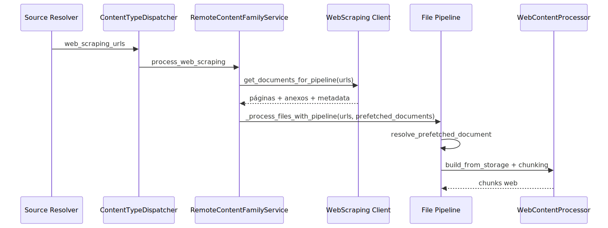

# Manual técnico: Pipeline de Ingestão Web Scraping

## 1. O que este manual técnico cobre

Este manual explica o slice técnico oficial da ingestão Web Scraping confirmado no código lido nesta sessão. O foco aqui é o caminho request-based usado pela ingestão oficial: resolução de URLs seed, preparação remota do documento, anexos, `prefetched_documents`, materialização HTML e persistência pela esteira comum.

Este manual não trata crawling amplo como comportamento canônico do request oficial sem evidência. O pacote web possui helpers de crawling recursivo e integração com Scrapy, mas isso aparece como capacidade disponível no client, não como fluxo oficial confirmado do `IngestionRequest.web_scraping_urls`.

## 2. Entry points reais

O caminho confirmado é este.

1. `resolve_web_scraping` lê `ingestion.remote_sources.web_scraping` e produz a lista de URLs.
2. `IngestionRequest` recebe essa lista em `web_scraping_urls`.
3. `ContentTypeDispatcher` detecta o conteúdo web e chama `_process_web_scraping_content`.
4. `RemoteContentFamilyService.process_web_scraping` assume a família remota.
5. `WebScrapingDatasourceMultimodalAdapterClient.get_documents_for_pipeline` prepara os documentos ricos.
6. `_process_files_with_pipeline` recebe as próprias URLs mais `prefetched_documents` obrigatórios.
7. `DataSourceDocumentExecutor.prepare` reutiliza o documento web já preparado.
8. `WebContentProcessor` materializa HTML limpo e cria chunks.

O ponto técnico crítico do diagrama é o reuso do documento prefetched. O pipeline genérico não deveria buscar a URL novamente, e o código confirma esse comportamento com `require_prefetched_documents=True`.

## 3. Contrato YAML que muda o comportamento

### 3.1. Fonte oficial das URLs

O resolver oficial lê `ingestion.remote_sources`. Dentro dele, a família `web_scraping` só participa do request se duas flags estiverem ativas: `remote_sources.enabled` e `remote_sources.web_scraping.enabled`.

As URLs são lidas da lista `remote_sources.web_scraping.sources`. Cada item pode ser string direta ou objeto com a chave `url`.

Impacto prático: o fluxo oficial é orientado a seeds explícitas. Se o bloco estiver ausente, desabilitado ou vazio, a feature não entra no lote.

### 3.2. Blocos do client que mudam o runtime

O client lê a configuração de `web_scraping` e extrai blocos que controlam comportamento real.

- `processing`: concorrência máxima, timeout, número de retries e atraso entre tentativas.
- `anti_bot`: user agent, browser fingerprint, CAPTCHA, Cloudflare e rate limiting.
- `proxy_rotation`: auto-rotação, tentativas em bloqueio, Bright Data, domínios que exigem proxy premium e integração com ScrapeOps.
- `security`: verificação SSL, redirects, domínios bloqueados e esquemas permitidos.
- `domain_specific_processing`: capability transversal consumida mais adiante pelo `WebContentProcessor`, depois da materialização HTML.
- `quality_filters` e `content_filters`: filtros de qualidade e de conteúdo usados durante a preparação da página.
- `javascript_rendering`: gate da estratégia avançada baseada em renderização.
- `smart_detection`: domínios avançados, quick detection de SPA e threshold de indicadores.
- `cache`: backend, TTL e prefixo de cache do resultado bruto do scraping.
- `deduplication`: backend, TTL e prefixo de deduplicação por hash.
- `attachments`: política de anexos e tipos permitidos.

### 3.3. Contrato multimodal do Web

O client resolve o gate local com `resolve_local_multimodal_gate_config_from_yaml(content_type="web")`. O resolvedor canônico rejeita `ingestion.remote_sources.web_scraping.multimodal` e exige `ingestion.web.multimodal` como fonte única do gate multimodal do tipo web.

Impacto prático: colocar o multimodal dentro do bloco remoto da fonte não funciona e falha cedo.

### 3.4. Caminhos legados rejeitados ou ignorados

O slice lido confirma alguns guards importantes.

- `ingestion.web.enabled` é inválido como ativação da coleta web. A ativação válida mora em `ingestion.remote_sources.web_scraping.enabled`.
- `remote_sources.web_scraping.multimodal` é inválido para o gate multimodal do tipo web.
- `web_scraping.security.authentication.attachments` é rejeitado. Attachments do web devem morar diretamente sob `web_scraping.attachments`.
- `anti_bot.javascript_rendering` não governa a resolução atual de renderização JavaScript; o client lê `web_scraping.javascript_rendering`.

### 3.5. Ambiguidade atual de autenticação

Existe uma ambiguidade operacional que vale registrar. O resolvedor dedicado de autenticação procura `remote_sources.web_scraping.authentication`. Já o client local aceita `web_scraping.authentication` e ainda faz fallback para `web_scraping.security.authentication`.

Impacto prático: a documentação do contrato precisa ser conservadora. O caminho principal confirmado para autenticação é `remote_sources.web_scraping.authentication`, mas o próprio client ainda carrega compatibilidade local com `security.authentication`.

## 4. Fluxo real de execução ponta a ponta

### 4.1. Resolução da família remota

`resolve_web_scraping` verifica se `remote_sources` existe, se está habilitado e se o bloco `web_scraping` também está habilitado. Depois converte `sources` em lista de URLs.

Se o resultado for vazio, o dispatcher não aciona o slice web.

### 4.2. Entrada no dispatcher

`ContentTypeDispatcher` registra o step `content_type:web_scraping` e chama `_process_web_scraping_content`. Essa função apenas delega a operação para `RemoteContentFamilyService.process_web_scraping`, o que mantém o dispatcher fino e coerente com a divisão por famílias.

### 4.3. Preparação da família remota

Na família remota, o código faz três guardas imediatas.

- sem URL, devolve resultado vazio;
- sem vector store, aborta com `RuntimeError`;
- antes de continuar, zera `_web_attachment_index` para a execução atual.

Na sequência, a família remota instancia `WebScrapingDatasourceMultimodalAdapterClient` com o YAML completo e `progress_callback`.

### 4.4. Aquisição do documento rico

O client executa `get_documents_for_pipeline`. Para cada URL, ele usa `_create_document_bundle_for_pipeline`, que chama `_fetch_document_data` e `_transform_to_document_async` com `pipeline_ready=True`.

Essa flag muda comportamento. Com `pipeline_ready=True`, o client devolve o documento base pronto para a esteira comum e não roda o enriquecimento multimodal nem o processamento de domínio dentro do próprio client. Isso evita duplicação com a etapa seguinte do pipeline.

Em termos práticos, isso significa que domain processing existe no slice Web, mas não na fronteira de aquisição remota. O enriquecimento é adiado para a camada documental, quando a página já foi transformada em documento canônico e o chunking HTML já tem contexto suficiente para receber metadata de domínio útil.

### 4.5. Escolha de estratégia de scraping

Dentro de `_fetch_document_data`, o client:

1. resolve domínio e autenticação aplicável;
2. registra início da coleta;
3. avalia se a URL exige proxy premium;
4. registra estado atual dos proxies;
5. pergunta ao `LinkExtractor` se a URL deve usar scraping avançado;
6. tenta o caminho avançado quando a resposta é positiva;
7. se o caminho avançado falhar, registra fallback e segue para o básico.

`should_use_advanced_scraping` usa prioridade explícita.

- se `javascript_rendering.enabled` estiver desligado, a resposta é sempre básica;
- se `smart_detection.enabled` estiver desligado, o runtime usa a estratégia avançada por padrão;
- se o domínio estiver em `advanced_scraping_domains`, a estratégia avançada é escolhida;
- se `quick_detection` estiver ativa, a decisão passa pela detecção rápida de SPA;
- na ausência disso, entram heurísticas de URL, como indicadores de `react`, `vue`, `/app/`, `/dashboard/` e subdomínios típicos.

`quick_spa_detection` faz uma requisição básica, baixa o HTML e conta indicadores de framework SPA até o threshold configurado.

### 4.6. Caminho avançado

Quando a estratégia avançada é escolhida, o client usa `scrape_spa_website` com possibilidade de browser automation, screenshot e extração de imagens. Depois ele limpa o HTML via `HtmlContentParser`, converte o DOM em conteúdo estruturado e escolhe entre esse conteúdo estruturado ou o texto simples como conteúdo preferido.

O resultado carrega `scraping_method="advanced"`, possível `spa_framework`, métricas de performance, imagens, links, anexos e estatísticas de limpeza.

### 4.7. Caminho básico

Quando a estratégia básica é usada, o client cria `ScrapingRequest` e chama `_scrape_basic_fallback` no `WebFetcher`. O fetcher encapsula sesssão HTTP, headers realistas, verificação de domínio, proxy e retry.

Os testes lidos confirmam retry com backoff em falhas transitórias e propagação explícita quando o número de tentativas é esgotado.

Depois da resposta, o client também limpa o HTML, tenta obter conteúdo estruturado e monta o resultado final com `scraping_method="basic"`.

### 4.8. Cache e deduplicação

O client instancia `WebScrapingCache` e `ContentDeduplicator` a partir da configuração. Ambos suportam `memory` e `redis`.

O cache guarda `ScrapingResult` serializado por URL com TTL. A deduplicação calcula hash SHA256 com base em texto normalizado e URL e decide se aquele conteúdo já foi visto.

Limite importante: quando Redis não está disponível, ambos trocam o backend para memória local. Isso é o comportamento real do código e deve ser entendido como compatibilidade operacional, não como coerência distribuída entre processos.

### 4.9. Anexos e índice lateral

`RemoteContentFamilyService` chama `_partition_web_documents_for_pipeline`, que separa páginas principais e attachment documents identificados por `metadata.source_type == "web_attachment"`. Em paralelo, o client expõe `get_attachment_metadata_index`, que devolve o índice de metadata por URL.

Se houver metadata de anexos, a família remota constrói `_web_attachment_index`. Se não houver índice estruturado, ela ainda cria `fallback_meta` a partir dos próprios documentos de anexo.

Quando existem anexos, a família remota materializa os documentos em `.sandbox/web_attachments` e chama `_propagate_web_attachment_paths`.

### 4.10. Verificação de integridade do prefetch

Antes de delegar para o pipeline comum, a família remota verifica se toda URL pedida consegue ser resolvida em `prefetched_documents`. Se alguma URL estiver sem documento correspondente, o fluxo aborta com `RuntimeError` explícito.

Esse é o guardrail que impede indexação baseada em fetch oculto.

### 4.11. Reentrada no pipeline padrão

Depois da preparação, a família remota chama `_process_files_with_pipeline` com:

- `file_paths` igual à lista original de URLs;
- `source_type=SourceType.REMOTE_FILE`;
- `source_system="web_scraping"`;
- `data_source_params.prefetched_documents`;
- `data_source_params.require_prefetched_documents=True`.

Isso força `DataSourceDocumentExecutor.prepare` a tentar `_resolve_prefetched_document` antes de qualquer data source fetch. Se o documento existir, ele é reutilizado e o pipeline registra em log que o prefetch foi reaproveitado.

### 4.12. Materialização HTML canônica e chunking

O `WebContentProcessor` herda de `HtmlContentProcessor`, mas especializa a materialização do documento web.

`build_from_storage` extrai HTML bruto de `raw_bytes` ou `content`, converte para texto limpo, monta `pages_info` com URL e status HTTP, chama a limpeza base e preserva metadata importante da página.

Na hora de gerar chunks, `_split_into_chunks` atualiza `pages_info` com o texto limpo final, calcula parâmetros adaptativos e registra telemetria de chunking. Se o processamento por domínio estiver habilitado, ele é aplicado depois que os chunks já existem.

O comportamento confirmado no código é este:

1. `_setup_domain_processing` cria `DomainProcessingResolver` e registra os domínios ativos;
2. `_split_into_chunks` delega primeiro ao chunking HTML base;
3. `_apply_domain_processing` chama `apply_processing(document, chunks)`;
4. o retorno `DomainProcessingOutcome` informa tanto os chunks enriquecidos quanto `applied_domains`;
5. quando nenhum plugin se aplica, o processor registra isso como caso observável, sem forçar erro.

Isso mantém coerência com PDF e JSON: o mesmo resolvedor central é reutilizado, e a diferença fica no momento do pipeline em que ele entra.

## 5. Contratos de entrada e saída

### Entrada oficial

O slice usa `IngestionRequest.web_scraping_urls` como entrada operacional. Esse campo é populado a partir do resolver de fontes.

### Saída intermediária

O client produz lista de `BaseDocument`, podendo incluir página principal e attachment documents. Em paralelo, devolve metadata indexada de anexos por URL.

### Saída para o pipeline comum

O pipeline comum recebe a URL original como `file_path`, mas resolve internamente um `StorageDocument` já preparado a partir de `prefetched_documents`.

### Saída final

O resultado final segue o contrato normal da ingestão: quantidade de documentos processados, chunks criados, chunks armazenados, sucesso, eventuais falhas e metadata de processamento.

## 6. O que acontece em caso de sucesso

No caminho feliz, cada URL seed vira um documento rico, possivelmente com anexos, entra no mapa de prefetch, é reaproveitada pelo executor de arquivo e segue para o chunking HTML canônico.

Os sinais mais úteis de sucesso no log são:

- início do step `content_type:web_scraping`;
- `INICIANDO PROCESSAMENTO WEB SCRAPING`;
- `WEB_SCRAPING_FETCH_INICIO`;
- `WEB_STRATEGY` com a estratégia escolhida;
- `WEB_ADVANCED_OK` ou `WEB_BASIC_OK`;
- `Documentos web preparados para pipeline padrao.`;
- `Documento prefetch reutilizado pelo pipeline.`;
- logs de `WEB CHUNKING`.

## 7. O que acontece em caso de erro

### 7.1. Sem vector store

Sintoma: a família remota aborta antes da esteira comum.

Detecção: `RuntimeError` indicando ausência de vector store para processamento de web scraping.

Impacto: o slice não continua porque a plataforma entende que não faz sentido capturar conteúdo sem destino de persistência.

### 7.2. Documento prefetched ausente

Sintoma: a URL foi pedida, mas não existe documento rico correspondente.

Detecção: erro explícito listando as URLs ricas ausentes.

Impacto: falha fechada, evitando fetch oculto e inconsistência entre captura e indexação.

### 7.3. Estratégia avançada falhou

Sintoma: Playwright ou a trilha avançada não concluiu a captura.

Detecção: log `WEB_FALLBACK` seguido de execução da trilha básica.

Impacto: o fluxo ainda tenta a captura básica, mas a qualidade final pode mudar.

### 7.4. Falha transitória de rede

Sintoma: conexão recusada, timeout ou erro semelhante no fetch básico.

Detecção: o `WebFetcher` reexecuta com backoff; se esgotar tentativas, propaga o erro.

Impacto: latência maior durante retry ou falha explícita se a janela de tentativa não bastar.

### 7.5. Configuração multimodal inválida

Sintoma: YAML com `remote_sources.web_scraping.multimodal`.

Detecção: `ValueError` apontando para `ingestion.web.multimodal`.

Impacto: falha cedo, antes de o runtime entrar em estado ambíguo.

## 8. Observabilidade e diagnóstico

### 8.1. Logs que contam a história

O slice lido já tem logs úteis nos pontos decisivos.

- início do processamento remoto;
- início de fetch por URL;
- exigência de proxy premium;
- estado do conjunto de proxies;
- estratégia escolhida;
- fallback da estratégia avançada;
- sucesso do fetch básico ou avançado;
- preparação dos documentos para o pipeline padrão;
- reuso do prefetch;
- inicialização do processamento por domínio Web;
- aplicação efetiva ou ausência de domínio aplicável nos chunks web;
- chunking web com parâmetros adaptativos.

### 8.2. Como diferenciar falha de aquisição de falha de chunking

Se o problema aparece antes de `Documentos web preparados para pipeline padrao.`, a falha está na camada remota de aquisição, anexos ou prefetch.

Se a preparação remota passou, mas o problema aparece depois, a investigação deve olhar `DataSourceDocumentExecutor` e `WebContentProcessor`.

### 8.3. Como diferenciar problema de estratégia

O campo mais útil é `WEB_STRATEGY`. Ele informa se a página foi tratada como `advanced_playwright` ou `basic_beautifulsoup`. Se o resultado ficou pobre em páginas claramente dinâmicas, esse log é o primeiro filtro para saber se a heurística escolheu a trilha certa.

### 8.4. Como diferenciar problema de contrato YAML

Erros de contrato aparecem cedo e com mensagem explícita, especialmente em paths legados de multimodal e ativação fora de `remote_sources.web_scraping`.

## 9. Comparação técnica com estado da arte

O slice atual está tecnicamente próximo de práticas modernas, mas com escopo específico.

- Está alinhado ao uso de browser automation para páginas dinâmicas, como recomendado em stacks baseadas em Playwright.
- Está alinhado à separação downloader versus pipeline observada em arquiteturas como Scrapy.
- Está alinhado à preocupação de reduzir ruído HTML antes de indexação, como fazem ferramentas focadas em extração de conteúdo principal.

Mas há diferenças importantes.

- O fluxo oficial confirmado aqui é orientado a seeds, não a broad crawl.
- O pacote suporta crawling recursivo e Scrapy, mas isso não ficou confirmado como caminho canônico do `IngestionRequest`.
- O runtime atual prefere uma arquitetura de documento rico reutilizado pelo pipeline, em vez de persistência direta na própria camada de scraping.

## 10. Configurações que mais mudam o comportamento

### `processing`

Controla concorrência, timeout e retry. Quanto mais agressivos os valores, maior throughput, mas maior risco de bloqueio e ruído operacional.

### `javascript_rendering`

Liga ou desliga a possibilidade de estratégia avançada. Se estiver desabilitado, `should_use_advanced_scraping` devolve falso e o runtime fica restrito ao básico.

### `smart_detection`

Controla quando usar a trilha avançada por domínio, quick detection ou heurística. É a principal alavanca para equilibrar custo e cobertura.

### `proxy_rotation`

Controla auto-rotação em bloqueios, domínios premium e integrações externas como Bright Data e ScrapeOps.

### `cache` e `deduplication`

Controlam reaproveitamento e prevenção de duplicidade de conteúdo. O risco principal é o operador assumir coerência distribuída quando o backend caiu para memória local.

### `attachments`

Controla se o runtime tenta coletar anexos, quais tipos aceita e como o contexto lateral da página será enriquecido.

### `security`

Controla SSL, redirects, domínios bloqueados e esquemas permitidos. Isso muda diretamente quais URLs a plataforma aceita processar.

### `authentication`

Controla sessões autenticadas e mapeamento por domínio. O caminho principal confirmado está em `remote_sources.web_scraping.authentication`, embora o client ainda tenha compatibilidade local com `security.authentication`.

## 11. Como colocar para funcionar

O caminho de execução confirmado no código é este: a feature precisa de um YAML com a família `ingestion.remote_sources.web_scraping` habilitada e com URLs em `sources`, além de vector store válido para a continuação da esteira.

Também é necessário configurar, quando aplicável, autenticação por domínio, proxy, rate limiting e o gate multimodal local do tipo web fora do bloco remoto.

O slice lido não confirmou, nesta sessão, um comando dedicado de exemplo operacional exclusivamente para Web Scraping. A execução real foi confirmada pelo caminho de código e pelos testes, não por uma rodada manual do pipeline web em ambiente local.

## 12. Limites e lacunas confirmadas

- Não ficou confirmado no código lido que o request oficial exponha crawling recursivo, sitemap crawl ou breadth crawl como contrato principal para a ingestão web.
- O pacote possui capacidade de `crawl_site_recursive` e `crawl_with_scrapy`, mas isso deve ser tratado como capacidade disponível do client, não como caminho oficial automaticamente usado.
- Existe ambiguidade atual na superfície de autenticação do client.
- O fallback Redis para memória em cache e deduplicação reduz previsibilidade distribuída.

## 13. Troubleshooting

### Sintoma: páginas dinâmicas entram quase vazias

Causa provável: `javascript_rendering` desligado ou heurística escolhendo caminho básico.

Como confirmar: procurar `WEB_STRATEGY` e ver se a estratégia foi `basic_beautifulsoup`.

Ação recomendada: revisar `javascript_rendering` e `smart_detection`.

### Sintoma: URL foi pedida, mas o pipeline reclamou de prefetch ausente

Causa provável: a camada remota não devolveu documento rico para aquela URL.

Como confirmar: procurar a exceção de `Documentos web ricos ausentes para URLs solicitadas`.

Ação recomendada: investigar a captura da URL antes do chunking.

### Sintoma: anexos não foram associados à página

Causa provável: attachments desabilitados, tipos não permitidos ou ausência de storage service.

Como confirmar: revisar logs de anexos, o índice `get_attachment_metadata_index` e `_web_attachment_index`.

Ação recomendada: revisar `web_scraping.attachments` e a política de persistência de imagens.

### Sintoma: comportamento difere entre processos

Causa provável: cache ou deduplicação operando em memória por indisponibilidade de Redis.

Como confirmar: procurar logs `CACHE_REDIS_INDISPONIVEL`, `DEDUP_REDIS_INDISPONIVEL` ou logs de fallback de inicialização.

Ação recomendada: validar a infraestrutura Redis e não assumir coerência cross-process enquanto o backend estiver local.

## 14. Checklist de entendimento

- Entendi o entry point oficial da ingestão web.
- Entendi o contrato YAML que ativa a família remota.
- Entendi como o runtime escolhe entre scraping básico e avançado.
- Entendi por que o prefetch é obrigatório.
- Entendi como anexos entram no fluxo.
- Entendi onde o multimodal do tipo web deve ser configurado.
- Entendi as lacunas atuais confirmadas no código lido.

## 15. Evidências no código

- `src/services/ingestion_request_source_resolvers.py`
  - Motivo da leitura: confirmar a leitura oficial das URLs seed.
  - Símbolo relevante: `resolve_web_scraping`.
  - Comportamento confirmado: o request web nasce de `ingestion.remote_sources.web_scraping.sources`.
- `src/ingestion_layer/content_type_dispatcher.py`
  - Motivo da leitura: confirmar a entrada no slice web e o particionamento entre páginas, anexos e `prefetched_documents`.
  - Símbolos relevantes: `_process_web_scraping_content`, `_partition_web_documents_for_pipeline`, `_resolve_prefetched_document`.
  - Comportamento confirmado: a URL entra na família remota e volta como documento prefetched obrigatório.
- `src/ingestion_layer/remote_content_family.py`
  - Motivo da leitura: confirmar a ponte entre família remota e pipeline padrão.
  - Símbolo relevante: `process_web_scraping`.
  - Comportamento confirmado: o runtime valida vector store, prepara anexos, verifica prefetch e delega para `_process_files_with_pipeline`.
- `src/ingestion_layer/file_pipeline_services.py`
  - Motivo da leitura: confirmar o reuso do prefetch e a falha fechada quando ele é obrigatório.
  - Símbolo relevante: `DataSourceDocumentExecutor.prepare`.
  - Comportamento confirmado: com `require_prefetched_documents=True`, o executor não faz fetch alternativo.
- `src/ingestion_layer/clients/web_scraping/_client.py`
  - Motivo da leitura: confirmar configuração, escolha de estratégia, transformação documental e modo pipeline-ready.
  - Símbolos relevantes: `__init__`, `_fetch_document_data`, `_transform_to_document_async`, `get_documents_for_pipeline`.
  - Comportamento confirmado: o client concentra política remota e prepara o bundle usado pela esteira oficial.
- `src/ingestion_layer/clients/web_scraping/_fetcher.py`
  - Motivo da leitura: confirmar responsabilidades de rede, retry e políticas anti-bot.
  - Símbolo relevante: `WebFetcher`.
  - Comportamento confirmado: a camada de fetch encapsula sessão HTTP, retry, proxy e autenticação.
- `src/ingestion_layer/clients/web_scraping/_link_extractor.py`
  - Motivo da leitura: confirmar heurística de scraping avançado e capacidades extras de crawling.
  - Símbolos relevantes: `should_use_advanced_scraping`, `quick_spa_detection`, `crawl_site_recursive`, `crawl_with_scrapy`.
  - Comportamento confirmado: a decisão de estratégia é heurística e o pacote possui capacidades de crawling além do fluxo seed-based.
- `src/ingestion_layer/clients/web_scraping/_cache.py`
  - Motivo da leitura: confirmar cache e deduplicação reais.
  - Símbolos relevantes: `WebScrapingCache`, `ContentDeduplicator`.
  - Comportamento confirmado: ambos tentam Redis e podem operar em memória local.
- `src/ingestion_layer/processors/web_processor.py`
  - Motivo da leitura: confirmar materialização HTML canônica e chunking adaptativo.
  - Símbolo relevante: `WebContentProcessor`.
  - Comportamento confirmado: o processor transforma o documento prefetched em HTML limpo e chunks reutilizáveis.
- `src/core/multimodal_runtime/config_resolver.py`
  - Motivo da leitura: confirmar o contrato multimodal canônico do tipo web.
  - Símbolo relevante: `resolve_local_multimodal_gate_config_from_yaml`.
  - Comportamento confirmado: `ingestion.web.multimodal` é o gate válido e paths legados falham.
