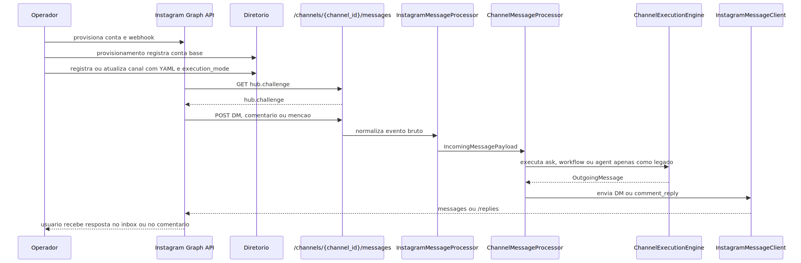

# Manual tecnico e guia de integracao por exemplo: Instagram para agente em comentario, mencao e mensagem direta

## 1. Objetivo deste manual

Este manual mostra como usar o Instagram com um agente no runtime atual do projeto. O foco aqui e tecnico e operacional.

Voce vai ver:

1. como provisionar a conta Instagram Business;
2. como registrar o canal para usar ask ou workflow, tratando `agent` apenas como legado;
3. como associar um YAML ao canal e trocar esse vinculo depois;
4. qual rota de webhook serve handshake e trafego real;
5. como o parser le DMs, comentarios e mencoes;
6. como responder por DM;
7. como responder publicamente a comentario;
8. quais limites existem no modo legado `agent` e no modo `ask`.

Este documento complementa [README-CONCEITUAL-INSTAGRAM-AGENTE-COMENTARIOS-DM.md](../conceitual/README-CONCEITUAL-INSTAGRAM-AGENTE-COMENTARIOS-DM.md), que apresenta a visao funcional e de negocio da feature. Aqui o foco e o canal conversacional com agente.

## 2. Entry points reais

### 2.1. Provisionamento da conta

- `POST /api/instagram/provision/start`

### 2.2. Cadastro e runtime do canal

- `POST /channels/register`
- `POST /channels/list`
- `GET /admin/channels`
- `PUT /admin/channels/{channel_id}`
- `GET /channels/{channel_id}/messages`
- `POST /channels/{channel_id}/messages`
- `POST /channels/{channel_id}/end-users/list`
- `POST /channels/{channel_id}/end-users/upsert`
- `POST /channels/instagram/{channel_id}/messages`
- `POST /channels/instagram/{channel_id}/send`
- `POST /channels/instagram/{channel_id}/history`
- `POST /channels/instagram/webhook/test`

### 2.3. Permissoes relevantes

- `provision.instagram`
- `channels.register`
- `channels.message`
- `channels.list`

## 3. Fluxo tecnico de ponta a ponta



O ponto central desse diagrama e este: comentario, mencao e DM entram pelo mesmo runtime, mas a resposta final nao sai automaticamente pela mesma superficie. A saida precisa carregar a semantica certa.

## 4. Como configurar o Instagram

### 4.1. Caminho administrativo por UI

Existe uma UI administrativa confirmada em [app/ui/static/ui-admin-gov-provisionamento-instagram.html](../app/ui/static/ui-admin-gov-provisionamento-instagram.html). Ela coleta os campos obrigatorios e faz `POST /api/instagram/provision/start` com `X-API-Key`.

No fluxo visivel da tela, os campos exigidos sao:

1. `instagram_business_account_id`
2. `page_id`
3. `display_name`
4. `email`
5. `access_token`
6. `app_id`
7. `app_secret`
8. `callback_url`
9. `verify_token`
10. `channel_id` opcional
11. `graph_api_version` opcional

### 4.2. Caminho administrativo por API

Exemplo minimo real:

```json
POST /api/instagram/provision/start
{
  "instagram_business_account_id": "17841499999999999",
  "page_id": "112233445566778",
  "page_name": "Plataforma de Agentes de IA Corp",
  "display_name": "Loja Plataforma de Agentes de IA",
  "email": "contato@prometeu.com.br",
  "access_token": "EAAG...",
  "app_id": "123456789012345",
  "app_secret": "segredo_meta_123",
  "callback_url": "https://api.exemplo.com/channels/17841499999999999/messages",
  "verify_token": "token_seguro_123",
  "channel_id": "17841499999999999",
  "graph_api_version": "v20.0"
}
```

### 4.3. O que o onboarding faz de fato

1. busca o perfil da conta Instagram Business;
2. assina a pagina para `instagram_messages,messages,messaging_postbacks`;
3. configura o webhook com `fields=comments,mentions,messages`;
4. registra a conta no diretorio local.

## 5. Qual callback usar no webhook

Se voce quiser usar a superficie nativa do app para o webhook da Meta, o caminho mais seguro confirmado no codigo e:

```text
GET /channels/{channel_id}/messages
POST /channels/{channel_id}/messages
```

Motivo: essa mesma rota ja tem o handshake GET e o POST generico consegue parsear eventos de `object=instagram`.

O endpoint `POST /channels/instagram/{channel_id}/messages` tambem existe e e util como superficie dedicada de POST, mas ele nao tem handshake GET parceiro no mesmo path. Por isso, para callback completo de Meta, a rota generica e a referencia mais segura do slice lido.

## 6. Como cadastrar o canal Instagram

O canal precisa existir no diretorio para o webhook conseguir resolver tenant, YAML e segredos.

### 6.1. O que o provisionamento cria e o que ainda falta

O onboarding da conta Instagram nao fecha sozinho o comportamento final do canal. No slice lido, o registro inicial da conta persiste um canal base com `channel_id` igual ao `instagram_business_account_id`, `channel_type=instagram`, `execution_mode=ask` e `yaml_path=None`.

Na pratica, isso significa o seguinte.

1. o provisionamento prepara a conta, o webhook e a entrada base no diretorio;
2. a associacao do canal a um agente ou workflow nao acontece por um `agent_id` separado;
3. o comportamento real do canal nasce quando voce grava `yaml_path` + `execution_mode` no catalogo do canal.

Se essa segunda etapa nao acontecer, o webhook pode chegar, mas o runtime nao tera um YAML valido para carregar.

### 6.2. Exemplo de registro do canal

```json
POST /channels/register
{
  "yaml_config_path": "app/yaml/clientes/cliente_demo.yaml",
  "user_email": "implantacao@cliente.com",
  "channel": {
    "channel_id": "17841499999999999",
    "client_code": "cliente_demo",
    "channel_type": "instagram",
    "description": "Canal Instagram de atendimento",
    "yaml_path": "app/yaml/clientes/cliente_demo.yaml",
    "execution_mode": "workflow",
    "queue_mode": "inline",
    "security": {
      "secret_token": "segredo_webhook_instagram"
    },
    "metadata": {
      "default_user_email": "social@cliente.com",
      "instagram_business_account_id": "17841499999999999",
      "graph_api_version": "v20.0",
      "channel_end_user_policy": {
        "principal_mode": "persist_optional",
        "access_policy": "observe_only"
      }
    }
  }
}
```

Use esse endpoint tambem quando a conta ja foi provisionada. O `ChannelRegistry.register` faz upsert no diretorio central, entao o mesmo `channel_id` pode ser regravado para sair do estado base e passar a operar com `workflow` ou, apenas em compatibilidade legada, com `agent`.

### 6.3. Por que o exemplo usa `channel_id` igual ao `instagram_business_account_id`

No slice lido, o `InstagramMessageClient` usa `definition.channel_id` para montar o endpoint `/{business_account_id}/messages`. Isso significa que o runtime atual fica mais seguro quando o `channel_id` cadastrado coincide com o identificador da conta Instagram Business usado na Graph API.

Se voce usar um alias logico diferente, o onboarding pode ate registrar a conta, mas o envio runtime pode nao apontar para o recurso correto.

### 6.4. Como associar um YAML do agente ao canal

No runtime atual, associar um agente ao canal significa associar o YAML que governa esse agente ao `channel_id` do Instagram e declarar o `execution_mode` correto.

Exemplo pratico:

1. se voce estiver sustentando um canal legado cujo YAML ainda depende desse ramo, o canal precisa apontar para esse `yaml_path` e usar `execution_mode=agent`;
2. se o YAML seleciona um workflow, o canal deve apontar para esse `yaml_path` e usar `execution_mode=workflow`;
3. se o canal usa apenas pergunta e resposta simples, o caminho mais enxuto continua sendo `execution_mode=ask`.

Para novos canais, a recomendacao publica e evitar `execution_mode=agent`. Esse ramo permanece apenas para contas legadas ainda nao migradas.

O ponto importante e este: o canal nao consulta um cadastro de agente separado. O vinculo operacional e sempre `yaml_path` + `execution_mode`.

### 6.5. Como trocar o YAML depois sem reprovisionar a conta

Depois que o canal ja existe, o catalogo administrativo permite trocar o `yaml_path` sem recriar a conta Instagram nem refazer o webhook na Meta.

```json
PUT /admin/channels/17841499999999999
{
  "yaml_path": "app/yaml/clientes/cliente_demo_vendas.yaml",
  "default_user_email": "social@cliente.com",
  "description": "Instagram comercial"
}
```

Esse endpoint atualiza `yaml_path`, `default_user_email`, `description` e `metadata`. Ele nao altera `execution_mode`. Se voce precisar mudar de `ask` para `workflow`, por exemplo, o caminho correto continua sendo regravar o canal por `POST /channels/register`.

### 6.6. Como governar remetentes do canal

O canal tambem tem governanca operacional de remetentes persistidos. Isso serve para allowlist, blocklist ou auditoria do publico que esta falando com a conta.

```json
POST /channels/17841499999999999/end-users/list
{
  "limit": 20,
  "status": "active"
}
```

```json
POST /channels/17841499999999999/end-users/upsert
{
  "external_user_id": "17840000000001",
  "status": "blocked",
  "display_name": "Perfil bloqueado"
}
```

Isso nao troca o YAML do canal, mas muda quem pode operar dentro dele quando a politica do canal exige controle de principal.

## 7. Como o webhook le DMs, comentarios e mencoes

### 7.1. DM de inbox

O parser procura eventos dentro de `entry[].messaging[]`.

Exemplo reduzido:

```json
{
  "object": "instagram",
  "entry": [
    {
      "id": "page-1",
      "messaging": [
        {
          "sender": {"id": "user-1"},
          "recipient": {"id": "page-1"},
          "timestamp": 1,
          "message": {"text": "Oi", "mid": "m-1"}
        }
      ]
    }
  ]
}
```

Isso vira `IncomingMessagePayload` com:

1. `sender_id=user-1`
2. `message_type=TEXT`
3. `text=Oi`

### 7.2. Comentario ou mencao em publicacao

O parser procura eventos dentro de `entry[].changes[]`.

Exemplo reduzido confirmado em teste:

```json
{
  "object": "instagram",
  "entry": [
    {
      "id": "page-1",
      "changes": [
        {
          "field": "comments",
          "value": {
            "comment_id": "c-1",
            "from": {"id": "user-9"},
            "post_id": "p-1",
            "text": "Qual o preco?"
          }
        }
      ]
    }
  ]
}
```

Isso vira payload com:

1. `sender_id=user-9`
2. `message_type=TEXT`
3. `text=Qual o preco?`
4. `metadata.comment_id=c-1`
5. `metadata.post_id=p-1`

Observacao importante: o parser trata comentarios e mencoes pelo mesmo caminho quando o payload da Meta traz campos de comentario genericos como `comment_id` ou `id`, autor e texto.

### 7.3. Postback e quick reply

Eventos de `postback` viram payload `INTERACTIVE` com botao unico. Isso e util para fluxo de inbox guiado.

## 8. Como o agente responde no Instagram

### 8.1. Resposta por DM

Quando o `OutgoingMessage` traz texto, botoes ou midia, o `InstagramResponder` monta mensagens para o endpoint `/{business_account_id}/messages`.

Isso cobre:

1. texto simples;
2. quick replies;
3. anexos com `attachment_id` ou `url`;
4. sequencias brutas via `instagram_sequence`.

### 8.2. Resposta publica a comentario

Quando o `OutgoingMessage.metadata` traz:

```json
{
  "instagram_comment_reply": {
    "comment_id": "c-1",
    "text": "Obrigado pelo interesse!"
  }
}
```

o responder monta um bloco `comment_reply` e o cliente HTTP chama `/{comment_id}/replies`.

### 8.3. Responder comentario e continuar em DM

O responder suporta os dois no mesmo lote. Exemplo de saida logica:

```json
{
  "text": "Chega em DM",
  "metadata": {
    "instagram_comment_reply": {
      "comment_id": "c-1",
      "text": "Obrigado pelo interesse!"
    }
  }
}
```

O efeito do runtime sera:

1. publicar a resposta em `/{comment_id}/replies`;
2. montar uma DM com `text=Chega em DM`.

Importante: o runtime monta esse lote. A aceitacao operacional da DM iniciada a partir de comentario depende das regras do provedor e nao foi validada ponta a ponta no slice lido.

## 9. O ponto mais importante: `ask` e `agent` nao bastam para reply publico automatizado

Essa e a regra tecnica mais importante para o seu caso de uso.

### 9.1. O que `ask` faz

`QuestionService` devolve `answer`. O canal encapsula isso em `OutgoingMessage(text=...)`.

Resultado pratico: gera resposta textual, nao `instagram_comment_reply`.

### 9.2. O que `agent` faz hoje como legado

`AgentOrchestrator` devolve `final_response`. O canal tambem encapsula isso em `OutgoingMessage(text=...)`.

Resultado pratico: gera resposta textual, nao `instagram_comment_reply`. Esse caminho continua apenas para compatibilidade e nao deve ser usado em novos projetos.

### 9.3. O que `workflow` faz

`WorkflowOrchestrator` pode devolver `outgoing_message` estruturado, com `text`, `buttons`, `media` e `metadata`.

Resultado pratico: e o caminho mais adequado para comentario com resposta publica automatizada, porque consegue carregar `instagram_comment_reply`.

### 9.4. Recomendacao objetiva

Se o objetivo e ler comentario em post e responder publicamente com agente, use `execution_mode=workflow` ou uma integracao manual que envie `messages` raw com `comment_reply`.

Se o objetivo e conversar no inbox via DM, `ask` ou `workflow` sao as opcoes recomendadas para novos canais. `agent` fica reservado a compatibilidade legada.

## 10. Como fazer conversa por mensagem direta

### 10.1. Fluxo recomendado

1. provisionar a conta;
2. registrar o canal;
3. apontar o callback da Meta para `GET/POST /channels/{channel_id}/messages`;
4. configurar o canal em `ask` ou `workflow` para novos projetos;
5. garantir `security_keys` com token do Instagram;
6. enviar uma DM real para a conta.

### 10.2. Exemplo de envio manual de DM

```json
POST /channels/instagram/17841499999999999/send
{
  "yaml_config_path": "app/yaml/clientes/cliente_demo.yaml",
  "recipient_id": "123456",
  "text": "Ola Instagram"
}
```

Esse endpoint e util para testes operacionais ou para disparo manual controlado.

### 10.3. Exemplo de quick replies

```json
POST /channels/instagram/17841499999999999/send
{
  "yaml_config_path": "app/yaml/clientes/cliente_demo.yaml",
  "recipient_id": "123456",
  "text": "Escolha uma opcao",
  "quick_replies": [
    {"title": "Promocoes", "payload": "promo"},
    {"title": "Suporte", "payload": "suporte"}
  ]
}
```

## 11. Como fazer leitura e resposta em comentario de publicacao

### 11.1. Leitura do comentario

O parser ja faz essa parte quando o webhook entrega evento em `changes` com `comment_id`, autor e texto.

### 11.2. Resposta publica automatizada

Para responder publicamente via runtime do agente, o caso de uso precisa devolver algo equivalente a:

```json
{
  "outgoing_message": {
    "text": "Posso te ajudar no inbox tambem.",
    "metadata": {
      "instagram_comment_reply": {
        "comment_id": "c-1",
        "text": "Obrigado pelo comentario!"
      }
    }
  }
}
```

Esse formato encaixa naturalmente em `workflow`, porque o caminho de workflow preserva `metadata` do `outgoing_message`.

### 11.3. Resposta publica manual

O endpoint manual aceita `messages` raw. Isso permite disparar `comment_reply` sem depender de workflow.

Exemplo:

```json
POST /channels/instagram/17841499999999999/send
{
  "yaml_config_path": "app/yaml/clientes/cliente_demo.yaml",
  "messages": [
    {
      "comment_reply": {
        "comment_id": "c-1",
        "text": "Obrigado pelo interesse!"
      }
    }
  ]
}
```

## 12. Como fazer conversa em comentario e DM ao mesmo tempo

Se voce quiser responder publicamente no post e continuar no privado, use um workflow ou envio manual que emita os dois blocos.

Exemplo manual:

```json
POST /channels/instagram/17841499999999999/send
{
  "yaml_config_path": "app/yaml/clientes/cliente_demo.yaml",
  "messages": [
    {
      "comment_reply": {
        "comment_id": "c-1",
        "text": "Obrigado! Te chamei no inbox."
      }
    },
    {
      "recipient": {"id": "user-9"},
      "messaging_type": "RESPONSE",
      "message": {
        "text": "Oi! Aqui esta a resposta detalhada no privado."
      }
    }
  ]
}
```

### 12.1. Como auditar o catalogo administrativo do canal

Quando a duvida for qual YAML esta associado ao Instagram hoje, nao comeca pelo payload da Meta. Comeca pelo catalogo administrativo.

```json
GET /admin/channels
```

Esse endpoint devolve `channel_id`, `client_code`, `channel_type`, `yaml_path`, `execution_mode`, `default_user_email`, `status` e metadados administrativos. Para Instagram, e o jeito certo de verificar se a conta provisionada ja foi promovida para um canal realmente operavel.

## 13. Configuracoes que mudam o comportamento

As configuracoes mais importantes confirmadas no codigo sao estas.

1. `channel_type=instagram`
2. `execution_mode=ask|agent|workflow`
3. `queue_mode=inline|redis|rabbitmq`
4. `yaml_path` do canal
5. `security.secret_token` para validar HMAC do webhook
6. `metadata.default_user_email`
7. `metadata.channel_end_user_policy` para controle de remetente
8. `security_keys.access_token` do Instagram
9. `metadata.graph_api_version` ou `security_keys.graph_api_version`

## 14. Testes operacionais uteis

### 14.1. Testar o parser do webhook sem chamar a Meta

```json
POST /channels/instagram/webhook/test
{
  "body": {
    "object": "instagram",
    "entry": [
      {
        "id": "123",
        "messaging": [
          {
            "sender": {"id": "user_1"},
            "recipient": {"id": "page_1"},
            "timestamp": 1710000000,
            "message": {"text": "Oi"}
          }
        ]
      }
    ]
  }
}
```

Esse endpoint devolve os payloads internos criados pelo parser.

### 14.2. Consultar historico salvo

```json
POST /channels/instagram/17841499999999999/history
{
  "limit": 20,
  "direction": "both"
}
```

Isso ajuda a auditar o que entrou e saiu do canal.

## 15. Principais erros confirmados no codigo

### 15.1. Callback errado para a Meta

Se o callback apontar para um path que nao tenha GET de verificacao e POST compativel, o onboarding pode parecer concluido, mas o runtime nao fecha o ciclo.

### 15.2. Canal sem `client_code` ou `yaml_path`

O webhook nao consegue resolver o tenant nem carregar o YAML correto.

### 15.3. Conta provisionada, mas canal ainda no estado base

O onboarding registrou a conta, mas ela ficou com `execution_mode=ask` e `yaml_path=None`. Nesse estado, a conta existe no diretorio, mas ainda nao esta ligada ao YAML do agente.

### 15.4. Token do Instagram ausente ou placeholder

O envio falha explicitamente no `InstagramMessageClient`.

### 15.5. Comentario entrou, mas nao houve resposta publica

Isso normalmente significa que o caso de uso devolveu apenas texto simples e nao `instagram_comment_reply`.

### 15.6. Identificador de conta desalinhado

Se `channel_id` nao estiver alinhado com o identificador usado pelo endpoint de mensagens da conta, o envio pode quebrar mesmo com token valido.

### 15.7. YAML trocado no catalogo, mas comportamento ainda inesperado

O `yaml_path` foi alterado, mas o `execution_mode` permaneceu o mesmo. Trocar o YAML por `PUT /admin/channels/{channel_id}` nao muda de `ask` para `workflow`.

## 16. Observabilidade e diagnostico

### 16.1. Como separar o problema

1. problema de onboarding: falha em `fetch_business_profile`, assinatura da pagina ou configuracao do webhook;
2. problema de parser: webhook nao vira payload interno;
3. problema de execucao: canal nao gera `OutgoingMessage` util;
4. problema de semantica: `OutgoingMessage` existe, mas nao traz `instagram_comment_reply` para comentario;
5. problema de entrega: a Graph API rejeita DM ou reply publico.

### 16.2. O que procurar

1. `channel_id`
2. `client_code`
3. `instagram_business_account_id`
4. `comment_id`
5. `post_id`
6. `message_id`
7. `correlation_id`

Quando a pergunta for por que a conta esta executando o agente errado, confira nesta ordem:

1. `GET /admin/channels` para ver `yaml_path` e `execution_mode` atuais;
2. se houve somente update administrativo de `yaml_path` ou se tambem houve novo `POST /channels/register`;
3. se o canal tem `client_code` valido e `default_user_email` coerente;
4. se a politica de remetente esta bloqueando ou apenas observando o principal.

## 17. Como colocar para funcionar

### 17.1. Ordem recomendada

1. provisionar a conta por API ou UI administrativa;
2. registrar ou regravar o canal com o mesmo `channel_id`, agora com `yaml_path` e `execution_mode` finais;
3. configurar `channel_id` alinhado ao identificador da conta;
4. garantir `security_keys.access_token` do canal;
5. apontar a Meta para a rota generica de canais;
6. validar o catalogo por `GET /admin/channels`;
7. testar o parser com `POST /channels/instagram/webhook/test`;
8. testar DM manual com `/channels/instagram/{channel_id}/send`;
9. se o caso for comentario publico, usar `workflow` ou mensagem raw com `comment_reply`.

### 17.2. Recomendacao por caso de uso

1. DM de atendimento novo: `ask` ou `workflow` sao as opcoes recomendadas.
2. Comentario publico automatizado: prefira `workflow`.
3. Resposta administrativa pontual em comentario: use `/channels/instagram/{channel_id}/send` com `comment_reply`.

## 18. Explicacao 101

No runtime atual, ler comentario do Instagram e facil porque o parser ja converte isso para texto interno. O ponto delicado e a volta. Responder no inbox e uma coisa. Responder embaixo do post e outra.

Se a sua automacao devolver so um texto comum, o sistema sabe montar mensagem direta. Para ele responder publicamente no comentario, a automacao precisa dizer explicitamente qual comentario deve receber reply e qual texto vai nesse reply.

Por isso comentario com resposta publica nao e apenas "o mesmo agente com outro canal". E o mesmo agente com uma semantica de saida mais rica.

## 19. Limites e pegadinhas

1. `POST /channels/{channel_id}/messages` e a rota mais segura para callback Meta porque tem GET parceiro para verificacao.
2. `POST /channels/instagram/{channel_id}/messages` e util, mas nao substitui sozinho o callback completo.
3. `agent` e `ask` nao criam `instagram_comment_reply` no slice lido, e `agent` nao deve ser recomendado para novos canais.
4. comentario e mencao entram pelo mesmo caminho generico do parser, mas o formato exato do evento da Meta continua mandando na capacidade de normalizacao.
5. `channel_id` desalinhado com a conta pode quebrar o envio.

## 20. Troubleshooting

### 20.1. O comentario foi lido, mas o post nao recebeu resposta

Confirme se o `OutgoingMessage` carregou `metadata.instagram_comment_reply`.

### 20.2. A conta foi provisionada, mas a Meta nao valida o webhook

Confirme callback, token de verificacao e se a rota escolhida realmente suporta GET e POST do webhook.

### 20.3. DM manual funciona, mas automacao nao responde

Confirme `execution_mode`, `yaml_path`, `client_code` e se o canal foi registrado corretamente.

### 20.4. O webhook chega, mas o envio falha

Confirme token do Instagram e alinhamento entre `channel_id` e identificador operacional da conta.

## 21. Exercicios guiados

### 21.1. Exercitar DM automatizada

Objetivo: comprovar que voce entende o caminho de inbox.

Passos:

1. registre o canal em `workflow` quando o objetivo for novo fluxo automatizado;
2. monte um webhook de DM no `instagram/webhook/test`;
3. descreva qual payload o parser devolve;
4. explique como esse payload vira resposta no inbox.

### 21.2. Exercitar comentario com reply publico

Objetivo: comprovar que voce entende a diferenca entre texto simples e reply publico.

Passos:

1. monte um evento de comentario;
2. escreva uma saida de workflow com `instagram_comment_reply`;
3. explique por que o caminho legado `agent` simples nao resolve o mesmo caso.

## 22. Checklist de entendimento

- Entendi como provisionar a conta Instagram.
- Entendi que provisionar conta nao basta para associar o agente ao canal.
- Entendi qual callback usar para webhook Meta.
- Entendi como registrar o canal no diretorio.
- Entendi que o vinculo real do canal com o agente e `yaml_path` + `execution_mode`.
- Entendi quando usar `POST /channels/register` e quando usar `PUT /admin/channels/{channel_id}`.
- Entendi como DMs entram no parser.
- Entendi como comentarios entram no parser.
- Entendi que resposta publica depende de `instagram_comment_reply`.
- Entendi por que `workflow` e o modo mais adequado para comentario automatizado.
- Entendi como usar o endpoint manual para DM ou comment reply.

## 23. Evidencias no codigo

- `src/api/routers/instagram_provision_router.py`
  - Motivo da leitura: contrato administrativo do onboarding.
  - Simbolos relevantes: `InstagramProvisionStartRequest`, `start_instagram_provisioning`.
  - Comportamento confirmado: o onboarding configura webhook e registra a conta.

- `src/channel_layer/services/instagram_onboarding.py`
  - Motivo da leitura: assinatura de pagina e campos de webhook.
  - Simbolos relevantes: `subscribe_page_to_messages`, `configure_webhook`.
  - Comportamento confirmado: a conta assina `instagram_messages,messages,messaging_postbacks` e o webhook pede `comments,mentions,messages`.

- `src/channel_layer/instagram_processor.py`
  - Motivo da leitura: parser real do webhook.
  - Simbolos relevantes: `_build_message_payload`, `_build_comment_payload`, `_build_postback_payload`.
  - Comportamento confirmado: o parser distingue inbox, comentario e postback.

- `src/api/routers/channel_router.py`
  - Motivo da leitura: borda HTTP de webhook, envio manual, historico e teste.
  - Simbolos relevantes: `register_channel`, `submit_message`, `submit_instagram_message`, `list_channel_end_users`, `upsert_channel_end_user`, `send_instagram_message`, `instagram_history`, `test_instagram_webhook`.
  - Comportamento confirmado: o app expoe registro/upsert de canal, webhook generico, governanca de remetentes, teste seguro do parser e operacao manual Instagram.

- `src/security/channel_repository.py`
  - Motivo da leitura: confirmar o que o onboarding persiste e o que o catalogo administrativo realmente atualiza.
  - Simbolos relevantes: `register_instagram_account`, `list_channels_catalog`, `update_channel_catalog`.
  - Comportamento confirmado: o onboarding cria a conta com `execution_mode=ask` e `yaml_path=None`, enquanto o catalogo administrativo troca `yaml_path`, `default_user_email`, `description` e `metadata`.

- `src/api/routers/admin/users_router.py`
  - Motivo da leitura: confirmar catalogo e manutencao administrativa dos canais.
  - Simbolos relevantes: `list_channels`, `update_channel`.
  - Comportamento confirmado: a operacao consegue auditar canais e trocar o YAML associado sem reprovisionar a conta Instagram.

- `src/channel_layer/config_resolver.py`
  - Motivo da leitura: confirmar que a execucao do canal depende de `yaml_path` valido e `client_code` definido.
  - Simbolos relevantes: `ChannelRuntimeConfigResolver.load_channel_config`.
  - Comportamento confirmado: sem `yaml_path` ou sem `client_code`, o runtime do canal falha explicitamente.

- `src/channel_layer/responders/instagram_responder.py`
  - Motivo da leitura: semantica da resposta para DM e comentario.
  - Simbolos relevantes: `_build_payload`, `_build_comment_reply`, `_build_quick_replies`.
  - Comportamento confirmado: a resposta publica depende de metadado explicito.

- `src/channel_layer/clients/instagram_message_client.py`
  - Motivo da leitura: entrega final para a Graph API.
  - Simbolos relevantes: `build_from_channel`, `send_batch`, `_send_comment_reply`.
  - Comportamento confirmado: DM e reply publico usam endpoints distintos da Graph API.

- `app/ui/static/ui-admin-gov-provisionamento-instagram.html`
  - Motivo da leitura: confirmar onboarding tambem pela UI administrativa.
  - Comportamento confirmado: a tela envia o mesmo contrato de `POST /api/instagram/provision/start` com `X-API-Key`.
