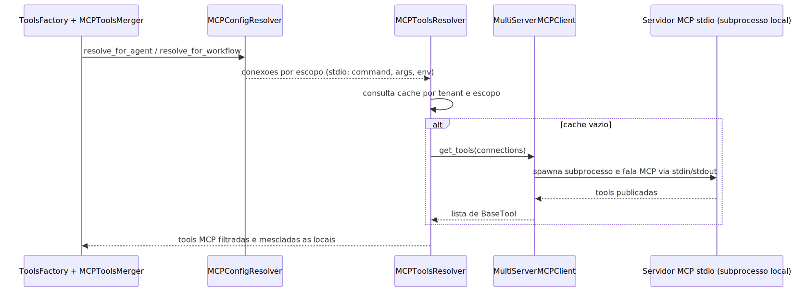

# Manual técnico e operacional: MCP no sistema

> Escopo desta integração (decisão de arquitetura): o projeto **NÃO hospeda servidor MCP
> próprio**. O MCP existe aqui **somente como cliente**: ele descobre tools em servidores MCP
> externos e as transforma em **tools de agente/workflow**, exatamente simétricas às tools
> nativas do catálogo builtin. O eixo de hospedagem (servidor `qa_system_server`, gateway
> `MCPGatewayManager`, permissões `MCP_SERVERS_*`) **foi removido por completo** (commit Fase A
> `5c075a946`). O **proxy stdio→HTTP em `/mcp`** — que era a última assimetria — **também foi
> removido**: hoje o transporte `stdio` é **direto**, com o subprocesso do servidor MCP
> spawnado localmente pelo próprio cliente MCP (ver §3.3 e §6.2). Qualquer menção a hospedar,
> gerenciar ou fazer proxy de servidor MCP é legado e não vale mais.

## 1. O que é esta feature

Tecnicamente, o MCP do projeto é um subsistema de **resolução de configuração** e **carga de
tools** que incorpora tools de servidores MCP externos ao runtime agentic como se fossem
tools nativas. O objetivo operacional não é “hospedar MCP” nem “falar com um servidor MCP” de
forma genérica: é colocar uma tool MCP dentro de um supervisor, agente ou workflow respeitando
o contrato YAML-first, o escopo agentic, a governança do catálogo builtin e a segurança do
boundary HTTP.

Em uma frase: **MCP vira tool**. O caminho oficial é `ToolsFactory -> MCPToolsMerger ->
MCPToolsResolver` (que usa o `MultiServerMCPClient` da lib `langchain-mcp-adapters`). A
distinção entre uma tool nativa e uma tool MCP é feita pelo campo `tool_type=='mcp'` no
catálogo (ver §3.5).

## 2. Que problema ela resolve

O problema técnico resolvido é este: como colocar tools externas dentro de supervisor, agente e
workflow sem criar integração nativa para cada caso e sem abrir um atalho fora do assembly
agentic — e sem o projeto precisar manter o ciclo de vida de um servidor MCP. O subsistema
resolve isso em camadas:

- configuração declarativa (YAML-first);
- normalização por escopo (global, supervisor local, agente/workflow local);
- **descoberta e persistência do catálogo** de tools MCP no mesmo registro builtin das nativas;
- carga das tools MCP em runtime, com cache, e merge ao conjunto local — conectando **direto**
  ao servidor externo em qualquer transporte (no `stdio`, o subprocesso é local).

## 3. Conceitos necessários para entender

### 3.1 Camadas de configuração

O resolver trabalha com três camadas para agentes e duas para workflows.

- Agente: global_mcp_configuration, local_mcp_configuration do supervisor, local_mcp_configuration do agente.
- Workflow: global_mcp_configuration, local_mcp_configuration do workflow.
- Global puro: apenas global_mcp_configuration.

### 3.2 Merge por servidor

Servidores são mesclados por id. Se o overlay trouxer o mesmo id do base, o merge é profundo. Se trouxer id novo, ele é acrescentado ao conjunto respeitando a ordem.

### 3.3 Transporte stdio direto (subprocesso local)

Quando o transporte é `stdio`, o resolver devolve a conexão **final e direta**: `command` e
`args` obrigatórios, mais `env`, `cwd`, `encoding` e `encoding_error_handler` quando declarados
(`MCPConfigResolver._inject_stdio_settings`). Quem consome essa conexão é o
`MultiServerMCPClient` (lib `langchain-mcp-adapters`), que **spawna o subprocesso local** do
servidor MCP na hora de carregar as tools. Não existe conversão para `streamable_http`, nem
rota `/mcp`, nem query params `yaml_config`/`mcp_scope` — esse proxy foi removido.

### 3.4 Catálogo persistido e governado (não mais sintético)

Este é o ponto que mais mudou (Fase B, commits `57b694b4f` e `745e99aa7`). Antes, o sistema
fabricava entradas “sintéticas” de catálogo MCP em runtime, a partir do que o YAML declarava em
`local_mcp_configuration.tools`. **Esse caminho sintético foi cortado por completo** (T10).

Agora o catálogo de tools MCP é **descoberto** dos servidores configurados e **persistido** no
**mesmo registro builtin** das tools nativas (`integrations.builtin_tool_registry`), com
`tool_type='mcp'`. Ele é governado igual às nativas: cada tenant pode ter a tool `active` ou
`disabled`, e a injeção no runtime passa pelo **mesmo boundary com fail-closed** do
`tools_library` (ver §6.1 e §9.3).

A descoberta acontece por **comando explícito** (espelhando o builder nativo), nunca no startup
nem por TTL:

```bash
python -m src.agentic_layer.mcp.mcp_catalog_builder --yaml <path-do-yaml> [--user-email ...]
```

Consequência operacional importante (simetria com as nativas): **declarar uma tool MCP no YAML
sem ter rodado o `mcp_catalog_builder` NÃO resolve a tool** — exatamente como acontece com uma
tool nativa ausente do catálogo builtin. Não existe mais “atalho sintético” que materialize a
tool só porque ela apareceu no YAML.

### 3.5 tool_type = 'mcp' (o terceiro tipo)

No modelo `ToolLibraryEntry` (catálogo builtin), o campo `tool_type` admite três valores:
`direct`, `factory_generated` e `mcp`. O valor `mcp` identifica uma tool consumida de um
servidor MCP externo. Diferença prática: uma tool `mcp` é **isenta de binding local de
execução** — ela não tem `impl` nem `factory_impl`, porque não roda em processo local; é
resolvida em runtime pelo `MCPToolsResolver` (que contata o servidor MCP). É exatamente esse
`tool_type=='mcp'` que a `ToolsFactory` usa para separar tools locais de tools MCP antes de
delegar ao `MCPToolsMerger`.

## 4. Como a feature funciona por dentro

### 4.1 Resolução de configuração

O ponto central é MCPConfigResolver.

- resolve_for_agent monta as camadas global, supervisor local e agente local.
- resolve_for_workflow monta global e workflow local.
- resolve_global usa apenas o bloco global.

Depois do merge, o resolver expande placeholders com expand_placeholders, valida enabled, tool_name_prefix e cache_ttl_s, e materializa o dicionário final de connections.

Há validações estruturais explícitas:

- servidor sem id válido gera erro;
- servidor duplicado no mesmo bloco gera erro;
- transport fora da lista suportada gera erro;
- url ausente em transporte não stdio gera erro;
- command ou args ausentes em stdio geram erro;
- auth.type diferente de bearer ou api_key gera erro.

### 4.2 Tratamento por transporte

Transportes suportados pelo código lido:

- stdio
- sse
- http
- streamable_http
- streamable-http
- websocket

Comportamento por transporte:

- stdio: conexão **direta** — `command` e `args` obrigatórios; `env`, `cwd`, `encoding` e
  `encoding_error_handler` entram quando declarados. O subprocesso é spawnado localmente pelo
  `MultiServerMCPClient`; campos de `url`/timeout não se aplicam.
- sse: timeout e sse_read_timeout entram como valores numéricos.
- http e streamable_http: timeout e sse_read_timeout entram como timedelta.
- websocket: o resolver aceita o transport, mas o comportamento operacional detalhado desse cliente não foi confirmado além da normalização da conexão.

### 4.3 Requisito operacional do caminho stdio

Como o subprocesso roda **na mesma máquina/container** do processo que executa o agente (API ou
worker), o executável declarado em `command` (ex.: `uvx`, `npx`) precisa existir nesse ambiente.
Se o spawn falhar, a carga de tools falha e **propaga** (ver §4.4) — não há fallback.

### 4.4 Carga e cache de tools no runtime agentic

O runtime usa MCPToolsResolver.

- Resolve a configuração do escopo.
- Calcula um cache_key baseado em tenant, escopo, connections e tool_name_prefix.
- Se houver cache válido, reutiliza.
- Caso contrário, instancia MultiServerMCPClient e chama get_tools.

Observação operacional importante (mudança da Fase A, T5): se o carregamento de tools falhar
por `ExceptionGroup`, `RuntimeError`, `ValueError`, `TypeError`, `OSError`, `KeyError` ou
`ImportError`, o resolver registra `logger.exception` e **propaga a falha (raise)**. Acabou o
`return []` silencioso. A política é **simétrica às tools nativas**: a falha de carga de uma
tool MCP é **visível** e quebra a execução, exatamente como uma falha ao montar uma tool nativa
(`tools_factory_engine` sempre faz `logger.exception` + `raise`). O motivo é evitar a
degradação invisível em que “MCP sumiu” silenciosamente sem que ninguém perceba.

### 4.5 Merge com tools locais

O merge é centralizado em MCPToolsResolver.merge_tools e consumido por MCPToolsMerger.

- merge_for_agent é usado no fluxo de resolução de tools de agentes.
- merge_for_workflow é usado na resolução de tools de nós de workflow.

Regra de conflito: se uma tool MCP chegar com nome já existente no conjunto base, ela é descartada com warning. O sistema preserva a tool base já presente.

## 5. Divisão em submódulos

### 5.1 MCPConfigResolver

Responsabilidade: transformar YAML MCP em conexões executáveis por escopo.

Recebe: yaml_config.

Entrega: MCPResolvedConfig com enabled, tool_name_prefix, cache_ttl_s e connections.

### 5.2 MCPToolsResolver

Responsabilidade: carregar tools MCP e aplicar cache.

Recebe: MCPResolvedConfig e escopo lógico.

Entrega: lista de BaseTool.

### 5.3 MCPToolsMerger

Responsabilidade: unir tools locais e MCP sem substituir silenciosamente nomes já existentes.

### 5.4 MCPCatalogBuilder

Responsabilidade: **descobrir** as tools dos servidores MCP configurados e **persistir** o
catálogo no registro builtin (`integrations.builtin_tool_registry`), com `tool_type='mcp'`.

Recebe: `yaml_config` (com `global_mcp_configuration`). Roda por **comando explícito**
(`main()` / CLI), nunca no startup nem por TTL — exatamente como o `tools_library_builder`
nativo.

Entrega: resumo com servidores contatados com sucesso, servidores falhos e total de tools
descobertas; e o `sync_summary` da persistência.

Reuso (sem caminho gêmeo do builder nativo): usa `MCPConfigResolver.resolve_global()` para
descobrir os servidores, `MultiServerMCPClient(...).get_tools(server_name=...)` para listar as
tools de cada servidor, e `BuiltinToolCatalogSynchronizer.sync_catalog(...)` para persistir.

Comportamento offline (decisão T7-X): a descoberta é **servidor a servidor**. Se um servidor
MCP estiver indisponível, a falha é **isolada nele**: o builder registra o evento canônico
`mcp.catalog.server.unavailable` (via `logger.exception`), **preserva o último catálogo
persistido daquele servidor** e segue para os demais — **sem abortar a rodada** e sem apagar o
catálogo por indisponibilidade transitória. A reconciliação de obsoletos é **escopada**: só
remove entradas MCP dos servidores que foram contatados com sucesso (predicado
`reconcile_obsolete_predicate`), preservando tools MCP de servidores offline e todas as tools
não-MCP.

## 6. Pipeline ou fluxo principal

### 6.1 Fluxo agentic

0. **Pré-requisito (uma vez, por comando):** o `mcp_catalog_builder` descobriu as tools dos
   servidores configurados e as persistiu no catálogo builtin (`tool_type='mcp'`).
1. No boundary de configuração, o `tools_library` (já com nativas e MCP persistidas) é
   **injetado** no runtime pela cadeia oficial, com **fail-closed** se vier preenchido pelo
   cliente (evento `config.configuration_factory.tools_library.injected`).
2. A `ToolsFactory` recebe os ids de tools pedidos e **separa locais de MCP** olhando
   `tool_type=='mcp'` no índice do catálogo (evento `mcp.tools.factory.split`). Id pedido que
   não está no catálogo persistido **não** é tratado como MCP (simetria com as nativas).
3. A `ToolsFactory` resolve as tools **locais** nativamente.
4. O `MCPToolsMerger` chama o `MCPToolsResolver` do mesmo escopo para as tools MCP.
5. O resolver consulta o cache; se necessário, o `MultiServerMCPClient` carrega as tools (se a
   carga falhar, **propaga o erro** — §4.4).
6. O merger anexa as tools MCP sem sobrescrever nomes existentes (conflito de nome = descarte
   da MCP com warning, evento `mcp.tools.merge.conflict_ignored`).
7. O runtime final executa vendo o conjunto combinado.

### 6.2 Fluxo stdio (subprocesso local)

O stdio **não tem fluxo paralelo**: ele percorre o mesmo pipeline do §6.1. A única diferença
está no passo 5 (carga):

1. O resolver entrega a conexão stdio direta (`command`, `args`, `env`...) ao
   `MCPToolsResolver`.
2. No `get_tools`, o `MultiServerMCPClient` **spawna o subprocesso local** do servidor MCP e
   fala o protocolo MCP via stdin/stdout.
3. O ciclo de vida do subprocesso pertence ao cliente MCP (lib `langchain-mcp-adapters`);
   nenhuma chamada passa por HTTP local.

## 7. Ordem de execução real

A configuração MCP **não** é resolvida no bootstrap da API. Ela é reavaliada a cada
materialização de tools de um escopo (agente/workflow), e a carga em si é amortizada pelo cache
por tenant+escopo com TTL `cache_ttl_s` (§4.4). Consequência diagnóstica: um problema pode estar
na configuração YAML do escopo, no catálogo persistido, no cache ou no próprio servidor externo
(processo stdio ou endpoint remoto) — nunca em um boundary HTTP intermediário, que não existe
mais.

## 8. Configurações que mudam o comportamento

### 8.1 Exemplo real de configuração global

O arquivo de modelo em app/yaml/system/rag-config-modelo.yaml confirma este formato:

```yaml
global_mcp_configuration:
  enabled: true
  tool_name_prefix: true
  cache_ttl_s: 300
  servers:
    - id: "agora_mcp"
      enabled: false
      transport: "stdio"
      command: "uvx"
      args:
        - "agora-mcp"
      env:
        FEWSATS_API_KEY: "${FEWSATS_API_KEY}"
    - id: "aws_knowledge_mcp"
      transport: "http"
      url: "https://knowledge-mcp.global.api.aws"
```

### 8.2 Exemplo real de especialização local em agente

O mesmo YAML de modelo confirma que um agente pode declarar tools MCP específicas no seu escopo:

```yaml
local_mcp_configuration:
  enabled: true
  tool_name_prefix: false
  tools:
    - "search_documentation"
    - "read_documentation"
    - "recommend"
    - "list_regions"
    - "get_regional_availability"
```

### 8.3 O que cada campo controla

- enabled: desliga todo o MCP do escopo, mesmo que haja servidores configurados.
- tool_name_prefix: controla nomes como servidor_tool.
- cache_ttl_s: controla o reaproveitamento do catálogo.
- defaults: permite compartilhar headers, transport e outros campos entre servidores.
- servers: define servidores individuais.
- tools no local_mcp_configuration: seleciona, dentro do escopo, quais ids MCP **já descobertos
  e persistidos** devem ser visíveis para aquele agente/workflow. Não fabrica tool: se o id não
  estiver no catálogo persistido, ele não resolve.

### 8.4 Disparar a descoberta do catálogo MCP

Antes de qualquer execução agentic com tool MCP, o catálogo precisa ter sido descoberto e
persistido. O comando é explícito (não roda no startup):

```bash
python -m src.agentic_layer.mcp.mcp_catalog_builder --yaml app/yaml/<seu-yaml>.yaml --user-email voce@exemplo.com
```

O comando lê `global_mcp_configuration`, contata cada servidor, descobre as tools e as persiste
com `tool_type='mcp'`. Servidores offline são preservados; um servidor inacessível não derruba
a rodada (ver §5.4).

## 9. Contratos, entradas e saídas

### 9.1 Contrato do resolver

Entrada: yaml_config completo.

Saída: MCPResolvedConfig.

Campos de saída confirmados:

- enabled
- tool_name_prefix
- cache_ttl_s
- connections

### 9.2 Contrato de permissões

**Não existem permissões específicas de MCP** no catálogo de autorização
(`src/api/security/permissions.py` não contém nenhuma chave `MCP_*`). As permissões
`MCP_SERVERS_*` (eixo de hospedagem, Fase A `5c075a946`) e `MCP_TOOLS_LIST`/`MCP_TOOLS_INVOKE`
(exclusivas do proxy stdio) foram removidas junto com os respectivos eixos. O consumo de tools
MCP é autorizado pelos mesmos boundaries dos endpoints agentic que disparam a execução (ex.:
`/agent/execute`), sem permissão adicional. O guard
`tests/unit/test_02-06-36_mcp_hosting_axis_removed_guard.py` falha se essas permissões órfãs
voltarem.

### 9.3 Contrato do catálogo persistido (builtin)

- Tabela: `integrations.builtin_tool_registry` (mesma das tools nativas).
- Discriminante: `tool_type='mcp'`.
- Governança: por tenant, `status` `active`/`disabled`.
- Origem: `created_by='mcp_catalog_builder'`, `discovered_from='mcp_server::<server>'`,
  `metadata.mcp_server=<server>` (usado na reconciliação escopada).
- Binding: tools MCP **não têm** `impl`/`factory_impl` (isentas de execução local).
- Injeção: pelo mesmo boundary com **fail-closed** do `tools_library`. Se o cliente enviar
  `tools_library` preenchida no YAML do endpoint, o sistema falha fechado (regra global do
  catálogo builtin).

## 10. O que acontece em caso de sucesso

O agente ou workflow recebe um conjunto de BaseTool já enriquecido com tools MCP. Se houver cache válido, esse conjunto é reaproveitado. Se não houver, ele é carregado na hora — conectando direto ao servidor externo (no stdio, spawnando o subprocesso local).

## 11. O que acontece em caso de erro

### 11.1 Erros de configuração

Erros como transport inválido, missing url, missing command, missing args, cache_ttl_s inválido ou tool_name_prefix inválido geram exceção explícita na resolução.

### 11.2 Erros na descoberta do catálogo (mcp_catalog_builder)

- Servidor MCP indisponível durante a descoberta: **não** aborta a rodada. O builder registra
  `mcp.catalog.server.unavailable`, preserva o catálogo persistido daquele servidor e segue
  (decisão T7-X). O resumo final lista o servidor em `failed_servers`.
- Nenhum servidor habilitado no `global_mcp_configuration`: nada a sincronizar; o builder
  registra `mcp.catalog.sync.skipped` (reason `no_enabled_servers`) e encerra sem erro.
- `user_email` ausente (multi-tenant): `SystemExit` no `main()` — informe `--user-email` ou
  `user_session.user_email` no YAML.

### 11.3 Carga de tools MCP no runtime falha (simetria com nativas)

Diferente do comportamento antigo: a falha de carga **não** vira lista vazia silenciosa. O
`MCPToolsResolver` faz `logger.exception` e **propaga** (`RuntimeError`), quebrando a execução —
igual a uma tool nativa que não monta (ver §4.4). Evento `mcp.tools.load.failed`.

## 12. Observabilidade e diagnóstico

### 12.1 Logs relevantes

Os logs do slice MCP usam o builder canônico `build_mcp_log_context(...)`
(`src/agentic_layer/mcp/log_vocabulary.py`) e `event_name`s do vocabulário `mcp.*`. Os
principais eventos confirmados no código:

- `config.configuration_factory.tools_library.injected` — injeção do catálogo (nativas + MCP)
  no boundary de configuração;
- `mcp.tools.factory.split` — `ToolsFactory` separou ids locais de ids MCP (por
  `tool_type=='mcp'`);
- `mcp.catalog.sync.started` / `mcp.catalog.sync.skipped` / `mcp.catalog.sync.completed` —
  descoberta+persistência do catálogo MCP;
- `mcp.catalog.server.discovered` — tools descobertas em um servidor;
- `mcp.catalog.server.unavailable` — servidor offline na descoberta (catálogo preservado);
- `mcp.tools.load.started` / `mcp.tools.load.completed` / `mcp.tools.load.failed` — carga de
  tools MCP no runtime (a falha **propaga**);
- `mcp.tools.cache.hit` / `mcp.tools.cache.updated` — cache de tools MCP;
- `mcp.tools.selection.applied` / `mcp.tools.selection.failed` — seleção/filtragem de tools
  solicitadas;
- `mcp.tools.merge.conflict_ignored` — tool MCP descartada por conflito de nome com tool local.

### 12.2 Correlation id

O slice MCP **não tem boundary HTTP próprio**: ele roda inteiro dentro do processo
correlacionado que o chamou (a execução do agente/workflow). `MCPConfigResolver` e
`MCPToolsResolver` herdam o `correlation_id` oficial via `BaseCorrelationComponent` e o gravam
em todos os eventos `mcp.*` — nenhum componente do slice cria, deriva ou substitui
identificador, respeitando o contrato canônico de `correlation_id`.

### 12.3 Onde começar a investigar

Se a tool não aparece no runtime agentic:

- **verificar primeiro se o catálogo MCP foi descoberto/persistido** (rodou o
  `mcp_catalog_builder`?): id MCP só resolve se estiver no catálogo builtin com `tool_type='mcp'`
  e `status='active'` para o tenant. Tool só declarada no YAML, sem descoberta, **não resolve**;
- verificar `local_mcp_configuration.tools` no escopo (seleção dentro do já descoberto);
- verificar conflito de nome com tool local (evento `mcp.tools.merge.conflict_ignored`);
- verificar logs de falha do MCPToolsResolver (`mcp.tools.load.failed` — agora a falha
  **propaga**, não some).

Se o problema é com servidor stdio:

- verificar se o executável de `command` existe no ambiente do processo (API/worker) e se
  `args`/`env` estão corretos — falha de spawn aparece como `mcp.tools.load.failed` e propaga;
- verificar se o servidor está `enabled` naquele escopo após o merge de camadas.

## 13. Limites e pegadinhas

### 13.1 O projeto não hospeda nem faz proxy de MCP (eixo servidor removido por inteiro)

O `MCPGatewayManager` e o servidor `qa_system_server` **não existem mais** (Fase A, commit
`5c075a946`), e o **proxy stdio em `/mcp` também não** (junto com seu router e a montagem no
`service_api.py`). Não há, no runtime, nenhum caminho em que o projeto suba, gerencie ou
intermedie um servidor MCP. O papel do projeto é **exclusivamente cliente**: todos os
transportes conectam direto ao servidor externo. O guard
`tests/unit/test_02-06-36_mcp_hosting_axis_removed_guard.py` falha se os módulos do
servidor/proxy voltarem a ser importáveis.

### 13.2 Falha de carga de tool MCP é visível (não some mais)

Antes, algumas falhas de carga viravam lista vazia e davam a impressão de que “MCP sumiu”. Isso
**acabou** (Fase A, T5): a falha de carga de tool MCP no runtime **propaga** e quebra a
execução, igual a uma tool nativa que não monta. A degradação invisível foi eliminada.

### 13.3 Catálogo MCP precisa ser descoberto antes de usar

Simetria pedida e legítima: declarar uma tool MCP no YAML **não basta**. Sem rodar o
`mcp_catalog_builder` para descobrir e persistir o catálogo, a tool não resolve — exatamente
como uma tool nativa ausente do catálogo builtin. Não existe mais materialização “sintética” em
runtime que mascarava esse pré-requisito (Fase B, T10).

## 14. Troubleshooting

### Sintoma: MCP habilitado, mas erro dizendo que não há servidores

Confirmação: enabled=true com servers ausente ou vazio no escopo efetivo.

Ação: revisar o merge entre global_mcp_configuration e local_mcp_configuration.

### Sintoma: tool MCP declarada no agente não resolve

Confirmação: a tool está em `agent.tools` (e em `local_mcp_configuration.tools`), mas a
`ToolsFactory` não a trata como MCP e a execução não enxerga a tool.

Causa mais comum: o catálogo MCP **não foi descoberto/persistido**. Como não existe mais
catálogo sintético em runtime, um id que não está no catálogo builtin com `tool_type='mcp'` não
é classificado como MCP.

Ação: rodar a descoberta — `python -m src.agentic_layer.mcp.mcp_catalog_builder --yaml <path>
--user-email <email>` — e confirmar no banco que a tool foi gravada com `tool_type='mcp'` e
`status='active'` para o tenant. Só depois disso ela resolve.

### Sintoma: tools de servidor stdio falham ao carregar

Confirmação: evento `mcp.tools.load.failed` na correlação, com erro de spawn/comunicação do
subprocesso (a execução quebra — a falha propaga).

Ação: revisar `command`, `args` e `env` do servidor no YAML e confirmar que o executável existe
no ambiente do processo que roda o agente (API/worker). Lembrar que MCPs stdio em JavaScript
exigem Node.js no container (`ENABLE_NODEJS` no Dockerfile).

## 15. Diagramas

### 15.1 Sequência do caminho stdio direto



O diagrama mostra que o caminho stdio é direto: a conexão resolvida carrega `command`/`args`/
`env` e o próprio cliente MCP spawna o subprocesso na carga das tools. Para diagnóstico, os
pontos de falha possíveis são a configuração do escopo, o cache e o subprocesso em si — não há
boundary HTTP intermediário.

## 16. Como colocar para funcionar

### 16.1 Pré-requisitos confirmados

- O YAML precisa trazer global_mcp_configuration ou local_mcp_configuration compatíveis.
- **O catálogo MCP precisa ter sido descoberto/persistido** com o `mcp_catalog_builder` antes da
  execução agentic (sem isso, a tool MCP não resolve — §3.4 e §13.3).
- Para servidores stdio: o executável de `command` precisa existir no ambiente do processo que
  executa o agente (§4.3).
- A autenticação é a normal dos endpoints agentic (X-API-Key ou YAML), sem nada específico de
  MCP (§9.2).

### 16.2 Passo a passo mínimo para um caso remoto HTTP

Primeiro, descobrir e persistir o catálogo a partir do YAML (uma vez, por comando):

```bash
python -m src.agentic_layer.mcp.mcp_catalog_builder --yaml app/yaml/<seu-yaml>.yaml --user-email voce@exemplo.com
```

Depois, o YAML do agente:

```yaml
global_mcp_configuration:
  enabled: true
  tool_name_prefix: true
  cache_ttl_s: 300
  servers:
    - id: "aws_knowledge_mcp"
      transport: "http"
      url: "https://knowledge-mcp.global.api.aws"

multi_agents:
  - id: "sup"
    enabled: true
    agents:
      - id: "aws_documentation_researcher"
        tools:
          - "search_documentation"
          - "read_documentation"
        local_mcp_configuration:
          enabled: true
          tool_name_prefix: false
          tools:
            - "search_documentation"
            - "read_documentation"
```

### 16.3 Passo a passo mínimo para um caso stdio

```yaml
global_mcp_configuration:
  enabled: true
  tool_name_prefix: true
  servers:
    - id: "agora_mcp"
      transport: "stdio"
      command: "uvx"
      args:
        - "agora-mcp"

multi_agents:
  - id: "sup"
    enabled: true
    agents:
      - id: "agora_shopping_assistant"
        local_mcp_configuration:
          enabled: true
          tool_name_prefix: true
          tools:
            - "agora_mcp_agora_search"
```

O que esperar: o resolver entrega a conexão stdio direta (`command`, `args`); na carga das
tools, o `MultiServerMCPClient` spawna o subprocesso local `uvx agora-mcp` e descobre as tools
por stdin/stdout.

### 16.4 Como validar que funcionou

- Verificar logs de carregamento de tools MCP no runtime agentic (`mcp.tools.load.completed`).
- Confirmar que a tool aparece no conjunto final do agente ou workflow sem warning de conflito de nome.

## 17. Exemplos práticos guiados

### 17.1 Exemplo real de conexão stdio resolvida (direta)

O teste `TestMcpStdioDirectResolution` (`tests/unit/test_02-04-51_mcp_resolvers.py`) prova que
um servidor stdio declarado no YAML resolve como conexão direta, sem `url`:

```python
{
    "transport": "stdio",
    "command": "uvx",
    "args": ["agora-mcp"],
    "env": {"FEWSATS_API_KEY": "abc"},
}
```

O mesmo teste afirma explicitamente que a presença de `url` na conexão stdio seria regressão
(indicaria a volta da ponte HTTP local removida).

## 18. Explicação 101

Do ponto de vista técnico simples, o sistema faz três perguntas antes de usar MCP:

1. Quais servidores MCP existem para este YAML?
2. Neste escopo específico, quais tools desse universo devem ser vistas?
3. O servidor é remoto (http/sse/websocket, via URL) ou local (stdio, subprocesso spawnado
   pelo cliente)?

Em todos os casos a conexão é direta. Quando essas três respostas estão coerentes, o agente usa a tool como se ela fosse parte do seu conjunto normal de ferramentas.

## 19. Checklist de entendimento

- Entendi o papel de MCPConfigResolver.
- Entendi que o stdio é subprocesso local spawnado pelo cliente MCP, sem proxy HTTP.
- Entendi o papel de local_mcp_configuration.tools no catálogo efetivo.
- Entendi o comportamento de cache no runtime agentic.
- Entendi que falha de carga de tool MCP propaga (simetria com as tools nativas).

## 20. Evidências no código

- src/agentic_layer/mcp/mcp_config_resolver.py
  - Símbolos relevantes: resolve_for_agent, resolve_for_workflow, _inject_stdio_settings, _build_connection_entry.
  - Comportamento confirmado: merge por escopo, transports suportados, expansão de placeholders (expand_placeholders) e conexão stdio direta com command/args/env/cwd/encoding preservados.
- src/agentic_layer/mcp/mcp_tools_resolver.py
  - Símbolos relevantes: _resolve_tools, _load_tools, merge_tools.
  - Comportamento confirmado: cache por tenant e escopo, carga via MultiServerMCPClient (que spawna o subprocesso no stdio), falha de carga propagada e descarte de conflito por nome.
- src/agentic_layer/supervisor/mcp_tools_merger.py
  - Símbolos relevantes: merge_for_agent, merge_for_workflow.
  - Comportamento confirmado: ponto de incorporação das tools MCP ao runtime.
- src/agentic_layer/supervisor/tools_factory.py
  - Símbolos relevantes: resolve_workflow_node_tools, resolve_agent_tools_with_context.
  - Comportamento confirmado: tools locais são resolvidas primeiro e depois enriquecidas com MCP.
- src/api/service_api.py
  - Comportamento confirmado: **não** há montagem de rota `/mcp` — o comentário canônico do arquivo registra que o projeto é apenas consumidor de MCP e que rota e proxy foram eliminados.
- src/api/security/permissions.py
  - Comportamento confirmado: nenhuma permissão `MCP_*` no catálogo de autorização.
- tests/unit/test_02-04-51_mcp_resolvers.py
  - Símbolo relevante: TestMcpStdioDirectResolution.
  - Comportamento confirmado: servidor stdio resolve como conexão direta (transport stdio, command/args/env, sem url) para agente e workflow.
- tests/unit/test_02-06-36_mcp_hosting_axis_removed_guard.py
  - Comportamento confirmado: módulos do servidor/proxy (`http_proxy`, `mcp_http_proxy_router`) não são importáveis e as permissões órfãs (`MCP_SERVERS_*`, `MCP_TOOLS_*`) não existem; o caminho oficial de consumo permanece importável.
