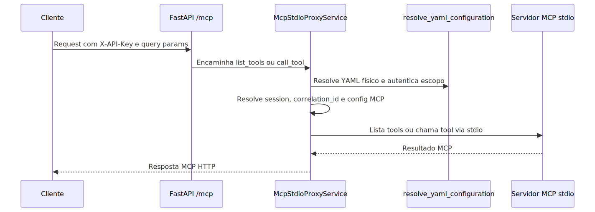

# Manual técnico e operacional: MCP no sistema

## 1. O que é esta feature

Tecnicamente, o MCP do projeto é um subsistema de resolução de configuração, carga de tools e proxy de transporte que permite incorporar servidores MCP ao runtime agentic. O objetivo operacional não é só “falar com um servidor MCP”, mas fazer isso respeitando o contrato YAML-first, o escopo agentic e a segurança do boundary HTTP.

## 2. Que problema ela resolve

O problema técnico resolvido é este: como colocar tools externas dentro de supervisor, agente e workflow sem criar integração nativa para cada caso e sem abrir um atalho fora do assembly agentic. O subsistema resolve isso em quatro camadas:

- configuração declarativa;
- normalização por escopo;
- materialização do catálogo efetivo;
- execução ou proxy do transporte.

## 3. Conceitos necessários para entender

### 3.1 Camadas de configuração

O resolver trabalha com três camadas para agentes e duas para workflows.

- Agente: global_mcp_configuration, local_mcp_configuration do supervisor, local_mcp_configuration do agente.
- Workflow: global_mcp_configuration, local_mcp_configuration do workflow.
- Global puro: apenas global_mcp_configuration.

### 3.2 Merge por servidor

Servidores são mesclados por id. Se o overlay trouxer o mesmo id do base, o merge é profundo. Se trouxer id novo, ele é acrescentado ao conjunto respeitando a ordem.

### 3.3 Proxy stdio

Quando o transporte é stdio, o resolver não devolve o bloco command e args como conexão final do consumo agentic. Ele devolve uma conexão streamable_http apontando para /mcp, com query params que identificam o YAML físico e o escopo.

### 3.4 Catálogo efetivo de tools MCP

O catálogo efetivo não nasce apenas do servidor remoto. O assembly agentic precisa conhecer ids de tools válidos naquele escopo. Por isso o ToolCatalogResolver injeta placeholders de tools MCP quando local_mcp_configuration.tools as declara explicitamente.

## 4. Como a feature funciona por dentro

### 4.1 Resolução de configuração

O ponto central é MCPConfigResolver.

- resolve_for_agent monta as camadas global, supervisor local e agente local.
- resolve_for_workflow monta global e workflow local.
- resolve_global usa apenas o bloco global.

Depois do merge, o resolver expande placeholders com expand_placeholders, valida enabled, tool_name_prefix e cache_ttl_s, e materializa o dicionário final de connections.

Há validações estruturais explícitas:

- servidor sem id válido gera erro;
- servidor duplicado no mesmo bloco gera erro;
- transport fora da lista suportada gera erro;
- url ausente em transporte não stdio gera erro;
- command ou args ausentes em stdio geram erro;
- auth.type diferente de bearer ou api_key gera erro.

### 4.2 Tratamento por transporte

Transportes suportados pelo código lido:

- stdio
- sse
- http
- streamable_http
- streamable-http
- websocket

Comportamento por transporte:

- stdio: convertido para streamable_http local com url apontando para /mcp.
- sse: timeout e sse_read_timeout entram como valores numéricos.
- http e streamable_http: timeout e sse_read_timeout entram como timedelta.
- websocket: o resolver aceita o transport, mas o comportamento operacional detalhado desse cliente não foi confirmado além da normalização da conexão.

### 4.3 Requisitos adicionais do caminho stdio

O stdio convertido depende de dois requisitos rígidos:

- _config_metadata precisa existir no YAML.
- _config_metadata.yaml_source precisa apontar para arquivo físico, não memory:// nem inline://.

Se isso falhar, o resolver não consegue gerar a query yaml_config para o proxy e aborta a resolução.

### 4.4 Carga e cache de tools no runtime agentic

O runtime usa MCPToolsResolver.

- Resolve a configuração do escopo.
- Calcula um cache_key baseado em tenant, escopo, connections e tool_name_prefix.
- Se houver cache válido, reutiliza.
- Caso contrário, instancia MultiServerMCPClient e chama get_tools.

Observação operacional importante: se o carregamento de tools falhar por ExceptionGroup, RuntimeError, ValueError, TypeError, OSError, KeyError ou ImportError, o resolver registra exception e devolve lista vazia. No runtime agentic, isso significa degradação funcional, não necessariamente falha dura da execução.

### 4.5 Merge com tools locais

O merge é centralizado em MCPToolsResolver.merge_tools e consumido por MCPToolsMerger.

- merge_for_agent é usado no fluxo de resolução de tools de agentes.
- merge_for_workflow é usado na resolução de tools de nós de workflow.

Regra de conflito: se uma tool MCP chegar com nome já existente no conjunto base, ela é descartada com warning. O sistema preserva a tool base já presente.

## 5. Divisão em submódulos

### 5.1 MCPConfigResolver

Responsabilidade: transformar YAML MCP em conexões executáveis por escopo.

Recebe: yaml_config.

Entrega: MCPResolvedConfig com enabled, tool_name_prefix, cache_ttl_s e connections.

### 5.2 MCPToolsResolver

Responsabilidade: carregar tools MCP e aplicar cache.

Recebe: MCPResolvedConfig e escopo lógico.

Entrega: lista de BaseTool.

### 5.3 MCPToolsMerger

Responsabilidade: unir tools locais e MCP sem substituir silenciosamente nomes já existentes.

### 5.4 ToolCatalogResolver

Responsabilidade: inserir ids de tools MCP locais no catálogo efetivo do assembly quando declaradas em local_mcp_configuration.tools.

### 5.5 McpStdioProxyService

Responsabilidade: expor via HTTP um conjunto de tools provenientes de servidores MCP stdio.

Recebe: Request HTTP com X-API-Key, yaml_config e parâmetros de escopo.

Entrega: listagem e execução de tools como servidor MCP streamable_http.

## 6. Pipeline ou fluxo principal

### 6.1 Fluxo agentic

1. O assembly materializa o catálogo efetivo e reconhece ids MCP declarados no escopo.
2. O ToolsFactory resolve as tools locais do agente ou do workflow.
3. O MCPToolsMerger chama o MCPToolsResolver do mesmo escopo.
4. O resolver consulta o cache.
5. Se necessário, o cliente MCP carrega as tools.
6. O merger anexa as tools MCP sem sobrescrever nomes existentes.
7. O runtime final executa vendo o conjunto combinado.

### 6.2 Fluxo stdio via /mcp

1. O resolver materializa uma conexão local streamable_http apontando para /mcp.
2. A FastAPI monta mcp_http_proxy_app em /mcp.
3. A camada ASGI valida X-API-Key com PermissionKeys.MCP_TOOLS_INVOKE.
4. O serviço do proxy parseia yaml_config e mcp_scope da query string.
5. O serviço resolve o YAML físico via resolve_yaml_configuration.
6. O serviço autentica o request com base no YAML e na permissão da operação.
7. O serviço injeta user_email e correlation_id na user_session.
8. O serviço resolve o MCP daquele escopo e filtra apenas conexões stdio.
9. O builder do catálogo lista tools nos servidores stdio e publica um catálogo em memória.
10. list_tools devolve as tools publicadas; call_tool roteia para o servidor certo e executa a tool real.

## 7. Ordem de execução real

O ponto importante é que o proxy stdio não usa a configuração MCP resolvida no momento do bootstrap da API. Ele reavalia o YAML por request. Isso torna a resolução aderente ao YAML físico e ao contexto de autenticação da chamada, mas também significa que o problema operacional pode estar tanto na configuração estática quanto no request que chegou ao proxy.

## 8. Configurações que mudam o comportamento

### 8.1 Exemplo real de configuração global

O arquivo de modelo em app/yaml/system/rag-config-modelo.yaml confirma este formato:

```yaml
global_mcp_configuration:
  enabled: true
  tool_name_prefix: true
  cache_ttl_s: 300
  servers:
    - id: "agora_mcp"
      enabled: false
      transport: "stdio"
      command: "uvx"
      args:
        - "agora-mcp"
      env:
        FEWSATS_API_KEY: "${FEWSATS_API_KEY}"
    - id: "aws_knowledge_mcp"
      transport: "http"
      url: "https://knowledge-mcp.global.api.aws"
```

### 8.2 Exemplo real de especialização local em agente

O mesmo YAML de modelo confirma que um agente pode declarar tools MCP específicas no seu escopo:

```yaml
local_mcp_configuration:
  enabled: true
  tool_name_prefix: false
  tools:
    - "search_documentation"
    - "read_documentation"
    - "recommend"
    - "list_regions"
    - "get_regional_availability"
```

### 8.3 O que cada campo controla

- enabled: desliga todo o MCP do escopo, mesmo que haja servidores configurados.
- tool_name_prefix: controla nomes como servidor_tool.
- cache_ttl_s: controla o reaproveitamento do catálogo.
- defaults: permite compartilhar headers, transport e outros campos entre servidores.
- servers: define servidores individuais.
- tools no local_mcp_configuration: sinaliza quais ids MCP entram no catálogo efetivo daquele escopo.

## 9. Contratos, entradas e saídas

### 9.1 Contrato do resolver

Entrada: yaml_config completo.

Saída: MCPResolvedConfig.

Campos de saída confirmados:

- enabled
- tool_name_prefix
- cache_ttl_s
- connections

### 9.2 Contrato do proxy HTTP

Query params confirmados:

- yaml_config
- mcp_scope
- supervisor_id quando scope=agent
- agent_id quando scope=agent
- workflow_id quando scope=workflow

Headers relevantes:

- X-API-Key
- x-correlation-id opcional

### 9.3 Contrato de permissões

Permissões confirmadas no catálogo de autorização:

- MCP_TOOLS_LIST
- MCP_TOOLS_INVOKE
- MCP_SERVERS_START
- MCP_SERVERS_STOP

Observação importante: o caminho canônico lido do proxy usa MCP_TOOLS_LIST e MCP_TOOLS_INVOKE. Não foi encontrada referência executável do runtime HTTP usando MCP_SERVERS_START ou MCP_SERVERS_STOP no caminho principal /mcp.

## 10. O que acontece em caso de sucesso

### 10.1 Runtime agentic

O agente ou workflow recebe um conjunto de BaseTool já enriquecido com tools MCP. Se houver cache válido, esse conjunto é reaproveitado. Se não houver, ele é carregado na hora.

### 10.2 Proxy stdio

O cliente HTTP consegue listar tools e invocar a tool correta. O proxy registra logs de listagem e execução com correlation_id e server_id.

## 11. O que acontece em caso de erro

### 11.1 Erros de configuração

Erros como transport inválido, missing url, missing command, missing args, cache_ttl_s inválido, tool_name_prefix inválido, yaml_source ausente ou escopo incompleto geram exceção explícita.

### 11.2 Erros de autenticação e permissão

No proxy, ausência ou invalidez de X-API-Key no boundary HTTP gera resposta JSON com status apropriado. Depois disso, o serviço ainda autentica o request com o YAML resolvido e a permissão da operação.

### 11.3 Erros de catálogo ou roteamento

- Tool desconhecida no proxy gera McpHttpProxyError com log de erro.
- Servidor ausente no roteamento gera erro.
- Ausência de conexões stdio após a filtragem gera erro explícito.

### 11.4 Erros de comunicação com stdio

O cliente stdio usa retry com tenacity.

- stop_after_attempt(5)
- wait_exponential com multiplicador 1, mínimo 1 e máximo 10
- retry em OSError, RuntimeError e TimeoutError

Isso vale tanto para list_tools quanto para call_tool.

## 12. Observabilidade e diagnóstico

### 12.1 Logs relevantes

Eventos confirmados em log:

- carregamento de tools MCP;
- tools carregadas com total e escopo;
- cache MCP reutilizado;
- cache MCP atualizado;
- listagem de tools stdio por servidor;
- chamada de tool stdio por servidor;
- tool executada via proxy;
- erros de tool desconhecida, servidor ausente e ausência de stdio.

### 12.2 Correlation id

O proxy resolve um correlation_id base a partir do header x-correlation-id ou gera um id local prefixado com mcp_proxy_. Depois disso, ele recompõe o correlation_id final com base no user_email da sessão.

### 12.3 Onde começar a investigar

Se a tool não aparece no runtime agentic:

- verificar local_mcp_configuration.tools no escopo;
- verificar conflito de nome com tool local;
- verificar logs de falha do MCPToolsResolver.

Se o problema é no /mcp:

- verificar query params yaml_config e mcp_scope;
- verificar X-API-Key;
- verificar se o YAML físico existe e contém _config_metadata.yaml_source válido;
- verificar se há servidores stdio habilitados naquele escopo.

## 13. Limites e pegadinhas

### 13.1 O proxy stdio não é cacheado por escopo

No código lido, o catálogo do proxy é cacheado apenas por tenant_key. Isso pode ser suficiente quando o tenant usa o mesmo conjunto stdio em todos os escopos, mas é uma limitação importante se diferentes escopos do mesmo tenant publicarem catálogos distintos.

### 13.2 O gateway manager não apareceu no wiring canônico

Existe um MCPGatewayManager no repositório, mas o grep de usos executáveis não mostrou esse manager participando do caminho ativo da FastAPI. O runtime HTTP lido monta /mcp usando mcp_http_proxy_app. Portanto, para este manual, o caminho canônico é o proxy HTTP, não o gateway manager.

### 13.3 Nem todo erro de carga quebra o runtime agentic

No caminho de resolução de tools, algumas falhas resultam em lista vazia. Operacionalmente, isso pode parecer “MCP sumiu” em vez de “a execução quebrou”.

## 14. Troubleshooting

### Sintoma: MCP habilitado, mas erro dizendo que não há servidores

Confirmação: enabled=true com servers ausente ou vazio no escopo efetivo.

Ação: revisar o merge entre global_mcp_configuration e local_mcp_configuration.

### Sintoma: tool declarada no agente continua inválida no assembly

Confirmação: a tool está em agent.tools, mas o catálogo efetivo não a reconhece.

Ação: declarar o id também em local_mcp_configuration.tools do escopo correspondente.

### Sintoma: stdio configurado com YAML inline falha

Confirmação: yaml_source ausente, memory:// ou inline://.

Ação: usar YAML físico para o caminho do proxy stdio.

### Sintoma: listagem do proxy funciona, mas chamada da tool falha

Confirmação: a tool aparece em routing, mas call_tool retorna erro do servidor stdio.

Ação: revisar command, args, env e disponibilidade do processo publicado pelo servidor MCP.

## 15. Diagramas

### 15.1 Sequência do caminho stdio



O diagrama mostra que o proxy reabre o contexto do YAML e da autenticação a cada request. Isso é importante para diagnóstico, porque um mesmo problema pode nascer da query, da segurança, do YAML ou do processo stdio.

## 16. Como colocar para funcionar

### 16.1 Pré-requisitos confirmados

- A API FastAPI precisa estar em execução.
- O YAML precisa existir em arquivo físico quando houver uso de stdio.
- O YAML precisa trazer global_mcp_configuration ou local_mcp_configuration compatíveis.
- O cliente precisa enviar X-API-Key com permissão apropriada.

### 16.2 Passo a passo mínimo para um caso remoto HTTP

```yaml
global_mcp_configuration:
  enabled: true
  tool_name_prefix: true
  cache_ttl_s: 300
  servers:
    - id: "aws_knowledge_mcp"
      transport: "http"
      url: "https://knowledge-mcp.global.api.aws"

multi_agents:
  - id: "sup"
    enabled: true
    agents:
      - id: "aws_documentation_researcher"
        tools:
          - "search_documentation"
          - "read_documentation"
        local_mcp_configuration:
          enabled: true
          tool_name_prefix: false
          tools:
            - "search_documentation"
            - "read_documentation"
```

### 16.3 Passo a passo mínimo para um caso stdio

```yaml
global_mcp_configuration:
  enabled: true
  tool_name_prefix: true
  servers:
    - id: "agora_mcp"
      transport: "stdio"
      command: "uvx"
      args:
        - "agora-mcp"

multi_agents:
  - id: "sup"
    enabled: true
    agents:
      - id: "agora_shopping_assistant"
        local_mcp_configuration:
          enabled: true
          tool_name_prefix: true
          tools:
            - "agora_mcp_agora_search"
```

O que esperar: o resolver converterá o stdio para uma URL local /mcp com parâmetros de escopo; o proxy assumirá a listagem e a execução real.

### 16.4 Como validar que funcionou

- Verificar logs de carregamento de tools MCP no runtime agentic.
- Verificar logs do proxy stdio ao listar ou chamar tool.
- Confirmar que a tool aparece no conjunto final do agente ou workflow sem warning de conflito de nome.

## 17. Exemplos práticos guiados

### 17.1 Exemplo real de proxy gerado para agente

Os testes unitários confirmam que um servidor stdio pode virar uma URL como:

```text
http://localhost:9000/mcp?yaml_config=app%2Fyaml%2Ftest-config.yaml&mcp_scope=agent&supervisor_id=sup&agent_id=agent
```

### 17.2 Exemplo real de proxy gerado para workflow

Os testes confirmam também o formato:

```text
http://127.0.0.1:8001/mcp?yaml_config=app%2Fyaml%2Ftest-config.yaml&mcp_scope=workflow&workflow_id=wf
```

## 18. Explicação 101

Do ponto de vista técnico simples, o sistema faz três perguntas antes de usar MCP:

1. Quais servidores MCP existem para este YAML?
2. Neste escopo específico, quais tools desse universo devem ser vistas?
3. O acesso será direto por transporte remoto ou indireto por /mcp no caso stdio?

Quando essas três respostas estão coerentes, o agente usa a tool como se ela fosse parte do seu conjunto normal de ferramentas.

## 19. Checklist de entendimento

- Entendi o papel de MCPConfigResolver.
- Entendi a diferença entre carga agentic e proxy stdio.
- Entendi o papel de local_mcp_configuration.tools no catálogo efetivo.
- Entendi o comportamento de cache no runtime agentic e no proxy.
- Entendi como o /mcp autentica e resolve o YAML.
- Entendi os erros duros e as degradações silenciosas do desenho atual.

## 20. Evidências no código

- src/agentic_layer/mcp/mcp_config_resolver.py
  - Símbolos relevantes: resolve_for_agent, resolve_for_workflow, _build_local_http_proxy_connection.
  - Comportamento confirmado: merge por escopo, transports suportados e geração da URL /mcp para stdio.
- src/agentic_layer/mcp/mcp_tools_resolver.py
  - Símbolos relevantes: _resolve_tools, _load_tools, merge_tools.
  - Comportamento confirmado: cache por tenant e escopo, carga via MultiServerMCPClient e descarte de conflito por nome.
- src/agentic_layer/supervisor/mcp_tools_merger.py
  - Símbolos relevantes: merge_for_agent, merge_for_workflow.
  - Comportamento confirmado: ponto de incorporação das tools MCP ao runtime.
- src/agentic_layer/supervisor/tools_factory.py
  - Símbolos relevantes: resolve_workflow_node_tools, resolve_agent_tools_with_context.
  - Comportamento confirmado: tools locais são resolvidas primeiro e depois enriquecidas com MCP.
- src/agentic_layer/mcp/http_proxy/mcp_stdio_http_proxy.py
  - Símbolos relevantes: McpStdioProxyService, McpStdioClient, McpStdioToolCatalogBuilder.
  - Comportamento confirmado: proxy stdio com autenticação, retry, catálogo em memória e roteamento por tool.
- src/api/routers/mcp_http_proxy_router.py
  - Símbolos relevantes: McpHttpProxyApp, McpHttpProxyServer.
  - Comportamento confirmado: servidor MCP HTTP streamable e validação de X-API-Key no boundary ASGI.
- src/api/service_api.py
  - Símbolo relevante: mount de /mcp.
  - Comportamento confirmado: proxy MCP faz parte do runtime HTTP principal.
- src/config/agentic_assembly/tool_resolver.py
  - Símbolo relevante: _append_local_mcp_tools.
  - Comportamento confirmado: local_mcp_configuration.tools entra no catálogo efetivo do assembly.
- tests/unit/test_02-04-51_mcp_resolvers.py
  - Motivo da leitura: confirmar exemplos executáveis de merge, cache e geração da URL do proxy.
  - Comportamento confirmado: casos de agente e workflow para stdio convertido em /mcp.
