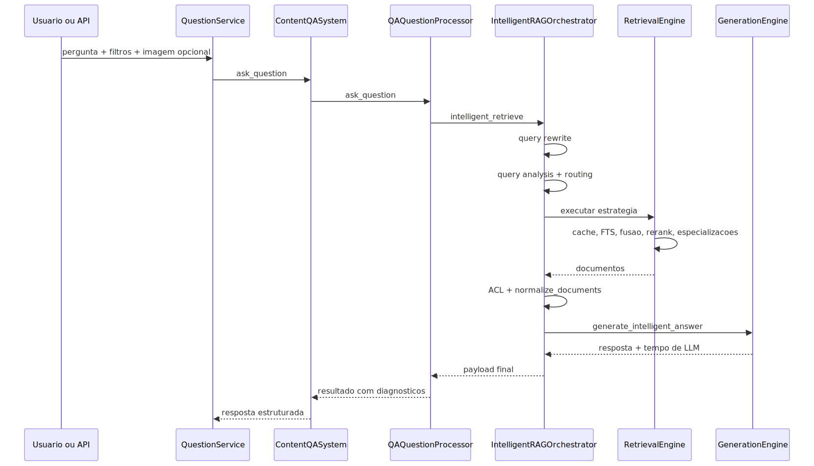

# Manual técnico e operacional: Pipeline RAG de recuperação avançada

## 1. Escopo e recorte técnico

Este documento descreve o caminho online do RAG moderno do projeto, isto é, o pipeline que começa na pergunta e termina na resposta. O recorte é propositalmente restrito à recuperação avançada e à geração final apoiada por evidência. Ingestão, chunking, OCR, indexação e ETL não fazem parte do fluxo principal explicado aqui.

Quando algum detalhe de corpus aparece, ele aparece apenas como pré-condição técnica para entender uma decisão do retrieval. Este manual não documenta a produção do corpus.

## 2. Entry points reais

### 2.1. Fachada pública da consulta

O ponto de entrada lido para consultas compartilhadas é QuestionService.execute.

Responsabilidades confirmadas:

- validar e registrar a consulta;
- decodificar imagem base64 opcional;
- inicializar o ContentQASystem com cache global de pipeline;
- aplicar InvokeTimeoutGuard;
- chamar qa_system.ask_question(...);
- extrair métricas de retrieval via PipelineDiagnosticsBuilder;
- registrar telemetria via QuestionTelemetryRecorder;
- enriquecer fontes e documentos de origem.

Implicação prática: a API não fala diretamente com o retriever. Ela fala com uma fachada estável que encapsula inicialização, timeout, telemetria e pós-processamento.

### 2.2. Sistema de QA

O ContentQASystem é a montagem do runtime. Ele valida o layout moderno, monta LLM, embeddings, vector store, cadeia QA, memória e pipeline inteligente.

Pontos confirmados no código:

- usa QARuntimeAssembly quando o modo moderno está disponível;
- valida que intelligent_pipeline deve ficar na raiz do YAML;
- pode reutilizar instância de pipeline via PipelineCacheManager;
- carrega qa_system pelo CredentialManager;
- instancia QAQuestionProcessor como boundary interno da pergunta.

### 2.3. Boundary da pergunta

O QAQuestionProcessor.ask_question é quem decide se o fluxo segue para o orchestrator inteligente.

Regras relevantes confirmadas:

- pergunta vazia falha cedo;
- SecurityKeysValidator roda antes do pipeline principal;
- se o modo moderno estiver ativo e o intelligent_orchestrator não existir, o código falha fechado;
- fallback silencioso foi removido do caminho moderno.

Esse é um ponto arquitetural importante: no recorte moderno, ausência do pipeline inteligente é erro de contrato, não “degradação natural”.

## 3. Fluxo executável de ponta a ponta

Esse fluxo já mostra a separação central do projeto: retrieval é uma etapa própria, com decisão, pós-processamento e rastreamento, e não apenas um detalhe antes do prompt final.

## 4. Ordem real da execução

Dentro de IntelligentRAGOrchestrator.intelligent_retrieve, a ordem confirmada é esta.

1. Validar a pergunta.
2. Resolver top_k via get_retrieval_top_k.
3. Construir access_context a partir do payload.
4. Registrar início do pipeline e telemetria.
5. Se o intelligent_pipeline estiver desabilitado, executar pipeline de fallback.
6. Fazer inicialização lazy dos componentes na primeira execução.
7. Executar query rewrite.
8. Rodar análise e roteamento da query.
9. Executar o processador escolhido.
10. Aplicar AccessControlEvaluator.filter_documents.
11. Normalizar documentos.
12. Montar resultado final com geração via LLM.
13. Anexar token_usage e retrieval_trace.
14. Atualizar métricas e registrar conclusão.

Essa ordem importa porque o projeto distingue claramente:

- preparação da pergunta;
- decisão de recuperação;
- recuperação;
- filtragem de segurança;
- geração final.

## 5. Configurações que mudam o comportamento

## 5.1. query rewrite

Lido em qa_system.query_rewrite.

Chaves confirmadas:

- enabled
- enable_paraphrase
- enable_correction
- enable_expansion
- max_variations
- min_similarity
- max_output_chars
- retry_attempts
- retry_wait_min
- retry_wait_max

Efeito prático:

- se disabled=false, a pergunta segue intacta;
- se não houver LLM, a etapa devolve passthrough com motivo explícito;
- se a similaridade entre original e reescrita ficar abaixo do mínimo, a reescrita é rejeitada.

## 5.2. retriever vetorial moderno

Lido em rag_system.retriever.vector_store.

Chaves confirmadas:

- k
- similarity_threshold
- use_mmr
- mmr_fetch_k
- mmr_lambda

Observação importante: o código considera k e similarity_threshold como obrigatórios no modo moderno.

## 5.3. híbrido e router adaptativo

Lido em rag_system.retriever.hybrid e rag_system.retriever.hybrid.adaptive_router.decision_strategy.

Chaves confirmadas:

- vector_weight
- text_weight
- combine_strategy
- thresholds.hybrid_threshold
- thresholds.bm25_only_threshold
- thresholds.vector_only_threshold
- default_strategy
- log_decisions
- include_analysis_in_response

Efeito prático:

- define pesos da combinação híbrida;
- controla thresholds da decisão do router;
- define estratégia padrão quando nada mais se destaca.

## 5.4. fusão

Lido em rag_system.retriever.hybrid.fusion.

Chaves confirmadas:

- default_algorithm
- weighted_rrf.k
- weighted_rrf.bm25_weight
- weighted_rrf.vector_weight
- linear.bm25_weight
- linear.vector_weight
- general.final_top_k
- general.remove_duplicates
- general.similarity_threshold
- general.min_final_score
- general.normalize_final_scores

Efeito prático: controla o motor HybridFusion, principalmente quando a estratégia exige combinação formal de múltiplos rankings.

## 5.5. FTS

Lido em rag_system.retriever.fts.

Chaves confirmadas:

- enabled
- mode
- top_k
- fallback_min_results
- semantic_score_threshold
- pg_dsn
- pg_schema
- table
- ts_config
- statement_timeout_ms
- pool e retry do Postgres

Efeito prático:

- mode=augment executa FTS como enriquecimento explícito;
- mode=fallback executa FTS só quando o gatilho indica poucos resultados ou score fraco;
- se o retriever FTS não estiver registrado, o pipeline apenas ignora a etapa.

## 5.6. cache semântico

Lido em rag_system.retriever.caching.

Chaves confirmadas:

- semantic_cache_enabled
- semantic_cache_distance_threshold
- semantic_cache_ttl_seconds ou cache_ttl_seconds
- semantic_cache_max_items ou cache_size
- semantic_cache_backend

Backends confirmados:

- redisearch
- qdrant
- azure_search
- disabled

## 5.7. reranker

Lido em qa_system.reranker.

Chaves confirmadas:

- enabled
- provider
- model
- fallback_model
- top_k
- feedback_field
- feedback_weight
- vision_weight

## 5.8. especialização Excel

Lido em json_specialized_rag_excel.

Chaves confirmadas:

- enabled
- min_keyword_matches
- keywords
- content_type_filter
- max_documents
- max_rows_sample
- direct_scan_batch_size
- require_exhaustive_ingestion
- direct_scan_max_documents

## 5.9. detalhe crítico de configuração

O orchestrator lê enable_fallbacks em intelligent_pipeline, mas o código força self.enable_fallbacks = False e apenas registra que fallback foi solicitado. Portanto, o comportamento real confirmado não é “fallback livre se o YAML pedir”. O comportamento real é mais duro: o pipeline moderno opera em fail-first, com quedas pontuais controladas apenas onde a implementação local já programou isso.

## 6. Query rewrite

O QueryRewriter é construído com configuração consolidada de QueryRewriteConfig.from_yaml.

Fluxo confirmado:

1. normaliza a pergunta;
2. verifica se a feature está habilitada;
3. verifica se há LLM;
4. constrói prompt fixo de reescrita;
5. chama o LLM com retry exponencial;
6. espera resposta em JSON com rewritten_query e variations;
7. sanitiza texto e variações;
8. calcula similaridade com a pergunta original;
9. só aplica a reescrita se a similaridade for suficiente.

Garantias relevantes:

- preserva códigos, siglas e números por política do prompt;
- pode devolver passthrough por disabled, llm_unavailable, parse_error, low_similarity e outros motivos explícitos.

## 7. Query analysis

O QueryAnalyzer.analyze extrai QueryFeatures.

Dados confirmados no objeto:

- query_type
- data_type
- domain
- original_query
- cleaned_query
- complexity
- confidence
- entities
- keywords
- requires_filters
- requires_temporal
- requires_real_time
- suggested_processors
- detected_schema
- intent
- context_hints
- technical_terms
- expansion_metadata

Técnicas observadas:

- regex para procedural, factual, conceptual, comparative e temporal;
- score por indicadores de dados estruturados, texto e API;
- detecção de domínio por vocabulário e auto_detection_keywords;
- cálculo de complexidade e confiança;
- detecção de content types disponíveis para favorecer JSON quando o acervo suporta isso.

Implicação prática: o pipeline não escolhe a estratégia apenas por string matching trivial do usuário. Ele tenta formar uma fotografia semântica e operacional da pergunta.

## 8. Adaptive routing

O AdaptiveQueryRouter combina regras, indicadores e thresholds.

Pontos confirmados:

- compila regras de rag_system.retriever.hybrid.adaptive_router.strategies quando existem;
- suporta lógica padrão quando não há regras explícitas;
- calcula características como has_exact_codes, has_technical_terms, has_structured_filters e has_conceptual_terms;
- aplica thresholds finais vindos do YAML;
- registra telemetria estruturada da decisão.

Regra mais importante do router:

Se a estratégia inicial cair em semantic, mas a pergunta tiver códigos exatos ou sinais técnicos, o router sobrescreve a decisão para hybrid. Isso foi implementado explicitamente para proteger consultas técnicas contra um caminho vetorial puro que perderia match literal.

Outro ponto técnico relevante:

O AdaptiveQueryRouter injeta um vector_store padrão local se a configuração estiver vazia, apenas para conseguir inicializar. Esse fallback existe no código lido e deve ser visto como proteção local do componente, não como contrato ideal de produto.

## 9. Estratégias de retrieval confirmadas

## 9.1. Tradicional

Executa retrievers em ordem de preferência:

- vector_search
- semantic_search
- default

Depois disso ainda pode chamar FTS via maybe_enrich_with_fts.

## 9.2. Híbrida

Fluxo confirmado:

1. decide se o hybrid está desligado, manual ou nativo;
2. verifica se o vector store suporta hybrid nativo;
3. enriquece a query com technical_terms quando houver;
4. tenta native_hybrid_search com retry externo quando suportado;
5. se não der, usa hybrid_search manual;
6. depois pode enriquecer com FTS.

## 9.3. Self-query

O RetrievalEngine primeiro tenta DomainSelfQueryResolver quando o domínio detectado pede busca estruturada. Se não resolver ou falhar, cai para um retriever self_query genérico. Se nenhum existir, volta para o tradicional.

## 9.4. Multi-query

Se multi_query_retriever já estiver montado, ele é usado. Caso contrário, o engine ainda consegue construir um MultiQueryRetriever temporário sobre o base_retriever e o LLM. Se nenhum dos caminhos existir, volta ao tradicional.

O MultiQueryRetriever suporta:

- múltiplas estratégias de expansão;
- execução paralela;
- cache de expansão;
- deduplicação de queries;
- configuração em intelligent_pipeline.multi_query.

## 9.5. JSON toolkit e Excel especializado

Há dois caminhos distintos.

- json_toolkit genérico, se houver retriever registrado;
- json_specialized_rag_excel, quando a estratégia escolhida for especializada.

O detector de Excel considera:

- feature habilitada;
- content types compatíveis encontrados no acervo;
- número mínimo de palavras-chave na pergunta.

Quando detectado, o engine monta uma RoutingDecision própria com processor_type JSON_TOOLKIT e retriever_strategy json_specialized_rag_excel.

## 9.6. Multimodalidade de consulta

O retriever vetorial suporta um caminho multimodal quando a pergunta traz image_bytes ou quando a configuração de visão está ativa.

Fluxo confirmado no retriever:

- tenta gerar texto derivado da imagem quando habilitado;
- pode compor pergunta textual com descrição de visão;
- gera embedding de visão para a consulta;
- roda busca de texto e busca de visão em paralelo;
- mescla os dois conjuntos;
- aplica rerank depois da fusão texto-visão.

Isso não é um “retriever PDF”. É um recurso de query multimodal e ranking multimodal.

## 10. Pós-retrieval

## 10.1. Cache semântico

O run_retriever_with_trace consulta cache antes de chamar o retriever real e grava cache depois da execução quando elegível.

Retrievers elegíveis confirmados:

- vector_search
- semantic_search
- hybrid_search
- self_query
- multi_query

Sinais registrados:

- semantic_cache:lookup
- semantic_cache:store
- hit, miss e motivo

## 10.2. FTS

O maybe_enrich_with_fts tem dois modos.

- augment: sempre tenta enriquecer;
- fallback: só roda se não houver documentos suficientes ou se o maior score ficar abaixo do limiar configurado.

O merge com FTS deduplica e limita o resultado pelo maior entre top_k do pipeline e top_k do próprio FTS.

## 10.3. Fusão

Quando decision.requires_fusion é true, o orchestrator chama apply_fusion_processing. O motor HybridFusion suporta pelo menos:

- linear
- rrf
- weighted_rrf
- interleaved
- score_normalized

O fluxo inclui estruturação dos resultados, deduplicação, execução do algoritmo e métricas de fusão.

## 10.4. Rerank

O rerank neural foi confirmado dentro do retriever vetorial multimodal e também na infraestrutura de retrievers.

Fluxo observado:

- consulta get_reranker_config;
- se enabled=false, a etapa é ignorada;
- tenta aplicar o modelo principal;
- se falhar, ainda pode tentar fallback_model;
- se tudo falhar, preserva a ordem anterior sem mascarar o que aconteceu.

## 10.5. ACL e normalização

Depois da recuperação, o orchestrator executa AccessControlEvaluator.filter_documents e normalize_documents.

Isso acontece antes da geração. Portanto, o conjunto que o LLM recebe já é o conjunto permitido.

## 11. Geração final

O GenerationEngine.generate_intelligent_answer faz a fase final.

Fluxo confirmado:

1. sumariza presença multimodal nos documentos;
2. monta contexto textual com histórico, memória do usuário, memória relacionada e documentos;
3. renderiza system prompt com contexto e pergunta;
4. chama o LLM com run_with_external_retry;
5. registra token usage via BillingCollector;
6. devolve resposta e tempo de geração.

Quando não há LLM, a etapa falha explicitamente com ContentQAError.

## 12. Diagnósticos e telemetria

O PipelineDiagnosticsBuilder monta dois grupos de saída muito importantes.

### 12.1. Diagnósticos de pipeline

Blocos confirmados:

- roteamento
- analise_query
- metricas_pipeline
- expansao_query
- bm25
- processadores_dominio
- resultado_retrieval
- detecao_keywords

O bloco `processadores_dominio` precisa ser lido como diagnóstico downstream da ingestão, não como execução inline de plugins durante a pergunta. O que o código expõe aqui são sinais de domínio já presentes na metadata dos documentos recuperados e resumidos pelo `PipelineDiagnosticsBuilder` para auditoria do retrieval.

### 12.2. Retrieval metrics para log

Campos confirmados:

- retrieval_attempt
- hybrid_retry_status
- top_documents

Além disso, QuestionService e QuestionTelemetryRecorder anexam essas métricas a logs e metadata de execução.

## 13. Especificidades JSON, Excel e PDF

## 13.1. JSON e Excel

O Excel especializado tem comportamento operacional próprio.

- tenta coleta direta no Qdrant ou Azure Search para garantir completude;
- cai para similarity_search apenas como modo aproximado;
- se require_exhaustive_ingestion=true e a coleta não for exaustiva, levanta ExcelIngestionCompletenessError;
- tenta resposta determinística antes do fallback generativo via JSON Agent;
- carrega metadados sobre collection_mode e exhaustive no retorno.

No RetrievalEngine, esse erro de completude recebe tratamento diferenciado: ele é logado e reerguido sem virar resposta genérica bem-sucedida.

Há outro detalhe importante para JSON estruturado: quando a ingestão passou por domain processing, os chunks chegam ao retrieval com metadata de domínio já enriquecida. Isso influencia tanto a leitura diagnóstica do pipeline quanto a capacidade de o runtime distinguir melhor catálogos, cupons e outros objetos de negócio sem depender só da superfície textual.

## 13.2. PDF

No recorte de recuperação avançada, não foi confirmada uma estratégia de roteamento exclusiva para PDF. O que foi confirmado é:

- o GenerationEngine reconhece metadados típicos de PDF ao formatar fontes;
- documentos derivados de PDF podem participar das rotas tradicionais e híbridas;
- o retriever vetorial suporta visão e query image, o que pode beneficiar cenários multimodais envolvendo conteúdo visual indexado.

Conclusão técnica correta: PDF entra no runtime principalmente como conteúdo recuperável pelo pipeline geral, não como processador específico de retrieval confirmado neste slice.

Ao mesmo tempo, o slice de ingestão PDF pode acrescentar metadata de domínio aos chunks antes da indexação. Portanto, mesmo sem existir um retriever PDF dedicado, o conteúdo derivado de PDF pode chegar ao RAG com sinais adicionais de domínio que melhoram filtragem, explicabilidade e leitura de diagnóstico.

## 14. O que acontece em caso de sucesso

No caminho feliz, o resultado final inclui pelo menos:

- answer
- sources
- source_documents
- routing_decision
- pipeline_metrics
- query_analysis
- metadata

E, quando houver:

- sources_formatted
- token_usage
- retrieval_trace
- access_control
- pipeline_diagnostics

O sucesso não é apenas geração de texto. É geração de texto apoiada por uma decisão de roteamento e por documentos coerentes com a ACL.

## 15. O que acontece em caso de erro

### 15.1. Erros explícitos confirmados

- ValueError para query vazia no orchestrator.
- ContentQAError quando o pipeline moderno obrigatório não está disponível.
- ContentQAError quando não existe retriever tradicional disponível.
- ExcelIngestionCompletenessError para Excel especializado sem coleta exaustiva suficiente.
- ContentQAError quando o LLM não existe na geração final.

### 15.2. Timeout

Se intelligent_retrieve ultrapassa asyncio.timeout, o código executa pipeline de fallback interno do orchestrator e registra timeout_fallback.

### 15.3. Erros tratáveis do pipeline

HANDLED_PIPELINE_ERRORS inclui, entre outros:

- ContentQAError
- JSONRAGError
- RAGEngineError
- erros de vocabulário BM25
- erros de Qdrant quando o backend está presente

Mesmo assim, a presença desse bloco não significa “fallback liberado sempre”. O próprio orchestrator força enable_fallbacks=False como estado efetivo, então a regra geral continua sendo falhar cedo quando a infraestrutura moderna não está íntegra.

## 16. Troubleshooting operacional

### 16.1. Router escolhe semântico quando a pergunta parece técnica

Causa provável: sinais técnicos fracos, baixa presença de códigos ou má configuração das regras/thresholds.

Como investigar:

- query_analysis
- routing_decision
- adaptive_router decision_factors

### 16.2. Híbrido não melhora o resultado

Causa provável: hybrid_search_mode desligado, retriever híbrido indisponível, suporte nativo ausente ou FTS desabilitado.

Como investigar:

- logs do hybrid mode;
- available_retrievers;
- retrieval_trace;
- bloco bm25 nos diagnósticos.

### 16.3. Excel especializado nunca dispara

Causa provável: feature desligada, content types não detectados ou palavras-chave insuficientes.

Como investigar:

- json_specialized_rag_excel.enabled;
- content_type_filter;
- keyword_matches e min_keyword_matches nos logs do detector.

### 16.4. Todos os documentos somem antes da resposta

Causa provável: ACL bloqueando tudo.

Como investigar:

- resultado_retrieval.controle_acesso;
- access_control no payload final.

### 16.5. Resposta lenta

Causa provável: query rewrite com LLM, multi-query, hybrid nativo com retry, FTS augment, visão multimodal ou rerank neural.

Como investigar:

- pipeline_metrics;
- retrieval_trace;
- events de query_rewrite, retrieval, semantic_cache e rag:reranker.

## 17. Comparação técnica com o padrão de mercado

Comparado ao RAG ingênuo de mercado, o projeto adiciona praticamente todas as camadas intermediárias que se espera de um RAG avançado de inferência.

- query preprocessing com rewrite;
- query analysis;
- query router;
- retrieval especializado por estratégia;
- post-retrieval com FTS, fusão, deduplicação e rerank;
- ACL;
- telemetria e diagnostics.

Isso está alinhado com o que referências oficiais de RAG avançado descrevem como query preprocessing, query routing e post-retrieval processing.

Ao mesmo tempo, o código lido não confirmou algumas peças como parte explícita do caminho online principal:

- fact-check pós-geração dentro do mesmo pipeline;
- compressor de prompt como etapa dedicada;
- processador PDF exclusivo de retrieval.

Portanto, o posicionamento técnico correto é: este runtime está acima do padrão simples de mercado e bem alinhado a um RAG avançado focado em recuperação, mas não deve ser descrito como suíte total de governança pós-resposta se o código não mostrar isso no fluxo online.

## 18. Como operar e validar

Para validar o comportamento do runtime de recuperação, o mais útil é inspecionar:

- logs do QuestionService;
- payload final com routing_decision, query_analysis, metadata e pipeline_metrics;
- retrieval_trace;
- pipeline_diagnostics e retrieval_metrics.

Perguntas operacionais úteis:

- a pergunta foi reescrita?
- qual processador foi escolhido?
- quantas tentativas de retrieval ocorreram?
- houve cache hit?
- o FTS entrou?
- a ACL removeu quantos documentos?
- a especialização Excel rodou ou não?

## 19. Explicação 101

Tecnicamente, esse pipeline funciona como um despachante inteligente antes do LLM.

Ele olha a pergunta e decide qual tipo de busca combina mais com ela. Se a pergunta parece conversa aberta, usa um caminho mais semântico. Se parece pergunta técnica com código ou termo exato, puxa o lado lexical e híbrido. Se parece consulta tabular, tenta uma trilha mais estruturada. Depois filtra segurança e só então entrega contexto ao modelo.

O ganho prático é que o LLM recebe um contexto melhor. O modelo não vira responsável por adivinhar o que deveria ter sido recuperado.

## 20. Evidências no código

- src/services/question_service.py
  - Motivo da leitura: fachada pública da consulta.
  - Símbolo relevante: QuestionService.execute.
  - Comportamento confirmado: timeout guard, extração de retrieval_metrics, telemetria, enriquecimento de fontes.

- src/qa_layer/content_qa_system.py
  - Motivo da leitura: montagem do runtime de QA.
  - Símbolo relevante: ContentQASystem.__init__.
  - Comportamento confirmado: QARuntimeAssembly, validação do layout moderno, setup do pipeline inteligente.

- src/qa_layer/qa_question_processor.py
  - Motivo da leitura: boundary da pergunta.
  - Símbolo relevante: QAQuestionProcessor.ask_question.
  - Comportamento confirmado: fail-fast do modo moderno, uso do intelligent_orchestrator, evidência e diagnostics.

- src/qa_layer/rag_engine/intelligent_orchestrator.py
  - Motivo da leitura: fluxo principal do runtime avançado.
  - Símbolo relevante: intelligent_retrieve,_execute_routing_decision, _assemble_final_result.
  - Comportamento confirmado: rewrite, routing, retrieval, ACL, geração e retrieval_trace.

- src/qa_layer/rag_engine/retrieval_engine.py
  - Motivo da leitura: execução das estratégias de recuperação.
  - Símbolo relevante: execute_hybrid_processor, execute_self_query_processor, execute_multi_query_processor, execute_json_processor, maybe_enrich_with_fts, run_retriever_with_trace.
  - Comportamento confirmado: híbrido nativo/manual, cache semântico, FTS, JSON/Excel especializado, trace de retrieval.

- src/qa_layer/rag_engine/query_analyzer.py
  - Motivo da leitura: análise semântica de perguntas.
  - Símbolo relevante: QueryAnalyzer.analyze.
  - Comportamento confirmado: classificação de tipo, domínio, data_type, entities, keywords e complexity.

- src/qa_layer/rag_engine/adaptive_router.py
  - Motivo da leitura: decisão de estratégia.
  - Símbolo relevante: AdaptiveQueryRouter.analyze_and_route e _apply_default_routing_logic.
  - Comportamento confirmado: prioridade para sinais técnicos e códigos exatos, thresholds modernos e fallback lógico.

- src/qa_layer/rag_engine/generation_engine.py
  - Motivo da leitura: geração final com contexto e fontes.
  - Símbolo relevante: GenerationEngine.generate_intelligent_answer.
  - Comportamento confirmado: montagem de contexto, renderização de prompt, retry externo no LLM e token usage.

- src/qa_layer/json_rag/specialized_rag_excel.py
  - Motivo da leitura: caminho estruturado para consultas tabulares.
  - Símbolo relevante: JSONSpecializedRAGExcel.ask_question e_collect_candidate_documents.
  - Comportamento confirmado: coleta direta exaustiva quando possível, resposta determinística e erro de completude.

- src/services/question/pipeline_diagnostics_builder.py
  - Motivo da leitura: bloco diagnóstico da consulta.
  - Símbolo relevante: build_diagnostics e extract_retrieval_metrics.
  - Comportamento confirmado: resumo de roteamento, BM25, resultado_retrieval, ACL e hybrid_retry_status.
