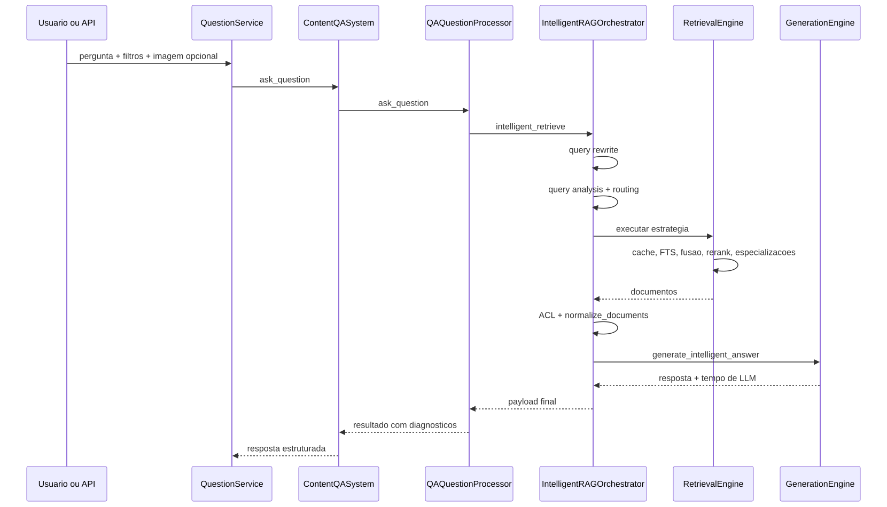

# Manual técnico e operacional: Pipeline RAG de recuperação avançada

## 1. Escopo e recorte técnico

Este documento descreve o caminho online do RAG moderno do projeto, isto é, o pipeline que começa na pergunta e termina na resposta. O recorte é propositalmente restrito à recuperação avançada e à geração final apoiada por evidência. Ingestão, chunking, OCR, indexação e ETL não fazem parte do fluxo principal explicado aqui.

Quando algum detalhe de corpus aparece, ele aparece apenas como pré-condição técnica para entender uma decisão do retrieval. Este manual não documenta a produção do corpus.

### 1.1. Este não é um RAG ingênuo

Vale dizer isto no começo, porque muda a forma de ler o resto do documento.

O RAG ingênuo — o desenho de quase todo tutorial — tem quatro passos: transformar a pergunta em um
vetor, buscar os N trechos mais próximos, colar esse texto num prompt, pedir a resposta. Ele não
falha por ser simples. Ele falha por três razões estruturais que só aparecem em acervo técnico real:

- **um único vetor não acha termo literal.** Busca semântica sozinha erra exatamente onde o domínio
  técnico é mais exigente: sigla, código de norma, número de identificação. "IS-203" e "Bueiro
  Tubular" precisam casar **como estão escritos**;
- **um único `top-k` mistura duas decisões diferentes.** Quantos candidatos colher e quantos entregar
  ao modelo não são o mesmo número, e tratá-los como um só degrada o resultado sem que ninguém
  perceba (§10.4.1);
- **ele sempre responde.** Sem gate de evidência e sem proveniência, o sistema não distingue "achei a
  resposta" de "achei alguma coisa" — e a resposta errada chega com a mesma confiança da certa.

O que este pipeline faz em cada uma dessas camadas está detalhado ao longo do documento, e
consolidado numa tabela camada a camada em **§17**. Três exemplos, para dar a medida:

- a busca é **híbrida** — significado e palavra literal, em duas representações independentes,
  fundidas por DBSF dentro do próprio banco vetorial (§10.2);
- o pipeline **recusa responder** quando o material recuperado não sustenta a resposta, sem gastar
  uma chamada de modelo (§10.5);
- a citação carrega **as duas numerações de página** — a física do arquivo e a impressa no rodapé,
  que é a que o leitor procura (§11.1).

E a diferença mais difícil de imitar não é nenhuma técnica da lista: é que **as decisões foram
medidas**. O rerank de interação tardia — o estado da arte da etapa — está implementado e a
recomendação para o acervo técnico medido é **mantê-lo desligado**, porque os números mostraram que
ali ele achatava a ordenação que a fusão já produzia, de 56,4% de dispersão para 1,94% (§5.7). Um
pipeline maduro não é o que acumula técnicas; é o que sabe qual delas está ajudando, e tem como
provar.

## 2. Entry points reais

### 2.1. Fachada pública da consulta

O ponto de entrada lido para consultas compartilhadas é QuestionService.execute.

Responsabilidades confirmadas:

- validar e registrar a consulta;
- decodificar imagem base64 opcional;
- inicializar o ContentQASystem com cache global de pipeline;
- aplicar InvokeTimeoutGuard;
- chamar qa_system.ask_question(...);
- extrair métricas de retrieval via PipelineDiagnosticsBuilder;
- registrar telemetria via QuestionTelemetryRecorder;
- enriquecer fontes e documentos de origem.

Implicação prática: a API não fala diretamente com o retriever. Ela fala com uma fachada estável que encapsula inicialização, timeout, telemetria e pós-processamento.

### 2.2. Sistema de QA

O ContentQASystem é a montagem do runtime. Ele valida o layout moderno, monta LLM, embeddings, vector store, cadeia QA, memória e pipeline inteligente.

Pontos confirmados no código:

- usa QARuntimeAssembly quando o modo moderno está disponível;
- valida que intelligent_pipeline deve ficar na raiz do YAML;
- pode reutilizar instância de pipeline via PipelineCacheManager;
- carrega qa_system pelo CredentialManager;
- instancia QAQuestionProcessor como boundary interno da pergunta.

### 2.3. Boundary da pergunta

O QAQuestionProcessor.ask_question é quem decide se o fluxo segue para o orchestrator inteligente.

Regras relevantes confirmadas:

- pergunta vazia falha cedo;
- SecurityKeysValidator roda antes do pipeline principal;
- se o modo moderno estiver ativo e o intelligent_orchestrator não existir, o código falha fechado;
- fallback silencioso foi removido do caminho moderno.

Esse é um ponto arquitetural importante: no recorte moderno, ausência do pipeline inteligente é erro de contrato, não “degradação natural”.

### 2.4. Boundary HTTP e execução pelo Job Core

O dispatcher público é `POST /rag/execute`. Para Q&A, o envelope usa `operation: ask` e o campo
`execution_mode` aceita `auto`, `direct_sync` ou `direct_async`.

- `direct_sync` executa a pergunta no request e devolve HTTP 200 com a resposta completa.
- `direct_async` publica no Job Core, devolve HTTP 202 com identificadores e URLs de
  acompanhamento, e executa o processo nominal `rag:ask` no worker.
- A operação irmã `delete` usa o processo nominal `rag:delete` quando assíncrona.
- `subprocess` é contrato legado e o boundary orienta usar `direct_async`; não existe executor RAG
  paralelo fora do Job Core.

O router unificado também recebe `ingest`, `etl` e `data_sources`, mas cada operação conserva seu
contrato especializado. O dispatcher não transforma todos esses domínios em um único pipeline.

## 3. Fluxo executável de ponta a ponta

Esse fluxo já mostra a separação central do projeto: retrieval é uma etapa própria, com decisão, pós-processamento e rastreamento, e não apenas um detalhe antes do prompt final.

## 4. Ordem real da execução

Dentro de IntelligentRAGOrchestrator.intelligent_retrieve, a ordem confirmada é esta.

1. Validar a pergunta.
2. Resolver top_k via get_retrieval_top_k.
3. Construir access_context a partir do payload.
4. Registrar início do pipeline e telemetria.
5. Se o intelligent_pipeline estiver desabilitado, falhar explícito com `ContentQAError` citando a
   chave `intelligent_pipeline.enabled: false` e o `correlation_id` (desde 2026-08-14; não existe
   mais pipeline de fallback aqui — ver nota de fallback em §15.2).
6. Fazer inicialização lazy dos componentes na primeira execução.
7. Executar query rewrite.
8. Rodar análise e roteamento da query.
9. Executar o processador escolhido.
10. Aplicar AccessControlEvaluator.filter_documents.
11. Normalizar documentos.
12. Montar resultado final com geração via LLM.
13. Anexar token_usage e retrieval_trace.
14. Atualizar métricas e registrar conclusão.

Essa ordem importa porque o projeto distingue claramente:

- preparação da pergunta;
- decisão de recuperação;
- recuperação;
- filtragem de segurança;
- geração final.

## 5. Configurações que mudam o comportamento

## 5.1. query rewrite

Lido em qa_system.query_rewrite.

Chaves confirmadas:

- enabled
- enable_paraphrase
- enable_correction
- enable_expansion
- max_variations
- min_similarity
- max_output_chars
- retry_attempts
- retry_wait_min
- retry_wait_max

Efeito prático:

- se `enabled: false`, a pergunta segue intacta;
- se não houver LLM, a etapa devolve passthrough com motivo explícito;
- se a similaridade entre original e reescrita ficar abaixo do mínimo, a reescrita é rejeitada.

**Estado real desta chave, para não induzir a erro operacional.** O default de `enabled` é `false`, e
os YAML de configuração hoje versionados no repositório mantêm esse valor — inclusive o de produção
do acervo técnico. Na prática, a etapa executa como passthrough com `reason="disabled"`. Dois
detalhes de projeto que decorrem disso:

- a reescrita usa **o mesmo LLM principal** da resposta, não um modelo auxiliar barato — ligá-la
  acrescenta uma chamada de modelo ao caminho quente;
- as `variations` produzidas pela reescrita são **descartadas** pelo orquestrador. Elas não
  alimentam multi-query; quem faz expansão de consulta em produção é o mecanismo lexical de domínio
  descrito em §6.1.

## 5.2. retriever vetorial moderno

Lido em rag_system.retriever.vector_store.

Chaves confirmadas:

- `k`
- `similarity_threshold`
- `use_mmr`
- `mmr_fetch_k`
- `mmr_lambda`

Observação importante: o código considera `k` e `similarity_threshold` como obrigatórios no modo
moderno.

**`k` é a chave que governa o tamanho da entrega quando o rerank está desligado.** A resolução do
`top_k` do pipeline tem precedência declarada em `get_retrieval_top_k`:

1. `rag_system.retriever.hybrid.fusion.general.final_top_k`, quando o retriever híbrido está ativo;
2. `rag_system.retriever.vector_store.k`;
3. `llm.openai.top_k_docs`;
4. default `5`.

Com o rerank ligado, esse valor é sobreposto por `qa_system.reranker.top_k` (§10.4). Saber qual das
duas chaves está no comando é a diferença entre ajustar o lote entregue ao modelo e mexer numa chave
inerte.

**`use_mmr`, `mmr_fetch_k` e `mmr_lambda` são chaves existentes e hoje sem efeito.** MMR (*Maximal
Marginal Relevance*) é a técnica que penaliza candidatos redundantes para que o lote entregue não
fique concentrado num documento só. As chaves são lidas e aparecem no log, mas não produzem
reordenação, por duas razões independentes:

- **no caminho híbrido**, que é o modo padrão para Qdrant e Azure Search, a rota monta a chamada de
  busca com um conjunto fixo de argumentos (consulta, `top_k`, filtros) e não repassa parâmetro de
  MMR;
- **no caminho vetorial simples**, a execução depende de uma operação de busca por relevância
  marginal que **nenhum vector store do repositório implementa** — a verificação de capacidade falha
  e o fluxo segue pela similaridade normal.

O efeito residual de ligar `use_mmr: true` é apenas cosmético no log, que passa a registrar a
intenção. **Diversidade de lote, portanto, é desenvolvimento a fazer, não chave a ligar** — e este
manual registra isso em vez de listar a chave como recurso disponível.

## 5.3. híbrido e router adaptativo

Lido em rag_system.retriever.hybrid e rag_system.retriever.hybrid.adaptive_router.decision_strategy.

Chaves confirmadas:

- vector_weight
- text_weight
- combine_strategy
- thresholds.hybrid_threshold
- thresholds.vector_only_threshold
- default_strategy
- log_decisions
- include_analysis_in_response

Efeito prático:

- define pesos da combinação híbrida;
- controla thresholds da decisão do router;
- define estratégia padrão quando nada mais se destaca.

## 5.4. fusão

Lido em rag_system.retriever.hybrid.fusion.

Chaves confirmadas:

- default_algorithm
- weighted_rrf.k
- weighted_rrf.vector_weight
- linear.vector_weight
- general.final_top_k
- general.remove_duplicates
- general.similarity_threshold
- general.min_final_score
- general.normalize_final_scores

Efeito prático: controla o motor HybridFusion, principalmente quando a estratégia exige combinação formal de múltiplos rankings.

## 5.5. Modo híbrido: resolução provider-native (sem FTS PostgreSQL)

O retriever FTS PostgreSQL (`fts_postgres_retriever.py`) e todo o runtime de vocabulário/índice lexical manual (`src/core/bm25_runtime/`) foram removidos. Não existe mais bloco de configuração lexical no YAML: `resolve_provider_hybrid_search_mode` (`src/qa_layer/rag_engine/pipeline_types.py`) resolve o modo híbrido só pela capacidade do provider declarado em `vector_store.type` — `HybridSearchMode.NATIVO` para `qdrant`/`azure`, `HybridSearchMode.DESLIGADO` para qualquer outro tipo.

Chaves legadas explicitamente rejeitadas (falha fechada, não silenciosa) por `_validate_legacy_lexical_contract` em `src/utils/yaml_schema_normalizer.py`:

- `rag_system.retriever.fts` (bloco inteiro)
- `rag_system.retriever.hybrid.bm25`
- `rag_system.retriever.hybrid.search_type`
- `rag_system.retriever.hybrid.adaptive_router.decision_strategy.thresholds.bm25_only_threshold`
- `rag_system.processor.fusion.{weighted_rrf,linear,score_normalized}.bm25_weight`
- `rag_system.processor.fusion.interleaved.bm25_priority`

Efeito prático: quando o modo é `NATIVO`, o BM25 roda dentro do próprio provider (`qdrant/bm25` server-side no Qdrant; `BM25SimilarityAlgorithm` auditado no índice do Azure Search) — ver `RetrievalEngine.execute_hybrid_processor` e `_execute_native_hybrid_search`. Não há enriquecimento (`augment`) nem fallback lexical separado: se o sparse obrigatório não estiver presente na collection/índice, a busca híbrida falha fechada em vez de degradar para dense-only.

## 5.6. cache semântico

Lido em rag_system.retriever.caching.

Chaves confirmadas:

- semantic_cache_enabled
- semantic_cache_distance_threshold
- semantic_cache_ttl_seconds ou cache_ttl_seconds
- semantic_cache_max_items ou cache_size
- semantic_cache_backend

Backends confirmados:

- redisearch
- qdrant
- azure_search
- disabled

## 5.7. reranker

Lido em qa_system.reranker por `get_reranker_config`
(`src/qa_layer/rag_engine/config_utils.py`). Desde 2026-08-14 este bloco configura o **rerank nativo
do Qdrant** (late interaction ColBERT executado no servidor). O reranker cross-encoder que rodava
dentro do container foi removido do produto.

Chaves confirmadas:

- `enabled` — liga o estágio de rerank na busca híbrida.
- `provider` — só aceita `qdrant_native` (default). Qualquer outro valor, inclusive o antigo
  `huggingface`, **falha explícito**: a chave legada não é convertida em silêncio.
- `model` — modelo late interaction. Default `answerdotai/answerai-colbert-small-v1`, o mesmo que
  gravou o multivetor na ingestão. Apontar outro modelo faz a busca **pular** o rerank (§10.4).
- `prefetch_limit` — candidatos que cada sub-busca traz **antes** de reordenar. Default 100.
- `top_k` — quantos documentos saem depois do rerank. Default 8.

Chaves que **deixaram de existir** (eram do cross-encoder e não têm equivalente no MaxSim
server-side): `fallback_model`, `feedback_field`, `feedback_weight`, `vision_weight`. YAML antigo que
ainda as traga não quebra — elas são simplesmente ignoradas.

Validação obrigatória: `prefetch_limit` menor que `top_k` falha explícito. Pedir 8 resultados a
partir de 5 candidatos é configuração sem sentido, e falhar cedo é melhor que devolver menos
silenciosamente.

**Recomendação medida, e ela contraria a expectativa.** O rerank de interação tardia é o estado da
arte da etapa, e a plataforma o executa da forma mais econômica possível (dentro do próprio banco
vetorial, sem modelo hospedado e sem viagem extra de rede). Ainda assim, a medição comparativa sobre
o acervo técnico de produção mostrou que, **naquele acervo**, ele reduzia a informação entregue ao
modelo em vez de aumentá-la: a dispersão de pontuação do lote — a diferença percentual entre o maior
e o menor score dos trechos entregues — caiu de **56,4%** (mediana, sem rerank) para **1,94%** (com
rerank), com **100% das buscas medidas** terminando com o lote praticamente empatado. Um lote
empatado dentro de 2% torna a priorização entre os trechos indiferente, e execuções idênticas passam
a variar de resposta.

O critério de decisão, portanto, é: **`enabled: true` é a configuração certa quando a fusão entrega
um lote pouco separado, e a configuração errada quando a fusão já separa bem.** Isso se mede, não se
presume — a dispersão está disponível no evento de rerank descrito em §10.4. O custo do estágio é da
ordem de **15% de latência**. A leitura completa da medição, com o desenho do experimento, está em
[README-TECNICO-PIPELINE-INGESTAO-RAG-DNIT.md](README-TECNICO-PIPELINE-INGESTAO-RAG-DNIT.md) §7.3.

## 5.8. especialização Excel

Lido em json_specialized_rag_excel.

Chaves confirmadas:

- enabled
- min_keyword_matches
- keywords
- content_type_filter
- max_documents
- max_rows_sample
- direct_scan_batch_size
- require_exhaustive_ingestion
- direct_scan_max_documents

## 5.9. detalhe crítico de configuração

O pipeline moderno opera em fail-first, sem chave de configuração que ligue fallback. Até 2026-08-14 existia a chave `intelligent_pipeline.enable_fallbacks`, lida e imediatamente descartada (o código forçava `self.enable_fallbacks = False`); ela era parâmetro órfão e foi REMOVIDA do código e dos YAMLs. Erro no pipeline agora falha explícito, com `correlation_id` na mensagem — não existe caminho que devolva resposta degradada em silêncio.

## 5.10. evidence_gate

Lido em `qa_system.evidence_gate` pelo `__init__` de `IntelligentRAGOrchestrator`
(`src/qa_layer/rag_engine/intelligent_orchestrator.py`). Decide se há evidência suficiente no que foi
recuperado para deixar o LLM responder — comportamento explicado em §10.5.

Chaves confirmadas (validadas pelo schema normalizer desde 2026-08-14,
`YamlSchemaNormalizer._validate_evidence_gate_contract`; chave fora desta lista falha explícito):

- `enabled` — default `true`. Com `false`, o gate nunca bloqueia.
- `min_dense_score` — piso de cosseno denso. Default `0.65` (constante
  `DEFAULT_EVIDENCE_GATE_MIN_SCORE`), calibrado sobre o caminho **sem** rerank (respostas corretas na
  faixa 0,679-0,722; reprovada em 0,625). Só se aplica quando o rerank não ordenou o conjunto (§10.5).
- `message` — texto devolvido ao usuário quando o gate bloqueia. Default: "Não encontrei no acervo
  material suficiente para responder isso com segurança. Poderia detalhar melhor a pergunta..."
  (`DEFAULT_EVIDENCE_GATE_MESSAGE`).

Valor malformado de `min_dense_score` (ex.: texto em vez de número) não falha: cai em
`except (TypeError, ValueError)` e usa o default em silêncio — a validação de schema pega chave
com nome errado, não valor de tipo errado.

## 6. Query rewrite

O QueryRewriter é construído com configuração consolidada de QueryRewriteConfig.from_yaml.

Fluxo confirmado:

1. normaliza a pergunta;
2. verifica se a feature está habilitada;
3. verifica se há LLM;
4. constrói prompt fixo de reescrita;
5. chama o LLM com retry exponencial;
6. espera resposta em JSON com rewritten_query e variations;
7. sanitiza texto e variações;
8. calcula similaridade com a pergunta original;
9. só aplica a reescrita se a similaridade for suficiente.

Garantias relevantes:

- preserva códigos, siglas e números por política do prompt;
- pode devolver passthrough por `disabled`, `llm_unavailable`, `parse_error`, `low_similarity` e
  outros motivos explícitos.

## 6.1. Expansão lexical de domínio — a expansão que roda hoje

Além da reescrita por LLM (§5.1, desligada por default), existe um segundo mecanismo de expansão de
consulta, este **sem modelo de linguagem, determinístico e ligado em produção**: a expansão lexical
por vocabulário de domínio.

Como funciona, em nível 101: um dicionário declarado no próprio YAML associa termos que o usuário
provavelmente escreve aos termos que o acervo realmente usa. A pergunta é casada contra esse
vocabulário e os termos correspondentes são **concatenados à consulta** antes da busca híbrida. É o
que faz a perna lexical da busca encontrar a grafia do documento quando o usuário escreveu a do
cotidiano.

- **Onde se configura:** `domain_specific_rag.domains.<dominio>.query_expansion.auto_vocabulary`,
  com `enabled` no mesmo bloco. O vocabulário vive **dentro do YAML**, não em arquivo separado.
- **Parâmetros efetivos:** teto de termos acrescentados por consulta (`max_terms`, 6) e confiança
  mínima para acrescentar um termo (`min_confidence`, 0,4).
- **Ativação:** é *opt-in* explícito — o default é desligado, e o registro de domínios reconhece hoje
  um único domínio configurado.
- **Fail-closed:** domínio ligado sem vocabulário resolvível falha explicitamente, em vez de rodar
  como se estivesse expandindo.
- **Onde o efeito aparece:** os termos entram em `technical_terms` da análise da pergunta e são
  concatenados à consulta enviada ao processador híbrido.

Por que isso importa para quem opera: é barato (nenhuma chamada de modelo), é auditável (o
dicionário é texto no YAML, revisável por especialista de domínio) e ataca exatamente a falha que a
busca semântica sozinha não cobre — o termo técnico raro que precisa casar **literalmente**.

## 7. Query analysis

O QueryAnalyzer.analyze extrai QueryFeatures.

Dados confirmados no objeto:

- query_type
- data_type
- domain
- original_query
- cleaned_query
- complexity
- confidence
- entities
- keywords
- requires_filters
- requires_temporal
- requires_real_time
- suggested_processors
- detected_schema
- intent
- context_hints
- technical_terms
- expansion_metadata

Técnicas observadas:

- regex para procedural, factual, conceptual, comparative e temporal;
- score por indicadores de dados estruturados, texto e API;
- detecção de domínio por vocabulário e auto_detection_keywords;
- cálculo de complexidade e confiança;
- detecção de content types disponíveis para favorecer JSON quando o acervo suporta isso.

Implicação prática: o pipeline não escolhe a estratégia apenas por string matching trivial do usuário. Ele tenta formar uma fotografia semântica e operacional da pergunta.

## 8. Adaptive routing

O AdaptiveQueryRouter combina regras, indicadores e thresholds.

Pontos confirmados:

- compila regras de rag_system.retriever.hybrid.adaptive_router.strategies quando existem;
- suporta lógica padrão quando não há regras explícitas;
- calcula características como has_exact_codes, has_technical_terms, has_structured_filters e has_conceptual_terms;
- aplica thresholds finais vindos do YAML;
- registra telemetria estruturada da decisão.

Regra mais importante do router:

Se a estratégia inicial cair em semantic, mas a pergunta tiver códigos exatos ou sinais técnicos, o router sobrescreve a decisão para hybrid. Isso foi implementado explicitamente para proteger consultas técnicas contra um caminho vetorial puro que perderia match literal.

Outro ponto técnico relevante:

O AdaptiveQueryRouter injeta um vector_store padrão local se a configuração estiver vazia, apenas para conseguir inicializar. Esse fallback existe no código lido e deve ser visto como proteção local do componente, não como contrato ideal de produto.

## 9. Estratégias de retrieval confirmadas

## 9.1. Tradicional

Executa retrievers em ordem de preferência:

- vector_search
- semantic_search
- default

Providers sem busca híbrida nativa permanecem no caminho vetorial tradicional.

## 9.2. Híbrida

Fluxo confirmado:

1. resolve a capacidade híbrida pelo tipo do vector store;
2. verifica se o vector store suporta hybrid nativo;
3. enriquece a query com technical_terms quando houver;
4. tenta native_hybrid_search com retry externo quando suportado;
5. se a capacidade sparse obrigatória estiver ausente, falha fechada sem dense-only.

## 9.3. Self-query

O RetrievalEngine primeiro tenta DomainSelfQueryResolver quando o domínio detectado pede busca estruturada. Se não resolver ou falhar, cai para um retriever self_query genérico. Se nenhum existir, volta para o tradicional.

## 9.4. Multi-query

Se multi_query_retriever já estiver montado, ele é usado. Caso contrário, o engine ainda consegue construir um MultiQueryRetriever temporário sobre o base_retriever e o LLM. Se nenhum dos caminhos existir, volta ao tradicional.

O MultiQueryRetriever suporta:

- múltiplas estratégias de expansão;
- execução paralela;
- cache de expansão;
- deduplicação de queries;
- configuração em intelligent_pipeline.multi_query.

## 9.5. JSON toolkit e Excel especializado

Há dois caminhos distintos.

- json_toolkit genérico, se houver retriever registrado;
- json_specialized_rag_excel, quando a estratégia escolhida for especializada.

O detector de Excel considera:

- feature habilitada;
- content types compatíveis encontrados no acervo;
- número mínimo de palavras-chave na pergunta.

Quando detectado, o engine monta uma RoutingDecision própria com processor_type JSON_TOOLKIT e retriever_strategy json_specialized_rag_excel.

## 9.6. Multimodalidade de consulta

O retriever vetorial suporta um caminho multimodal quando a pergunta traz image_bytes ou quando a configuração de visão está ativa.

Fluxo confirmado no retriever:

- tenta gerar texto derivado da imagem quando habilitado;
- pode compor pergunta textual com descrição de visão;
- gera embedding de visão para a consulta;
- roda busca de texto e busca de visão em paralelo;
- mescla os dois conjuntos, deduplicando por chave e ordenando por score, com bônus para o
  resultado de visão.

Atenção: esse último passo é **mescla**, não o rerank de §10.4. O cross-encoder que rodava aqui foi
removido do produto; o rerank do caminho oficial é server-side e acontece dentro da busca híbrida.

Isso não é um “retriever PDF”. É um recurso de query multimodal e ranking multimodal.

## 10. Pós-retrieval

## 10.1. Cache semântico

O run_retriever_with_trace consulta cache antes de chamar o retriever real e grava cache depois da execução quando elegível.

Retrievers elegíveis confirmados:

- vector_search
- semantic_search
- hybrid_search
- self_query
- multi_query

Sinais registrados:

- semantic_cache:lookup
- semantic_cache:store
- hit, miss e motivo

## 10.2. Resultado híbrido provider-native

Qdrant entrega o ranking já combinado por **DBSF** (Distribution-Based Score Fusion) sobre prefetch
dense+sparse — desde 2026-08-14, no lugar do RRF. Azure Search entrega o resultado de texto+vetor
pelo próprio índice. O pós-retrieval não consulta PostgreSQL nem aplica retriever lexical paralelo.

Por que a troca importa na leitura do score: o RRF pontuava por **posição** (1º, 2º, 3º…) e sempre
entregava valores dentro de [0,1]. O DBSF normaliza cada sub-busca pela distribuição dos próprios
resultados (média ± 3 desvios) e **soma** — os scores passam de 1,0 com facilidade e não podem ser
grampeados. Por isso `search_hybrid` devolve o score do estágio **cru**.

O que o DBSF **não** resolve: ele continua relativo ao lote. Uma busca em que tudo é irrelevante
produz o mesmo topo de uma busca excelente. Quem mede relevância absoluta é o `dense_score`
(cosseno entre a pergunta e o trecho), devolvido ao lado do score de fusão — é ele, e não o `score`,
que serve de evidência para decidir se há material suficiente para responder.

## 10.3. Fusão

Quando decision.requires_fusion é true, o orchestrator chama apply_fusion_processing. O motor HybridFusion suporta pelo menos:

- linear
- rrf
- weighted_rrf
- interleaved
- score_normalized

O fluxo inclui estruturação dos resultados, deduplicação, execução do algoritmo e métricas de fusão.

## 10.4. Rerank

O rerank é **nativo do Qdrant** e roda no servidor, não no container. Ele não é um passo separado do
pós-retrieval: é o **estágio externo do mesmo `query_points`** que já faz a busca híbrida, numa única
viagem de rede.

Como funciona, em ordem:

1. dense e sparse buscam `prefetch_limit` candidatos cada (default 100);
2. o DBSF funde os dois num prefetch aninhado;
3. o nível externo reordena esses candidatos por **MaxSim** entre a pergunta e o multivetor ColBERT
   de cada trecho, e devolve `top_k` (default 8).

Late interaction, em nível 101: o modelo não comprime o texto num único vetor. Ele guarda um vetor
por token e, na hora de comparar, casa cada token da pergunta com o token mais parecido do trecho e
soma os melhores casamentos. É mais caro e mais preciso — por isso só reordena candidatos já
recuperados, nunca faz a busca inicial.

Onde a decisão mora: `QdrantVectorStore._resolve_native_rerank_target`
(`src/ingestion_layer/vector_stores/qdrant_client.py`), ponto **único**. Ela devolve "reordena com
este vetor" ou "não reordena por este motivo", e nenhum ramo é silencioso. As três razões de não
reordenar:

- `disabled_by_config` — o tenant não pediu rerank. Caminho normal.
- `model_mismatch` — o YAML aponta um modelo late interaction diferente do que gravou o multivetor
  na ingestão. Rerankear assim compararia a pergunta com outro espaço vetorial e a ordem sairia
  aleatória, em silêncio. Pular é estritamente melhor.
- `late_interaction_vector_missing` — a coleção foi ingerida antes do rerank nativo e não tem o vetor
  `<primary>_late`. A busca segue com a ordem do DBSF.

Note a assimetria deliberada com a ingestão: lá, coleção sem o multivetor **falha explícito**
(`_assert_late_interaction_vector_available`), porque seguir gravaria acervo pela metade e o estrago
é permanente. Aqui, na busca, o mesmo caso é **skip logado**, porque falhar deixaria o tenant inteiro
sem RAG por causa de um acervo defasado.

Observabilidade: `ingestion.vector_store.qdrant.hybrid_search.rerank`, sempre em `info`, executado ou
não — com `status` (`executed`/`skipped`), `reason`, `duration_ms` e, em `metadata`,
`documents_in`/`documents_out`/`late_interaction_model`/`late_interaction_vector`/
`top_k_requested`/`top_k_applied`. O nível `info` é requisito, não detalhe: o reranker anterior da
plataforma passou meses sem executar justamente porque logava a decisão só em `debug`.

### 10.4.1. Profundidade da colheita × tamanho da entrega

Estes são **dois números diferentes**, e confundi-los é a origem mais comum de comparação inválida
entre configurações de busca. O código os separa explicitamente:

| | Candidatos colhidos por sub-busca | Documentos entregues ao modelo |
|---|---|---|
| **Rerank ligado** | `reranker.prefetch_limit` (default 100) | `reranker.top_k` (default 8) |
| **Rerank desligado** | `max(reranker.prefetch_limit, top_k)` | `top_k` do chamador (§5.2) |

Duas consequências práticas:

- **A profundidade da colheita é independente do tamanho da entrega, com ou sem rerank.** Isso é
  deliberado. Com rerank, o lote grande existe para alimentar o MaxSim — não há o que reordenar num
  lote do tamanho da saída. Sem rerank, vale pelo mesmo motivo que torna o DBSF poderoso e
  traiçoeiro: **a fusão é relativa ao lote**. Ela renormaliza cada sub-busca pela distribuição dos
  resultados que aquela sub-busca devolveu, então colher menos candidatos não entrega "os mesmos
  trechos, mais rápido" — **reescreve o conjunto**. Reduzir a colheita é uma mudança de resultado,
  não de desempenho.
- **O `max` protege o chamador.** A validação de configuração compara `prefetch_limit` com
  `reranker.top_k`, nunca com o `top_k` de quem chamou. Sem o `max`, um chamador que pedisse mais
  documentos do que o tamanho do pool receberia menos do que pediu, em silêncio.

Efeito colateral a conhecer: com rerank ligado, `reranker.top_k` **sobrepõe** o `top_k` pedido pelo
chamador. Os dois aparecem no log (`top_k_requested` × `top_k_applied`) para a divergência nunca ser
silenciosa.

> **Armadilha de experimento, registrada porque já inverteu uma conclusão.** Desligar o rerank sem
> ajustar a chave que passa a governar a entrega (`top_k`, via §5.2) mede um lote colapsado, não o
> pipeline sem rerank. Toda comparação entre as duas configurações precisa mover **as duas** chaves.

Requisito de acervo: o rerank só funciona sobre coleção ingerida **com** o vetor `<primary>_late`.
Acervo antigo precisa de reingestão com `vector_store.if_exists: overwrite` — o Qdrant não acrescenta
vetor denso novo a coleção existente.

## 10.5. Gate de evidência (responder × recusar por score)

Depois do rerank (ou da fusão DBSF pura, quando não há rerank) e antes da geração, o orchestrator
decide se o conjunto recuperado sustenta uma resposta. Ponto único:
`IntelligentRAGOrchestrator._avaliar_gate_de_evidencia`, chamado de `_assemble_final_result`. Quando
bloqueia, monta `_montar_resultado_sem_evidencia`: **nenhuma chamada ao LLM**, `sources`/
`source_documents` vazios de propósito (mostrar trechos que a própria plataforma julgou
insuficientes sugeriria que a resposta veio deles) e `answer` é a mensagem de `evidence_gate.message`.

**O que este gate é, e o que ele não é.** Ele avalia a **pontuação da recuperação antes da geração** —
ou seja, decide se vale a pena chamar o modelo. Ele **não** confere a resposta depois de pronta, e
**não** valida citações contra os trechos recuperados (§11.2).

Regra (um único predicado, sem segundo gate paralelo). Note que **três dos quatro ramos são
fail-open** — bloquear é a exceção, e isso é deliberado:

1. `enabled: false` no YAML → não bloqueia.
2. **Rerank ColBERT ordenou o conjunto** (`rerank_score` presente nos documentos) → não bloqueia.
   Motivo nomeado no log: `rerank_reordenou_conjunto_sem_piso_calibravel`.
3. Nenhum documento trouxe `dense_score` → não bloqueia (ausência de medição não é evidência de
   irrelevância — é como uma resposta sustentada só por memória/histórico continua passando).
4. Melhor `dense_score` abaixo de `min_dense_score` → **bloqueia**.

**Por que o rerank desliga o piso denso, em vez de julgar pelo MaxSim (mudança de 2026-08-14):**
o piso de 0,65 foi calibrado sobre execuções em que o conjunto devolvido era o topo denso do acervo.
Com rerank, `search_hybrid` devolve o top-k por MaxSim tirado de ~100 candidatos fundidos por DBSF —
o `max(dense_score)` que chega ao gate pode nem ser o argmax do pool, e é amostra viesada para baixo.
Medição real: respostas **corretas** com dense 0.629 e 0.639, dentro da faixa que a calibração de
2026-07-29 chamava de reprovada (0.625) — o vão de 0.054 virou 0.004. Um piso de MaxSim foi avaliado
e descartado: o MaxSim tem escala dependente do número de tokens da pergunta (soma por token, sem
teto em 1,0), não existe caso negativo medido no caminho rerankeado para calibrar um piso, e o Qdrant
não devolve a contagem de tokens da inferência no retorno de `query_points` para normalizar por ela.
Inventar um número seria falsa segurança (`CLAUDE.md §1`).

**Pendência real, decisão do usuário ainda em aberto:** com rerank ligado, o gate hoje **não tem
nenhuma trava de score** — ele responde sempre que o rerank ordenou, mesmo que o material seja pouco
relevante. Mitigação em vigor: os dois sinais (`dense_top_score` e `rerank_top_score`) são publicados
em `info` a cada execução, criando série histórica real para calibrar um piso futuro; o modelo
continua recusando honestamente sem ajuda do gate (medido: 0 alucinações em 8 execuções no acervo de
teste, incluindo 2 recusas corretas); e `evidence_gate.enabled: false` continua disponível para
desligar o gate inteiro. Sem instrumento calibrável hoje, qualquer piso de MaxSim seria sorteio, não
proteção — daí a decisão de não bloquear em vez de bloquear com número inventado.

Observabilidade: o evento `rag_pipeline_step` (`generation:evidence_gate`) sempre loga
`evidence_gate_min_dense_score`, `dense_top_score`, `rerank_top_score` (`None` quando o rerank não
ordenou este conjunto) e `blocked`, executado ou não.

## 10.6. ACL e normalização

Depois da recuperação, o orchestrator executa AccessControlEvaluator.filter_documents e normalize_documents.

Isso acontece antes da geração. Portanto, o conjunto que o LLM recebe já é o conjunto permitido.

## 11. Geração final

O GenerationEngine.generate_intelligent_answer faz a fase final.

Fluxo confirmado:

1. sumariza presença multimodal nos documentos;
2. monta contexto textual com histórico, memória do usuário, memória relacionada e documentos;
3. renderiza system prompt com contexto e pergunta;
4. chama o LLM com run_with_external_retry;
5. registra token usage via BillingCollector;
6. devolve resposta e tempo de geração.

Quando não há LLM, a etapa falha explicitamente com `ContentQAError`.

## 11.1. Citação e rastreabilidade da fonte

Numa resposta técnica, o endereço da informação vale tanto quanto a informação. Uma resposta correta
com referência errada é, na prática de engenharia, uma resposta que não serve — porque o leitor não
consegue conferir.

**Um dono único, três superfícies.** A montagem da referência é feita por funções puras em
`src/qa_layer/rag_engine/document_reference.py`, e a mesma implementação alimenta as três
superfícies onde a citação aparece: o **contexto entregue ao modelo**, a **lista de fontes** da
resposta e a **projeção de trechos** usada pelo caminho de recuperação sem geração. Não há três
formatações que possam divergir entre si.

**O que entra na referência**, nesta ordem, separado por `" | "`:

1. título do documento (com precedência entre título, nome e origem);
2. localizador de seção, quando existe âncora de seção;
3. `Norma …`, a partir do código normativo do documento;
4. `Manual …`, a partir do código de manual;
5. página.

**A página é dupla, e é aqui que mora a diferença.** Um manual técnico tem duas numerações que quase
nunca coincidem: a **física** (a folha do arquivo PDF) e a **impressa** (o número no rodapé, que é o
que o engenheiro procura, e que o sumário do próprio documento usa). O acervo carrega as duas —
`page_number` e `printed_page_number` — e a citação as apresenta no formato `p. 256 (arquivo p. 259)`:
a impressa primeiro, porque é a que se procura; a física entre parênteses, porque é a que se usa
para navegar no leitor de PDF.

Regras de degradação, todas explícitas:

- documento **com** as duas numerações → `p. <impressa> (arquivo p. <física>)`;
- documento **só com** a física → `p. <física>`;
- documento **sem** página → a parte de página simplesmente não entra na referência, em vez de
  aparecer vazia ou zerada.

Onde a numeração impressa é apurada e por que ela não existe em todos os documentos é assunto da
ingestão — ver
[README-TECNICO-INGESTAO-PDF-PIPELINE-COMPLETO.md](README-TECNICO-INGESTAO-PDF-PIPELINE-COMPLETO.md).

**Telemetria de cobertura.** O uso da página impressa é resumido a cada execução e publicado no
evento `generation:sources_selected`. Isso permite medir, no acervo real, em que fração das respostas
a citação saiu com o endereço que o leitor procura — em vez de supor.

**O que a plataforma controla no texto da resposta.** As regras de resposta padrão instruem o modelo
a **não** escrever página ou rótulo de documento no corpo do texto, nem inventar uma seção "Fontes":
a lista de fontes é montada pela plataforma, a partir dos trechos efetivamente entregues, e anexada
ao resultado. O cabeçalho de cada documento no contexto também é entregue **sem número de ordem**, de
propósito, para o modelo não copiar "Documento 1" como se fosse uma referência.

## 11.2. O que é auditável, e o que não é validação automática

Esta distinção precisa ser feita com precisão, porque é fácil prometer demais.

**O que existe:** cada resposta carrega a lista dos trechos que a plataforma entregou ao modelo, com
documento e página; e toda a execução vive sob um identificador de correlação único, de ponta a
ponta. Isso torna possível **auditar depois** se as páginas citadas numa resposta estavam entre as
páginas entregues àquela execução — e auditorias desse tipo foram efetivamente conduzidas sobre o
acervo técnico de produção, com resultado publicado em
[README-TECNICO-PIPELINE-INGESTAO-RAG-DNIT.md](README-TECNICO-PIPELINE-INGESTAO-RAG-DNIT.md) §7.6.

**O que NÃO existe:** uma validação automática pós-geração que confronte as citações do texto contra
os trechos recuperados e bloqueie a resposta em caso de divergência. Não há etapa de *grounding* ou
*faithfulness check* no caminho online. A rastreabilidade é **auditável**, não **verificada em tempo
de execução** — e este manual não descreve como guarda automática algo que é procedimento de
auditoria.

**Uma lacuna correlata, registrada:** a telemetria de busca guarda hoje a consulta usada, a contagem
de resultados, a duração e a faixa de pontuação, mas **não** a lista de (documento, página,
pontuação) devolvida. Auditar uma resposta específica muito depois do fato exige reexecutar a busca
contra o acervo. Fechar essa lacuna é recomendação técnica aberta.

## 12. Diagnósticos e telemetria

O PipelineDiagnosticsBuilder monta dois grupos de saída muito importantes.

### 12.1. Diagnósticos de pipeline

Blocos confirmados:

- roteamento
- analise_query
- metricas_pipeline
- expansao_query
- processadores_dominio
- resultado_retrieval
- detecao_keywords

O bloco `processadores_dominio` precisa ser lido como diagnóstico downstream da ingestão, não como execução inline de plugins durante a pergunta. O que o código expõe aqui são sinais de domínio já presentes na metadata dos documentos recuperados e resumidos pelo `PipelineDiagnosticsBuilder` para auditoria do retrieval.

### 12.2. Retrieval metrics para log

Campos confirmados:

- retrieval_attempt
- hybrid_retry_status
- top_documents

Além disso, `QuestionService` e `QuestionTelemetryRecorder` anexam essas métricas aos logs e à
metadata da execução. Quando `INTERACTION_TELEMETRY_ENABLED=true`, o recorder também envia um
registro não bloqueante ao `InteractionTelemetryManager`, que grava em lote no PostgreSQL em
`public.interaction_runs` pelo writer canônico.

Essa persistência é **best-effort** e não é condição de sucesso do Q&A: telemetria desabilitada,
ausência de `tenant_id`, fila cheia ou falha de persistência gera skip/drop/fallback observável,
sem transformar uma resposta RAG válida em erro. Portanto, log da correlação e linha em
`interaction_runs` são evidências complementares; a ausência de linha, isoladamente, não prova que
a pergunta não executou.

## 13. Especificidades JSON, Excel e PDF

## 13.1. JSON e Excel

O Excel especializado tem comportamento operacional próprio.

- tenta coleta direta no Qdrant ou Azure Search para garantir completude;
- cai para similarity_search apenas como modo aproximado;
- se require_exhaustive_ingestion=true e a coleta não for exaustiva, levanta ExcelIngestionCompletenessError;
- tenta resposta determinística antes do fallback generativo via JSON Agent;
- carrega metadados sobre collection_mode e exhaustive no retorno.

No RetrievalEngine, esse erro de completude recebe tratamento diferenciado: ele é logado e reerguido sem virar resposta genérica bem-sucedida.

Há outro detalhe importante para JSON estruturado: quando a ingestão passou por domain processing, os chunks chegam ao retrieval com metadata de domínio já enriquecida. Isso influencia tanto a leitura diagnóstica do pipeline quanto a capacidade de o runtime distinguir melhor catálogos, cupons e outros objetos de negócio sem depender só da superfície textual.

## 13.2. PDF

No recorte de recuperação avançada, não foi confirmada uma estratégia de roteamento exclusiva para PDF. O que foi confirmado é:

- o GenerationEngine reconhece metadados típicos de PDF ao formatar fontes;
- documentos derivados de PDF podem participar das rotas tradicionais e híbridas;
- o retriever vetorial suporta visão e query image, o que pode beneficiar cenários multimodais envolvendo conteúdo visual indexado.

Conclusão técnica correta: PDF entra no runtime principalmente como conteúdo recuperável pelo pipeline geral, não como processador específico de retrieval confirmado neste slice.

Ao mesmo tempo, o slice de ingestão PDF pode acrescentar metadata de domínio aos chunks antes da indexação. Portanto, mesmo sem existir um retriever PDF dedicado, o conteúdo derivado de PDF pode chegar ao RAG com sinais adicionais de domínio que melhoram filtragem, explicabilidade e leitura de diagnóstico.

## 14. O que acontece em caso de sucesso

No caminho feliz, o resultado final inclui pelo menos:

- answer
- sources
- source_documents
- routing_decision
- pipeline_metrics
- query_analysis
- metadata

E, quando houver:

- sources_formatted
- token_usage
- retrieval_trace
- access_control
- pipeline_diagnostics

O sucesso não é apenas geração de texto. É geração de texto apoiada por uma decisão de roteamento e por documentos coerentes com a ACL.

## 15. O que acontece em caso de erro

### 15.1. Erros explícitos confirmados

- ValueError para query vazia no orchestrator.
- ContentQAError quando o pipeline moderno obrigatório não está disponível.
- ContentQAError quando não existe retriever tradicional disponível.
- ExcelIngestionCompletenessError para Excel especializado sem coleta exaustiva suficiente.
- ContentQAError quando o LLM não existe na geração final.

### 15.2. Timeout

Se intelligent_retrieve ultrapassa asyncio.timeout, desde 2026-08-14 o orchestrator **não** executa
mais nenhum pipeline de fallback: ele levanta `ContentQAError` citando o limite em segundos
(`max_pipeline_time`) e o `correlation_id`. `_execute_fallback_pipeline` e o `timeout_fallback` que
existiam antes foram removidos por serem, na prática, uma resposta com `status ok` e `answer` vazio
(o dict de fallback do retrieval nunca teve chamada à geração) — diretriz do usuário: "prefiro deixar
claro que não funcionou do que mascarar o erro e entregar resposta ruim".

### 15.3. Erros tratáveis do pipeline

HANDLED_PIPELINE_ERRORS inclui, entre outros:

- ContentQAError
- JSONRAGError
- RAGEngineError
- QdrantVectorStoreError e UnexpectedResponse quando o backend Qdrant está presente
- AzureCognitiveSearchError, adicionalmente, no caminho de hybrid nativo (NATIVE_HYBRID_ERRORS)

Mesmo assim, a presença desse bloco não significa resposta degradada: desde 2026-08-14 o orchestrator não tem nenhum fallback de pipeline. Esses erros são capturados apenas para registrar o log canônico e são reerguidos como `ContentQAError` com o `correlation_id`. A regra é falhar cedo e explícito quando a infraestrutura moderna não está íntegra.

## 16. Troubleshooting operacional

### 16.1. Router escolhe semântico quando a pergunta parece técnica

Causa provável: sinais técnicos fracos, baixa presença de códigos ou má configuração das regras/thresholds.

Como investigar:

- query_analysis
- routing_decision
- adaptive_router decision_factors

### 16.2. Híbrido não melhora o resultado

Causa provável: hybrid_search_mode desligado (provider fora de `qdrant`/`azure`), retriever híbrido indisponível ou sparse obrigatório ausente na collection/índice.

Como investigar:

- logs do hybrid mode;
- available_retrievers;
- retrieval_trace.

### 16.3. Excel especializado nunca dispara

Causa provável: feature desligada, content types não detectados ou palavras-chave insuficientes.

Como investigar:

- json_specialized_rag_excel.enabled;
- content_type_filter;
- keyword_matches e min_keyword_matches nos logs do detector.

### 16.4. Todos os documentos somem antes da resposta

Causa provável: ACL bloqueando tudo.

Como investigar:

- resultado_retrieval.controle_acesso;
- access_control no payload final.

### 16.5. Resposta lenta

Causa provável: query rewrite com LLM, multi-query, hybrid nativo com retry ou visão multimodal. O
rerank nativo entra na conta, mas roda dentro do mesmo `query_points` — o custo dele aparece em
`duration_ms` do evento de rerank, não como viagem extra de rede.

Como investigar:

- pipeline_metrics;
- retrieval_trace;
- events de query_rewrite, retrieval e semantic_cache;
- `ingestion.vector_store.qdrant.hybrid_search.rerank` (o step `rag:reranker` não existe mais).

## 17. Camada a camada: RAG ingênuo × este pipeline

A §1.1 apresentou a tese; esta seção a detalha. A tabela confronta camada a camada, e cada linha da
coluna da direita corresponde a um mecanismo descrito neste manual — não a uma intenção de projeto.

| Camada | RAG ingênuo | Este pipeline |
|---|---|---|
| **Consulta** | usa a pergunta como o usuário digitou | expansão lexical por vocabulário de domínio, determinística e auditável (§6.1); análise de tipo, entidades e termos técnicos (§7) |
| **Escolha da busca** | uma estratégia fixa para toda pergunta | roteador adaptativo que classifica a pergunta e **sobrepõe** a decisão para híbrida quando detecta código exato ou sinal técnico (§8) |
| **Busca** | só similaridade semântica — perde a sigla, o número de norma, o código literal | duas representações independentes (densa e esparsa BM25), fundidas por DBSF dentro do próprio banco (§10.2) |
| **Ordenação** | a ordem que o banco devolveu | fusão que normaliza distribuições incomparáveis; rerank de interação tardia disponível, **com critério medido para ligar ou não** (§5.7, §10.4) |
| **Profundidade** | busca N e entrega N | profundidade de colheita separada do tamanho da entrega, porque a fusão é relativa ao lote (§10.4.1) |
| **Decisão de responder** | responde sempre, com o que veio | gate de evidência pré-geração, que **recusa sem chamar o modelo** quando não há material (§10.5) |
| **Segurança** | filtro aplicado — ou esquecido — na consulta | ACL avaliada sobre o conjunto recuperado, antes da geração (§10.6) |
| **Citação** | o modelo escreve a fonte que achar | referência montada pela plataforma a partir dos trechos entregues, com numeração de página física **e** impressa (§11.1) |
| **Falha** | devolve resposta degradada e parece ter funcionado | falha explícita com identificador de correlação; nenhum caminho de fallback silencioso (§5.9, §15) |
| **Observabilidade** | nenhuma, ou tempo total | decisão de cada estágio registrada em `info`, incluindo os estágios que **não** executaram e por quê (§10.4, §12) |

Uma linha da tabela merece destaque, porque é a que mais distingue um pipeline de produção de uma
prova de conceito e é a que nunca aparece em tutorial: **a capacidade de recusar**. Um sistema que
sempre responde é um sistema que responde errado quando não sabe. Aqui a recusa é um caminho de
primeira classe, tomado antes de gastar uma chamada de modelo — e o efeito colateral saudável é que
"não encontrei material suficiente" vira uma resposta legítima do produto, em vez de um texto
plausível construído sobre contexto irrelevante.

### 17.1. O que este pipeline deliberadamente não faz

Registrado com a mesma clareza, porque um manual que só lista virtudes não é utilizável para decidir:

- **não há verificação automática de citação pós-geração** (§11.2) — a rastreabilidade é auditável,
  não validada em tempo de execução;
- **não há compressor de contexto** como etapa dedicada;
- **não há diversificação de lote em funcionamento** — as chaves de MMR existem e são inertes
  (§5.2); um lote concentrado num único documento é um resultado possível hoje;
- **não há retriever exclusivo de PDF** — conteúdo de PDF entra pelas rotas gerais (§13.2);
- **não há retentativa automática que mascare falha** — erro é erro, e aparece como erro.

O posicionamento honesto, portanto: este é um pipeline de **recuperação** avançada, com governança de
acesso, rastreabilidade e observabilidade de nível de produção. Ele não é, e não deve ser
apresentado como, uma suíte completa de verificação pós-resposta.

## 18. Como operar e validar

Para validar o comportamento do runtime de recuperação, o mais útil é inspecionar:

- logs do QuestionService;
- payload final com routing_decision, query_analysis, metadata e pipeline_metrics;
- retrieval_trace;
- pipeline_diagnostics e retrieval_metrics.

Perguntas operacionais úteis:

- a pergunta foi reescrita?
- qual processador foi escolhido?
- quantas tentativas de retrieval ocorreram?
- houve cache hit?
- a ACL removeu quantos documentos?
- a especialização Excel rodou ou não?

## 19. Explicação 101

Tecnicamente, esse pipeline funciona como um despachante inteligente antes do LLM.

Ele olha a pergunta e decide qual tipo de busca combina mais com ela. Se a pergunta parece conversa aberta, usa um caminho mais semântico. Se parece pergunta técnica com código ou termo exato, puxa o lado lexical e híbrido. Se parece consulta tabular, tenta uma trilha mais estruturada. Depois filtra segurança e só então entrega contexto ao modelo.

O ganho prático é que o LLM recebe um contexto melhor. O modelo não vira responsável por adivinhar o que deveria ter sido recuperado.

## 20. Evidências no código

- src/services/question_service.py
  - Motivo da leitura: fachada pública da consulta.
  - Símbolo relevante: QuestionService.execute.
  - Comportamento confirmado: timeout guard, extração de retrieval_metrics, telemetria, enriquecimento de fontes.

- src/qa_layer/content_qa_system.py
  - Motivo da leitura: montagem do runtime de QA.
  - Símbolo relevante: ContentQASystem.__init__.
  - Comportamento confirmado: QARuntimeAssembly, validação do layout moderno, setup do pipeline inteligente.

- src/qa_layer/qa_question_processor.py
  - Motivo da leitura: boundary da pergunta.
  - Símbolo relevante: QAQuestionProcessor.ask_question.
  - Comportamento confirmado: fail-fast do modo moderno, uso do intelligent_orchestrator, evidência e diagnostics.

- src/qa_layer/rag_engine/intelligent_orchestrator.py
  - Motivo da leitura: fluxo principal do runtime avançado.
  - Símbolo relevante: intelligent_retrieve,_execute_routing_decision, _assemble_final_result.
  - Comportamento confirmado: rewrite, routing, retrieval, gate de evidência (§10.5), ACL, geração e retrieval_trace.

- src/qa_layer/rag_engine/retrieval_engine.py
  - Motivo da leitura: execução das estratégias de recuperação.
  - Símbolo relevante: execute_hybrid_processor, execute_self_query_processor, execute_multi_query_processor, execute_json_processor, run_retriever_with_trace.
  - Comportamento confirmado: híbrido provider-native (Qdrant/Azure), cache semântico, JSON/Excel especializado, trace de retrieval.

- src/qa_layer/rag_engine/query_analyzer.py
  - Motivo da leitura: análise semântica de perguntas.
  - Símbolo relevante: QueryAnalyzer.analyze.
  - Comportamento confirmado: classificação de tipo, domínio, data_type, entities, keywords e complexity.

- src/qa_layer/rag_engine/adaptive_router.py
  - Motivo da leitura: decisão de estratégia.
  - Símbolo relevante: AdaptiveQueryRouter.analyze_and_route e _apply_default_routing_logic.
  - Comportamento confirmado: prioridade para sinais técnicos e códigos exatos, thresholds modernos e fallback lógico.

- src/qa_layer/rag_engine/generation_engine.py
  - Motivo da leitura: geração final com contexto e fontes.
  - Símbolo relevante: GenerationEngine.generate_intelligent_answer.
  - Comportamento confirmado: montagem de contexto, renderização de prompt, retry externo no LLM e token usage.

- src/qa_layer/json_rag/specialized_rag_excel.py
  - Motivo da leitura: caminho estruturado para consultas tabulares.
  - Símbolo relevante: JSONSpecializedRAGExcel.ask_question e_collect_candidate_documents.
  - Comportamento confirmado: coleta direta exaustiva quando possível, resposta determinística e erro de completude.

- src/services/question/pipeline_diagnostics_builder.py
  - Motivo da leitura: bloco diagnóstico da consulta.
  - Símbolo relevante: build_diagnostics e extract_retrieval_metrics.
  - Comportamento confirmado: resumo de roteamento, resultado_retrieval, ACL e hybrid_retry_status.

- src/api/routers/rag_operations_router.py e src/api/routers/rag_runtime_operations_compat.py
  - Motivo da leitura: confirmar o boundary HTTP unificado e a seleção de modo.
  - Comportamento confirmado: `POST /rag/execute`, operação `ask`, HTTP 200/202 e rejeição do modo
    `subprocess` em favor de `direct_async`.

- src/api/services/rag_direct_async_processes.py
  - Motivo da leitura: confirmar o wiring assíncrono no Job Core.
  - Comportamento confirmado: processos nominais `rag:ask` e `rag:delete`, sem lifecycle local.

- src/services/question/question_telemetry_recorder.py e
  src/telemetry/interaction/interaction_telemetry_manager.py
  - Motivo da leitura: distinguir diagnóstico em log de persistência central de interações.
  - Comportamento confirmado: enqueue não bloqueante condicionado a
    `INTERACTION_TELEMETRY_ENABLED` e gravação em lote de `interaction_runs`.
