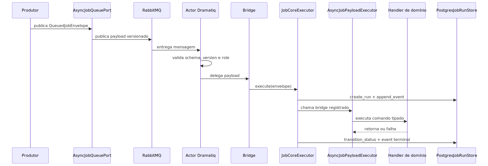
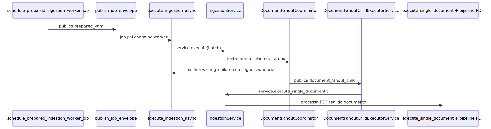

# Manual técnico: Sistema de Jobs, Worker e Paralelismo

## 1. O que este documento cobre

Este manual explica o comportamento técnico real do mecanismo de processamento de jobs do repositório. O foco é mostrar, em ordem de execução, como o sistema genérico funciona, como ele é materializado sobre RabbitMQ e Dramatiq, como o worker sobe e consome envelopes, como o core resolve handlers e como a ingestão PDF especializa esse mecanismo com job pai, job filho e fan-out por documento.

O documento também fecha o ponto que o usuário pediu explicitamente: como especializar o mecanismo para novos tipos de job sem criar fluxo paralelo, sem fallback implícito e sem contaminar o core com regra de domínio.

## 2. Mecanismo genérico e agnóstico

### 2.1. Camadas reais do sistema

O que o código mostra não é um bloco só. É uma pilha em camadas.

1. Contrato genérico do Job Core.
2. Store durável do lifecycle.
3. Registry de handlers por chave composta.
4. Porta abstrata de fila.
5. Adapter RabbitMQ e Dramatiq.
6. Runtime dedicado do processo worker.
7. Bridge transporte -> core.
8. Executor canônico de payload do worker.
9. Especialização de domínio.



O diagrama importa porque mostra onde a especialização deve entrar. Ela entra depois do core e do bridge, não antes.

### 2.2. Contrato mínimo do Job Core

O core define quatro tipos principais.

- `JobEnvelope`: identidade lógica do trabalho.
- `JobExecutionContext`: contexto entregue ao handler.
- `JobTerminalError`: erro terminal estruturado.
- `JobExecutionResult`: resultado terminal validado.

O contrato é deliberadamente pequeno. Ele exige:

- `job_id`;
- `route_kind`;
- `dispatch_mode`;
- `job_type`;
- `handler_key`;
- `correlation_id`;
- `payload`.

O campo mais importante para roteamento não é `handler_key` isolado. É a combinação de `route_kind + dispatch_mode`, exposta como `routing_key`.

Por que isso existe: o sistema já tem mais de um domínio assíncrono convivendo. Se o registry aceitasse uma chave fraca, um fluxo poderia sobrescrever o outro.

### 2.3. Executor genérico do core

`JobCoreExecutor.execute` faz o lifecycle mínimo completo.

1. valida o envelope;
2. cria a run se ainda não existir;
3. registra `ENVELOPE_RECEIVED`;
4. monta o `JobExecutionContext`;
5. registra `ENVELOPE_VALIDATED`;
6. encerra cedo se a execução já vier marcada como stale ou cancelada;
7. resolve o handler pela chave composta;
8. muda o status para `running`;
9. registra `EXECUTION_EXECUTED`;
10. chama o handler;
11. persiste o estado terminal.

O ponto importante é que o core não sabe nada sobre ingestão, PDF, ETL ou background. O máximo que ele sabe é validar contrato, registrar evento e chamar o handler certo.

### 2.4. Registry de handlers sem fallback implícito

`JobHandlerRegistry` registra e resolve handlers por `route_kind + dispatch_mode`.

Aspectos confirmados:

- registro duplicado explode com erro;
- ausência de handler produz falha explícita;
- não existe “tentar outro handler” por conveniência;
- o próprio registry monta `routing_key` canônico.

Em linguagem simples: se o sistema não sabe exatamente quem executa aquele job, ele para. Isso é correto.

### 2.5. Store durável do lifecycle

`PostgresJobRunStore` implementa o ledger durável do core em PostgreSQL.

Operações confirmadas:

- `create_run`;
- `transition_status`;
- `append_event`;
- `get_run`;
- `list_events`.

Aspectos importantes confirmados no código:

- o DSN canônico vem de `INGESTION_TELEMETRY_DSN`;
- o store usa `ConnectionPool` compartilhado;
- há retry explícito para erros transitórios, incluindo `PoolTimeout`;
- status terminal atualiza `finished_at` e razão final.

Isso significa que o core não depende da memória do worker para lembrar o que aconteceu.

### 2.6. Porta abstrata de fila

Na camada de API e services, o contrato genérico de transporte passa por `AsyncJobQueuePort`, `StreamJobMessage` e `QueuedJobEnvelope`.

O que `QueuedJobEnvelope` acrescenta ao core:

- `kind` físico do runtime assíncrono;
- `worker_execution_correlation_id` obrigatório;
- `run_id` opcional;
- `queued_at` opcional.

Essa camada é importante porque o produtor não deveria montar payload físico de RabbitMQ na mão.

### 2.7. Configuração canônica do runtime assíncrono

`system_config_manager.py` é a fonte canônica da configuração do backend assíncrono.

O que foi confirmado na leitura anterior e usado nesta documentação:

- backend aceito: `rabbitmq`;
- runtime consumidor aceito: `dramatiq`;
- resolução de AMQP URL;
- nomes base de filas;
- timeout e TTL da fila;
- topologia de threads do worker.

Esse ponto é importante porque não existe caminho oficial paralelo do tipo “se não der Dramatiq, consome inline”. O sistema escolhe o runtime canônico e falha quando ele não está configurado corretamente.

### 2.8. Nomes de fila e versão de contrato

`async_job_dramatiq_queue_names.py` materializa a convenção física de filas. O contrato observado usa versão `v2` e separa explicitamente pelo papel operacional.

Filas confirmadas:

- fila pai de ingestão;
- fila filha de ingestão para `fanout_children`;
- fila pai de ETL;
- fila pai de background execution.

Isso conversa com outra garantia importante: filho não pode cair na fila pai.

### 2.9. Adapter RabbitMQ e Dramatiq

`async_job_dramatiq.py` faz duas coisas principais.

- Publica mensagens com contrato versionado.
- Sobe actors Dramatiq para consumo por fila e papel.

Os actors oficiais sobem com `max_retries=0`. Em linguagem simples, o broker não fica repetindo o trabalho por conta própria. Quando existe retry, ele precisa nascer na camada de domínio, de forma explícita e observável.

No publish, `_build_transport_payload` injeta:

- `async_job_message_schema_version`;
- `async_job_queue_contract_version`;
- `async_job_queue_role`;
- `async_job_kind`.

No consume, `_validate_transport_payload` falha fechado se qualquer desses campos não bater com o actor.

Há uma proteção extra importante: se um payload `document_fanout_child` cair na fila pai de ingestão, `_ingestion_actor` registra erro estruturado e levanta `FanoutChildOnParentQueueError`. O adapter não tenta redirecionar. Isso é deliberado e correto.

### 2.10. Runtime dedicado do worker

O processo worker sobe por `app/worker_main.py`, que delega para `app/runners/worker_runner.py`.

O bootstrap confirmado:

1. carrega `.env`;
2. força `PROCESS_ROLE=worker`;
3. valida infraestrutura obrigatória;
4. sobe `RuntimeBootstrap`;
5. constrói `WorkerProcessRuntime`;
6. inicia o runtime assíncrono;
7. emite markers `MULTICHANNEL_SUPERVISOR_READY` e `WORKER_READY`;
8. entra em espera até sinal de shutdown;
9. faz shutdown coordenado.

O `WorkerProcessRuntimeSnapshot` expõe estado observável do processo, como backend assíncrono, runtime consumidor, prontidão de ingestão e estado do fan-out.

O runtime unificado também emite `WORKER_RUNTIME_READY` quando o plano de controle multicanal e o runtime assíncrono já estão prontos ao mesmo tempo. Esse marker nasce em `src/api/services/worker_process_runtime.py` e complementa os markers do runner.

### 2.11. Bridge transporte -> Job Core

`_build_transport_job_core_executor` registra handlers de bridge para o core. Eles não executam o domínio diretamente. Eles apenas conectam a chave `route_kind + dispatch_mode` ao método certo do `AsyncJobPayloadExecutor`.

O que está confirmado:

- ingestão `prepared_yaml` -> `execute_ingestion_payload`;
- ingestão `resolve_on_worker` -> `execute_ingestion_payload`;
- ingestão `document_fanout_child` -> `execute_ingestion_payload` especializado via dispatch interno;
- ETL `prepared_yaml` -> `execute_etl_payload`;
- background execution -> `execute_background_execution_payload`.

Esse bridge é um ponto chave da extensibilidade. Job novo não deve bypassar o core; ele deve ser conectado aqui.

### 2.12. Normalização tipada do payload

`AsyncJobCommandFactory` é o funil que transforma payload heterogêneo em comandos coerentes.

Comandos confirmados:

- `PreparedIngestionJobCommand`;
- `ResolveOnWorkerIngestionJobCommand`;
- `DocumentFanoutChildIngestionJobCommand`;
- `PreparedEtlJobCommand`;
- `BackgroundExecutionJobCommand`;
- `SchedulerExecutionJobCommand`.

Essa fábrica faz validação estrutural importante.

- exige `dispatch_mode`;
- exige `correlation_id`;
- exige `worker_execution_correlation_id`;
- valida inteiro positivo quando necessário;
- valida datetime ISO-8601 para o scheduler.

Em linguagem simples: o worker não entrega dicionário cru e incompleto ao domínio. Ele obriga o payload a virar um comando minimamente saudável.

### 2.13. Dispatcher e handlers de domínio

`AsyncJobCommandDispatcher` resolve o handler do comando tipado, novamente por `kind + dispatch_mode`, usando o mesmo `JobHandlerRegistry` do core.

No caminho de ingestão, isso leva a dois papéis bem diferentes.

- `IngestionParentJobHandler`: coordena o job pai.
- `IngestionDocumentJobHandler`: coordena o job filho.

Essa separação é a base para explicar o paralelismo sem confundir coordenação e execução documental.

## 3. Fluxo técnico principal de ponta a ponta

### 3.1. Fluxo genérico



### 3.2. O que cada passo decide

1. O produtor decide que a execução sairá do modo inline.
2. A porta de fila decide como publicar sem acoplar o boundary ao broker.
3. O adapter decide qual fila física receberá a mensagem.
4. O actor decide se a mensagem pertence mesmo àquela fila.
5. O bridge decide qual método do executor de payload será chamado.
6. O core decide o lifecycle genérico e o handler registrado.
7. O domínio decide a regra de negócio real.

Essa distribuição de responsabilidade é o que torna o mecanismo agnóstico.

## 4. Especialização para ingestão e PDF

### 4.1. Agendamento do job pai de ingestão

`schedule_prepared_ingestion_worker_job` é o boundary reutilizável que agenda o job pai já com o YAML preparado.

O que ele faz, em ordem:

1. gera `run_id`;
2. anexa monitoramento inicial ao snapshot;
3. exige telemetria durável de ingestão;
4. rejeita conflito concorrente de vectorstore;
5. registra a run enfileirada;
6. registra progresso inicial;
7. compõe `worker_execution_correlation_id` reservado;
8. persiste a reserva;
9. publica o envelope `prepared_yaml`.

Esse passo importa porque o job já nasce com identidade operacional explícita e estado durável antes do broker entrar em cena.

### 4.1.1. Boundary `resolve_on_worker` do job de ingestão

O módulo `src/api/services/ingestion_job_executor.py` cobre o outro caminho oficial do job pai: quando o endpoint ainda não quer materializar o YAML completo na borda HTTP e publica apenas o payload criptografado para resolução no worker.

Nesse fluxo, o serviço:

1. gera `run_id` e `queued_at`;
2. persiste o payload criptografado offline quando necessário;
3. anexa `job_runtime_monitor` ao snapshot preparado;
4. exige telemetria durável de ingestão e registra o run enfileirado;
5. compõe `worker_execution_correlation_id` com `correlation_id + run_id`;
6. monta `build_resolve_on_worker_ingestion_job_envelope(...)`;
7. reserva a identidade operacional do worker antes do publish;
8. publica o envelope `resolve_on_worker` na fila oficial.

Esse slice importa porque o job de ingestão não nasce apenas do caminho `prepared_yaml`. O runtime oficial também aceita um pai que leva `encrypted_data` e só resolve YAML dentro do worker.

### 4.2. Reserva e publicação canônica

`reserve_worker_execution_and_publish` mantém a ordem canônica da transição assíncrona.

1. valida `worker_execution_correlation_id`;
2. persiste a reserva;
3. atualiza o callback com worker reservado;
4. publica a mensagem no stream.

Isso evita um problema clássico: mensagem publicada antes de o monitoramento refletir a reserva do worker.

### 4.3. Envelope pai de ingestão

`build_prepared_ingestion_job_envelope` monta o envelope com:

- `task_id`;
- `correlation_id`;
- `worker_execution_correlation_id`;
- `run_id`;
- `queued_at`;
- `user_email`;
- `output_format`;
- `document_parallelism`;
- `yaml_config_path`;
- `yaml_config_data`;
- `dispatch_mode=prepared_yaml`.

O envelope do filho tem contrato diferente. Ele exige `dispatch_mode=document_fanout_child`, `document_parallelism=1` e carrega identidade do documento e do pai.

### 4.4. Execução do job pai no worker

Quando o worker consome o job pai, `IngestionParentJobHandler` chama `execute_ingestion_async`.

O handler tem dois ramos explícitos.

- Se o envelope veio como `resolve_on_worker`, ele tenta reaproveitar `encrypted_data` do payload e, se o campo vier ausente, recarrega o payload criptografado pelo `AsyncJobQueuePort.load_ingestion_runtime_payload(...)`. Depois resolve YAML, descobre `user_email`, verifica cancelamento cooperativo do pai e só então chama `execute_ingestion_async`.
- Se o envelope veio como `prepared_yaml`, ele exige `user_email` e `yaml_config_data` já resolvidos no próprio payload antes de delegar para `execute_ingestion_async`.

`execute_ingestion_async` faz estas etapas confirmadas:

1. carrega o YAML com sessão;
2. reconcilia `correlation_id` final do YAML;
3. cria logger e identidade do worker;
4. prepara contexto canônico do job;
5. anexa metadados do monitor de runtime;
6. registra queued e running no monitor;
7. materializa `IngestionService`;
8. chama `service.execute(...)`;
9. consolida resumo de processamento;
10. decide entre conclusão terminal e estado `waiting_children`.

Esse último ponto é importante. Se o fan-out foi despachado, mas o run agregado ainda não terminou, o pai não deve ser marcado como concluído. O código lido trata isso explicitamente.

### 4.5. Como `IngestionService` decide entre sequencial e fan-out

`IngestionService.execute` delega para `_execute_prepared_request`.

O serviço:

1. registra início da ingestão;
2. constrói `IngestionRequest`;
3. se estiver em modo de documento único, força snapshot de paralelismo compatível;
4. se o fan-out estiver permitido, tenta montar um plano;
5. se houver plano elegível, delega ao coordenador de fan-out;
6. se não houver plano, executa o orchestrator de ingestão diretamente.

Em outras palavras: o job pai não decide por `if document_parallelism > 1`. Ele pede ao serviço para avaliar elegibilidade real.

### 4.6. Planejamento do fan-out documental

`DocumentFanoutCoordinator` é a peça que transforma intenção de paralelismo em plano executável.

O que ele confirma no código:

- respeita feature flag operacional;
- verifica se as origens ativas suportam paralelismo documental;
- bloqueia cenários com pré-requisitos operacionais ausentes;
- inventaria itens por fonte remota replayable;
- deduplica itens do plano;
- calcula `effective_parallelism` com base em documentos elegíveis e capacidade física;
- registra snapshot de paralelismo e preflight de capacidade.

Esse desenho é importante porque fan-out errado é pior do que fan-out ausente. O coordenador tenta garantir que o paralelismo só nasce quando é seguro.

### 4.7. Publicação dos filhos

Na publicação do lote, `DocumentFanoutCoordinator.build_response` e sua rotina interna de dispatch:

1. resolve `parent_run_id` e telemetria do pai;
2. exige bootstrap compartilhado do pai;
3. cria ou reconcilia estado queued por documento;
4. calcula janela inicial de dispatch;
5. evita republicar filhos já materializados em replay;
6. publica envelopes `document_fanout_child` até o limite inicial;
7. registra metadados do child job publicado.

Esse comportamento evita duplicação de publicação e deixa explícito quando o pai apenas reconciliou estado, em vez de publicar tudo de novo.

### 4.8. Execução segura do filho

`DocumentFanoutChildExecutorService.execute` é a peça mais importante para entender o paralelismo seguro.

Ele faz, em alto nível:

1. valida que `user_email` e `yaml_config_data` existem;
2. garante o contrato de bootstrap do pai;
3. cria logger e callback sensível ao cancelamento do pai;
4. inicializa telemetria do filho;
5. inspeciona estado existente do documento;
6. consulta a gate canônica de execução;
7. se permitido, aguarda slot de execução;
8. executa a tentativa real com retry de domínio;
9. persiste sucesso, cancelamento ou falha terminal;
10. promove o próximo queued quando aplicável.

O detalhe mais importante é que o filho não depende apenas de a mensagem ter chegado. Ele depende de o plano de controle ainda autorizar aquela execução.

### 4.9. Onde o PDF roda de fato

Dentro do filho, a tentativa real cria `IngestionService` com `requested_document_parallelism=1` e chama `execute_single_document`.

Esse método desliga novo fan-out e força a esteira oficial de um único documento. Se o documento for PDF, o pipeline PDF especializado entra aqui.

Isso resolve a separação conceitual pedida pelo usuário:

- mecanismo genérico: recebe, publica, consome, roteia, monitora;
- especialização de ingestão: decide lote, pai e filho;
- especialização PDF: faz parsing, OCR e chunking do documento efetivo.



## 5. Como especializar para novos tipos de job

Esta é a parte mais importante para evolução futura.

### 5.1. Regra geral

Adicionar um job novo não é criar uma função qualquer no worker. No desenho atual, especialização correta exige mexer em camadas específicas, cada uma com responsabilidade própria.

### 5.2. Cenário A: novo dispatch dentro de um kind já existente

Exemplo conceitual: um novo modo de ingestão ou um novo modo de background dentro de um `kind` que já existe.

Passos obrigatórios:

1. Definir a combinação `route_kind + dispatch_mode`.
2. Criar o builder de envelope do produtor.
3. Garantir `worker_execution_correlation_id` se o fluxo exigir monitoramento operacional.
4. Estender `AsyncJobCommandFactory` com um comando tipado novo.
5. Criar um `AsyncJobMessageHandler` específico.
6. Criar ou adaptar o handler de domínio real.
7. Registrar o bridge no `JobCoreExecutor` do transporte.
8. Cobrir com teste unitário e, quando houver fila física, com teste de integração do adapter.

### 5.3. Cenário B: novo kind com papel físico próprio

Exemplo conceitual: uma família nova de trabalho assíncrono que não cabe em ingestão, ETL ou background execution.

Além dos passos do cenário A, será necessário:

1. Expandir `JobKind` na borda assíncrona.
2. Adicionar base name e construção de fila no contrato físico.
3. Adicionar actor dedicado no adapter Dramatiq.
4. Validar topologia de worker para o novo papel.
5. Atualizar a factory de runtime e configuração sistêmica.

Na prática, kind novo não é uma simples variação de handler. É extensão da topologia operacional.

### 5.4. O que não fazer

- Não publicar dicionário cru direto no broker sem `QueuedJobEnvelope`.
- Não bypassar o `JobCoreExecutor` para “ganhar tempo”.
- Não usar `handler_key` sozinho como identidade.
- Não reusar a fila errada e torcer para o actor dar conta.
- Não esconder retry de negócio dentro do transporte.
- Não criar resolvedor paralelo quando já existe porta e adapter canônicos.

### 5.5. Fluxo recomendado para especialização



O diagrama mostra por que a especialização correta é multietapas. Se alguém tentar “pular” direto do caso de uso para o worker, cria-se um fluxo paralelo e frágil.

### 5.6. Regra operacional para um agente de IA de manutenção

Se a intenção é criar um agente de IA para refatorar, corrigir ou revisar este sistema, a regra central é simples: ele precisa separar com rigor o mecanismo genérico de processamento de jobs da especialização de ingestão e PDF.

O problema que essa regra resolve é o erro mais comum em sistemas assíncronos grandes: empurrar regra de domínio para dentro da infraestrutura ou, no sentido contrário, contaminar o domínio com detalhes de broker, actor, contrato físico de fila e lifecycle genérico. Quando isso acontece, a correção até pode “parecer funcionar”, mas o sistema fica acoplado, frágil, difícil de testar e mais perigoso de evoluir.

Escopo exato do mecanismo genérico e agnóstico:

- receber `JobEnvelope` e `QueuedJobEnvelope` válidos;
- persistir o lifecycle genérico em `job_core.job_runs` e `job_core.job_run_events`;
- resolver o handler pela chave `route_kind + dispatch_mode`;
- transportar o trabalho pelo backend assíncrono oficial;
- subir o processo worker, consumir a fila correta e entregar o payload ao core;
- normalizar o payload transportado para comandos tipados do worker;
- executar o handler já escolhido, sem conhecer regra de negócio do domínio específico.

Em termos de código, esse escopo vive principalmente em:

- `src/core/job_core/*`;
- `src/api/services/async_job_dramatiq.py`;
- `src/api/services/async_job_queue_port.py` e factories correlatas;
- `app/worker_main.py` e `app/runners/worker_runner.py`;
- partes genéricas de `src/api/services/async_job_worker_payload_executor.py`.

Escopo exato da especialização para ingestão e PDF:

- decidir quando a ingestão será assíncrona;
- montar envelope pai e envelope filho de ingestão;
- reservar identidade operacional do worker para a run;
- decidir entre execução sequencial e fan-out documental;
- planejar, publicar e reconciliar os filhos do fan-out;
- aplicar gates, cancelamento, retry e promoção de documentos no slice de ingestão;
- executar a pipeline especializada de documento e PDF.

Em termos de código, esse escopo vive principalmente em:

- `src/api/services/ingestion_http_prepared_async_service.py`;
- `src/api/services/ingestion_async_enqueue_support.py`;
- `src/api/services/ingestion_async_enqueue_service.py`;
- `src/api/services/rag_async_execution_service.py`;
- `src/services/ingestion_service.py`;
- `src/services/document_fanout_coordinator.py`;
- `src/services/document_fanout_child_executor_service.py`;
- pipeline de ingestão e PDF chamada no fim desse fluxo.

O mecanismo genérico faz:

- contrato comum;
- roteamento comum;
- execução comum;
- observabilidade comum;
- persistência durável comum.

O mecanismo genérico não faz:

- parse de PDF;
- OCR;
- chunking;
- decisão de motor de documento;
- regra de fan-out da ingestão;
- reconciliação de manifest da ingestão;
- regra de negócio de tenant, vectorstore, lote ou documento.

A especialização para ingestão e PDF faz:

- orquestração do job pai;
- orquestração do job filho;
- controle do paralelismo documental;
- decisão de continuar, enfileirar, promover ou encerrar documento;
- chamada do pipeline que realmente processa o PDF.

A especialização para ingestão e PDF não faz:

- definir contrato físico de RabbitMQ ou Dramatiq;
- alterar o lifecycle canônico do `JobCoreExecutor`;
- decidir como `job_core.job_runs` funciona;
- inventar fila nova fora do contrato oficial;
- criar caminho paralelo de transporte;
- usar fallback implícito quando não encontra handler, fila ou configuração.

Regra prática para corrigir no lugar certo:

- se o problema é de envelope, roteamento, registro de handler, bridge, actor, nome de fila, versão de contrato, bootstrap do worker, ledger do core ou transição de status, a correção pertence ao mecanismo genérico;
- se o problema é de agendamento da ingestão, envelope pai/filho, `document_parallelism`, gates do documento, slot lease, reconciliação da run, cancelamento documental, promoção do próximo documento ou pipeline de PDF, a correção pertence à especialização de ingestão;
- se o problema é do conteúdo do PDF, OCR, extração, chunking ou indexação, a correção pertence à pipeline especializada do documento e não ao core assíncrono.

Guardrails obrigatórios para o agente:

- nunca adicionar campo, status, evento ou coluna no core apenas para atender um domínio específico, a menos que a necessidade seja comprovadamente comum a todos os tipos de job;
- nunca fazer `JobCoreExecutor`, `JobEnvelope`, `AsyncJobQueuePort` ou `PostgresJobRunStore` conhecer tabela, regra ou semântica específica de ingestão/PDF;
- nunca fazer o domínio de ingestão/PDF conhecer `async_job_queue_contract_version`, actor concreto, detalhe de publish físico ou outra regra interna do adapter de transporte;
- nunca trocar a chave real de roteamento por `handler_key` isolado;
- nunca misturar fila pai com fila filha;
- nunca criar resolvedor paralelo, dispatcher paralelo ou fluxo alternativo “mais simples” fora do caminho canônico.

Texto pronto para usar como regra-base do agente:

```text
Você é um agente de manutenção do sistema de jobs assíncronos. Sua obrigação é preservar a separação entre mecanismo genérico e especialização de domínio.

Considere como mecanismo genérico apenas o que for comum a qualquer job: contrato `JobEnvelope`, ledger `job_core`, roteamento por `route_kind + dispatch_mode`, porta de fila, adapter RabbitMQ/Dramatiq, runtime do worker, bridge transporte -> core, normalização tipada do payload e execução genérica do handler.

Considere como especialização de ingestão/PDF apenas o que for específico desse domínio: agendamento do job pai, envelopes de ingestão, reserva operacional da run, decisão entre sequencial e fan-out, coordenação pai-filhos, gates e retries do documento, leases, reconciliação da ingestão e pipeline que realmente processa o PDF.

Seu trabalho é corrigir cada problema na camada que realmente controla aquele comportamento. Se a falha estiver no contrato, no transporte, no worker, no roteamento ou no lifecycle genérico, corrija o mecanismo genérico. Se a falha estiver na lógica de ingestão, no fan-out documental, no cancelamento do documento ou no pipeline de PDF, corrija a especialização de ingestão/PDF.

Você não pode empurrar regra de PDF para dentro do core, nem empurrar detalhe de broker para dentro do domínio. Você não pode criar fallback implícito, fluxo paralelo, dispatcher paralelo, fila errada, chave de roteamento fraca nem resolvedor alternativo por conveniência. Quando faltar handler, fila ou configuração, a falha deve ser explícita e observável.

Antes de editar, identifique qual camada decide o comportamento. Depois altere apenas essa camada e as suas bordas imediatas. Preserve a independência entre infraestrutura e domínio. Preserve a topologia pai/filho. Preserve a chave `route_kind + dispatch_mode`. Preserve o ledger canônico do Job Core como fonte de verdade do lifecycle genérico.
```

## 6. Configurações que mudam o comportamento

### 6.1. `backend` e `consumer_runtime`

Controlam qual infraestrutura assíncrona é aceita. O código lido confirma RabbitMQ + Dramatiq como caminho oficial.

### 6.2. `ingestion_queue`, `etl_queue` e `background_execution_queue`

Controlam os nomes base das filas físicas, sobre as quais o contrato `v2` constrói filas por papel.

### 6.3. `dramatiq_worker_threads` e `dramatiq_child_worker_threads`

Controlam a capacidade física do worker. Isso afeta throughput e o paralelismo real do fan-out documental.

### 6.4. `dramatiq_worker_timeout_ms` e `dramatiq_shutdown_timeout_ms`

Controlam o comportamento operacional do runtime consumidor e do shutdown coordenado.

### 6.5. TTL de mensagens

O adapter resolve TTL da fila e aplica `max_age` aos actors. Isso muda quanto tempo uma mensagem velha ainda pode circular.

### 6.6. `document_parallelism`

Na ingestão, controla a intenção de paralelismo documental. O coordenador ainda decide se a intenção é executável.

### 6.7. `INGESTION_DOCUMENT_FANOUT_ENABLED`

Feature flag operacional que pode desligar o fan-out e manter o fluxo sequencial.

### 6.8. Variáveis de retry do documento filho

O executor do filho lê variáveis dedicadas para tentativas, espera mínima e máxima e limites de slot de execução. Isso mostra que o retry de domínio é configurável sem ser empurrado para o broker.

## 7. Contratos, entradas e saídas

### 7.1. Contrato do `JobEnvelope`

Obrigatórios:

- `job_id`
- `route_kind`
- `dispatch_mode`
- `job_type`
- `handler_key`
- `correlation_id`

### 7.2. Contrato do `QueuedJobEnvelope`

Além do envelope lógico, a borda assíncrona exige:

- `kind`
- `worker_execution_correlation_id`
- `run_id` opcional
- `queued_at` opcional

### 7.3. Contrato do payload transportado por Dramatiq

O adapter adiciona e valida:

- `async_job_message_schema_version`
- `async_job_queue_contract_version`
- `async_job_queue_role`
- `async_job_kind`

### 7.4. Contrato do comando tipado

Cada dispatch mode relevante tem seu comando próprio. Esse é o contrato que o domínio efetivamente consome.

## 8. O que acontece em caso de sucesso

No caminho feliz genérico:

1. a mensagem entra na fila certa;
2. o actor valida o contrato;
3. o core registra run e eventos;
4. o handler correto executa;
5. o core persiste o estado terminal.

No caminho feliz da ingestão com fan-out:

1. o pai agenda e monitora;
2. o coordenador publica os filhos elegíveis;
3. cada filho processa um documento;
4. o pai só vira terminal quando o lote agregado realmente termina.

## 9. O que acontece em caso de erro

### 9.1. Erros estruturais confirmados

- envelope sem `dispatch_mode`;
- envelope sem `worker_execution_correlation_id`;
- comando de ingestão sem `user_email` resolvido;
- comando de ingestão sem `yaml_config_data` válido;
- handler não registrado no core;
- mensagem com schema version ou queue role incompatível.

### 9.2. Erros de isolamento de fila confirmados

- `FanoutChildOnParentQueueError` quando filho chega à fila pai.

### 9.3. Erros de infraestrutura crítica confirmados

- ausência de bootstrap compartilhado do pai no fan-out;
- indisponibilidade de telemetria canônica do pai;
- falha do publisher canônico ao publicar filhos.

### 9.4. Erros de domínio confirmados

- falha terminal do documento filho após retries;
- cancelamento cooperativo do pai bloqueando filho;
- gate de execução bloqueando reentrada ou promoção automática.

## 10. Observabilidade e diagnóstico

### 10.1. Identificadores principais

- `correlation_id`
- `worker_execution_correlation_id`
- `run_id` do core e do domínio quando aplicável
- `parent_run_id` no fan-out documental

### 10.2. Marcadores úteis

No worker:

- `MULTICHANNEL_SUPERVISOR_READY`
- `WORKER_READY`
- markers de shutdown coordenado

No adapter assíncrono:

- erro estruturado quando filho cai na fila pai
- startup do runtime Dramatiq com `queue_contract_version` e `message_schema_version`

Na ingestão:

- `ingestion.fanout.plan.completed`
- `ingestion.fanout.publish.started`
- `ingestion.fanout.parent.waiting_children`
- eventos do executor do documento filho

### 10.3. Ordem recomendada de investigação

1. Confirmar se o worker subiu e ficou pronto.
2. Confirmar se a mensagem foi publicada na fila correta.
3. Confirmar se o actor aceitou o contrato da mensagem.
4. Confirmar se o core registrou a run.
5. Confirmar se o handler da chave composta existe.
6. Confirmar se o domínio entrou em execução.
7. Para ingestão, confirmar se o pai publicou filhos ou ficou bloqueado.
8. Para documento filho, confirmar se a gate autorizou a execução.

## 11. Impacto técnico

O impacto técnico principal é a separação robusta entre transporte, lifecycle genérico e domínio. Isso melhora clareza arquitetural, reduz duplicação e permite evoluir paralelismo sem espalhar lógica de fila pelo produto.

## 12. Impacto executivo

Executivamente, o sistema melhora previsibilidade operacional e capacidade de isolar gargalos entre coordenação e execução pesada.

## 13. Impacto comercial

Comercialmente, ele sustenta promessas de processamento assíncrono corporativo com rastreabilidade e paralelismo governado.

## 14. Impacto estratégico

Estratégicamente, ele cria a espinha dorsal para novas famílias de job sem proliferar mecanismos concorrentes e sem reintroduzir legado.

## 15. Exemplos práticos guiados

### 15.1. Exemplo: ingestão preparada entra no worker pai

Entrada: envelope `prepared_yaml` com YAML já resolvido.

Processamento: `IngestionParentJobHandler` chama `execute_ingestion_async`.

Saída: pai conclui direto ou entra em `waiting_children`.

### 15.2. Exemplo: documento filho processa um PDF

Entrada: envelope `document_fanout_child` com contexto do documento e `document_parallelism=1`.

Processamento: executor do filho consulta gate, aguarda slot, chama `execute_single_document`.

Saída: documento fica `success`, `skipped`, `failed` ou `cancelled`, com promoção do próximo queued quando cabível.

### 15.3. Exemplo: adicionar novo dispatch em ETL

Entrada: caso de uso novo que ainda pertence ao `kind=etl`.

Processamento: criar envelope, comando tipado, handler e bridge.

Saída esperada: novo fluxo assíncrono sem criar outro mecanismo de fila.

## 16. Explicação 101

O sistema funciona como uma esteira com três níveis.

- O primeiro nível recebe o pedido e empacota o trabalho.
- O segundo nível transporta e registra o trabalho.
- O terceiro nível faz o trabalho especializado.

Se o trabalho for grande, como uma ingestão com muitos documentos, o sistema cria um coordenador e vários executores menores. Mas ele só faz isso quando consegue provar que a coordenação e o controle continuam íntegros.

## 17. Limites e pegadinhas

- O core é genérico, mas o runtime assíncrono físico atual não é genérico a qualquer broker; ele está fechado em RabbitMQ + Dramatiq.
- `document_parallelism` não força fan-out se a origem não for elegível.
- O filho pode acordar fora de hora; por isso a gate consulta o estado durável antes de trabalhar.
- Kind novo pode exigir topologia nova, não apenas handler novo.
- O contrato do pai e do filho não é intercambiável.

## 18. Troubleshooting

### 18.1. Sintoma: handler não é encontrado

Causa provável: `route_kind + dispatch_mode` não foi registrado no bridge ou no dispatcher.

Ação recomendada: verificar registry do core e handlers do executor de payload.

### 18.2. Sintoma: filho de fan-out cai na fila pai

Causa provável: publicação com role errada ou contrato físico desatualizado.

Ação recomendada: revisar construção do payload de transporte e nomes de fila `v2`.

### 18.3. Sintoma: pai de ingestão fica parado após publicar

Causa provável: está em `waiting_children` ou não conseguiu publicar filhos por bloqueio operacional.

Ação recomendada: revisar eventos de fan-out do pai e o estado agregado do run.

### 18.4. Sintoma: filho não processa documento apesar de ter sido consumido

Causa provável: gate bloqueou execução, cancelamento do pai ou infraestrutura crítica ausente.

Ação recomendada: revisar logs do executor filho e runtime state do pai.

## 19. Como colocar para funcionar

Pré-requisitos confirmados no código lido:

- RabbitMQ disponível via AMQP URL configurada;
- backend assíncrono configurado para `rabbitmq`;
- runtime consumidor configurado para `dramatiq`;
- banco de telemetria acessível para o ledger durável;
- processo worker iniciado pelo entrypoint Python `app/worker_main.py`.

O comando exato de operação em container não foi confirmado integralmente nos arquivos lidos. O entrypoint Python e a dependência do runtime canônico foram confirmados.

## 20. Checklist de entendimento

- Entendi as camadas do mecanismo genérico.
- Entendi o contrato mínimo do Job Core.
- Entendi por que o registry usa chave composta.
- Entendi o papel do adapter RabbitMQ + Dramatiq.
- Entendi o bootstrap do worker.
- Entendi como o payload vira comando tipado.
- Entendi a diferença entre job pai e job filho de ingestão.
- Entendi onde o PDF realmente entra na execução.
- Entendi como adicionar novos job types sem criar fluxo paralelo.
- Entendi como diagnosticar falha por camada.

## 21. Evidências no código

- [../src/core/job_core/models.py](../src/core/job_core/models.py)
  - Motivo da leitura: confirmar o contrato mínimo do core.
  - Símbolos relevantes: `JobEnvelope`, `JobExecutionResult`.
  - Comportamento confirmado: o core é agnóstico ao domínio.

- [../src/core/job_core/executor.py](../src/core/job_core/executor.py)
  - Motivo da leitura: confirmar a ordem do lifecycle do executor.
  - Símbolo relevante: `JobCoreExecutor.execute`.
  - Comportamento confirmado: run, eventos e terminalização ficam no core.

- [../src/core/job_core/registry.py](../src/core/job_core/registry.py)
  - Motivo da leitura: confirmar o roteamento sem fallback.
  - Símbolo relevante: `JobHandlerRegistry`.
  - Comportamento confirmado: chave composta obrigatória e erro em duplicidade.

- [../src/core/job_core/postgres_store.py](../src/core/job_core/postgres_store.py)
  - Motivo da leitura: confirmar persistência durável e retry.
  - Símbolo relevante: `PostgresJobRunStore`.
  - Comportamento confirmado: ledger PostgreSQL com retry explícito.

- [../src/api/services/async_job_dramatiq.py](../src/api/services/async_job_dramatiq.py)
  - Motivo da leitura: confirmar actors, filas por papel e bridge.
  - Símbolos relevantes: `_build_async_job_actors`, `_validate_transport_payload`, `_build_transport_job_core_executor`.
  - Comportamento confirmado: contrato versionado, fail-closed e ligação explícita ao core.

- [../src/api/services/async_job_worker_payload_executor.py](../src/api/services/async_job_worker_payload_executor.py)
  - Motivo da leitura: confirmar comandos tipados e handlers especializados.
  - Símbolos relevantes: `AsyncJobCommandFactory`, `IngestionParentJobHandler`, `IngestionDocumentJobHandler`, `AsyncJobCommandDispatcher`.
  - Comportamento confirmado: desserialização tipada e roteamento de domínio.

- [../src/api/services/ingestion_http_prepared_async_service.py](../src/api/services/ingestion_http_prepared_async_service.py)
  - Motivo da leitura: confirmar o boundary de agendamento do job pai.
  - Símbolo relevante: `schedule_prepared_ingestion_worker_job`.
  - Comportamento confirmado: reserva do worker e publicação do envelope preparado.

- [../src/api/services/ingestion_job_executor.py](../src/api/services/ingestion_job_executor.py)
  - Motivo da leitura: confirmar o boundary oficial do job pai com `resolve_on_worker`.
  - Símbolos relevantes: `RedisRuntimeIngestionStreamPublisher.publish`, `build_resolve_on_worker_ingestion_job_envelope`.
  - Comportamento confirmado: payload criptografado, reserva explícita do worker e publicação do envelope `resolve_on_worker` no caminho canônico.

- [../src/api/services/ingestion_async_enqueue_support.py](../src/api/services/ingestion_async_enqueue_support.py)
  - Motivo da leitura: confirmar builders de envelope pai e filho.
  - Símbolos relevantes: `build_prepared_ingestion_job_envelope`, `build_document_fanout_child_ingestion_job_envelope`.
  - Comportamento confirmado: pai e filho têm contratos diferentes e o filho exige `document_parallelism=1`.

- [../src/api/services/ingestion_async_enqueue_service.py](../src/api/services/ingestion_async_enqueue_service.py)
  - Motivo da leitura: confirmar a ordem da reserva e publicação.
  - Símbolo relevante: `reserve_worker_execution_and_publish`.
  - Comportamento confirmado: persiste a reserva antes de publicar.

- [../src/api/services/rag_async_execution_service.py](../src/api/services/rag_async_execution_service.py)
  - Motivo da leitura: confirmar a execução do job pai.
  - Símbolo relevante: `execute_ingestion_async`.
  - Comportamento confirmado: o pai pode concluir diretamente ou ficar aguardando filhos.

- [../src/services/ingestion_service.py](../src/services/ingestion_service.py)
  - Motivo da leitura: confirmar a decisão entre sequencial, batch e documento único.
  - Símbolos relevantes: `execute`, `execute_single_document`, `_execute_prepared_request`.
  - Comportamento confirmado: o serviço decide se chama o coordenador de fan-out ou o orchestrator direto.

- [../src/services/document_fanout_coordinator.py](../src/services/document_fanout_coordinator.py)
  - Motivo da leitura: confirmar planejamento, dispatch e replay seguro do fan-out.
  - Símbolos relevantes: `build_response` e rotinas de dispatch.
  - Comportamento confirmado: o pai publica filhos com pré-requisitos e janela de dispatch controlada.

- [../src/services/document_fanout_child_executor_service.py](../src/services/document_fanout_child_executor_service.py)
  - Motivo da leitura: confirmar gate, retry e execução do documento filho.
  - Símbolo relevante: `DocumentFanoutChildExecutorService.execute`.
  - Comportamento confirmado: o filho respeita plano de controle, slot, retry e estado terminal.

- [../app/runners/worker_runner.py](../app/runners/worker_runner.py)
  - Motivo da leitura: confirmar o bootstrap do processo worker.
  - Símbolo relevante: `run_worker_process`.
  - Comportamento confirmado: runtime dedicado com markers de prontidão e shutdown coordenado.

- [../src/api/services/worker_process_runtime.py](../src/api/services/worker_process_runtime.py)
  - Motivo da leitura: confirmar a prontidão do runtime unificado do worker.
  - Símbolos relevantes: `WorkerProcessRuntime.start`, `WorkerProcessRuntimeSnapshot.ready`.
  - Comportamento confirmado: `WORKER_RUNTIME_READY` só nasce quando plano de controle e runtime assíncrono estão prontos em conjunto.

- [../tests/integration/test_03-01-08_async_job_dramatiq_real_flow.py](../tests/integration/test_03-01-08_async_job_dramatiq_real_flow.py)
  - Motivo da leitura: confirmar evidência executável do fluxo físico real.
  - Símbolo relevante: `test_quando_runtime_real_executa_matriz_critica_entao_boundary_completo_passa_pelo_job_core_e_executor_canonico`.
  - Comportamento confirmado: o transporte RabbitMQ/Dramatiq real atravessa bridge, Job Core e executor canônico para a matriz crítica de `route_kind + dispatch_mode`.
  - Comportamentos confirmados adicionais: o slice também valida exceção real de leaf com falha terminal no core, cancelamento cooperativo do pai antes do domínio, concorrência real entre múltiplos jobs e preservação de linhagem por `worker_execution_correlation_id` em log físico compartilhado por `correlation_id` nesse boundary por actor.
