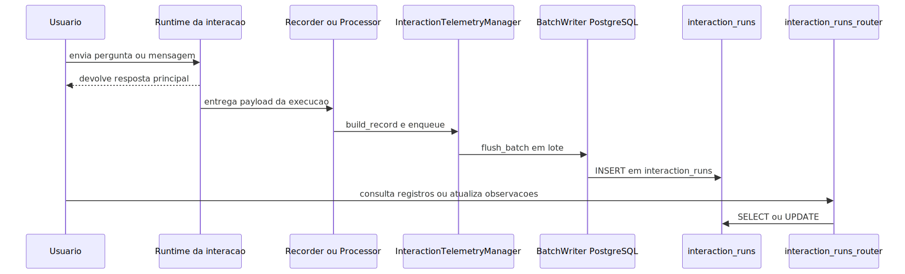

# Manual tecnico e operacional: telemetria de interacoes do agente

> Navegacao rapida: volte ao [README principal](../README.md) para o indice geral, use [README-INDICE.MD](../README.md) para escolher a trilha por pergunta real, leia [README-CONCEITUAL-TELEMETRIA-INTERACOES-AGENTE.md](../conceitual/README-CONCEITUAL-TELEMETRIA-INTERACOES-AGENTE.md) para valor e limites da feature, complemente com [API-ENDPOINTS-SWAGGER.md](./API-ENDPOINTS-SWAGGER.md) para o boundary HTTP e [README-TECNICO-ARQUITETURA-LOGGING-CORRELATION-ID.md](./README-TECNICO-ARQUITETURA-LOGGING-CORRELATION-ID.md) para a investigacao por correlation_id.

## 1. O que e esta feature

Esta feature e a trilha tecnica que grava a interacao principal do agente em interaction_runs para consulta posterior. O codigo lido confirma que o runtime persiste, pelo menos, estes grupos de dados:

- pergunta recebida;
- resposta enviada;
- identificacao de tenant, cliente, canal, workflow e agente quando disponivel;
- tokens, custo, latencia, confidence_score e sentiment_score quando disponiveis;
- correlation_id;
- sinais de erro e no_answer;
- metadados e evidence_summary;
- observacoes editaveis depois da execucao.

O objetivo tecnico nao e guardar qualquer artefato possivel. O objetivo e registrar a interacao principal com estrutura suficiente para monitoramento e revisao.

## 2. Que problema ela resolve

Sem interaction_runs, a revisao operacional dependeria de logs brutos, payloads efemeros ou reconstrucao manual. Isso e ruim para suporte, para operacao e para melhoria continua.

interaction_runs resolve esse problema oferecendo uma estrutura persistida e pesquisavel. Em vez de procurar resposta em arquivos ou consoles, o sistema consulta uma tabela propria para a interacao.

## 3. Conceitos necessarios para entender

### InteractionTelemetryRecord

E o objeto intermediario que representa uma linha pronta para persistencia. Ele padroniza os campos antes da escrita em banco.

### InteractionTelemetryManager

E o coordenador central da feature. Ele carrega configuracao, recebe registros, enfileira eventos, executa flush em lote e aciona o writer PostgreSQL.

### PostgreSQLInteractionTelemetryBatchWriter

E o adapter que transforma o lote em INSERT na tabela configurada, por padrao interaction_runs.

### InteractionRunsRepository

E a camada de leitura e atualizacao usada pelo monitoramento posterior. Ele consulta, pagina, filtra e atualiza o campo observacoes.

## 4. Arquitetura interna

O comportamento tecnico lido se divide em quatro blocos.

### 4.1 Entry points que geram telemetria

O primeiro entry point confirmado e o fluxo web de pergunta em src/services/question_service.py. Depois que a resposta e produzida, o servico chama QuestionTelemetryRecorder.record tanto no caminho de sucesso quanto no caminho de erro.

O segundo entry point confirmado e o fluxo de canais em src/channel_layer/processor.py. Depois da execucao e antes de concluir a operacao do canal, o processor chama o metodo interno de registro da telemetria, que monta e enfileira o registro.

### 4.2 Montagem do registro

No fluxo web, o recorder extrai answer_text do payload resultante, question_text da entrada original e agrega metricas, analise, evidencias e contexto de workflow ou agente quando presentes.

No fluxo de canal, o processor extrai answer_text da mensagem de saida, usa question_text da mensagem recebida e tenta identificar workflow_id, workflow_name, agent_id e agent_name a partir das camadas do payload de execucao.

### 4.3 Fila e persistencia em lote

O manager cria uma fila em memoria, agrupa registros e faz flush em lote conforme batch_size e flush_interval. Em falhas de persistencia, aplica retry para erros transitorios e pode gravar fallback local em JSONL se configurado.

### 4.4 Consulta e feedback humano

O router de interaction_runs expoe duas operacoes principais:

- consulta paginada com filtros e insights;
- atualizacao do campo observacoes.

Esse e o boundary que transforma telemetria em ferramenta de monitoramento e aperfeicoamento futuro.

## 5. Pipeline principal de ponta a ponta

O diagrama mostra o ponto arquitetural mais importante: a escrita na tabela nao fica no caminho critico da resposta. O runtime responde e a telemetria e tratada por uma esteira separada.

## 6. Entry points confirmados

### 6.1 Perguntas web

Em src/services/question_service.py, a resposta consolidada chama QuestionTelemetryRecorder.record tanto no fluxo bem-sucedido quanto no fluxo de excecao. Isso confirma que a telemetria nao depende apenas de sucesso.

### 6.2 Canais externos

Em src/channel_layer/processor.py, a telemetria e registrada depois da execucao do canal. O registro inclui answer_text da mensagem enviada e contexto de canal, cliente, tenant e usuario.

### 6.3 Limite confirmado da leitura atual

Nao foi confirmado neste slice que todo endpoint direto de agente em src/api/routers/agent_router.py escreva interaction_runs pelo mesmo caminho. Por rigor, a documentacao desta trilha cobre apenas os entry points efetivamente lidos.

## 7. Contrato observado da tabela

O contrato observado diretamente no codigo inclui campos persistidos ou consultados como:

- interaction_id;
- tenant_id;
- client_code;
- source;
- user_email;
- channel;
- channel_id;
- customer_identifier;
- workflow_id;
- workflow_name;
- agent_id;
- agent_name;
- vectorstore_id;
- question_text;
- answer_text;
- input_tokens;
- output_tokens;
- latency_ms;
- cost_usd;
- sentiment_score;
- confidence_score;
- metadata;
- evidence_summary;
- error_flag;
- error_message;
- correlation_id;
- request_timestamp;
- response_timestamp;
- no_answer.

Na camada de consulta tambem aparecem total_tokens, created_at e observacoes. Isso confirma que o monitoramento nao le apenas pergunta e resposta; ele le tambem contexto agregado e anotacoes posteriores.

## 8. Configuracoes que mudam o comportamento

O manager le sua configuracao principal do ambiente.

### INTERACTION_TELEMETRY_ENABLED

Liga ou desliga a feature. Se estiver desligado, o manager nao persiste registros.

### INTERACTION_TELEMETRY_SCHEMA

Controla o schema da tabela. Valor padrao confirmado no codigo lido: public.

### INTERACTION_TELEMETRY_TABLE

Controla o nome da tabela. Valor padrao confirmado no codigo lido: interaction_runs.

### INTERACTION_TELEMETRY_DSN

Fornece a conexao PostgreSQL. Sem esse valor, o manager falha ao carregar a configuracao.

### INTERACTION_TELEMETRY_BATCH_SIZE

Controla quantos registros entram em cada flush.

### INTERACTION_TELEMETRY_FLUSH_INTERVAL_SECONDS

Controla o intervalo maximo entre flushes.

### INTERACTION_TELEMETRY_QUEUE_MAXSIZE

Controla o tamanho da fila em memoria.

### INTERACTION_TELEMETRY_RETRY_MAX_ATTEMPTS

Define quantas tentativas serao feitas em falhas transitorias de persistencia.

### INTERACTION_TELEMETRY_RETRY_INITIAL_DELAY_SECONDS e INTERACTION_TELEMETRY_RETRY_MAX_DELAY_SECONDS

Controlam o backoff do retry.

### INTERACTION_TELEMETRY_OFFLOAD_FILE

Permite fallback local em JSONL para reprocessamento manual quando a persistencia falha depois das tentativas configuradas.

## 9. Boundary de monitoramento

O router src/api/routers/interaction_runs_router.py confirma dois endpoints operacionais relevantes.

### /interaction-runs/query

Lista registros com filtros por tenant, canal, workflow, agent_id, erro, no_answer, observacoes, texto e periodo. Tambem devolve insights agregados para analise operacional.

### /interaction-runs/observacoes

Atualiza o campo observacoes de um registro especifico. Este e o ponto tecnico que materializa o aperfeicoamento futuro pelo usuario, porque permite anexar avaliacao humana a interacao persistida.

## 10. O que acontece em caso de sucesso

No caminho feliz, o recorder ou processor monta o InteractionTelemetryRecord, o manager enfileira, o lote e persistido em PostgreSQL e o registro passa a estar disponivel para consulta e anotacao posterior.

Do ponto de vista do usuario, sucesso significa que a interacao deixa rastros estruturados e pode ser reencontrada depois por filtro, texto ou correlacao.

## 11. O que acontece em caso de erro

### Falha ao montar o registro

No fluxo de canal, o codigo trata erro de preparacao com exception logada e abandona o registro para nao quebrar a entrega principal.

### Fila cheia

Quando a fila estoura, o manager descarta eventos e registra warning correlacionado. Isso e risco operacional importante porque afeta completude da trilha.

### Falha transitoria de banco

O manager aplica retry com backoff exponencial para InteractionTelemetryTransientPersistenceError.

### Falha definitiva de persistencia

Depois de esgotar retry, o lote pode ser gravado em fallback local JSONL se configurado.

### tenant_id ausente

No fluxo web, o recorder ignora a telemetria se nao conseguir resolver tenant_id. No fluxo de canais, ele tenta usar identificador alternativo, mas registra warning quando o tenant nao esta claro.

## 12. Observabilidade e diagnostico

Para investigar esta feature, a ordem mais eficiente e:

1. Confirmar se INTERACTION_TELEMETRY_ENABLED esta ativo.
2. Confirmar se INTERACTION_TELEMETRY_DSN esta configurado.
3. Verificar se o entry point realmente chama o recorder ou processor correto.
4. Validar se tenant_id e correlation_id estao presentes.
5. Verificar warnings de fila cheia ou falha de persistencia.
6. Consultar /interaction-runs/query para confirmar se o registro chegou.

Se a interacao aparece nos logs mas nao chega a tabela, o problema tende a estar na montagem do registro, na fila, no DSN ou na persistencia em lote.

## 13. Uso para monitoramento e aperfeicoamento futuro

O ponto mais importante para o pedido do usuario esta aqui: a tabela nao serve so para auditoria passiva. Ela tambem serve como ponte para revisao humana.

O usuario pode consultar interacoes, filtrar erros, localizar respostas sem evidencia suficiente, encontrar casos de no_answer e escrever observacoes. Esse campo nao altera automaticamente o comportamento do agente, mas cria uma camada explicita de feedback operacional que pode orientar tuning, revisao de fluxo, melhoria de conhecimento e ajustes de produto.

## 14. Decisoes tecnicas e trade-offs

### Registrar a interacao principal em vez de todo ruido interno

Ganho: historico mais enxuto e util para operacao.

Custo: nem toda saida intermediaria interna fica disponivel nessa mesma tabela.

### Permitir observacoes no proprio registro

Ganho: o feedback humano fica proximo da execucao original.

Custo: observacoes precisam de disciplina operacional para realmente alimentar melhoria.

### Separar escrita e leitura

Ganho: runtime de execucao fica desacoplado do runtime de consulta.

Custo: exige duas superficies coerentes, uma para persistencia e outra para monitoramento.

## 15. Exemplos praticos guiados

### Exemplo 1: resposta ruim com no_answer

Cenario: o agente responde que nao encontrou informacao suficiente.

Persistencia: o runtime grava a pergunta, a resposta, no_answer e confidence_score reduzido quando o detector identifica hedge.

Uso posterior: a operacao consulta esses casos e anota em observacoes quais temas exigem melhoria de base ou de fluxo.

### Exemplo 2: canal externo com agente e workflow identificados

Cenario: uma interacao de canal passa por workflow e produz mensagem de saida.

Persistencia: o processor tenta extrair workflow_id, workflow_name, agent_id e agent_name do payload de execucao antes de gravar interaction_runs.

Uso posterior: o time consegue comparar desempenho por fluxo e por agente quando esses metadados estao presentes.

### Exemplo 3: erro operacional sem quebrar a entrega principal

Cenario: a persistencia falha, mas a resposta ja foi entregue ao usuario.

Comportamento: a telemetria tenta retry e, em ultimo caso, usa fallback local se configurado.

Impacto: a plataforma protege a resposta principal, mas a trilha de monitoramento pode exigir reprocessamento.

## 16. Explicacao 101

O agente responde para o usuario. Depois disso, a plataforma pega essa pergunta e essa resposta e coloca numa tabela organizada. Mais tarde, alguem consegue abrir esse historico, buscar por erros ou respostas ruins e escrever observacoes sobre o que precisa melhorar. Esse e o papel pratico de interaction_runs.

## 17. Checklist de entendimento

- Entendi quais entry points confirmados gravam interaction_runs.
- Entendi quais campos principais sao persistidos.
- Entendi como a consulta e a edicao de observacoes funcionam.
- Entendi que a tabela registra a interacao principal, nao toda saida interna intermediaria.

## 18. Evidencias no codigo

- src/telemetry/interaction/interaction_telemetry_persistence.py
  - Motivo da leitura: confirmar a escrita em PostgreSQL.
  - Simbolo relevante: PostgreSQLInteractionTelemetryBatchWriter.
  - Comportamento confirmado: INSERT em lote na tabela configurada, por padrao interaction_runs.

- src/telemetry/interaction/interaction_telemetry_manager.py
  - Motivo da leitura: confirmar configuracao, fila, retry e build_record.
  - Simbolo relevante: carregamento de configuracao, enqueue e build_record.
  - Comportamento confirmado: fila assincrona, configuracao via env e montagem do registro.

- src/services/question/question_telemetry_recorder.py
  - Motivo da leitura: confirmar o entry point web.
  - Simbolo relevante: record.
  - Comportamento confirmado: question_text e answer_text do fluxo web sao transformados em registro.
- src/channel_layer/processor.py
  - Motivo da leitura: confirmar o entry point de canais.
  - Simbolo relevante: metodo interno de montagem do registro da interacao.
  - Comportamento confirmado: answer_text da mensagem de saida e metadados de agente e workflow entram no registro quando disponiveis.

- src/telemetry/interaction/interaction_runs_repository.py
  - Motivo da leitura: confirmar a leitura operacional e a atualizacao de observacoes.
  - Simbolo relevante: search_runs e update_observacoes.
  - Comportamento confirmado: consulta com filtros e anotacao humana do registro.

- src/api/routers/interaction_runs_router.py
  - Motivo da leitura: confirmar o boundary HTTP de monitoramento.
  - Simbolo relevante: /query e /observacoes.
  - Comportamento confirmado: o usuario consegue consultar registros e gravar observacoes posteriores.

- src/api/service_api.py
  - Motivo da leitura: confirmar a exposicao publica do router.
  - Simbolo relevante: include_router(interaction_runs_router).
  - Comportamento confirmado: a API publica essa superficie sob a tag Interacoes.

## 19. Lacunas reais encontradas

- A DDL fisica completa de interaction_runs nao apareceu no codigo lido nesta trilha.
- Nao foi confirmado no codigo lido um pipeline automatico que transforme observacoes em ajuste de prompt, treino ou curadoria sem intervencao adicional.
