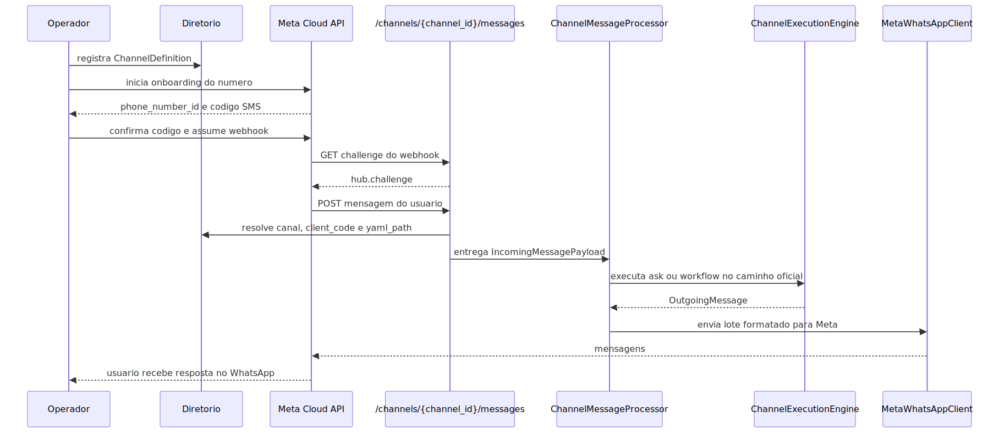

# Manual tecnico e guia de integracao por exemplo: comunicacao WhatsApp com agente, configuracao do canal e onboarding completo

## 1. Objetivo deste manual

Este documento mostra, com contratos reais do codigo, como colocar um numero WhatsApp para conversar com um agente na plataforma. O foco aqui e operacional e tecnico.

Voce vai ver:

1. quais endpoints participam do onboarding e da conversa;
2. como cadastrar o canal;
3. como provisionar ou importar o numero;
4. como a Meta valida o webhook;
5. como a mensagem entra no backend;
6. como o agente responde;
7. quais segredos e campos precisam existir;
8. como listar, editar e governar canais existentes;
9. como associar ou trocar o YAML que o canal executa;
10. quais falhas sao mais provaveis.

Este manual complementa o documento conceitual e nao substitui o manual antigo de provisionamento. O manual antigo continua util quando a pergunta e apenas ativacao do numero. Aqui o foco e a jornada ponta a ponta do canal conversacional.

## 2. Entry points reais

### 2.1. Cadastro e operacao do canal

- `POST /channels/register`
- `POST /channels/list`
- `GET /admin/channels`
- `PUT /admin/channels/{channel_id}`
- `GET /channels/{channel_id}/messages`
- `POST /channels/{channel_id}/messages`
- `POST /channels/{channel_id}/end-users/list`
- `POST /channels/{channel_id}/end-users/upsert`

### 2.2. Onboarding do numero WhatsApp

- `GET /api/whatsapp/provision/client-codes`
- `POST /api/whatsapp/provision/start`
- `POST /api/whatsapp/provision/verify`
- `POST /api/whatsapp/provision/import-existing`
- `POST /api/whatsapp/provision/remove-webhook`
- `POST /api/whatsapp/provision/takeover`

### 2.3. Permissoes relevantes

- `channels.register`
- `channels.message`
- `provision.whatsapp`

## 3. Fluxo tecnico de ponta a ponta



Esse diagrama mostra o ponto central do design: o runtime do canal nao depende da chamada de onboarding, mas depende do estado que o onboarding deixou no diretorio e na Meta.

## 4. Contrato do cadastro do canal

O canal precisa existir no diretorio antes da Meta validar o webhook ou antes do webhook POST conseguir auto-resolver o YAML.

Os campos estruturais confirmados em `ChannelDefinition` sao:

- `channel_id`
- `client_code`
- `channel_type`
- `yaml_path`
- `execution_mode`
- `queue_mode`
- `security.secret_token`
- `metadata`

### 4.1. Exemplo de cadastro minimo do canal

```json
POST /channels/register
{
  "yaml_config_path": "app/yaml/clientes/cliente_demo.yaml",
  "user_email": "implantacao@cliente.com",
  "channel": {
    "channel_id": "whatsapp_cliente_demo",
    "client_code": "cliente_demo",
    "channel_type": "whatsapp",
    "description": "Canal oficial de atendimento no WhatsApp",
    "yaml_path": "app/yaml/clientes/cliente_demo.yaml",
    "execution_mode": "workflow",
    "queue_mode": "inline",
    "security": {
      "secret_token": "segredo_do_webhook"
    },
    "metadata": {
      "default_user_email": "atendimento@cliente.com",
      "max_iterations": 6,
      "channel_end_user_policy": {
        "principal_mode": "persist_optional",
        "access_policy": "observe_only"
      }
    }
  }
}
```

### 4.2. O que esse cadastro controla na pratica

1. `channel_id` vira a chave do endpoint `/channels/{channel_id}/messages`.
2. `client_code` liga o canal ao tenant e aos segredos.
3. `yaml_path` aponta qual configuracao o canal vai carregar.
4. `execution_mode` escolhe se a mensagem vai para ask ou workflow no caminho oficial.
5. `secret_token` protege o POST do webhook com HMAC quando configurado.
6. `default_user_email` vira fallback de sessao para logs e orchestrators.

### 4.3. O que significa associar um YAML ao canal

No codigo atual existem duas referencias parecidas, mas com papeis diferentes.

1. O campo externo `yaml_config_path` ou `encrypted_data` do request administrativo serve para autorizar e contextualizar a operacao de cadastro, listagem ou manutencao do canal.
2. O campo interno `channel.yaml_path` dentro de `ChannelDefinition` e o que amarra o canal ao runtime que respondera a mensagem do usuario.

Na pratica, a associacao do agente ao canal nao e feita por um `agent_id` separado. O canal conhece apenas:

1. qual YAML deve carregar em runtime;
2. qual `execution_mode` deve usar;
3. quais metadados e segredos devem ser injetados nesse YAML.

Isso produz duas combinacoes operacionais oficiais.

1. `execution_mode=ask` + `yaml_path` com configuracao de pergunta e resposta.
2. `execution_mode=workflow` + `yaml_path` que o `WorkflowOrchestrator` consegue executar. Este e o caminho recomendado para novos canais com automacao agentic.

Em linguagem simples: o canal nao guarda o nome do agente. Ele guarda o caminho do YAML e o modo de execucao. O comportamento efetivo vem do conteudo desse YAML.

### 4.4. Como trocar o YAML de um canal depois do cadastro

O projeto nao exige recriar o canal para mudar o YAML associado. O catalogo administrativo exposto em `GET /admin/channels` permite consultar o canal existente e atualizar `yaml_path`, `description`, `default_user_email` e `metadata` com `PUT /admin/channels/{channel_id}`.

Exemplo de ajuste administrativo:

```json
PUT /admin/channels/whatsapp_cliente_demo
{
  "yaml_path": "app/yaml/clientes/cliente_demo_vendas.yaml",
  "default_user_email": "atendimento@cliente.com",
  "description": "Canal oficial de vendas no WhatsApp",
  "metadata": {
    "default_user_email": "atendimento@cliente.com",
    "channel_end_user_policy": {
      "principal_mode": "persist_optional",
      "access_policy": "allowlist"
    }
  }
}
```

O efeito pratico e imediato: o mesmo `channel_id` continua recebendo webhook no mesmo endpoint, mas passa a executar outro YAML nas proximas mensagens.

### 4.5. Quando o YAML vem do proprio diretorio e nao do canal

O caminho mais forte continua sendo manter `yaml_path` explicitamente salvo no canal. Mesmo assim, o codigo confirma dois cenarios de resolucao automatica pelo diretorio.

1. No webhook `POST /channels/{channel_id}/messages`, se a chamada nao trouxer configuracao externa, o router busca `ChannelDefinition` no diretorio e usa primeiro `definition.yaml_path`. Se esse campo estiver vazio, tenta recuperar um `yaml_path` ativo por `client_code` e `channel_type` em `tenant_channels`.
2. No registro do telefone WhatsApp durante onboarding, se o fluxo de telefone nao recebeu `yaml_path`, o repositorio tenta localizar um `yaml_path` ativo do tipo `whatsapp` para o `client_code` informado.

Isso nao e um fallback arbitrario de conveniencia. E uma resolucao governada do diretorio central. Se nada estiver configurado, o processo falha explicitamente.

### 4.6. Como governar quem pode falar com o canal

O canal nao guarda apenas telefone e YAML. Ele tambem pode manter principais persistidos do remetente externo, o que permite controle operacional por allowlist, blocklist ou observacao.

Os endpoints reais para isso sao:

- `POST /channels/{channel_id}/end-users/list`
- `POST /channels/{channel_id}/end-users/upsert`

Na pratica, isso serve para tres cenarios.

1. Consultar quais numeros externos ja falaram com o canal.
2. Mudar o status de um remetente para `allowed`, `blocked` ou `pending`.
3. Fazer o canal operar com politica mais restritiva sem alterar o webhook nem o YAML principal.

Essa governanca conversa com `metadata.channel_end_user_policy`, que define se o canal apenas observa, se exige allowlist ou se bloqueia remetentes explicitamente marcados.

## 5. Configuracao minima fora do canal

O codigo confirma dois conjuntos diferentes de configuracao: perfil Meta do tenant e credenciais de envio do canal.

### 5.1. Perfil Meta do tenant

Esse bloco e lido pelo `MultiTenantWhatsAppManager` no diretorio do cliente. Os campos confirmados sao:

- `meta_access_token`
- `meta_app_id`
- `meta_whatsapp_business_account_id`
- `meta_graph_api_version` opcional
- `meta_webhook_callback_url`
- `meta_webhook_verify_token`

Sem esse perfil, o onboarding nao consegue registrar o numero nem configurar o webhook.

### 5.2. Credenciais de envio do canal

No runtime de resposta, o `MetaWhatsAppClient` procura as chaves canonicas abaixo dentro de `security_keys` enriquecido pelo diretorio:

- `access_token`
- `phone_number_id`
- `api_version` opcional
- `base_url` opcional
- `timeout` opcional

Ele aceita esses valores na raiz de `security_keys` e tambem em escopos de canal como `active_channel` ou `channels[channel_id]`.

### 5.3. Exemplo de estrutura canonica de credenciais

```json
{
  "security_keys": {
    "channels": {
      "whatsapp_cliente_demo": {
        "access_token": "EAAG...",
        "phone_number_id": "109876543210",
        "api_version": "v20.0",
        "base_url": "https://graph.facebook.com",
        "timeout": 30
      }
    }
  }
}
```

Se `access_token` ou `phone_number_id` vierem como placeholder, o envio falha explicitamente.

## 6. Onboarding do numero: fluxo recomendado

### 6.1. Descobrir `client_code` autorizado

```http
GET /api/whatsapp/provision/client-codes
```

Esse endpoint existe para garantir que o operador so provisiona numeros dentro do tenant autenticado.

### 6.2. Iniciar provisionamento do numero

```json
POST /api/whatsapp/provision/start
{
  "phone_e164": "+5511988888777",
  "client_code": "cliente_demo",
  "channel_id": "whatsapp_cliente_demo"
}
```

Resposta esperada no caminho feliz:

```json
{
  "success": true,
  "phone_number_id": "109876543210",
  "message": "SMS enviado! Digite o codigo recebido no WhatsApp.",
  "client_code": "cliente_demo",
  "channel_id": "whatsapp_cliente_demo"
}
```

O efeito real dessa etapa e:

1. registrar o numero na Meta;
2. solicitar o codigo de verificacao;
3. gravar o telefone no diretorio com `status=pending_verification`.

### 6.3. Concluir verificacao e ativacao

```json
POST /api/whatsapp/provision/verify
{
  "phone_e164": "+5511988888777",
  "client_code": "cliente_demo",
  "codigo_sms": "123456",
  "channel_id": "whatsapp_cliente_demo",
  "phone_number_id": "109876543210"
}
```

O que a etapa faz na pratica:

1. confere se o numero existe localmente;
2. confirma se o `phone_number_id` bate com o salvo no diretorio;
3. valida o codigo na Meta;
4. ativa o numero;
5. configura o webhook usando `meta_webhook_callback_url` e `meta_webhook_verify_token` do tenant;
6. tenta garantir o template padrao `boas_vindas`;
7. atualiza o diretorio com `status`, `webhook_configured` e `template_created`.

### 6.4. Importar numero ja existente

Use esse fluxo quando o numero ja esta ativo na Meta e voce nao quer refazer registro e SMS.

```json
POST /api/whatsapp/provision/import-existing
{
  "phone_e164": "+5511988888777",
  "phone_number_id": "109876543210",
  "client_code": "cliente_demo",
  "channel_id": "whatsapp_cliente_demo",
  "assume_active": true
}
```

Essa etapa so registra o ativo no diretorio local. Ela nao assume o webhook sozinha.

### 6.5. Assumir o webhook do numero importado

```json
POST /api/whatsapp/provision/takeover
{
  "phone_e164": "+5511988888777",
  "client_code": "cliente_demo",
  "channel_id": "whatsapp_cliente_demo",
  "ensure_template": true
}
```

Use takeover depois da importacao quando o numero ja existe e voce precisa mover o trafego para este app.

## 7. Como a Meta valida o webhook

O endpoint de verificacao e:

```http
GET /channels/{channel_id}/messages?hub.mode=subscribe&hub.challenge=123&hub.verify_token=abc
```

O backend so aceita esse desafio quando:

1. o `channel_id` existe no diretorio;
2. o canal possui `client_code`;
3. o perfil do tenant possui `meta_webhook_verify_token`;
4. o token recebido bate com o esperado.

Se qualquer um desses pontos falhar, a verificacao nao passa. Isso e intencional. O sistema nao aceita fallback silencioso de token ou canal.

## 8. Como a mensagem entra no backend

O endpoint real de conversa e:

```http
POST /channels/{channel_id}/messages
X-Hub-Signature-256: sha256=...
```

O `ChannelMessageRequest` aceita dois formatos.

1. `payload` interno ja normalizado.
2. corpo bruto da Meta com `object=whatsapp_business_account`.

### 8.1. Exemplo reduzido de webhook bruto da Meta

```json
{
  "object": "whatsapp_business_account",
  "entry": [
    {
      "id": "waba-1",
      "changes": [
        {
          "value": {
            "messaging_product": "whatsapp",
            "metadata": {
              "display_phone_number": "5511999999999",
              "phone_number_id": "109876543210"
            },
            "contacts": [
              {
                "wa_id": "5511988887777",
                "profile": {
                  "name": "Cliente Demo"
                }
              }
            ],
            "messages": [
              {
                "from": "5511988887777",
                "id": "wamid.HBg...",
                "timestamp": "1710000000",
                "type": "text",
                "text": {
                  "body": "Quero falar com o agente"
                }
              }
            ]
          }
        }
      ]
    }
  ]
}
```

### 8.2. O que o router faz antes de executar

1. transforma o evento bruto em `IncomingMessagePayload`;
2. monta `correlation_id` enriquecido com canal, cliente e telefone quando possivel;
3. resolve `yaml_path` pelo diretorio se o webhook nao trouxe configuracao;
4. cria `yaml_config` com `user_session`;
5. valida HMAC pelo `secret_token` do canal, se configurado;
6. chama o processor.

### 8.3. Em que ordem o webhook decide qual YAML usar

Esse ponto costuma gerar confusao em implantacao. A ordem real confirmada no codigo e esta.

1. Se o request do canal trouxe `yaml_config_path` ou `encrypted_data`, essa configuracao entra primeiro.
2. Se o webhook bruto da Meta nao trouxe configuracao, o router carrega o canal do diretorio pelo `channel_id`.
3. O router usa `definition.yaml_path` quando ele existe no canal.
4. Se `definition.yaml_path` estiver vazio, tenta resolver um `yaml_path` ativo do diretorio por `client_code` e `channel_type`.
5. Se ainda assim nao houver YAML, a chamada falha com erro explicito.

Essa ordem importa porque explica por que o mesmo webhook continua funcionando depois de uma troca administrativa em `/admin/channels/{channel_id}`.

## 9. Como o canal escolhe o comportamento do agente

O `ChannelExecutionEngine` le `definition.execution_mode` e delega para tres caminhos.

### 9.1. `ask`

Usa `QuestionService`. Esse modo e o mais simples para FAQ ou respostas guiadas por base de conhecimento.

### 9.2. `agent` legado

Usa `AgentOrchestrator`. O texto do usuario vira `task` e a resposta final devolvida ao canal sai de `final_response`. Esse ramo continua existindo por compatibilidade, mas nao deve ser escolhido em novos cadastros de canal.

### 9.3. `workflow`

Usa `WorkflowOrchestrator`. Quando o workflow devolve `outgoing_message`, o canal consegue responder com texto, botoes e midia, nao apenas texto simples.

## 10. Como o agente responde no WhatsApp

O `WhatsAppResponder` prioriza o formato da resposta nesta ordem.

1. lista interativa quando existem botoes;
2. texto simples quando existe texto;
3. sequencia `whatsapp_sequence` quando o metadata do `OutgoingMessage` pede varios passos;
4. fallback de midia;
5. fallback textual minimo `Mensagem vazia` quando nada veio pronto.

### 10.1. Exemplo de resposta interativa

```json
{
  "text": "Escolha uma opcao",
  "buttons": [
    {"title": "Promocoes", "payload": "promo"},
    {"title": "Suporte", "payload": "suporte"}
  ]
}
```

No WhatsApp isso vira lista interativa com rows e payload curto.

### 10.2. Exemplo de resposta com sequencia e midia

```json
{
  "metadata": {
    "whatsapp_sequence": [
      {"type": "text", "text": "Primeiro"},
      {"type": "text_image", "text": "Veja", "media_index": 0},
      {"type": "video", "media_id": "video-789"}
    ]
  },
  "media": [
    {"type": "image", "media_id": "media-123"}
  ]
}
```

Essa resposta vira um lote ordenado de mensagens: texto, texto, imagem e video.

### 10.3. Exemplo de documento

```json
{
  "media": [
    {
      "type": "document",
      "url": "https://cdn.exemplo.com/manual.pdf",
      "caption": "Manual atualizado"
    }
  ]
}
```

O responder converte isso para `type=document` com link e caption.

## 11. O que o POST de webhook devolve

A resposta HTTP do endpoint do canal nao e a mesma mensagem mostrada ao usuario. Ela e um snapshot operacional com:

- `status`
- `queue_mode`
- `result`
- `pending_messages` quando aplicavel
- `delivery`

Na pratica, o campo `delivery` e o mais importante para suporte porque mostra se a entrega ao provedor foi `sent`, `skipped` ou `error`.

## 12. O que muda quando o canal esta em fila

O modelo do canal aceita `queue_mode` com `inline`, `redis` ou `rabbitmq`.

Para explicacao operacional simples:

1. `inline` e o caminho mais direto e facil de depurar;
2. fila externa existe para desacoplamento e carga maior;
3. o contrato do endpoint continua o mesmo, mas a resposta pode passar a refletir pendencia em vez de execucao imediata.

### 12.1. O que o catalogo de canais mostra na administracao

O endpoint `GET /admin/channels` devolve um catalogo administrativo mais rico do que `POST /channels/list`. Ele inclui, alem do resumo do canal:

1. `client_code`
2. `yaml_path`
3. `execution_mode`
4. `queue_mode`
5. `metadata`
6. `default_user_email`
7. `status`, `label`, `external_id`, `created_at` e `updated_at`

Em termos praticos, `POST /channels/list` e melhor para automacao leve do runtime. `GET /admin/channels` e o ponto mais util para auditoria, manutencao e revisao de qual YAML esta ligado a qual canal.

## 13. Caminho feliz de onboarding e conversa

1. Registrar o canal com `channel_type=whatsapp`, `client_code`, `yaml_path` e `execution_mode`.
2. Garantir que o profile do tenant tenha credenciais Meta e configuracao de webhook.
3. Garantir que `security_keys` do canal tenham `access_token` e `phone_number_id` reais.
4. Chamar `start` e guardar `phone_number_id`.
5. Chamar `verify` com o codigo SMS.
6. Confirmar que a Meta valida o GET do webhook.
7. Enviar uma mensagem de teste para o numero.
8. Verificar no retorno do POST se houve `delivery.status=sent`.

## 14. Principais erros confirmados no codigo

### 14.1. Re-onboarding indevido

Se `start` encontrar numero ja registrado com `phone_number_id`, a API devolve conflito.

### 14.2. Fluxo de verify fora de ordem

Se `verify` nao encontrar registro local do numero, o backend manda reiniciar por `start`.

### 14.3. `phone_number_id` divergente

Se o `phone_number_id` enviado em `verify` nao bater com o salvo no diretorio, a API devolve conflito.

### 14.4. Webhook sem canal ou sem token correto

O GET de verificacao falha se o canal nao existir, se nao tiver `client_code` ou se o token nao bater com o do tenant.

### 14.5. Segredos de envio ausentes

O runtime do canal falha explicitamente se `security_keys` nao trouxer credenciais validas do WhatsApp.

### 14.6. Assinatura HMAC ausente ou invalida

Se o canal tiver `secret_token`, o POST do webhook falha antes da execucao do agente.

### 14.7. Audio bruto sem texto util

O slice lido converte audio Meta em anexo, mas nao confirmou preenchimento de `audio_url` no payload do webhook bruto. Isso significa que audio puro pode nao virar texto executavel nesse caminho.

## 15. Observabilidade e diagnostico

### 15.1. O que seguir primeiro

1. `channel_id`
2. `client_code`
3. `yaml_path`
4. `wa_id`
5. `phone_number_id`
6. `message_id`
7. `correlation_id`

### 15.2. Como separar tipo de falha

1. Falha antes do processor: problema de webhook, canal, token ou HMAC.
2. Falha no processor: problema de politica de remetente, conteudo util ou resolucao de contexto.
3. Falha no engine: problema do caso de uso interno, YAML ou orchestrator.
4. Falha de delivery: problema de `access_token`, `phone_number_id` ou resposta HTTP da Meta.

### 15.3. Onde o sistema ajuda

O router loga inicio do endpoint, o processor loga mensagem recebida e processada, e o cliente de envio devolve snapshot de delivery. Isso permite saber se o problema esta antes ou depois da execucao do agente.

## 16. Como colocar para funcionar

### 16.1. Pre-requisitos confirmados no codigo

1. API com os routers de canais e provisionamento montados.
2. Diretorio multi-tenant disponivel.
3. Canal registrado com `client_code` e `yaml_path`.
4. Perfil do tenant com credenciais Meta e webhook configurados.
5. `security_keys` do canal com credenciais reais de envio.
6. Permissoes `channels.register`, `channels.message` e `provision.whatsapp` para as operacoes administrativas.

### 16.2. Ordem recomendada

1. Cadastrar o canal.
2. Configurar profile e secrets do tenant.
3. Fazer `start` e `verify`, ou `import-existing` e `takeover`.
4. Apontar a Meta para `GET/POST /channels/{channel_id}/messages`.
5. Enviar mensagem de teste.
6. Confirmar delivery `sent`.

### 16.3. Sequencia segura para associar um agente a um numero WhatsApp

Quando a pergunta pratica for “como ligo um YAML de agente ao canal WhatsApp?”, a ordem mais segura e esta.

1. Escolher o `execution_mode` correto do canal.
2. Definir `channel.yaml_path` para o YAML que representa o comportamento desejado.
3. Registrar ou atualizar o canal no diretorio.
4. Fazer onboarding ou takeover do numero usando o mesmo `channel_id`.
5. Testar uma mensagem real no numero.
6. Se o comportamento nao for o esperado, revisar primeiro `execution_mode` e `yaml_path`, nao o webhook.

## 17. Exemplos praticos guiados

### 17.1. Onboarding do zero

Objetivo: sair de numero nao registrado para numero ativo e respondendo.

Passos:

1. registrar o canal;
2. chamar `start`;
3. receber o codigo SMS;
4. chamar `verify`;
5. validar GET do webhook;
6. enviar uma mensagem real ao numero.

Resposta esperada: numero ativo, webhook assumido e primeira resposta entregue.

### 17.2. Migracao de numero ja existente

Objetivo: mover um numero que ja existe na Meta para este app sem re-onboarding.

Passos:

1. registrar o canal;
2. chamar `import-existing`;
3. chamar `remove-webhook` se houver callback antigo;
4. chamar `takeover`;
5. validar webhook e enviar mensagem de teste.

Resposta esperada: webhook deste app assumido e numero respondendo.

### 17.3. Workflow com botoes

Objetivo: usar WhatsApp para jornada guiada, nao apenas texto livre.

Passos:

1. cadastrar o canal como `workflow`;
2. garantir que o workflow devolve `outgoing_message.buttons`;
3. enviar mensagem inicial;
4. observar a lista interativa enviada ao usuario.

Resposta esperada: usuario recebe lista interativa compatibilizada pelo `WhatsAppResponder`.

## 18. Explicacao 101

Para o canal funcionar, voce precisa ligar tres pecas.

1. O numero precisa existir e estar ativo na Meta.
2. O Plataforma de Agentes de IA precisa conhecer esse canal e saber qual cliente ele representa.
3. O backend precisa saber qual comportamento executar quando uma mensagem chega.

Quando essas tres pecas estao ligadas, o WhatsApp vira so a porta de entrada e de saida. A inteligencia continua no runtime interno da plataforma.

## 19. Limites e pegadinhas

1. `POST /channels/{channel_id}/messages` nao exige `yaml_config_path` no webhook bruto porque ele auto-resolve o YAML pelo diretorio. Isso so funciona se o canal estiver corretamente cadastrado.
2. `verify` depende do mesmo `phone_number_id` salvo em `start`; trocar esse valor quebra a finalizacao.
3. `takeover` so funciona para numero que ja existe localmente no diretorio.
4. `delivery.status=sent` significa que o backend enviou para a Meta; nao substitui validacao de UX final com o numero real.
5. Audio bruto vindo da Meta ainda e uma zona de cautela no slice lido.
6. Trocar `yaml_path` no catalogo administrativo muda o comportamento do canal sem mudar o endpoint do webhook. Isso e poderoso, mas tambem exige governanca para nao apontar o numero para o YAML errado.

## 20. Troubleshooting

### 20.1. Sintoma: GET de verificacao retorna erro

Verifique:

1. o canal existe;
2. o canal tem `client_code`;
3. o tenant tem `meta_webhook_verify_token`;
4. o token enviado pela Meta bate com o esperado.

### 20.2. Sintoma: POST do webhook retorna 401

Verifique:

1. `secret_token` do canal;
2. `X-Hub-Signature-256` recebido;
3. se o corpo chegou exatamente como o assinado.

### 20.3. Sintoma: POST processa, mas nao entrega

Verifique:

1. `security_keys` enriquecido no canal;
2. `access_token` e `phone_number_id` reais;
3. detalhe HTTP devolvido pelo `MetaWhatsAppClient`.

### 20.4. Sintoma: o numero responde, mas com o runtime errado

Verifique:

1. `execution_mode` do canal;
2. `yaml_path` associado;
3. `default_user_email` e metadados de canal.

### 20.5. Sintoma: o canal responde, mas executa o agente errado depois de uma mudanca administrativa

Verifique:

1. `yaml_path` atual do canal no `GET /admin/channels`;
2. se houve `PUT /admin/channels/{channel_id}` recente;
3. se o diretorio possui outro `yaml_path` ativo para o mesmo `client_code` e `channel_type`;
4. se `execution_mode` continua coerente com o YAML agora apontado.

Na pratica, esse sintoma quase sempre e problema de amarracao entre canal e YAML, nao de onboarding Meta.

## 21. Exercicios guiados

### 21.1. Exercitar onboarding do zero

Objetivo: comprovar que voce entende a ordem correta.

Passos:

1. Escreva um payload de `register` para um canal `whatsapp` em modo `workflow`.
2. Escreva um payload de `start` usando o mesmo `channel_id`.
3. Liste quais campos precisam existir no profile do tenant para `verify` funcionar.

Resposta esperada: voce consegue ligar canal, numero e tenant sem misturar responsabilidades.

### 21.2. Exercitar diagnostico de falha de delivery

Objetivo: diferenciar erro de execucao de erro de envio.

Passos:

1. Imagine que o processor executou e gerou `OutgoingMessage`.
2. Liste quais credenciais ainda podem fazer o envio falhar.
3. Liste em qual camada isso aparece.

Resposta esperada: `access_token` e `phone_number_id` aparecem no envio, nao na execucao do agente.

## 22. Checklist de entendimento

- Entendi os endpoints reais de canal e onboarding.
- Entendi que o canal deve ser cadastrado antes da conversa.
- Entendi que o numero pode ser provisionado do zero ou importado.
- Entendi como a Meta valida o webhook.
- Entendi como o webhook bruto e normalizado.
- Entendi como `execution_mode` escolhe o comportamento do agente.
- Entendi como o `WhatsAppResponder` formata a resposta.
- Entendi quais segredos sustentam o envio.
- Entendi como diagnosticar falha antes da execucao e depois da execucao.

## 23. Evidencias no codigo

- `src/api/routers/channel_router.py`
  - Motivo da leitura: confirmar DTOs, GET de verificacao, POST de webhook e normalizacao Meta.
  - Simbolos relevantes: `ChannelRegisterRequest`, `ChannelMessageRequest`, `verify_webhook_subscription`, `_process_channel_message`, `submit_message`.
  - Comportamento confirmado: o canal aceita cadastro administrativo e webhook bruto da Meta.

- `src/api/routers/admin/users_router.py`
  - Motivo da leitura: confirmar catalogo e atualizacao administrativa dos canais.
  - Simbolos relevantes: `list_channels`, `update_channel`.
  - Comportamento confirmado: o operador pode listar canais e trocar `yaml_path`, `default_user_email`, `description` e `metadata` sem recriar o canal.

- `src/channel_layer/models.py`
  - Motivo da leitura: confirmar contrato de `ChannelDefinition` e `OutgoingMessage`.
  - Simbolos relevantes: `ChannelDefinition`, `ChannelExecutionMode`, `ChannelQueueMode`, `OutgoingMessage`.
  - Comportamento confirmado: o canal declara modo de execucao, fila, seguranca e metadados.

- `src/channel_layer/config_resolver.py`
  - Motivo da leitura: confirmar enrich de YAML com contexto do cliente.
  - Simbolo relevante: `ChannelRuntimeConfigResolver.load_channel_config`.
  - Comportamento confirmado: o runtime injeta `security_keys`, `client_context` e `user_session` pelo diretorio.

- `src/security/channel_repository.py`
  - Motivo da leitura: confirmar resolucao automatica de `yaml_path`, catalogo administrativo e registro do telefone WhatsApp no diretorio.
  - Simbolos relevantes: `resolve_channel_yaml_path`, `list_channels_catalog`, `update_channel_catalog`, `register_whatsapp_phone`.
  - Comportamento confirmado: o diretorio consegue localizar `yaml_path` por `client_code` e `channel_type`, alem de atualizar o vinculo do canal com o YAML.

- `src/channel_layer/execution_engine.py`
  - Motivo da leitura: confirmar escolha entre ask, agent e workflow.
  - Simbolos relevantes: `execute`, `_execute_ask`, `_execute_agent`, `_execute_workflow`.
  - Comportamento confirmado: o canal reutiliza os orchestrators e services existentes.

- `src/channel_layer/responders/whatsapp_responder.py`
  - Motivo da leitura: confirmar formato real das respostas no WhatsApp.
  - Simbolo relevante: `WhatsAppResponder._build_payload`.
  - Comportamento confirmado: listas interativas, sequencias e midia sao suportadas no payload final.

- `src/channel_layer/clients/meta_whatsapp_client.py`
  - Motivo da leitura: confirmar validacao e origem das credenciais de envio.
  - Simbolos relevantes: `build_from_channel`, `_resolve_whatsapp_config`, `_ensure_valid_credentials`.
  - Comportamento confirmado: o cliente usa chaves canonicas e falha fechado quando credenciais estao ausentes ou invalidas.

- `src/api/routers/whatsapp_provision_router.py`
  - Motivo da leitura: confirmar contratos e etapas de start, verify, import e takeover.
  - Simbolos relevantes: `ProvisionStartRequest`, `ProvisionVerifyRequest`, `ImportExistingRequest`, `TakeoverRequest`, `start_provisioning`, `verify_and_activate`, `import_existing_number`, `takeover_number`.
  - Comportamento confirmado: o onboarding e a migracao sao caminhos separados e complementares.

- `src/channel_layer/services/whatsapp_meta_onboarding.py`
  - Motivo da leitura: confirmar credenciais, webhook e operacoes Meta.
  - Simbolos relevantes: `MetaGraphCredentials`, `ClientPhoneProfile`, `get_credentials`, `get_webhook_config`, `start_provision`, `finalize_provision`.
  - Comportamento confirmado: profile do tenant sustenta o onboarding e a posse do webhook.
