# Manual técnico, executivo, comercial e estratégico: dyn_api

## 1. O que é dyn_api

dyn_api é o contrato da plataforma para transformar uma operação REST aprovada em uma tool executável no runtime agentic. Assim como dyn_sql, ele não aparece como uma tool concreta descoberta pelo builder. Ele se materializa quando recebe um identificador, como dyn_api<buscar_cliente>.

Em termos simples, dyn_api existe para expor integrações HTTP governadas sem exigir uma nova tool Python para cada endpoint.

## 2. Que problema ele resolve

Sem dyn_api, toda nova integração REST tende a cair em dois extremos ruins.

- criar código novo para cada endpoint, mesmo quando a diferença é só configuração;
- usar requests genéricas demais e empurrar detalhes perigosos para o prompt ou para YAML solto.

dyn_api cria um caminho intermediário: o endpoint vira uma capability publicada, com contrato estável e resolução controlada.

## 3. Visão conceitual

O conceito central é o mesmo de governança por capability. O agente não deveria precisar conhecer detalhes de endpoint, método, autenticação e binding de headers toda vez. Ele deveria invocar uma operação com significado de negócio e deixar o runtime resolver a implementação.

Isso transforma integração REST em ativo de plataforma, não em improviso de projeto.

## 4. Visão técnica

O comportamento confirmado no código segue esta precedência.

1. O runtime recebe dyn_api<endpoint_id>.
2. Procura endpoint_id primeiro em tools_config.api_dynamic.endpoints do YAML efetivo.
3. Se não encontrar, consulta integrations.api_operation_registry usando user_session.tenant_id.
4. Quando encontra no registro, mescla a operação resolvida de volta em tools_config.api_dynamic, incluindo authentications quando houver profile associado.
5. A factory cria a tool dinâmica e usa cache por chave lógica para evitar reconstrução repetida.

Mais uma vez, o desenho continua YAML-first, mas já aceita expansão por registro persistido administrável.

## 5. Guardrails confirmados no código

Quando dyn_api é resolvida por registro persistido, o runtime exige:

- user_session.tenant_id explícito;
- operação ativa;
- operação publicada para agentes;
- protocol_type igual a rest_json.

Esse último ponto é importante. O código deixa explícito que dyn_api por registro só aceita operações com protocol_type rest_json. Isso evita que qualquer integração registrada seja tratada como tool agentic sem contrato compatível.

## 6. Visão executiva

Para liderança, dyn_api reduz tempo de integração e padroniza governança. Em vez de espalhar conectores pequenos e frágeis por vários projetos, a plataforma consegue publicar operações reaproveitáveis e controladas.

O efeito prático é mais velocidade para onboarding e menos custo de manutenção dispersa.

## 7. Visão comercial

Comercialmente, dyn_api aumenta a capacidade de encaixar a plataforma em ecossistemas do cliente sem prometer desenvolvimento artesanal para cada endpoint. Ele sustenta uma narrativa forte: novas operações podem ser publicadas de forma governada e rapidamente reutilizadas por agentes.

Isso é especialmente útil em propostas de integração com ERP, CRM, backoffice, parceiros e APIs internas do cliente.

## 8. Visão estratégica

Estrategicamente, dyn_api amplia a superfície da plataforma sem inflar o catálogo builtin com milhares de tools fixas. Ele cria um mecanismo de expansão por tenant e por operação publicada, preservando coerência técnica com o runtime agentic.

Esse desenho fortalece multi-tenant, governança e evolução incremental.

## 9. Fluxo principal

O diagrama deixa claro que o runtime não improvisa endpoint. A operação precisa existir no YAML ou estar publicada em registro compatível.

## 10. O que acontece em caso de sucesso

No caminho feliz, dyn_api resolve o endpoint, monta o contrato efetivo de execução, injeta autenticação quando aplicável, constrói a tool parametrizada e a entrega ao agente pronta para uso.

Na prática, isso significa publicar uma nova integração REST sem obrigar a criação de uma builtin tool exclusiva para cada caso.

## 11. O que acontece em caso de erro

Os erros confirmados no código incluem:

- endpoint não encontrado no YAML nem em registro;
- ausência de user_session.tenant_id quando a busca precisa ir ao registro;
- operação inativa;
- operação não publicada para agentes;
- protocol_type diferente de rest_json;
- endpoint ausente depois da tentativa de resolução.

Essas falhas ajudam a diferenciar erro de catálogo, erro de publicação e erro de contrato.

## 12. Limites e pegadinhas

- dyn_api não substitui toda necessidade de builtin tool. Quando o domínio exige lógica rica de negócio, uma tool dedicada continua sendo a escolha correta.
- O builder reconhece a family, mas não gera uma lista materializada de dyn_api<...> porque os ids dependem de configuração e registro.
- O suporte por registro persistido está explicitamente restrito a rest_json no código lido.
- Uma operação registrada mas não publicada continua invisível para o agente, por desenho.

## 13. Quando usar dyn_api

Use dyn_api quando o problema principal for expor uma operação HTTP governada, especialmente em cenários como:

- integração com APIs internas do cliente;
- composição rápida de endpoints aprovados por tenant;
- expansão de capabilities sem criar nova builtin tool Python;
- conexão de agentes a serviços REST com contrato administrável.

## 14. Exemplo real: Rappi read-only no YAML de varejo

Uma V1 pequena da Rappi cabe bem em dyn_api quando o objetivo é só monitorar pedidos, sem abrir toolkit Python dedicada e sem inventar novo endpoint no backend do produto.

Em termos simples, isso significa: o YAML declara as credenciais em security_keys, a autenticação OAuth-like fica em tools_config.api_dynamic.authentications e os endpoints de consulta ficam em tools_config.api_dynamic.endpoints. O agente então usa dyn_api<...> como qualquer outra capability governada.

Exemplo prático já materializado no YAML de varejo:

- security_keys com RAPPI_CLIENT_ID e RAPPI_CLIENT_SECRET;
- authentications.rappi_auth apontando para o login integrations da Rappi;
- header x-authorization com Bearer {{token}};
- endpoints read-only para listar pedidos em READY, listar pedidos em SENT e consultar eventos de um pedido.

Por que o exemplo é read-only nesta V1?

- porque é o menor recorte seguro para provar o trilho oficial;
- porque evita alterar estado externo de pedido durante validação do exemplo;
- porque demonstra autenticação, resolução de token e uso de domains oficiais da Rappi sem inflar o escopo.

## 15. Evidências no código

- src/agentic_layer/tools/domain_tools/dynamic_api_tools/dynamic_api_factory.py
  - Motivo da leitura: confirmar a precedência YAML primeiro e registro depois, além da criação lazy da tool.
  - Comportamento confirmado: dyn_api procura endpoint_id no YAML, resolve no registro se necessário e usa cache dinâmico para construir a tool.
- src/agentic_layer/tools/domain_tools/dynamic_tool_registry_resolver.py
  - Motivo da leitura: confirmar os guardrails do modo por registro.
  - Comportamento confirmado: a operação precisa estar ativa e publicada, tenant_id é obrigatório e protocol_type deve ser rest_json.
- src/config/agentic_assembly/validators/tools_semantic_validator.py
  - Motivo da leitura: confirmar o status de contrato parametrizado.
  - Comportamento confirmado: dyn_api<...> é tratado como prefixo semântico reconhecido pelo validador.
- src/agentic_layer/tools/domain_tools/dynamic_api_tools/auth_manager.py
  - Motivo da leitura: confirmar se o fluxo já aceita login com auth_url, auth_body, token_key e cache de token para a Rappi.
  - Comportamento confirmado: os placeholders de security_keys são resolvidos no body de autenticação e o token é extraído da chave configurada.
- app/yaml/rag-config-linx-retail.yaml
  - Motivo da leitura: registrar um exemplo de varejo já alinhado ao runtime real.
  - Comportamento confirmado: o YAML agora demonstra a V1 read-only da Rappi sobre dyn_api, com segredos explícitos em security_keys e tools dyn_api<...> prontas para uso agentic.
