# Manual técnico, executivo, comercial e estratégico: tools de esportes

## 1. O que são as tools de esportes

As tools de esportes são o conjunto especializado do catálogo voltado a consultas de competição, partida, elenco, classificação e odds. No código lido, esse domínio já nasce multiprovedor. A plataforma não depende de uma única fonte. Ela oferece seis provedores confirmados, cada um com cinco tools concretas.

- Sportsradar
- Sportmonks
- API-Sports
- GoalServe
- Opta
- Enetpulse

Em termos práticos, isso faz diferença porque o mercado esportivo costuma variar muito em cobertura, nomenclatura e profundidade de dado. O projeto já foi desenhado levando essa realidade em conta.

## 2. Que problema elas resolvem

Sem esse pacote, qualquer solução esportiva teria de escolher um provedor cedo demais e absorver sozinha os riscos dessa decisão.

- cobertura desigual entre competições;
- diferenças de nomenclatura e payload;
- limitações de quota ou latência de um fornecedor;
- necessidade de buscar jogos, tabela, equipes e atletas em formatos diferentes.

Com a abordagem atual, a plataforma consegue tratar esporte como capacidade de negócio reutilizável, e não como uma única integração rígida.

## 3. Visão conceitual

O conceito central desta frente é redundância útil. A plataforma não replica seis vezes a mesma coisa por descuido. Ela mantém múltiplos provedores porque o problema esportivo é naturalmente multifonte.

Em linguagem simples, isso significa o seguinte.

- Se o caso é agenda e tabela, um provedor pode ser suficiente.
- Se o caso é enriquecer análise com odds, outro pode ser melhor.
- Se o caso exige compatibilidade com uma base já existente no cliente, a presença de mais de uma família reduz atrito de adoção.

## 4. Visão técnica

O código confirma 30 tools concretas nessa família, distribuídas assim.

| Provedor | Quantidade de tools | Cobertura confirmada |
| --- | ---: | --- |
| Sportsradar | 5 | resumo de evento, partidas, times, perfil de jogador, classificação |
| Sportmonks | 5 | partida por id, partidas por data, time, jogador, classificação |
| API-Sports | 5 | partida por id, partidas por data, time por nome, jogadores por time, classificação |
| GoalServe | 5 | partida por id, partidas por data, time por nome, jogadores por time, classificação |
| Opta | 5 | competições, fixtures, classificação, equipes, jogadores |
| Enetpulse | 5 | eventos, fixtures, odds, classificação, equipes |

A arquitetura técnica repete um padrão saudável.

- cada provedor usa @tool_factory;
- cada factory exige credencial própria em security_keys;
- cada family normaliza erro de autenticação, client error, server error e rate limit;
- o retorno é empacotado em formato mais previsível para o agente.

## 5. Visão executiva

Para gestão, o valor desta família está em reduzir dependência de fornecedor único e acelerar novos casos de uso em mídia, apostas, conteúdo esportivo, scouting, operação editorial e atendimento contextualizado.

A existência de várias families prontas diminui risco de projeto travado por cobertura insuficiente de um único provedor.

## 6. Visão comercial

Comercialmente, as tools de esportes ajudam a posicionar a plataforma para mercados que precisam de dados quentes, estruturados e rapidamente combináveis.

- mídia e conteúdo esportivo;
- operações de fantasy e estatística;
- briefing editorial e acompanhamento de rodada;
- experiências conversacionais baseadas em jogo, time e atleta.

A mensagem comercial mais forte aqui é especialização: o catálogo já traz vocabulário e conectores próprios do domínio.

## 7. Visão estratégica

Estrategicamente, esta família mostra que a plataforma consegue crescer por vertical de negócio sem perder governança do catálogo. O mesmo pipeline de discovery, persistência e injeção serve tanto para uma tool genérica de busca quanto para um pacote especializado de esportes.

Isso fortalece a tese de produto baseada em catálogo de capacidades por domínio.

## 8. Submódulos lógicos

### 8.1. Cobertura de competição e calendário

Problema resolvido: consultar agenda, fixtures, competições e visão macro do campeonato.

Ferramentas representativas:

- sportsradar_partidas_competicao
- sportmonks_partidas_por_data
- apisports_partidas_por_data
- goalserve_partidas_por_data
- opta_buscar_fixtures
- enetpulse_buscar_fixtures

### 8.2. Cobertura de classificação e ranking

Problema resolvido: acompanhar tabela e posição competitiva.

Ferramentas representativas:

- sportsradar_classificacao_competicao
- sportmonks_classificacao_temporada
- apisports_classificacao_liga
- goalserve_classificacao_liga
- opta_buscar_classificacao
- enetpulse_buscar_classificacao

### 8.3. Cobertura de equipe e elenco

Problema resolvido: detalhar times, jogadores e contexto de elenco.

Ferramentas representativas:

- sportsradar_times_competicao
- sportsradar_perfil_jogador
- sportmonks_time_por_id
- sportmonks_jogador_por_id
- apisports_times_por_nome
- apisports_jogadores_por_time
- goalserve_times_por_nome
- goalserve_jogadores_por_time
- opta_buscar_equipes
- opta_buscar_jogadores
- enetpulse_buscar_equipes

### 8.4. Cobertura de evento e odds

Problema resolvido: enxergar detalhe de jogo e sinais adicionais do mercado.

Ferramentas representativas:

- sportsradar_resumo_evento
- sportmonks_partida_por_id
- apisports_partida_por_id
- goalserve_partida_por_id
- enetpulse_buscar_eventos
- enetpulse_buscar_odds

## 9. Fluxo principal

O diagrama mostra a lógica correta: primeiro o agente identifica o tipo de informação esportiva necessário; depois escolhe a family adequada.

## 10. O que acontece em caso de erro

Os módulos lidos confirmam um padrão consistente.

- chave de API ausente gera erro explícito;
- autenticação inválida gera mensagem clara de auth failure;
- rate limit é distinguido como condição própria;
- erros 4xx e 5xx são registrados com contexto de recurso e correlation_id.

Na prática, isso ajuda a distinguir se o problema está na credencial, no provedor ou no uso da tool.

## 11. Limites e pegadinhas

- A existência de seis provedores não significa equivalência perfeita entre eles.
- A mesma pergunta esportiva pode ter melhor resposta em providers diferentes.
- Odds aparecem confirmadas apenas na trilha Enetpulse entre os módulos lidos aqui.
- O catálogo cobre bem consulta. Para ações operacionais fora do domínio de consulta esportiva, outras famílias da plataforma continuam sendo necessárias.

## 12. Evidências no código

- src/agentic_layer/tools/vendor_tools/sports_tools/sportsradar_tools.py
  - Motivo da leitura: confirmar a family Sportsradar.
  - Comportamento confirmado: cinco tools concretas para evento, competição, time, jogador e classificação.
- src/agentic_layer/tools/vendor_tools/sports_tools/sportmonks_tools.py
  - Motivo da leitura: confirmar a family Sportmonks.
  - Comportamento confirmado: cinco tools concretas focadas em partida, data, time, jogador e classificação.
- src/agentic_layer/tools/vendor_tools/sports_tools/apisports_tools.py
  - Motivo da leitura: confirmar a family API-Sports.
  - Comportamento confirmado: cinco tools concretas cobrindo partida, data, time, elenco e classificação.
- src/agentic_layer/tools/vendor_tools/sports_tools/goalserve_tools.py
  - Motivo da leitura: confirmar a family GoalServe.
  - Comportamento confirmado: cinco tools concretas com escopo semelhante ao de API-Sports.
- src/agentic_layer/tools/vendor_tools/sports_tools/opta_tools.py
  - Motivo da leitura: confirmar a family Opta.
  - Comportamento confirmado: cinco tools de busca por query para competições, fixtures, classificação, equipes e jogadores.
- src/agentic_layer/tools/vendor_tools/sports_tools/enetpulse_tools.py
  - Motivo da leitura: confirmar a family Enetpulse.
  - Comportamento confirmado: cinco tools de busca por query incluindo odds.
