# Manual técnico, executivo, comercial e estratégico: tools de social e mensageria

## 1. O que são as tools de social e mensageria

As tools desta família transformam a plataforma em operador de canais digitais. No código lido, esse domínio está concentrado em quatro frentes confirmadas.

- WhatsApp Cloud API para envio de texto e template.
- Instagram Graph para publicação, DM e insights.
- Chatwoot para operação de inbox e atendimento.
- Twitter/X para busca recente, menções, timeline e lookup de perfil.

Em termos simples, esta não é uma camada para falar de social. É uma camada para agir em canais e recuperar sinais operacionais desses canais.

## 2. Que problema elas resolvem

Sem essa família, qualquer jornada social precisaria combinar várias integrações ad hoc.

- uma integração para publicar;
- outra para mandar mensagens;
- outra para medir resultado;
- outra para atendimento;
- outra para escuta social.

O catálogo atual reduz esse atrito porque já oferece as peças mínimas para publicação, comunicação, monitoramento e operação de inbox.

## 3. Visão conceitual

O domínio social do projeto segue uma divisão funcional saudável.

- Publicação e mensageria direta: Instagram e WhatsApp.
- Atendimento operacional: Chatwoot.
- Escuta e pesquisa de buzz: Twitter/X.

Isso é importante porque evita confundir comunicação outbound com operação de atendimento e com inteligência de canal. Cada problema recebe a tool certa.

## 4. Visão técnica

O código confirma 17 tools concretas nessa frente.

| Frente | Tools confirmadas | Uso prático |
| --- | ---: | --- |
| WhatsApp Cloud | 2 | enviar texto e template |
| Instagram Graph | 3 | publicar mídia, enviar DM, buscar insights |
| Chatwoot | 8 | listar conversas, responder, atualizar, listar contatos, health check |
| Twitter/X | 4 | buscar buzz, menções, timeline e dados básicos de perfil |

O padrão técnico mais importante é a exigência de contexto operacional. Nas tools diretamente lidas de Instagram e WhatsApp, user_session.correlation_id é obrigatório. Isso garante rastreabilidade ponta a ponta. Os segredos ficam em security_keys e as opções variáveis de canal ficam em tool_config ou blocos equivalentes de configuração.

## 5. Visão executiva

Para liderança, essa família reduz fragmentação operacional. Ela aproxima marketing, atendimento e monitoramento em uma base única de capabilities, o que diminui dependência de consoles isolados e acelera jornadas assistidas por agente.

O ganho executivo é previsibilidade: o mesmo catálogo pode apoiar demonstração comercial, operação assistida e automação futura.

## 6. Visão comercial

Comercialmente, esta família é muito demonstrável. Ela permite mostrar cenários de alto apelo sem inventar narrativa.

- publicar uma campanha no Instagram;
- responder um lead em WhatsApp;
- acompanhar fila de atendimento no Chatwoot;
- buscar menções ou buzz no Twitter/X para orientar a ação seguinte.

Isso ajuda a vender a plataforma como operador omnicanal, e não só como chatbot.

## 7. Visão estratégica

Estrategicamente, a família social fortalece a plataforma em duas direções.

- direção externa, porque conecta o agente a canais de aquisição, atendimento e relacionamento;
- direção interna, porque prepara terreno para combinar esses canais com CRM, observabilidade, workflows e integrações governadas.

O catálogo atual já permite composições interessantes com HubSpot, RD Station, Gmail, Teams e tools web, mesmo quando o domínio principal continua sendo social.

## 8. Submódulos lógicos

### 8.1. WhatsApp

Problema resolvido: disparo de comunicação estruturada e transacional.

Valor entregue: conversa direta com cliente em um canal de alta adesão.

Ferramentas confirmadas:

- whatsapp_send_text_message
- whatsapp_send_template_message

### 8.2. Instagram

Problema resolvido: publicar, conversar e medir.

Valor entregue: une social publishing e resposta direta com leitura de métricas.

Ferramentas confirmadas:

- instagram_publish_media
- instagram_send_direct_message
- instagram_fetch_insights

### 8.3. Chatwoot

Problema resolvido: operar a fila de atendimento e o contexto da conversa.

Valor entregue: traz o inbox para dentro do catálogo agentic.

Ferramentas confirmadas:

- chatwoot_listar_conversas
- chatwoot_obter_conversa
- chatwoot_enviar_mensagem
- chatwoot_atualizar_conversa
- chatwoot_listar_contatos
- chatwoot_criar_contato
- chatwoot_listar_agentes
- chatwoot_health_check

### 8.4. Twitter/X

Problema resolvido: monitorar buzz, menções e contexto público.

Valor entregue: adiciona escuta social e pesquisa rápida ao agente.

Ferramentas confirmadas:

- twitter_search
- twitter_mentions_search
- twitter_user_timeline
- twitter_user_lookup

## 9. Pipeline principal

O valor do fluxo está em separar ação de publicação, ação de atendimento e ação de pesquisa. Misturar esses objetivos geralmente gera automações frágeis.

## 10. O que acontece em caso de sucesso

Quando a configuração está correta e o provedor aceita a chamada, a tool devolve um resultado serializado e próprio para consumo do agente. Em Instagram e WhatsApp, o retorno vem como JSON textual. Em Chatwoot e Twitter/X, o formato é voltado para os objetos úteis da operação.

Na prática, isso permite que o agente use o retorno imediatamente para decidir o próximo passo, sem ter de interpretar formatos muito diferentes entre provedores.

## 11. O que acontece em caso de erro

Os erros confirmados no código seguem um padrão consistente.

- segredo ausente gera falha explícita de validação;
- parâmetro obrigatório ausente gera ValueError;
- falhas do provider são registradas com contexto operacional e convertidas em mensagens compreensíveis;
- Chatwoot expõe um health check para distinguir canal não configurado de falha funcional.

O ganho prático é reduzir tempo perdido com erro silencioso ou token faltando sem contexto.

## 12. Limites e pegadinhas

- Esta família opera canais, mas não substitui toda a jornada comercial do cliente. CRM, automação e analytics podem exigir composição com outras tools.
- WhatsApp e Instagram são tools de runtime. Provisionamento de canal é outra preocupação e vive em slices separados da API.
- Chatwoot é inbox e operação de atendimento. Não é substituto direto de publicação social.
- Twitter/X ajuda em escuta e contexto público, não em entrega de mensagens privadas ao cliente.

## 13. Evidências no código

- src/agentic_layer/tools/vendor_tools/whatsapp_tools/whatsapp_toolkit.py
  - Motivo da leitura: confirmar a família WhatsApp e seus requisitos.
  - Comportamento confirmado: a factory cria duas tools, exige correlation_id, token e phone_number_id.
- src/agentic_layer/tools/vendor_tools/instagram_tools/instagram_toolkit.py
  - Motivo da leitura: confirmar a família Instagram.
  - Comportamento confirmado: a factory cria publicação, DM e insights com business_account_id obrigatório.
- src/agentic_layer/tools/vendor_tools/chatwoot_tools/chatwoot_toolkit.py
  - Motivo da leitura: confirmar a frente de inbox.
  - Comportamento confirmado: o toolkit expõe oito tools cobrindo fila, conversa, contato e health check.
- src/agentic_layer/tools/external_tools/twitter_search.py
  - Motivo da leitura: confirmar a frente Twitter/X.
  - Comportamento confirmado: a factory cria quatro tools voltadas a busca, menções, timeline e lookup.
