# Manual técnico, executivo, comercial e estratégico: dyn_sql

## 1. O que é dyn_sql

dyn_sql é o contrato da plataforma para transformar uma query aprovada em uma tool executável no runtime agentic. Ele não aparece no catálogo como uma tool concreta descoberta pelo builder, porque é uma família parametrizada. A tool só ganha forma real quando recebe um identificador, como dyn_sql<clientes_ativos>.

Em termos práticos, dyn_sql existe para publicar capacidade analítica ou operacional de leitura sem criar uma nova tool Python para cada consulta.

## 2. Que problema ele resolve

Sem dyn_sql, toda nova pergunta de negócio baseada em banco tenderia a cair em um dos dois extremos ruins.

- escrever código novo para cada query;
- deixar o agente ou a interface perto demais de SQL livre.

dyn_sql resolve esse problema criando um contrato governado: a query é previamente definida, validada, publicada e só então exposta como tool.

## 3. Visão conceitual

O conceito central é desacoplar intenção de negócio de implementação SQL concreta. O agente fala no nome de uma capacidade. O runtime decide qual query aprovada corresponde àquele identificador.

Isso importa porque a plataforma é YAML-first e agentic. Nessa arquitetura, o ideal não é espalhar SQL pelo prompt, e sim tratar consulta como ativo governado.

## 4. Visão técnica

O comportamento confirmado no código segue esta precedência.

1. O runtime recebe dyn_sql<query_id>.
2. Ele procura primeiro query_id em tools_config.sql_dynamic.queries do YAML efetivo.
3. Se não encontrar, tenta resolver query_id em integrations.sql_query_registry usando user_session.tenant_id.
4. Quando encontra no registro, injeta a query e a conexão resolvidas de volta em tools_config.sql_dynamic.
5. A factory cria a tool dinâmica e usa cache por chave lógica para evitar reconstrução desnecessária.

Esse fluxo mostra um ponto importante: dyn_sql continua YAML-first, mas já suporta expansão por registro persistido.

## 5. Guardrails confirmados no código

Quando dyn_sql é resolvida por registro persistido, o runtime exige:

- user_session.tenant_id explícito;
- query ativa;
- query publicada para agentes;
- conexão SQL ativa;
- conexão SQL marcada como read_only.

Esse último ponto é crucial. O código deixa explícito que dyn_sql por registro exige read_only=true na conexão. Isso é uma decisão de segurança operacional, não um detalhe cosmético.

## 6. Visão executiva

Para liderança, dyn_sql reduz custo de evolução analítica. Ele permite publicar novas consultas aprovadas sem transformar cada demanda em desenvolvimento de integração dedicado.

Além disso, reduz risco, porque não estimula SQL improvisado em interface, YAML de cliente ou prompt.

## 7. Visão comercial

Comercialmente, dyn_sql é uma peça forte porque encurta o caminho entre pergunta de negócio e capability vendável. Ele permite dizer, com base no código, que a plataforma consegue expor consultas aprovadas como ferramentas reutilizáveis sem pedir nova tool Python a cada caso.

Isso ajuda em demos de dashboard assistido, cockpit de operação, leitura de PDV, relatórios e consultas governadas por tenant.

## 8. Visão estratégica

Estrategicamente, dyn_sql é um pilar da plataforma. Ele aproxima catálogo de tools e governança de dados. Em vez de crescer apenas pela adição de conectores, o produto cresce também pela publicação controlada de capacidades analíticas.

Esse desenho melhora escalabilidade de produto e evita acoplamento excessivo entre domínio e código customizado.

## 9. Fluxo principal

O diagrama mostra o comportamento mais importante: a query não nasce livremente no agente. Ela precisa existir no YAML ou em registro persistido publicado.

## 10. O que acontece em caso de sucesso

No caminho feliz, dyn_sql resolve uma query conhecida, descobre a conexão associada, constrói a tool parametrizada, reaproveita o cache quando possível e entrega ao agente uma ferramenta concreta para aquela consulta.

Na prática, isso permite usar capacidades como clientes ativos, vendas por loja, radar de checkout ou outras consultas aprovadas sem materializar uma tool Python exclusiva para cada uma.

## 11. O que acontece em caso de erro

Os erros confirmados no código incluem:

- query não encontrada no YAML nem em registro;
- ausência de user_session.tenant_id quando a busca precisa ir ao registro;
- query inativa;
- query não publicada para agentes;
- conexão SQL inexistente, inativa ou não marcada como read_only;
- query sem connection definida.

Esses erros são importantes porque explicam por que dyn_sql falha fechado em vez de improvisar fallback perigoso.

## 12. Limites e pegadinhas

- dyn_sql não é uma query generator. Ele depende de query previamente definida.
- O builder descobre a family, mas não gera uma lista materializada de dyn_sql<...> porque os ids dependem de configuração e registro.
- A exigência de read_only confirmada no código vale para resolução por registro persistido. Não convém generalizar essa mesma regra sem confirmação para toda e qualquer variação local fora desse fluxo.
- Ter a sintaxe dyn_sql<...> no YAML não basta; a query correspondente precisa existir de fato.

## 13. Quando usar dyn_sql

Use dyn_sql quando o objetivo for expor dados de banco como capability governada, especialmente em cenários como:

- cockpit e dashboard assistido;
- leitura analítica de varejo;
- consultas operacionais aprovadas por tenant;
- AG-UI com capabilities fechadas;
- substituição de código repetitivo de query por contrato configurável.

## 14. Evidências no código

- src/agentic_layer/tools/domain_tools/dynamic_sql_tools/dynamic_sql_factory.py
  - Motivo da leitura: confirmar a precedência YAML primeiro e registro depois, além da criação lazy da tool.
  - Comportamento confirmado: dyn_sql procura query_id no YAML, resolve no registro se necessário e usa cache dinâmico para construir a tool.
- src/agentic_layer/tools/domain_tools/dynamic_tool_registry_resolver.py
  - Motivo da leitura: confirmar os guardrails do modo por registro.
  - Comportamento confirmado: a query precisa estar ativa e publicada, a conexão precisa estar ativa e read_only, e tenant_id é obrigatório.
- src/config/agentic_assembly/validators/tools_semantic_validator.py
  - Motivo da leitura: confirmar o status de contrato parametrizado.
  - Comportamento confirmado: dyn_sql<...> é tratado como prefixo semântico reconhecido pelo validador.
