# Manual técnico, executivo, comercial e estratégico: tools de varejo

## 1. O que são as tools de varejo

As tools de varejo são a camada do catálogo que conecta a plataforma a operações comerciais reais. No código lido, esse domínio não aparece como um único pacote homogêneo. Ele aparece como um conjunto de trilhas complementares.

- Trilhas de catálogo e marketplace para localizar produtos em hubs e plataformas externas.
- Trilhas de ecommerce para trabalhar produtos, pedidos, clientes e estoque.
- Trilhas de food delivery para capturar eventos, consultar pedidos, atualizar status e operar cardápio.
- Trilhas de descoberta e composição governada para PDV, checkout e analytics com dyn_sql.

Em linguagem simples, o domínio de varejo aqui não é um chat que responde perguntas sobre venda. É um conjunto de conectores e capacidades operacionais reutilizáveis para vender, consultar, monitorar e explicar a operação.

## 2. Que problema elas resolvem

Sem esse pacote, cada caso de varejo exigiria refazer uma ou mais destas tarefas.

- implementar autenticação e tratamento de erro para cada provedor;
- padronizar respostas de APIs muito diferentes entre si;
- criar um caminho novo para cada painel ou consulta operacional;
- expor SQL ou integrações de forma desgovernada no agente;
- repetir o mesmo esforço de integração em todo novo projeto.

O catálogo de varejo troca customização repetitiva por capacidade de plataforma.

## 3. Visão conceitual

O domínio de varejo no projeto segue uma ideia importante: separar canal operacional de mecanismo de governança.

Canal operacional é a tool concreta que fala com um provider, como Magalu Hub, iFood, Shopify ou VTEX.

Mecanismo de governança é a forma como a plataforma decide o que pode ser executado em analytics, descoberta de catálogo interno ou jornadas de PDV. É aí que entram dyn_sql, UCP discovery e o slice AG-UI de varejo já documentado em outras partes do repositório.

Essa separação evita misturar duas coisas muito diferentes.

- consumir API de negócio de terceiros;
- expor dado interno do cliente de forma segura e auditável.

## 4. Visão técnica

As famílias confirmadas no código são estas.

### 4.1. Marketplaces e hubs de catálogo

- magalu_hub_buscar_produtos
- amazon_sp_api_buscar_produtos
- pluggto_buscar_produtos
- uber_buscar_produtos

Essas tools validam sessão, exigem correlation_id, leem segredos de security_keys, montam cliente HTTP com tratamento de erro e devolvem listas normalizadas.

### 4.2. Suites de ecommerce

O toolkit ecommerce confirmado no código cobre Shopify, WooCommerce e VTEX, com operações como listar produtos, obter produto, listar pedidos, obter pedido, atualizar estoque, atualizar status e operar clientes.

Além de consultas, essa frente já cobre mutações em alguns provedores, o que muda o risco operacional e exige mais cuidado em seleção de tool por caso de uso.

### 4.3. Food delivery e operação omnichannel

O código confirma famílias específicas para:

- iFood em duas trilhas: toolkit operacional amplo e toolkit SDK focado em eventos;
- Goomer;
- Food99;
- Repediu;
- Linx Delivery Hub;
- Linx Neemo;
- Delivery Much;
- CRM Food;
- Cardápio Web;
- Keeta;
- Alloy;
- Zé Delivery;
- Shopify delivery.

Aqui o valor não é só consultar. Em vários provedores, o catálogo já permite atualizar disponibilidade, mudar status e operar etapas do pedido.

### 4.4. Descoberta e governo do varejo interno

- ucp_discovery_tool
- dyn_sql<query_id>

Essas duas entradas representam a fronteira entre integração pronta e leitura governada. UCP discovery ajuda na descoberta de capacidades do ecossistema UCP. dyn_sql viabiliza analytics e painéis com consultas aprovadas em vez de SQL improvisado.

## 5. Visão executiva

Para liderança, esse pacote reduz duas fontes clássicas de custo.

- custo de integração, porque muitos canais de varejo já entram prontos;
- custo de governança, porque analytics e consultas internas podem ser expostas via contratos aprovados, não via acesso solto a banco.

O efeito prático é acelerar time-to-value em clientes de varejo sem sacrificar controle operacional.

## 6. Visão comercial

Comercialmente, este é um dos conjuntos mais fortes da plataforma porque permite demonstrar casos concretos.

- localizar produto em hubs e marketplaces;
- inspecionar pedidos e eventos de delivery;
- verificar estoque e clientes em suites de ecommerce;
- acoplar consulta governada a cockpit ou assistente comercial.

Isso ajuda a vender a plataforma como operador digital de varejo, e não apenas como camada conversacional.

## 7. Visão estratégica

Estrategicamente, o catálogo de varejo fortalece o produto em quatro frentes.

- Reuso: o mesmo catálogo serve agentes, AG-UI, demos e integrações por tenant.
- Especialização: o projeto já tem musculatura em food delivery, ecommerce e varejo analítico.
- Governança: consultas internas podem migrar para dyn_sql em vez de proliferar código customizado.
- Evolução: novas plataformas de varejo entram pelo mesmo pipeline de @tool_factory, builder e catálogo builtin.

## 8. Submódulos lógicos do varejo

### 8.1. Busca de catálogo externo

Problema resolvido: encontrar produtos rapidamente em marketplaces e hubs.

Valor entregue: acelera atendimento, curadoria de catálogo e comparação comercial.

Risco principal: credencial inválida ou limite de API. O código já trata cenários de autenticação e rate limit com mensagens mais amigáveis.

### 8.2. Operação de ecommerce

Problema resolvido: expor ações de produto, pedido, cliente e estoque sem criar uma integração nova por loja.

Valor entregue: transforma o agente em operador de backoffice digital.

Risco principal: mutações em pedidos, produtos ou estoque exigem escopo mais rigoroso do que simples consulta.

### 8.3. Operação de food delivery

Problema resolvido: lidar com a fragmentação entre canais, cardápios, eventos e pedidos.

Valor entregue: centraliza operações antes espalhadas por vários painéis.

Risco principal: mistura de consulta e ação operacional. Por isso a seleção de tool deve ser intencional e não genérica.

### 8.4. Analytics governada

Problema resolvido: mostrar dado interno do cliente com governança.

Valor entregue: painéis, radar de checkout, catálogo e resumo executivo sem expor SQL livre.

Risco principal: tentar usar uma tool de integração onde o caso exige dyn_sql ou outra capacidade governada.

## 9. Fluxo principal de uso

O ponto importante do fluxo é que o projeto não trata todo problema de varejo do mesmo jeito. A solução muda conforme o dado é externo, operacional ou governado.

## 10. Como escolher a tool de varejo certa

- Se a necessidade é encontrar produto em hub ou marketplace, procure primeiro Magalu Hub, Amazon SP-API, Plugg.to ou Uber.
- Se a necessidade é operar catálogo, pedido, cliente ou estoque de loja virtual, procure Shopify, WooCommerce ou VTEX.
- Se a necessidade é lidar com pedidos e cardápios de delivery, procure a família do canal específico.
- Se a necessidade é responder pergunta analítica ou abastecer cockpit interno, avalie dyn_sql em vez de uma tool de provider.

## 11. O que pode dar errado

- segredo ausente em security_keys;
- endpoint ou base_url obrigatória ausente em tool_config do provider;
- rate limit do provedor externo;
- uso de tool mutável em um fluxo que precisava ser apenas de consulta;
- tentativa de resolver analytics interna com canal externo, ou o contrário.

## 12. Limites e pegadinhas

- Nem todo problema de varejo deve virar integração nova. Muitas jornadas já cabem nas famílias existentes.
- Nem toda tool de varejo é somente leitura. Ecommerce e food delivery incluem ações operacionais.
- O catálogo de varejo não substitui governança de SQL. Para analytics interna, dyn_sql continua sendo a peça correta quando o dado é do cliente.
- UCP discovery não é a mesma coisa que checkout ou fallback de UCP. É uma tool de descoberta, não o runtime completo do slice UCP.

## 13. Evidências no código

- src/agentic_layer/tools/vendor_tools/ecommerce_tools/magalu_hub_tools.py
  - Motivo da leitura: confirmar tool concreta de catálogo de marketplace.
  - Comportamento confirmado: magalu_hub_buscar_produtos é criada por @tool_factory e devolve lista normalizada.
- src/agentic_layer/tools/vendor_tools/ecommerce_tools/pluggto_tools.py
  - Motivo da leitura: confirmar a trilha Plugg.to.
  - Comportamento confirmado: pluggto_buscar_produtos nasce via factory e depende de PLUGGTO_API_KEY.
- src/agentic_layer/tools/vendor_tools/ecommerce_tools/amazon_sp_api_tools.py
  - Motivo da leitura: confirmar a trilha Amazon SP-API.
  - Comportamento confirmado: amazon_sp_api_buscar_produtos é exposta como tool de busca.
- src/agentic_layer/tools/vendor_tools/ecommerce_tools/ecommerce_toolkit.py
  - Motivo da leitura: confirmar a frente ampla de ecommerce.
  - Comportamento confirmado: o toolkit cobre Shopify, WooCommerce e VTEX com catálogo, pedidos, clientes e estoque.
- src/agentic_layer/tools/domain_tools/food_delivery_tools e src/agentic_layer/tools/vendor_tools/ifood_tools
  - Motivo da leitura: confirmar a frente food delivery.
  - Comportamento confirmado: há múltiplas famílias específicas por canal, incluindo duas trilhas de iFood.
- src/agentic_layer/tools/vendor_tools/ucp_tools/ucp_discovery_tool.py
  - Motivo da leitura: confirmar o elo com capacidades governadas de varejo.
  - Comportamento confirmado: ucp_discovery_tool é uma builtin tool própria do domínio.
