# Guia 101 — Como o sistema responde uma pergunta técnica (RAG for dummies)

> **Para quem é este guia**: consultor júnior, analista de produto, suporte técnico, qualquer pessoa que precisa entender o que acontece desde "o usuário digitou uma pergunta" até "a resposta apareceu na tela" — sem precisar saber programar.

---

## O problema que o sistema resolve

Imagine que você tem centenas de documentos técnicos salvos. Um usuário digita:

> "Qual é a capacidade máxima de carga por eixo conforme a tabela 3 da norma vigente?"

O sistema precisa encontrar, entre todos esses documentos, exatamente o trecho que responde isso — e ainda gerar uma resposta em linguagem natural. Esse processo se chama **RAG** (Retrieval-Augmented Generation, ou "Geração Aumentada por Recuperação").

A dificuldade real é que duas pessoas podem perguntar a mesma coisa com palavras completamente diferentes:

- "carga por eixo" e "peso por eixo" significam a mesma coisa, mas têm palavras diferentes.
- "tabela 3 da norma" precisa ser encontrado exatamente como está escrito — o sistema não pode "adivinhar" o número da tabela.

Por isso o sistema usa duas estratégias de busca ao mesmo tempo e combina os resultados. Isso é chamado de **busca híbrida**.

---

## O passo a passo completo: da pergunta até a resposta



---

## Fase 1 — Preparação da pergunta (reescrita)

**O que entra**: a pergunta bruta do usuário, exatamente como ele digitou.

**O que acontece**: o sistema pode, opcionalmente, pedir ao LLM para reescrever a pergunta de forma mais clara antes de buscar. Isso se chama *query rewrite*. O sistema só aplica a reescrita se ela for parecida o suficiente com a original (há um limiar de similaridade). Siglas, números e códigos são preservados por política do prompt.

**Analogia**: é como um recepcionista que, antes de encaminhar um pedido, reformula "quero saber sobre aquela norma do peso dos caminhões" para "qual é o limite de carga por eixo para veículos pesados segundo a legislação vigente?".

**O que sai**: a pergunta original ou a pergunta reescrita (dependendo da configuração).

**Configuração relevante**: chave `qa_system.query_rewrite.enabled`. Se desligada, a pergunta segue intacta.

---

## Fase 2 — Análise da pergunta

**O que entra**: a pergunta (original ou reescrita).

**O que acontece**: o sistema analisa a pergunta para entender do que ela se trata. Ele extrai:
- **Tipo de pergunta**: factual, conceitual, comparativa, procedimental, temporal.
- **Tipo de dado esperado**: texto narrativo, dado estruturado, dados em tabela.
- **Domínio**: engenharia, jurídico, financeiro, ou outro detectado automaticamente.
- **Palavras-chave e entidades**: termos que precisam ser encontrados com precisão.
- **Complexidade**: simples, moderada ou complexa.

**Analogia**: é como um bibliotecário experiente que, ao ouvir a pergunta, já sabe se ela precisa de um livro de regulamento (busca por número de norma), de uma explicação geral (busca semântica) ou de uma consulta em base de dados (busca estruturada).

**O que sai**: um perfil completo da pergunta chamado `QueryFeatures`, que guia todas as decisões seguintes.

---

## Fase 3 — Roteamento (qual estratégia de busca usar?)

**O que entra**: o perfil da pergunta (`QueryFeatures`).

**O que acontece**: o sistema decide qual caminho de busca usar. As opções principais são:

- **Busca híbrida** (denso + esparso): para perguntas técnicas com códigos, números ou termos exatos. É o caminho mais completo.
- **Busca semântica pura** (só denso): para perguntas conceituais ou abertas.
- **Multi-query**: quando a pergunta pode ser abordada por múltiplos ângulos, o sistema gera variações da pergunta e busca por todas elas em paralelo.
- **Busca estruturada** (JSON/Excel): quando a pergunta parece consulta tabular.

**Regra importante confirmada no código**: se a análise inicial sugerir busca semântica pura, mas a pergunta tiver códigos exatos ou termos técnicos detectados, o roteador sobrescreve a decisão para busca híbrida. Isso protege buscas técnicas contra perda de precisão.

**Configuração relevante**: chaves em `rag_system.retriever.hybrid.adaptive_router`. É possível configurar estratégias explícitas ou deixar a lógica padrão agir.

---

## Fase 4 — Embedding da pergunta (o que é um vetor semântico?)

**O que é um embedding**: imagine que cada frase tem uma "posição" num espaço com 1536 dimensões (como coordenadas, mas em muitas mais dimensões do que conseguimos visualizar). Frases com significado parecido ficam próximas nesse espaço. Frases com significado diferente ficam longe.

Para calcular essa posição, o sistema usa um modelo de embedding (como `text-embedding-3-large` da OpenAI). O modelo transforma a pergunta num vetor de 1536 números. Esse vetor representa o *significado* da pergunta.

**Analogia**: é como a latitude e longitude de uma cidade — dois locais próximos têm coordenadas próximas. Dois conceitos parecidos têm vetores próximos.

**O que entra**: o texto da pergunta.

**O que sai**: um vetor denso — uma lista de ~1536 números que representa o significado da pergunta.

---

## Fase 5 — Representação sparse provider-native (o que é BM25?)

Esta fase só roda quando a busca híbrida foi escolhida no roteamento.

**O que é BM25**: BM25 é um algoritmo clássico de busca por palavras. Ele calcula, para cada documento, uma pontuação baseada em:
- Com que frequência a palavra aparece no documento.
- Quão rara é essa palavra no corpus todo (palavras raras que aparecem são mais informativas do que palavras comuns).

Isso é diferente do embedding semântico: o BM25 não entende significado, mas é preciso para encontrar termos literais.

**Como a representação é gerada**: a aplicação envia o texto ao Qdrant usando o modelo server-side `qdrant/bm25` com idioma português. O provider produz a representação sparse tanto na ingestão quanto na consulta. Não existe vocabulário, corpus ou índice lexical paralelo mantido em PostgreSQL, Redis ou memória da aplicação.

**Analogia**: o vetor denso é como um mapa de relevo — mostra o contorno geral do terreno. O vetor esparso é como uma lista de coordenadas GPS de pontos específicos — muito preciso para localização exata, mas sem informação sobre o entorno.

**O que sai**: uma consulta sparse criada pelo mesmo modelo usado na ingestão e pronta para o prefetch híbrido do Qdrant.

---

## Fase 6 — Busca híbrida no Qdrant (hybrid search nativo)

Este é o coração do sistema. Aqui o Qdrant recebe os dois vetores da pergunta e faz tudo internamente.

**O que o Qdrant faz com dois vetores**:

1. Faz uma busca densa: compara o vetor semântico da pergunta com os vetores densos de todos os chunks indexados. Retorna os mais parecidos em significado.
2. Faz uma busca esparsa: compara o vetor BM25 da pergunta com os vetores esparsos de todos os chunks. Retorna os que têm mais palavras em comum.
3. Aplica **RRF** (Reciprocal Rank Fusion, ou Fusão por Rank Recíproco) para combinar os dois rankings num único ranking unificado.

**O que é RRF**: imagine que você tem duas listas de candidatos — uma lista por competência técnica e outra por comunicação. O RRF não soma as notas diretamente (isso daria vantagem para quem tem notas altas numa só dimensão). Em vez disso, ele usa a posição no ranking: quem está em primeiro em ambas as listas sobe muito; quem está em décimo em ambas fica para trás. Candidatos que aparecem bem nas duas listas ao mesmo tempo são os melhores.

**Analogia do chef de cozinha**: é como buscar uma receita que seja ao mesmo tempo a mais bem avaliada pelos críticos (semântica) e a que usa exatamente os ingredientes que você tem em casa (termos exatos). O resultado cobre os dois critérios.

**O RRF é executado pelo servidor do Qdrant**, não pelo código Python. O código só monta e envia a query com as instruções de fusão. Isso significa que a fusão é rápida e não consome recursos do worker.

**Falha fechada confirmada no código**: se a coleção não comprovar o vetor sparse esperado, a busca híbrida encerra com erro estruturado. Ela não degrada silenciosamente para dense-only, porque isso esconderia uma coleção incompatível e mudaria a semântica da consulta.

**O que sai**: uma lista de chunks ranqueados pelo Qdrant, com scores combinados.

---

## Fase 7 — Seleção pelo provider

A parte lexical não possui retriever nem chave própria. O runtime seleciona a busca híbrida nativa pela capacidade de `vector_store.type`: Qdrant combina dense e sparse com RRF; Azure combina texto e vetor no próprio serviço. Providers sem essa capacidade seguem pela busca vetorial, sem criar FTS PostgreSQL paralelo.

---

## Fase 8 — Cache semântico (opcional)

Antes de disparar a busca no Qdrant, o sistema verifica se já existe uma resposta cacheada para uma pergunta semanticamente equivalente (ou seja, uma pergunta parecida em significado, não necessariamente idêntica em palavras). Se existir e estiver dentro do TTL configurado, devolve o cache diretamente, sem chamar Qdrant nem LLM.

**Configuração relevante**: `rag_system.retriever.caching.semantic_cache_enabled`. Backends disponíveis: Redis (redisearch), Qdrant, Azure Search, ou desabilitado.

---

## Fase 9 — Filtro de segurança (ACL)

**O que é ACL**: Access Control List — lista de controle de acesso. Após recuperar os documentos, o sistema filtra quais deles o usuário atual tem permissão de ver. Documentos de outros tenants, projetos restritos ou conteúdo classificado são removidos nesta fase.

**Onde acontece**: depois do retrieval, antes de entregar contexto ao LLM. Isso garante que o modelo nunca receba conteúdo não autorizado.

---

## Fase 10 — Montagem do contexto

**O que acontece**: o sistema pega os chunks que passaram pelo filtro de ACL e monta um "contexto" — um bloco de texto contendo os trechos mais relevantes encontrados. Este contexto é o que vai para o prompt do LLM.

A montagem inclui:
- Histórico recente de conversa (quando há sessão).
- Memória do usuário (se configurado).
- Os trechos dos documentos recuperados.

**Analogia**: é como preparar um briefing para um especialista antes de ele responder uma pergunta. Em vez de dar o acervo inteiro para ele ler, você seleciona os 5 trechos mais relevantes.

---

## Fase 11 — O LLM gera a resposta

**O que entra**: o prompt com a pergunta do usuário + os trechos de contexto.

**O que acontece**: o LLM (por exemplo, GPT-4 ou Claude) lê o contexto fornecido e gera uma resposta em linguagem natural, citando as fontes quando possível.

**Ponto importante**: o LLM não "sabe" a resposta de memória. Ele usa exclusivamente os trechos que foram fornecidos como contexto. Se o retrieval não encontrou o trecho certo, a resposta será ruim ou incompleta — não porque o LLM errou, mas porque o contexto errado foi dado a ele. Por isso a qualidade da busca (fases 4 a 7) é tão importante.

**O que sai**: a resposta final em texto, com referências às fontes (nome do documento, página, trecho) para que o usuário possa verificar.

---

## Fase extra — Multi-query (quando ativado)

Se o roteador decidiu que a pergunta pode ser abordada por múltiplos ângulos, o `MultiQueryRetriever` entra em ação.

**O que faz**: usa o LLM para gerar variações da pergunta original — formulações diferentes que podem encontrar informações complementares. Por exemplo, "carga por eixo" pode gerar variações como "peso máximo por eixo", "limite de peso por eixo", "capacidade de carga axial".

**Por que isso ajuda**: documentos técnicos usam nomenclaturas diferentes para o mesmo conceito. Um documento diz "carga por eixo", outro diz "peso axial máximo". Buscar por múltiplas variações aumenta a chance de encontrar todos os documentos relevantes.

**Como funciona**: as buscas pelas variações rodam em paralelo. Os resultados são mesclados e deduplicados antes de seguir para o filtro de ACL.

**Configuração relevante**: `intelligent_pipeline.multi_query`. Esta fase só roda quando o roteador decide que é necessário — não roda em toda pergunta.

---

## Rerank: existe no sistema?

O sistema tem suporte a re-ranqueamento, mas de forma condicional:

**BM25 provider-native:** não existe re-rank lexical em memória nem corpus textual carregado pela aplicação. No Qdrant, documento e consulta usam o modelo `qdrant/bm25` e a fusão RRF do serviço. No Azure Search, o índice precisa declarar `BM25SimilarityAlgorithm`; similarity Classic ou desconhecida falha fechada e exige correção controlada do índice.

**Rerank neural (cross-encoder)**: não confirmado como etapa explícita no caminho online principal dos arquivos lidos.

---

## Resumo visual do fluxo

```
Pergunta do usuário
       ↓
[Reescrita opcional pelo LLM — preserve codes/siglas]
       ↓
[Análise: tipo, domínio, complexidade, palavras-chave]
       ↓
[Roteamento: híbrido / semântico / multi-query / estruturado]
       ↓
    ┌──────────────────────────┐
    │  Embedding da pergunta   │ → Vetor DENSO (1536 números, semântica)
    │  Consulta sparse nativa  │ → Modelo BM25 executado pelo provider
    └──────────────────────────┘
       ↓
[Qdrant: hybrid search nativo]
  → Prefetch denso: top-K por semântica
  → Prefetch esparso: top-K por palavras exatas
  → RRF server-side: combina os dois rankings
  → [Se sparse estiver ausente → falha fechada]
       ↓
[ACL: remove documentos não autorizados]
       ↓
[Montagem do contexto: trechos selecionados]
       ↓
[LLM: gera resposta em linguagem natural com base no contexto]
       ↓
Resposta com fontes citadas
```

---

## Erros comuns e o que causam

**"A resposta não encontrou o documento que eu sei que existe"**
Causa mais provável: o chunk relevante ficou com score baixo na busca. Pode ser que a pergunta tenha palavras muito diferentes das do documento ou que a coleção não tenha sido ingerida com a configuração híbrida provider-native atual. Solução: verificar a ingestão, o tamanho dos chunks e os eventos de criação/consulta sparse do provider.

**"A resposta inventou informação"**
Causa: o retrieval não encontrou o trecho correto, mas o LLM tentou responder mesmo assim com base no que "sabe". O LLM não deve inventar — mas se o contexto fornecido for inadequado, o modelo pode preencher lacunas com conhecimento geral impreciso. Solução: melhorar a qualidade da busca; verificar se o threshold de score está calibrado corretamente.

**"A busca está lenta"**
Causas possíveis: multi-query ativo (gera múltiplas buscas em paralelo), reescrita de query (chama o LLM antes de buscar), latência do embedding ou latência do provider de vector store.

**"A resposta cita documentos que o usuário não deveria ver"**
Causa: filtro ACL mal configurado ou bug na implementação de ACL. O sistema filtra após o retrieval — se o filtro não está funcionando, documentos não autorizados chegam ao LLM.

---

## Glossário

| Termo | O que significa |
|---|---|
| **RAG** | Retrieval-Augmented Generation: gerar resposta com base em documentos recuperados, não só com a memória do LLM. |
| **Vetor denso** | Lista de ~1536 números que representa o *significado* de um texto. Calculado por um modelo de embedding. |
| **Vetor esparso** | Lista com quase tudo em zero, com valores só nas posições das palavras que aparecem no texto. Representa palavras literais. |
| **Embedding** | Processo de converter texto em vetor denso. O resultado captura o significado semântico. |
| **BM25** | Algoritmo de pontuação que mede relevância por frequência de palavras e raridade no corpus. Produz vetores esparsos. |
| **IDF** | Inverse Document Frequency: palavras raras que aparecem em poucos documentos têm mais peso. Faz parte do BM25. |
| **Hybrid search** | Busca que usa vetor denso e vetor esparso ao mesmo tempo, combinando os resultados. |
| **RRF** | Reciprocal Rank Fusion: algoritmo que combina dois rankings usando a posição (não a nota) de cada item. |
| **Falha fechada** | Comportamento de encerrar a busca híbrida quando a capacidade sparse obrigatória não está disponível, sem esconder o defeito com dense-only. |
| **Rerank** | Reordenar os documentos já recuperados usando um modelo específico, quando o fluxo o habilita. |
| **Multi-query** | Gerar variações da pergunta original e buscar por todas elas em paralelo para encontrar mais documentos relevantes. |
| **ACL** | Access Control List: controle de quais documentos cada usuário pode ver. Aplicado após o retrieval e antes do LLM. |
| **Context builder** | Parte do sistema que monta o "briefing" — os trechos selecionados que serão enviados ao LLM como contexto. |
| **LLM** | Large Language Model: modelo de linguagem (ex.: GPT-4, Claude) que gera a resposta final com base no contexto. |
| **Cache semântico** | Guarda respostas de perguntas anteriores. Se chegar uma pergunta semanticamente equivalente, devolve o cache sem chamar Qdrant nem LLM. |

---

## Checklist de entendimento

Ao final da leitura, você deve conseguir responder:

- [ ] Por que o sistema usa dois tipos de vetor (denso e esparso) em vez de um só?
- [ ] Quem gera a representação BM25: a aplicação ou o provider?
- [ ] O que é RRF e quem o executa (código Python ou Qdrant)?
- [ ] O que acontece se a coleção não tiver o vetor sparse obrigatório?
- [ ] Por que a qualidade do retrieval é mais importante do que a qualidade do LLM para uma boa resposta?
- [ ] Em qual fase o sistema filtra documentos que o usuário não pode ver?
- [ ] Por que a busca híbrida falha fechada em vez de degradar para dense-only?
- [ ] Multi-query e rerank são usados em toda pergunta ou são condicionais?

---

## Evidências no código

- `src/qa_layer/rag_engine/intelligent_orchestrator.py` — Fluxo principal: `intelligent_retrieve`, análise, roteamento, retrieval, ACL, montagem do contexto, geração.
- `src/qa_layer/rag_engine/retrieval_engine.py` — Estratégias de retrieval: `execute_hybrid_processor`, `_execute_native_hybrid_search` e `run_retriever_with_trace`.
- `src/ingestion_layer/vector_stores/qdrant_client.py` — Documento e consulta com `qdrant/bm25`, prefetch dense+sparse e `models.FusionQuery(fusion=models.Fusion.RRF)`; falha fechada sem sparse.
- `src/ingestion_layer/vector_stores/azure_search_client.py` — Índice com `BM25SimilarityAlgorithm` e consulta híbrida texto+vetor.
- `src/qa_layer/rag_engine/multi_query_retriever.py` — Expansão de queries: `MultiQueryRetriever`.
- `src/qa_layer/rag_engine/generation_engine.py` — Geração final: `GenerationEngine.generate_intelligent_answer`, monta contexto e chama LLM.
