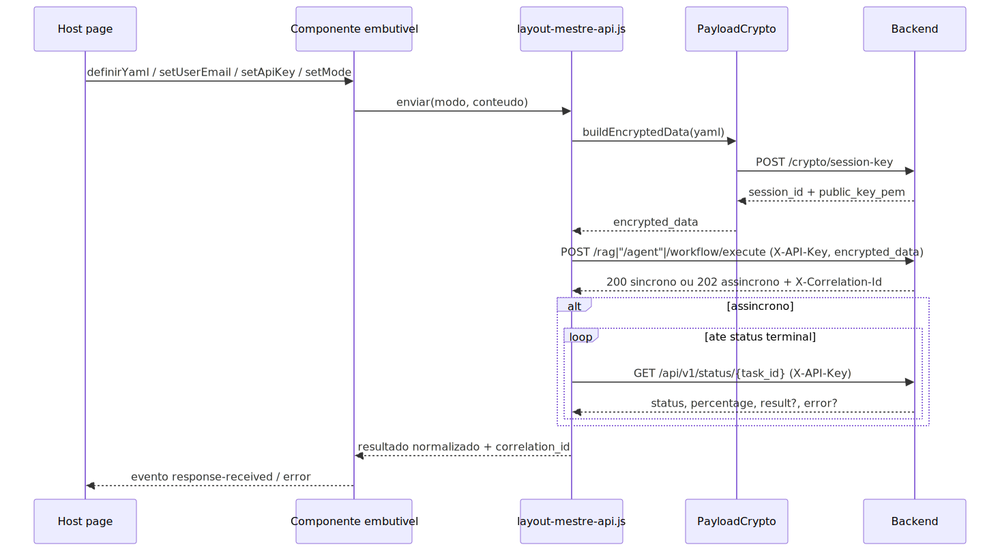

# Guia do Componente WebChat Embutível

## 1. Objetivo

Este documento define a v1 do componente PrometeuEmbeddableChatRuntime.

O objetivo é ter um componente de WebChat embutível, reutilizável em várias telas da aplicação, responsável por encapsular a experiência de conversa com o backend.

Em termos simples:

- a tela host configura e observa;
- o componente renderiza e conversa.

A tela hospedeira não deve redesenhar a conversa, recriar a chamada HTTP, montar payload por conta própria ou duplicar lógica de tratamento de resposta.

O componente deve entregar:

- área de mensagens;
- campo de digitação;
- botão de envio;
- controle de estado;
- histórico da sessão;
- envio da pergunta para o backend;
- tratamento da resposta;
- tratamento de erro;
- publicação de eventos;
- estado exportado para a tela host;
- adaptação ao espaço disponível no container onde foi montado.

## 2. Regra principal da v1

A v1 deve resolver o essencial.

Ela deve permitir que qualquer tela da aplicação consiga embutir um chat funcional sem virar dona da lógica do chat.

Não é objetivo da v1 criar:

- novo backend;
- novo endpoint;
- novo contrato de payload;
- cliente HTTP paralelo;
- runtime alternativo;
- framework genérico demais;
- duplicação da página ui-webchat-v3.html.

A v1 deve ser simples, clara, reutilizável e compatível com o fluxo que já funciona hoje.

## 3. Página host oficial (a antiga "página base de referência")

Histórico em uma frase: a `ui-webchat-v3.html` foi a referência funcional usada para
construir o componente; em 2026-06-10 a migração da Fase B se completou e **ela própria
virou a página host oficial do componente** — o motor de chat duplicado que ela tinha
(montagem de payload, fetch, criptografia e HIL próprios) foi removido.

http://127.0.0.1:5555/ui/static/ui-webchat-v3.html

O que isso significa na prática:

- a v3 é hoje o melhor exemplo REAL de host completo: injeta YAML/payload/e-mail, repassa
  os selects de modo/execução e os filtros de metadados, e re-liga as funções satélites
  (histórico localStorage, export, análise de log, alerta de background) sobre as APIs e
  eventos do componente;
- a fonte de verdade do contrato HTTP (payload, criptografia, headers, endpoints,
  correlation_id, sync/async) **não** é mais o JS da v3 — é a fonte única
  `app/ui/static/js/shared/layout-mestre-api.js`, consumida pelo componente;
- qualquer dúvida sobre contrato, payload, criptografia, headers, endpoint ou tratamento
  de resposta deve ser resolvida lendo a fonte única e a seção 35.2 deste guia.

A regra prática atual é:

se a sua tela host injetar contexto e delegar a conversa inteira ao componente como a
v3 faz, ela está no padrão oficial.

## 4. O que é o componente

O PrometeuEmbeddableChatRuntime é o chat em si.

Ele é um bloco reutilizável que pode ser montado dentro de uma página, painel, card, modal, drawer ou área específica da aplicação.

A tela host não precisa implementar a conversa. Ela apenas reserva um container, informa a configuração necessária e observa o estado ou eventos publicados pelo componente.

## 5. O que ele não é

Este componente não é:

- uma página administrativa completa;
- um substituto do Layout Mestre;
- um adapter do runtime DNIT legado;
- um cliente HTTP independente;
- um novo webchat concorrente;
- uma cópia da ui-webchat-v3.html;
- um lugar para regras específicas de uma única tela.

A função dele é ser um componente oficial de chat embutível, baseado no fluxo que já funciona no WebChat atual.

## 6. Onde está o código

Runtime do componente:

app/ui/static/js/shared/embeddable-chat-runtime.js

Cliente canônico usado pelo componente:

app/ui/static/js/shared/layout-mestre-api.js

Utilitários compartilhados de resposta e correlação:

app/ui/static/js/shared/ui-webchat-runtime-utils.js

Runtime de polling assíncrono:

app/ui/static/js/shared/ui-webchat-async-runtime.js

Página host de exemplo oficial:

app/ui/static/ui-admin-plataforma-webchat.html

Script da host page de exemplo:

app/ui/static/js/ui-admin-plataforma-webchat.js

Estilo dedicado da host de exemplo (cards de configuração + container do componente):

app/ui/static/css/ui-admin-plataforma-webchat.css

Página de teste isolada (bancada) do componente:

app/ui/static/ui-embeddable-chat-test.html

Script da bancada de teste isolada:

app/ui/static/js/ui-embeddable-chat-test.js

Teste E2E Playwright Python do componente isolado:

tests/playwright/test_08-01-10_embeddable_chat_isolated.py

Página host oficial de produto (WebChat v3, host fino do componente desde 2026-06-10):

app/ui/static/ui-webchat-v3.html

Script do host v3 (contexto, selects, histórico localStorage, export, análise de log):

app/ui/static/js/ui-webchat-v3.js

Teste estrutural anti-regressão do single-source (componente + v3 protegidos):

tests/frontend/webchat_single_source_regression_contract.test.js

## 7. Ideia arquitetural correta

A separação correta é:

- o componente cuida do chat;
- a tela host cuida do contexto externo.

Na prática:

- o componente renderiza a conversa;
- o componente controla input, envio, loading, resposta, erro e histórico;
- o componente chama o backend usando o caminho canônico;
- a host page decide qual YAML usar;
- a host page decide qual userEmail usar;
- a host page decide qual apiKey usar;
- a host page decide qual modo expor ao usuário;
- a host page pode mostrar painéis externos, filtros, resumos, debug, status, histórico ou ações administrativas.

Esse desenho evita que cada tela recrie o runtime do chat do seu próprio jeito.

## 8. Dependências obrigatórias

O componente deve reutilizar dependências canônicas já existentes no projeto.

Dependências obrigatórias no browser:

- window.prometeuLayoutMestreApi
- window.WebchatRuntimeUtils
- window.WebchatAsyncRuntime

Arquivos normalmente carregados antes do componente:

<script src="/ui/static/js/shared/layout-mestre-api.js"></script>
<script src="/ui/static/js/shared/ui-webchat-runtime-utils.js"></script>
<script src="/ui/static/js/shared/ui-webchat-async-runtime.js"></script>
<script src="/ui/static/js/shared/embeddable-chat-runtime.js"></script>

Se qualquer dependência obrigatória estiver ausente, o componente deve falhar fechado com erro explícito.

Isso é intencional.

A v1 não deve mascarar contrato quebrado com fallback escondido.

## 9. Fluxo mental do componente

O fluxo esperado é:

1. A host page carrega as dependências obrigatórias.
2. A host page cria a instância do componente.
3. A host page monta o componente em um container HTML.
4. A host page injeta contexto, como YAML, payload, e-mail, chave e modo.
5. O componente valida se possui contexto mínimo para enviar.
6. O usuário digita uma pergunta.
7. O componente monta o payload seguindo o padrão da ui-webchat-v3.html.
8. O componente chama a API usando o cliente canônico.
9. O componente recebe a resposta.
10. O componente atualiza mensagens, estado, correlation_id, última resposta e histórico.
11. A host page pode reagir por eventos ou lendo o estado exportado.

## 10. Responsabilidade da tela host

A tela host continua existindo, mas muda de responsabilidade.

Ela deve cuidar de:

- reservar o container onde o chat será montado;
- carregar ou resolver o YAML;
- informar yamlContent ou encryptedPayload;
- informar userEmail;
- informar apiKey;
- escolher mode;
- escolher executionMode;
- informar filtros de metadados, se houver;
- ouvir eventos do componente;
- ler estado exportado quando necessário;
- exibir informações externas ao chat, se fizer sentido.

A tela host não deve:

- renderizar a conversa principal;
- montar payload manualmente fora do caminho canônico;
- criar cliente HTTP paralelo;
- interpretar resposta da API com lógica duplicada;
- competir com o DOM interno do componente;
- criar outro contrato de envio.

## 11. Responsabilidade do componente

O componente deve cuidar de:

- renderizar área de mensagens;
- renderizar campo de digitação;
- renderizar botão de envio;
- controlar estado de envio;
- impedir duplo envio acidental;
- montar o payload conforme a ui-webchat-v3.html;
- enviar a pergunta para a API;
- tratar resposta;
- tratar erro;
- preservar correlation_id;
- manter histórico da sessão;
- publicar eventos;
- exportar estado;
- adaptar-se ao container recebido.

## 12. Configuração suportada

A criação do componente e o método definirConfiguracao(config) devem aceitar os principais campos abaixo:

- apiBaseUrl: base da API. Se não for informada, usa a origem da página.
- yamlContent: conteúdo YAML em texto puro.
- encryptedPayload: payload já preparado pela host page, usado quando a host não trabalhar com yamlContent.
- yamlFilename: nome lógico do YAML.
- userEmail: e-mail obrigatório da sessão.
- apiKey: chave obrigatória enviada no padrão da aplicação.
- mode: modo de operação.
- executionMode: modo de execução.
- metadataFilters: filtros de metadados, usados principalmente em Q&A/RAG.
- threadId: identificador de thread, útil em fluxo de workflow.
- disabled: bloqueia interação do componente.
- placeholder: texto do campo de pergunta.
- submitLabel: texto do botão.
- emptyTitle: título do estado vazio.
- emptyMessage: texto do estado vazio.
- autoFocus: indica se o campo deve receber foco automaticamente.
- minHeightPx: altura mínima quando o container ainda não tiver altura útil.

## 13. Contexto mínimo para envio

O componente só deve permitir envio quando existir contexto mínimo válido.

Contexto mínimo (regra canônica de `app/ui/CLAUDE.md`: YAML e x-api-key são fontes **alternativas** de credencial — basta uma — e o e-mail é obrigatório):

- **uma** fonte de credencial: `yamlContent` **ou** `encryptedPayload` **ou** `apiKey`;
- `userEmail` (sempre obrigatório).

O `apiKey` separado **não** é exigido quando o YAML já carrega a credencial em
`authentication.access_key` — o backend aceita a chave do header `X-API-Key` **ou** do YAML
(`src/api/security/user_auth.py`). Exigir os três ao mesmo tempo seria violar a regra.

Como o componente resolve isso de verdade (comprovado no código):

- se o host chamou `setApiKey`, essa chave **vence** e é usada como `X-API-Key`;
- sem `setApiKey`, o componente extrai `authentication.access_key` do YAML injetado,
  reusando o helper compartilhado `PrometeuYamlExtractor.extractAccessKeyFromYaml`
  (por isso o script `yaml-access-key-extractor.js` deve ser carregado antes do
  componente);
- sem nenhuma das duas fontes, o envio **falha fechado** com mensagem clara, exibida na
  linha de status — o erro de pré-condição nunca é engolido.

Se faltar e-mail, ou se não houver nenhuma fonte de credencial, o componente não envia
a pergunta e mostra o erro (inclusive quando o envio é chamado programaticamente).

## 14. Tratamento de YAML e payload

O componente deve receber o YAML já carregado pela tela host.

A host page decide qual YAML usar.

O componente consome esse YAML para montar a requisição.

A transformação de YAML em payload, o tratamento de payload criptografado e a chamada à
API acontecem na fonte única `app/ui/static/js/shared/layout-mestre-api.js` (detalhe do
fluxo HTTP real na seção 35.2).

O componente embutível não inventa outro formato.

### 14.1 Comportamento HTTP alinhado ao v3 (offline-store)

O comportamento HTTP do componente no envio do chat é idêntico ao da `ui-webchat-v3.html`: o componente NÃO faz o POST extra em `/crypto/offline-store`. A fonte única de montagem de payload/chamada de API é `app/ui/static/js/shared/layout-mestre-api.js`, que expõe a opção `registrarPayloadOffline` (default `true`). O componente embutível instancia o cliente com `registrarPayloadOffline: false`, replicando o v3. Os demais consumidores de `prometeuLayoutMestreApi` permanecem no default `true`, sem mudança de comportamento. Esse alinhamento foi confirmado por teste de contrato e por validação em runtime (o envio real pelo componente passa por `/crypto/session-key` e `/<modo>/execute`, sem `/crypto/offline-store`).

## 15. Modes suportados

Valores oficiais de mode na v1:

- qa
- agent
- deepagent
- workflow

Alias aceito por compatibilidade:

- rag

Quando rag for informado, ele deve ser tratado internamente como equivalente ao fluxo de Q&A/RAG já usado pelo WebChat atual.

O modo `agent` é puro: vai para `POST /agent/execute` sem `mode: "deepagent"` (a antiga coerção `agent→qa` foi removida em 2026-06-10).

Quem decide como cada modo monta payload e chama backend é a fonte única `layout-mestre-api.js` (dispatch do `enviar()`), consumida pelo componente.

## 16. Modos de execução

Valores aceitos em executionMode:

- auto
- direct_sync
- direct_async

Comportamento esperado:

- auto: usa o comportamento definido pelo contexto, YAML e backend;
- direct_sync: força envio síncrono quando o endpoint suportar;
- direct_async: força caminho assíncrono e acompanhamento por polling quando suportado.

O padrão da v1 deve ser auto.

direct_sync e direct_async devem ser usados apenas quando a host page tiver motivo explícito para forçar o caminho.

## 17. API pública principal

A API pública principal da v1 deve priorizar nomes claros e estáveis.

### Ciclo de vida

- mount(container)
- update(nextOptions)
- destroy()

### Configuração

- definirConfiguracao(config)
- definirYaml(yaml)
- definirPayload(payload)
- setUserEmail(email)
- setApiKey(apiKey)
- setMode(mode)
- setExecutionMode(mode)
- setMetadataFilters(filters)
- setThreadId(threadId)
- setRenderStructured(enabled) — liga/desliga a renderização AG-UI estruturada (ver seção 18.1)
- definirCapacidadesBoasVindas(spec, enabled) — painel de capacidades como onboarding no estado vazio (alias técnico: setWelcomeCapabilities)

### Interação

- preencherPergunta(texto)
- limparCampo()
- enviarPergunta(options)
- perguntar(texto, options) — `options.payloadText` envia texto diferente do exibido (ver seção 18.5)
- cancelar() — aborta o envio em andamento, sync ou async (ver seção 18.3)
- responderHil(tipoDecisao, edicoes) — decide uma pendência HIL programaticamente (ver seção 18.2)
- restaurarConversa(messages) — re-hidrata uma conversa completa (ver seção 18.4)
- inserirMensagemExterna(item) — injeta mensagem externa do assistente (ver seção 18.4)
- limparHistorico()
- focarCampo()

### Leitura de estado

- obterHistorico()
- obterUltimaInteracao()
- obterEstadoAtual()
- obterYamlAtual()

## 18. Aliases técnicos opcionais

Aliases podem existir por compatibilidade, mas não devem ser a interface principal do guia.

Aliases possíveis:

- setConfig(config)
- setYamlContent(yaml)
- setEncryptedPayload(payload)
- getMessages()
- getLastInteraction()
- getState()
- focusInput()
- cancel()
- respondHil(...)
- restoreConversation(...)
- insertExternalAssistantMessage(...)

A recomendação é que novas telas usem a API pública principal.

## 18.1 Renderização AG-UI estruturada (Capacidades, Dashboard e UISpec)

### O que é, em uma frase

Quando a resposta do backend traz um **spec AG-UI conhecido** (um bloco de dados estruturado que descreve uma interface, e não só texto), o componente **desenha esse spec como UI visual** dentro da bolha do assistente — cards de capacidades, gráficos, KPIs, tabelas — em vez de mostrar um JSON cru ou um texto seco. Se a resposta **não** traz spec reconhecido, o componente continua mostrando texto, exatamente como antes. Esse é o ponto central: a feature é **aditiva e invisível para quem só usa texto**.

"Spec AG-UI" aqui significa: um objeto que o agente devolve descrevendo *o que mostrar* (ex.: "estes são meus assuntos", "este é o dashboard de vendas"), seguindo um contrato fixo. O componente reconhece o contrato, valida que ele é seguro e o transforma em DOM. AG-UI = *Agent-Generated UI*, interface gerada pelo agente.

> Importante não confundir: aqui o spec chega **no corpo da resposta** dos endpoints de chat já usados pelo componente (`/rag/execute`, `/agent/execute`). Isto é diferente do runtime de streaming `/ag-ui/runs` descrito no [manual técnico de AG-UI](../tecnico/README-TECNICO-AG-UI.md); o componente embutível **não** abre stream SSE — ele detecta o spec na resposta normalizada e o renderiza. São duas superfícies AG-UI distintas que compartilham o mesmo conceito de spec governado.

### Os três specs que o componente reconhece

1. **CapabilitiesSpec — painel "o que você faz / sobre o que falo".** É o spec novo desta entrega. Renderiza um título, uma introdução, **cards de grupos de assuntos** (cada card com um rótulo e uma descrição amigável) e **chips clicáveis de perguntas-exemplo**. Clicar num chip envia aquela pergunta **uma vez**, pelo mesmo caminho oficial de envio do componente (mesmo guard anti-duplo-envio do botão Enviar) — o usuário não precisa digitar. Serve para responder, de forma visual, perguntas como "o que você faz?", "sobre o que posso te perguntar?". O painel **nunca** mostra nomes internos de ferramenta, subdomínio ou parâmetro técnico: o backend monta o painel a partir das descrições amigáveis dos especialistas do agente e um validador barra qualquer vazamento.

2. **DashboardSpec — dashboard dinâmico.** Já existia no backend (é o canvas governado de varejo); agora o componente embutível também **renderiza** esse spec: KPIs, tabelas, rankings, cards de insight e **gráficos reais** (barra, linha e rosca) desenhados de verdade na tela. Antes desta entrega o componente não desenhava dashboards.

3. **UISpec — interface genérica governada.** Quando a resposta traz uma UISpec, o componente **delega** ao renderizador oficial de UISpec já existente no projeto — não reimplementa nada.

### Como o componente decide entre desenhar e mostrar texto

O fluxo, passo a passo, para cada resposta de assistente (sem erro):

1. o componente pega a resposta já normalizada e procura um spec conhecido nela (na raiz e em contêineres convencionais como `ag_ui`, `structured`, `data`, `result`);
2. achou um spec? ele passa por um **validador fail-closed** (descrito abaixo). Spec inválido = tratado como se não existisse;
3. spec válido = o renderizador correspondente desenha a UI dentro da bolha;
4. **qualquer** uma destas condições cai em texto puro: não há spec reconhecido; o spec é inválido; `renderStructured` está desligado; o runtime de renderização não foi carregado na página; a lib de gráfico está ausente (só os gráficos degradam, o resto do dashboard continua). Esse é o **fallback duro**: o pior caso é o comportamento de antes (texto), nunca um erro na tela.

Em uma frase: **o componente nunca fica pior do que era**. Quem não ativar nada, ou cujo agente só devolve texto, não percebe diferença.

### Como ATIVAR (ligar a feature numa host page)

A feature tem duas partes: carregar os scripts certos (uma vez, na host) e, opcionalmente, ligar o onboarding.

**1. Carregar os scripts, NESTA ordem, antes do `embeddable-chat-runtime.js`:**

```html
<!-- vendor da lib de gráfico (opcional, mas necessário para desenhar gráficos do dashboard) -->
<script src="/ui/static/js/vendor/apexcharts.min.js?v=5.14.0"></script>
<!-- porta neutra de gráfico + adapter ApexCharts (o adapter se auto-registra como ativo) -->
<script src="/ui/static/js/shared/ag-ui-chart-adapter.js"></script>
<script src="/ui/static/js/shared/ag-ui-chart-adapter-apexcharts.js"></script>
<!-- detecção de spec + registry de renderizadores + renderer de Capacidades -->
<script src="/ui/static/js/shared/embeddable-chat-spec-runtime.js"></script>
<!-- bridge ESM: liga os renderizadores oficiais e publica o runtime montado em window -->
<script type="module" src="/ui/static/js/shared/ag-ui-spec-render-bridge.js"></script>
<!-- por fim, o componente -->
<script src="/ui/static/js/shared/embeddable-chat-runtime.js"></script>
```

A ordem importa porque cada peça depende da anterior: o adapter ApexCharts só se registra se a porta `ag-ui-chart-adapter.js` já existir; o bridge ESM (que é `type="module"`, então executa deferido) exige o `embeddable-chat-spec-runtime.js` já carregado para montar o runtime e publicá-lo em `window.PrometeuEmbeddableChatSpecRuntime`. O componente resolve esse runtime de forma **lazy** no momento de renderizar — por isso o bridge pode terminar depois da criação do componente sem quebrar nada.

**2. Não precisa fazer mais nada para o render estruturado:** `renderStructured` já vem **ligado por padrão**. Para forçar o modo 100% texto (ex.: um parceiro que só quer texto), passe `renderStructured: false` na configuração, ou chame `componente.setRenderStructured(false)` em runtime.

**3. Backend: nada a ligar.** A tool builtin `descrever_capacidades` é **auto-injetada em todo supervisor DeepAgent** — qualquer agente DeepAgent já sabe emitir o CapabilitiesSpec quando o usuário pergunta o que ele faz. O DashboardSpec é emitido pelo subagente de dashboard do varejo via `response_format`. Você não configura YAML novo para isso.

**4. Onboarding (opcional):** para mostrar o painel de capacidades já no **estado vazio** do chat (antes da primeira pergunta), como boas-vindas:

```js
// liga o onboarding e injeta um CapabilitiesSpec curado pela própria host
componente.definirCapacidadesBoasVindas(specDeBoasVindas, true);
// alias técnico equivalente: componente.setWelcomeCapabilities(specDeBoasVindas, true);
```

Ou na configuração inicial: `welcomeCapabilities: true` + `welcomeCapabilitiesSpec: <spec>`. Esse opt-in vem **desligado por padrão** (sem ele, o estado vazio é idêntico ao de antes). O componente **nunca busca o spec sozinho** — a host injeta, coerente com o contrato do componente embutível (a host carrega o contexto, o componente não vai atrás).

### Segurança: por que isso não vira porta de injeção

Todo spec — de Capacidades, Dashboard ou UISpec — passa por **validação fail-closed** antes de virar DOM, espelhando no frontend o mesmo contrato que o backend já aplica. Na prática:

- HTML, JavaScript, SQL livre e segredos são **bloqueados** (chave proibida ou string insegura = spec inválido = cai em texto);
- a renderização usa **primitivas DOM seguras**: o conteúdo do agente entra como `textContent`, nunca como `innerHTML`; não há `onclick` inline;
- os chips de pergunta são `<button>` semânticos, sem `onclick` inline — o clique é capturado por **delegação de evento** no container de mensagens, que lê a pergunta de um atributo `data-`;
- os gráficos do ApexCharts desenham **SVG a partir de números e rótulos de texto já validados**, com HTML desabilitado em tooltip, dataLabels, legenda e labels — o gráfico não pode virar vetor de injeção.

O CapabilitiesSpec ainda carrega quatro flags de segurança (`htmlAllowed`, `scriptAllowed`, `sqlAllowed`, `secretsAllowed`), todas **sempre `false`** — se vierem diferentes, o spec é recusado.

### Erros a evitar (pegadinhas)

- **Esquecer o bridge ESM ou a ordem dos scripts.** Sem `ag-ui-spec-render-bridge.js` carregado, o componente não encontra o runtime de spec em `window` e renderiza texto — você vai achar que a feature "não funciona", quando na verdade ela degradou para o fallback. Confira a ordem da seção "Como ATIVAR".
- **Esperar gráficos sem o vendor.** Sem `apexcharts.min.js`, o dashboard ainda renderiza KPIs/tabelas/rankings, mas os gráficos caem no placeholder. Isso é por design (fail-closed), não bug.
- **Achar que toda resposta vira UI.** Só vira UI a resposta que carrega um spec reconhecido e válido. Resposta de texto continua texto. Render estruturado vale **só** para mensagem de assistente sem erro.
- **Tentar montar o payload/spec na host.** A host não inventa spec nem mexe no contrato — quem emite o spec é o backend (tool de capacidades / subagente de dashboard). A host, no máximo, injeta um CapabilitiesSpec **curado** para o onboarding de boas-vindas.

### Estado real por host (honesto)

A feature está **ativa** apenas onde o wiring completo foi carregado:

- **`ui-webchat-v3.html`** (a página oficial de WebChat, host do componente desde 2026-06-10): carrega a cadeia AG-UI completa (ApexCharts → adapter → adapter-apexcharts → spec-runtime) **antes** do componente, com gate falha-fechada que exige o spec runtime resolvido → **ATIVA** (render estruturado comprovado em runtime real no gate da Fase B).
- **`ui-admin-plataforma-webchat.html`** (host de exemplo/bancada de demonstração): carrega todos os scripts → **ATIVA**.
- **`ui-embeddable-chat-test.html`** (bancada de teste isolada): wiring completo → **ATIVA**.

## 18.2 HIL (Human-in-the-loop) no componente

HIL é o fluxo em que o agente pausa e pede aprovação humana antes de executar uma ação
(por exemplo, rodar uma tool sensível). Desde a Fase A da migração, esse fluxo vive
**dentro do componente** — a tela host não implementa nada de HIL.

O que o componente faz sozinho quando a resposta do backend traz uma pendência HIL:

- valida o contrato da resposta com `HilContract.normalizeResponse` (fail-closed: contrato
  inválido vira erro explícito, nunca aprovação silenciosa);
- monta o painel compartilhado `HilReviewPanel` na própria bolha da mensagem, com as ações
  de aprovar, rejeitar e editar;
- **bloqueia novos envios** enquanto a pendência existir (o usuário precisa decidir antes
  de continuar a conversa);
- executa a decisão pelos 2 caminhos oficiais, sempre via fonte única: com `approvalToken`
  → `enviarDecisaoHil` (POST `/agent/hil/decisions`); sem token → `enviarResumeHil`
  (POST no `resumeEndpoint` do contrato);
- se a decisão falhar no backend, a pendência **permanece** (dá para tentar de novo);
- emite os eventos `hil-pending`, `hil-decision-sent`, `hil-decision-completed` e
  `hil-decision-failed` para a host reagir (ver seção 21).

Pré-requisito de scripts: `ui-webchat-hil-contract.js` e `hil-review-panel.js` carregados
antes do componente. A checagem é falha-fechada apenas quando uma resposta HIL chega —
hosts sem HIL no fluxo não precisam dos scripts, mas a recomendação é sempre carregá-los.

A host pode decidir programaticamente (por exemplo, num fluxo automatizado de teste):

```javascript
await chat.responderHil('approve');            // aprovar
await chat.responderHil('reject');             // rejeitar
await chat.responderHil('edit', edicoes);      // aprovar com argumentos editados
```

## 18.3 Cancelamento de envio

`cancelar()` (alias `cancel()`) aborta a execução em andamento nos dois caminhos:

- **síncrono:** aborta o `fetch` via `AbortController` (o `signal` é repassado pela fonte
  única);
- **assíncrono:** interrompe o polling de status.

O componente materializa o estado "cancelado" na conversa (não vira erro genérico), emite
o evento `send-cancelled` e fica pronto para o próximo envio. Durante um envio, o próprio
DOM do componente mostra o botão **Cancelar**; a host pode ligar atalhos próprios (a v3
liga a tecla Esc) chamando `cancelar()`.

## 18.4 Hidratação de conversa (restaurar histórico e mensagens externas)

Duas APIs permitem à host injetar conteúdo sem existir caminho de render paralelo — tudo
passa pela mesma normalização interna de mensagem do componente:

- `restaurarConversa(messages)` — substitui a conversa inteira por uma lista de mensagens
  `{role, content, correlationId?, hil?}`. Uso típico: a v3 restaura conversas salvas no
  localStorage (`webchat_history`). Se uma mensagem restaurada tiver pendência HIL, ela é
  re-hidratada de verdade: o painel remonta e o envio volta a ficar bloqueado até a
  decisão. Emite `conversation-restored`.
- `inserirMensagemExterna(item)` — injeta uma única mensagem do assistente vinda de fora
  do fluxo de envio. Uso típico: materializar pendências de background (`hil_pending`,
  `final_result_pending`) vindas do ledger, com `correlationId` e contrato HIL
  normalizado.

```javascript
// exemplo: restaurar uma conversa salva pela host
chat.restaurarConversa([
  { role: 'user', content: 'Qual o faturamento de 2023?' },
  { role: 'assistant', content: 'R$ 1,2 mi', correlationId: '20260610_..-abc' },
]);
```

## 18.5 payloadText: exibir uma coisa, enviar outra

`perguntar(textoExibido, { payloadText })` mostra `textoExibido` na bolha do usuário e
envia `payloadText` ao backend. Serve para hosts que enriquecem a pergunta com contexto
que não deve poluir a conversa (caso DNIT: contexto de projeto e arquivos anexado à
pergunta). O histórico e os eventos carregam **os dois** textos, para auditoria. Sem a
opção, o comportamento é o padrão (envia o que exibe).

## 18.6 messageActions: ações da host por mensagem

A opção `messageActions` (lista passada na criação do componente) adiciona botões de ação
nas bolhas de mensagem, executados pela host. É como a v3 liga "copiar", "análise de log"
e "download do log" por mensagem sem tocar no render do componente. Cada ação exige
`label` (texto do botão) e `onSelect` (função que recebe uma CÓPIA da mensagem — a host
nunca muta o estado interno); o predicado opcional `quando(mensagem)` filtra em quais
mensagens o botão aparece:

```javascript
const chat = window.EmbeddableChatRuntime.createGenericEmbeddableChat({
  // ...config...
  messageActions: [
    {
      label: 'Analisar log',
      quando: (mensagem) => Boolean(mensagem.correlationId),
      onSelect: (mensagem) => abrirAnaliseDeLog(mensagem.correlationId),
    },
  ],
});
```

## 19. Estado exportado

O estado público deve incluir, no mínimo:

- input
- messages
- lastInteraction
- lastResponse
- lastError
- status
- statusMessage
- correlationId
- ready
- mounted
- config

Significado prático:

- input: texto atual no campo de digitação;
- messages: histórico renderizado pelo componente;
- lastInteraction: última pergunta e última resposta associadas;
- lastResponse: último payload bruto útil recebido do backend;
- lastError: erro normalizado, quando existir;
- status: estado técnico do runtime;
- statusMessage: mensagem pronta para a host page exibir;
- correlationId: correlation_id oficial recebido do backend;
- ready: indica se o componente tem contexto mínimo para envio;
- mounted: indica se o componente está montado no DOM;
- config: snapshot seguro da configuração aplicada.

## 20. Status esperados

Status técnicos esperados na v1:

- idle
- ready
- sending
- waiting
- error

Outros status podem existir no futuro, mas a v1 deve ser simples.

## 21. Eventos emitidos

O namespace dos eventos do componente é:

- prometeu-embeddable-chat:*

Eventos mínimos emitidos:

- prometeu-embeddable-chat:state-change
- prometeu-embeddable-chat:question-sent
- prometeu-embeddable-chat:response-received
- prometeu-embeddable-chat:error
- prometeu-embeddable-chat:history-cleared

Eventos do HIL (seção 18.2):

- prometeu-embeddable-chat:hil-pending — pendência de aprovação detectada (envio bloqueado)
- prometeu-embeddable-chat:hil-decision-sent — decisão despachada à fonte única
- prometeu-embeddable-chat:hil-decision-completed — decisão aceita pelo backend
- prometeu-embeddable-chat:hil-decision-failed — decisão falhou (pendência mantida)

Eventos de cancelamento e hidratação (seções 18.3 e 18.4):

- prometeu-embeddable-chat:send-cancelled — envio abortado pelo usuário/host
- prometeu-embeddable-chat:conversation-restored — conversa re-hidratada via restaurarConversa

Cada evento deve carregar detail com dados serializáveis do runtime.

Exemplo:

```javascript
container.addEventListener('prometeu-embeddable-chat:state-change', (event) => {
  const state = event.detail;
  console.log('Novo estado do chat:', state);
});
```

## 22. Histórico da sessão

O componente deve manter histórico da sessão em memória.

Cada interação deve preservar, no mínimo:

- pergunta do usuário;
- resposta do assistente, quando existir;
- erro, quando existir;
- status;
- horário de envio;
- horário de resposta;
- correlation_id, quando existir;
- payload bruto útil da resposta, quando existir.

A v1 não precisa persistir histórico em banco, Redis ou localStorage.

Persistência externa pode ser feita futuramente pela host page usando eventos e estado exportado.

## 23. Diretriz obrigatória: componente testável isoladamente

O componente embutível deve ser testável sozinho, fora da página host final.

Essa é uma diretriz obrigatória da v1.

O objetivo é separar dois problemas diferentes:

1. validar se o componente funciona corretamente por conta própria;
2. validar depois se uma tela host específica conseguiu embutir o componente corretamente.

A implementação não deve depender exclusivamente da página ui-admin-plataforma-webchat.html para provar que o componente funciona.

Deve existir uma página de teste isolada, simples e dedicada ao componente, capaz de montar o PrometeuEmbeddableChatRuntime diretamente em um container controlado.

Essa página de teste deve permitir validar:

- carregamento das dependências obrigatórias;
- criação da instância do componente;
- montagem do componente no DOM;
- injeção de yamlContent ou encryptedPayload;
- injeção de userEmail;
- injeção de apiKey;
- habilitação do envio quando o contexto mínimo estiver presente;
- preenchimento manual de pergunta;
- envio de pergunta para a API;
- renderização da mensagem do usuário;
- renderização da resposta do assistente ou erro útil do backend;
- preservação de correlation_id;
- atualização do histórico;
- leitura de obterEstadoAtual();
- leitura de obterHistorico();
- leitura de obterUltimaInteracao();
- limpeza do histórico;
- preenchimento externo com preencherPergunta(texto);
- envio programático com perguntar(texto);
- comportamento básico de redimensionamento.

Também deve existir um teste automatizado E2E para essa página isolada.

O teste E2E deve abrir a página de teste do componente, aplicar uma configuração válida, enviar uma pergunta e validar o comportamento real do componente.

O teste deve validar, no mínimo:

- o componente foi montado;
- o componente ficou pronto para envio;
- a pergunta enviada apareceu na conversa;
- a resposta ou erro útil do backend apareceu na conversa;
- o estado exportado foi atualizado;
- o histórico interno recebeu a interação;
- o correlation_id foi preservado quando retornado pelo backend.

A tela host oficial ui-admin-plataforma-webchat.html também pode ter testes próprios, mas ela não deve ser o único lugar onde o componente é validado.

A regra é:

primeiro o componente precisa funcionar sozinho;
depois ele deve funcionar embutido em uma tela host real.

Isso reduz o risco de misturar problema do componente com problema de layout, contexto, shell, YAML, autenticação ou integração específica da host page.

## 24. Redimensionamento e encaixe no host

O componente deve ocupar 100% da largura e da altura do container onde for montado.

Isso significa:

- o componente não decide sozinho o tamanho da página;
- quem define o espaço é a host page;
- o componente se adapta ao container recebido;
- a área de mensagens deve usar scroll interno;
- o campo de digitação deve permanecer acessível;
- em telas menores, o composer pode quebrar para coluna automaticamente;
- o componente não deve estourar o layout da host page.

Regra prática para quem embute:

<div id="meu-chat-host" style="width: 100%; height: 100%; min-height: 480px;"></div>

Se a host não reservar altura útil, o chat não terá onde crescer.

## 25. Exemplo mínimo de host page

<div id="chat-host" style="width:100%;height:480px"></div>
<div id="chat-summary"></div>

<script src="/ui/static/js/shared/layout-mestre-api.js"></script>
<script src="/ui/static/js/shared/ui-webchat-runtime-utils.js"></script>
<script src="/ui/static/js/shared/ui-webchat-async-runtime.js"></script>
<script src="/ui/static/js/shared/embeddable-chat-runtime.js"></script>

<script>
  const chat = window.EmbeddableChatRuntime.createGenericEmbeddableChat({
    yamlContent: 'mode: rag',
    yamlFilename: 'config.yaml',
    userEmail: 'analista@empresa.com',
    apiKey: 'x-api-key-real',
    mode: 'qa',
    executionMode: 'auto',
    onChange(state) {
      document.getElementById('chat-summary').textContent = state.statusMessage || '';
    }
  });

  chat.mount(document.getElementById('chat-host'));
</script>

## 26. Exemplo com host reagindo ao estado exportado

```javascript
const host = document.getElementById('chat-host');
const correlation = document.getElementById('correlation-label');
const payloadViewer = document.getElementById('payload-viewer');

const chat = window.EmbeddableChatRuntime.createGenericEmbeddableChat({
  yamlContent: yamlText,
  userEmail: currentUserEmail,
  apiKey: currentApiKey,
  mode: 'agent',
  executionMode: 'auto',
  onChange(state) {
    correlation.textContent = state.correlationId || 'aguardando backend';
    payloadViewer.textContent = state.lastResponse
      ? JSON.stringify(state.lastResponse, null, 2)
      : 'sem resposta ainda';
  }
});

chat.mount(host);
```

## 27. Exemplo usando eventos DOM

```javascript
const host = document.getElementById('chat-host');

const chat = window.EmbeddableChatRuntime.createGenericEmbeddableChat({
  yamlContent: yamlText,
  userEmail: currentUserEmail,
  apiKey: currentApiKey,
  mode: 'workflow',
  executionMode: 'auto'
});

const root = chat.mount(host);

root.addEventListener('prometeu-embeddable-chat:state-change', (event) => {
  const state = event.detail;
  console.log('Novo estado do chat:', state);
});

root.addEventListener('prometeu-embeddable-chat:error', (event) => {
  console.error('Falha visível do componente:', event.detail);
});
```

## 28. Exemplo de integração com host que recebe YAML externamente

```javascript
function syncHostIntoComponent(snapshot) {
  chat.definirConfiguracao({
    yamlContent: snapshot.yamlContent,
    encryptedPayload: snapshot.payloadContent,
    yamlFilename: snapshot.yamlFilename || 'config.yaml',
    userEmail: snapshot.userEmail,
    apiKey: snapshot.apiKey,
    mode: modeSelect.value,
    executionMode: executionModeSelect.value,
    metadataFilters: parseMetadataFilters(),
  });
}
```

A ideia importante:

- o shell ou a tela host resolve o contexto;
- o componente consome o contexto;
- os dois continuam desacoplados.

## 29. Página de exemplo oficial

A página abaixo deve ser o exemplo oficial de host page:

app/ui/static/ui-admin-plataforma-webchat.html

Ela deve demonstrar:

- carga de YAML same-origin;
- sincronização com o contexto da página;
- troca de modo e execução fora do chat;
- resumo externo consumindo o estado exportado;
- uso do componente como bloco principal da tela;
- ausência de cliente HTTP paralelo;
- ausência de renderização duplicada da conversa.

## 30. Validação isolada do componente

Antes de tratar a integração em telas mais complexas, a v1 deve permitir validação isolada do componente.

Deve existir uma tela ou página de teste dedicada, capaz de montar o componente fora de uma host page complexa.

A bancada oficial dessa validação isolada é `app/ui/static/ui-embeddable-chat-test.html` (com `app/ui/static/js/ui-embeddable-chat-test.js`). Ela só configura e observa: monta o componente em um container controlado, resolve as dependências canônicas com falha fechada e observável, injeta contexto por campos simples, expõe botões para todos os métodos públicos e permite redimensionar o container. Ela não monta payload próprio, não faz fetch de execução e não desenha a conversa (a conversa é desenhada pelo componente). O caminho primário da bancada é `encryptedPayload` (objeto stub), para provar o componente sem arrastar a criptografia real.

Essa tela deve permitir validar:

- carregamento ou injeção de YAML;
- preenchimento manual de pergunta;
- envio real para a API;
- montagem correta do payload;
- recebimento e exibição da resposta;
- preservação de correlation_id;
- histórico da sessão;
- consulta da última interação;
- consulta do histórico completo;
- limpeza do histórico;
- preenchimento externo do campo;
- envio programático com perguntar(texto);
- tratamento de erro;
- redimensionamento básico.

O objetivo é separar dois problemas:

1. fazer o componente funcionar sozinho;
2. depois embutir o componente em telas reais.

## 31. Teste E2E

A v1 deve possuir teste automatizado E2E, preferencialmente com Playwright se esse for o padrão já existente no projeto.

O teste E2E oficial é `tests/playwright/test_08-01-10_embeddable_chat_isolated.py` (famílias `browser` + `e2e` + `asyncio`). Ele serve a bancada por HTTP, intercepta de forma determinística o boundary HTTP do navegador (`/crypto/offline-store` e `/<modo>/execute`) e valida o componente em desktop e mobile. Usa o caminho `encryptedPayload` com `executionMode=direct_sync` (sem polling), de modo a provar o componente sem backend vivo nem criptografia real.

O teste deve abrir a tela de teste isolada do componente e validar, no mínimo:

- componente montado;
- contexto mínimo aplicado;
- botão de envio habilitado quando YAML, e-mail e API key estiverem presentes;
- envio de pergunta;
- mensagem do usuário renderizada;
- resposta ou erro útil do backend renderizado;
- correlation_id preservado quando retornado;
- histórico interno atualizado.

O teste deve validar o componente de verdade, independente de ele estar embutido na tela host final.

## 31.1 Definição de 100% verde: componente embutível **E** backend, ambos verdes

Regra obrigatória do roteiro de teste deste componente (decisão registrada do usuário):

- **"100% verde" só é válido quando o componente embutível E o backend estiverem rodando 100% verdes.** Não basta o componente passar nos testes automáticos e se comportar corretamente na UI; a rodada só é aprovada quando uma pergunta enviada pela UI real **recebe resposta final visível no chat** e o **log da correlação fecha limpo**, sem erro, traceback, fallback indevido nem `correlation_id` ausente.
- **Todo erro de backend encontrado durante o teste faz parte do roteiro de teste deste componente** — não é "fora de escopo". Isso inclui, por exemplo: `500` sem `X-Correlation-Id` na resposta; `logging.contract.violation` / `missing_event_name`; falha de inicialização de supervisor DeepAgent (`CompositeBackend não encontrado`); resolução de alvo vetorial (`VectorTargetResolutionError`) e qualquer exceção, warning bloqueante ou fallback indevido no caminho exercitado.
- Cada erro de backend deve ser tratado pelo **loop de auto-correção por log** (`.claude/rules/loops-estrategicos.md`): capturar o `correlation_id`, abrir o log oficial, provar a causa raiz no código, corrigir na origem, proteger com teste e repetir a rodada pela UI real.
- O teste só pode ser declarado concluído com sucesso quando **ambos** os lados — componente e backend — estiverem verdes no caminho oficial de runtime, com prova por log.

## 32. Regras práticas de uso

### 32.1 Não criar cliente HTTP paralelo

O componente deve usar o caminho canônico do projeto.

Se uma página criar outro cliente HTTP só para facilitar, ela reabre o problema que este componente existe para resolver.

### 32.2 Não esconder erro real do backend

Se o backend devolver erro com mensagem útil, o componente deve mostrar essa mensagem e preservar o correlation_id.

Isso ajuda o usuário e permite rastreabilidade no log.

### 32.3 A host page não deve desenhar a conversa

A host page pode desenhar:

- filtros;
- painéis auxiliares;
- resumo de estado;
- botões externos;
- telemetria;
- histórico externo;
- ações administrativas.

Mas ela não deve competir com o DOM interno do componente para renderizar a conversa principal.

### 32.4 Resize correto depende do container

O componente ocupa o espaço recebido.

A host page precisa fornecer altura útil.

Se o container pai não tiver altura, o componente pode aplicar uma altura mínima de segurança, mas o comportamento ideal depende de um layout bem definido pela host.

### 32.5 Não alterar a página base

A página ui-webchat-v3.html é referência funcional.

Ela não deve ser alterada para fazer o componente funcionar.

Se houver dúvida, consulte a página para copiar o comportamento correto de contrato, não para modificar a referência.

## 33. Critérios de aceite da v1

A v1 está pronta quando:

- o componente monta dentro de um container;
- o componente recebe yamlContent, userEmail e apiKey;
- o componente também aceita encryptedPayload quando esse for o fluxo da host;
- o envio só fica habilitado quando o contexto mínimo estiver presente;
- o componente envia pergunta usando o cliente canônico;
- o payload enviado é compatível com a ui-webchat-v3.html;
- o tratamento de YAML segue o comportamento da ui-webchat-v3.html;
- o tratamento de payload criptografado segue o comportamento da ui-webchat-v3.html;
- a resposta da API é interpretada como na ui-webchat-v3.html;
- a mensagem do usuário aparece na conversa;
- a resposta do assistente aparece na conversa;
- erros úteis do backend aparecem na conversa;
- o correlation_id oficial do backend é preservado;
- messages é atualizado;
- lastInteraction é atualizado;
- lastResponse é atualizado;
- lastError é atualizado quando houver erro;
- limparHistorico() funciona;
- preencherPergunta(texto) funciona;
- perguntar(texto) funciona;
- obterEstadoAtual() retorna snapshot coerente;
- obterHistorico() retorna histórico da sessão;
- obterUltimaInteracao() retorna a última interação;
- o componente funciona em tela de teste isolada;
- existe teste E2E validando o componente isoladamente;
- a tela ui-admin-plataforma-webchat.html funciona como exemplo oficial de host page;
- não existe cliente HTTP paralelo;
- não existe renderização duplicada da conversa fora do componente;
- não existe código legado morto relacionado ao componente;
- não existem duas versões concorrentes do componente.

## 34. FAQ

### O componente pode ser usado fora do shell administrativo?

Sim, desde que a página carregue as dependências canônicas necessárias e entregue a configuração mínima.

Ele não depende da sidebar administrativa nem da página de exemplo.

### Preciso passar YAML sempre em texto puro?

Não.

A host page pode passar yamlContent ou encryptedPayload, dependendo do fluxo.

### O componente decide sozinho qual YAML usar?

Não.

O correto é a host page decidir isso e repassar ao componente.

### Posso usar esse componente para Q&A, Agent, DeepAgent e Workflow?

Sim.

O campo mode existe para isso.

### Posso forçar síncrono ou assíncrono?

Sim.

Use executionMode com direct_sync ou direct_async.

Se quiser respeitar o comportamento configurado, use auto.

### Como pego a última resposta sem ler o DOM?

Use obterEstadoAtual().

O campo lastResponse foi pensado para isso.

### Como limpo a conversa programaticamente?

Use limparHistorico().

### Como coloco uma pergunta por código e envio sem o usuário digitar?

Use perguntar(texto).

### Como coloco uma pergunta no campo sem enviar?

Use preencherPergunta(texto).

### O componente gera correlation_id no browser?

Não.

Ele só preserva e exibe o correlation_id recebido do backend.

### O que acontece se a X-API-Key for inválida?

O backend responde com erro.

O componente deve preservar a mensagem real, preservar o correlation_id quando existir, atualizar lastError e publicar evento de erro.

### Posso adicionar botões externos, filtros, tabs e painéis em volta dele?

Sim.

Esse é o desenho recomendado.

O componente cuida do chat. A host page cuida do resto.

## 35. Checklist de integração de uma nova host page

Antes de considerar uma nova host page pronta, confirme:

- existe um container com altura útil;
- as dependências canônicas foram carregadas;
- o componente foi montado no container correto;
- a host page injeta yamlContent ou encryptedPayload;
- a host page injeta userEmail;
- a host page injeta apiKey;
- a host page define mode;
- a host page define executionMode ou aceita o padrão auto;
- a host page observa correlationId ou lastResponse se precisar de rastreabilidade;
- a host page não criou cliente HTTP paralelo;
- a host page não recriou a renderização da conversa;
- a host page não alterou a ui-webchat-v3.html;
- a host page não duplicou lógica de payload;
- a host page não duplicou lógica de tratamento de resposta.

## 35.1 Estado de convergência e itens abertos

Estado da convergência após a migração da Fase B (2026-06-10):

- O componente, a host de exemplo (`ui-admin-plataforma-webchat.html`) **e a página oficial
  `ui-webchat-v3.html`** usam `layout-mestre-api.js` como ponto único de payload,
  criptografia e HTTP — incluindo o HTTP das decisões HIL (`enviarDecisaoHil`/
  `enviarResumeHil`). O motor próprio da v3 (~2.100 linhas de payload/fetch/criptografia/
  HIL/polling/markdown) foi removido; a v3 é host fino.
- O teste estrutural `webchat_single_source_regression_contract.test.js` protege componente
  e v3: se qualquer um voltar a ter fetch de execução, criptografia ou payload próprio, o
  teste falha (provado por regressão simulada).

Um ponto permanece como pendência explícita e rastreável:

- O runtime de chat do detalhe de projeto DNIT (`app/ui/static/js/shared/dnit-project-chat-runtime.js`)
  ainda é um segundo runtime com payload próprio. A migração foi **adiada por decisão do
  usuário** (2026-06-10) e continua planejada para etapa futura — o pré-requisito técnico
  (componente com HIL, `payloadText`, modo `agent` puro e apiKey por YAML) já está pronto.
  Não é descuido nem lixo: é dívida transitória declarada (regra canônica
  `.claude/rules/componente-chat-embutivel.md` §6).

## 35.2 Comunicação com a API: o fluxo HTTP real, ponta a ponta

Esta seção consolida em um único lugar a sequência HTTP que o componente executa por
baixo. Ela não substitui a montagem de payload (detalhada em
[README-TECNICO-WEBCHAT-MONTAGEM-PAYLOAD.md](../tecnico/README-TECNICO-WEBCHAT-MONTAGEM-PAYLOAD.md)),
mas explica a ordem real das chamadas — útil para quem precisa diagnosticar a rede ou
construir uma interface própria (ver [GUIA-INTEGRADOR-CHAT-PLATAFORMA.md](GUIA-INTEGRADOR-CHAT-PLATAFORMA.md)).

1. **Handshake criptográfico** — quando há YAML, `PayloadCrypto.buildEncryptedData(...)`
   chama `POST /crypto/session-key` e recebe `{ session_id, public_key_pem, expires_at,
   ttl_seconds }`. A chave pública protege a chave Fernet usada para cifrar o YAML.
2. **Cifra do YAML** — o helper gera o envelope `encrypted_data` com `session_id`,
   `wrapped_key`, `encrypted_yaml`, `original_filename`, `encryption_scheme` e
   `yaml_operational_contract`. Quando o usuário carrega um payload já cifrado, esse
   passo é pulado (o componente usa o objeto direto e, no chat, **não** registra em
   `/crypto/offline-store`).
3. **Envio por modo** — `POST` para o endpoint do modo selecionado:
   - `qa` → `/rag/execute` (envelope `{ operation: "ask", payload: { ... } }`);
   - `agent`/`deepagent` → `/agent/execute` (campos no topo do corpo; `deepagent` força
     `mode: "deepagent"`);
   - `workflow` → `/workflow/execute`.
   Headers reais: `Content-Type: application/json`, `X-API-Key: <chave>` (ou a chave em
   `authentication.access_key` no YAML), `X-Prometeu-UI-Session-Required: 1`, e
   `credentials: 'include'`.
4. **Leitura do correlation_id** — o componente lê `X-Correlation-Id` (header) ou os
   campos de correlação do corpo, exibe na barra de status e propaga. Nunca cria esse
   identificador localmente.
5. **Polling assíncrono** — se a resposta for `HTTP 202`, ou síncrona mas com
   `status_url`/`polling_url`/`stream_url` no corpo (ou `execution_mode = direct_async`),
   o componente faz polling em `GET /api/v1/status/{task_id}` com o header `X-API-Key`,
   a cada ~1s, até o status virar terminal (`completed`, `failed`, `cancelled`) ou de
   pausa (`paused`, `awaiting_human_decision`). O resultado final sai de `result`/`data`
   do payload de status.



## 36. Resumo final

Se precisar lembrar de uma regra só, lembre desta:

a tela host configura e observa; o componente renderiza e conversa.

A página ui-webchat-v3.html é hoje o exemplo real de host completo do componente — para
ver "como integrar", leia o `ui-webchat-v3.js`.

Para dúvidas de contrato HTTP (payload, YAML, criptografia, endpoints, correlation_id),
a fonte de verdade é a fonte única `layout-mestre-api.js` e a seção 35.2 deste guia.

O componente embutível é o único motor de conversa das telas migradas: sem lógica
duplicada, sem cliente paralelo e sem legado morto para trás.
