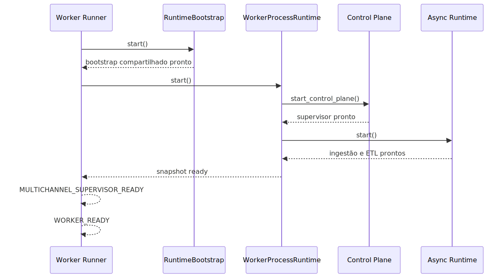

# Manual técnico, executivo, operacional e estratégico: scheduler, worker oficial e filas operacionais

## 1. O que é esta feature

Este documento explica a topologia operacional atual da plataforma para
quem precisa entender execução real, e não lembrança de arquitetura
legada.

Na prática, a plataforma opera com três papéis diferentes:

- a API atende HTTP e aceita requisições;
- o scheduler roda em processo próprio para tarefas por tempo;
- o worker oficial roda em processo próprio para o plano de controle
  multicanal e para o runtime assíncrono de ingestão e ETL.

O ponto central deste manual é simples: processo web, scheduler e worker
não são a mesma coisa. Misturar esses papéis leva a diagnóstico errado,
observabilidade ruim e operação frágil.

## 2. Que problema ela resolve

Sem essa separação, a operação tende a cometer quatro erros frequentes:

- achar que API viva significa domínio assíncrono saudável;
- tratar scheduler como detalhe hospedado no processo web;
- confundir supervisão multicanal com consumo de fila de ingestão e ETL;
- investigar fila errada quando a execução longa para de andar.

Esta feature resolve isso ao publicar uma topologia operacional explícita
e marcadores de prontidão que contam a história do bootstrap e do
shutdown.

## 3. Visão executiva

Para liderança e operação, a principal vantagem é previsibilidade.
Quando cada processo tem papel claro, fica mais fácil saber onde está o
problema, qual componente precisa ser reiniciado e qual evidência prova
saúde real.

Isso reduz tempo de diagnóstico, evita falsa sensação de disponibilidade
e melhora governança operacional.

## 4. Visão comercial

Do ponto de vista comercial e de implantação, esta separação ajuda a
demonstrar que a plataforma não roda com automação improvisada dentro do
servidor web. Há um desenho operacional explícito para API, scheduler e
worker oficial, o que aumenta confiança de clientes que precisam de
processamento assíncrono observável.

## 5. Visão estratégica

Estrategicamente, essa topologia fortalece a plataforma porque separa
boundary HTTP, coordenação temporal e consumo assíncrono em papéis
diferentes. Isso prepara o sistema para crescer sem voltar a acoplamentos
onde o web process tentava hospedar tudo por conveniência.

## 6. Conceitos necessários para entender

### API

É o boundary HTTP. Recebe chamada, valida contexto, autentica, agenda
trabalho e devolve resposta. Não é o lugar onde o trabalho pesado deve
rodar por efeito colateral.

### Scheduler

É o processo dedicado a rotinas por tempo, como manutenção e tarefas
agendadas. Ele não é o consumidor oficial das filas assíncronas de
ingestão e ETL.

### Worker oficial

É o processo responsável por duas funções combinadas:

- subir o plano de controle multicanal;
- subir o runtime assíncrono que consome ingestão e ETL.

### Plano de controle multicanal

É a parte viva do domínio de canais e supervisão operacional. Se esse
plano não sobe, o worker ainda não provou prontidão completa.

### Runtime assíncrono

É o componente que consome trabalho enfileirado. No código lido, o
worker oficial exige backend RabbitMQ e consumer runtime Dramatiq.

### Marcadores de prontidão

São logs estruturados que informam quando o processo realmente ficou
apto para operar. Eles são mais confiáveis do que apenas ver que o PID
subiu.

## 7. Como a feature funciona por dentro

O worker runner define PROCESS_ROLE=worker e monta o ciclo de vida com
StartupPolicy, RuntimeBootstrap e WorkerProcessRuntime.

O RuntimeBootstrap cuida do bootstrap operacional compartilhado entre
scheduler e worker. Já o WorkerProcessRuntime sobe o plano de controle
multicanal e o runtime assíncrono na ordem coordenada.

Essa ordem importa:

1. o worker valida infraestrutura obrigatória;
2. executa bootstrap operacional compartilhado;
3. sobe o plano de controle multicanal;
4. sobe o runtime assíncrono RabbitMQ + Dramatiq;
5. calcula snapshot de prontidão;
6. emite markers de supervisor pronto e worker pronto.

O scheduler segue caminho parecido, mas seu papel é diferente. Ele sobe
como processo scheduler-only, usa o mesmo RuntimeBootstrap compartilhado
e emite seu próprio marker SCHEDULER_READY quando termina o bootstrap.

## 8. Divisão em etapas ou submódulos

### 8.1 Runner de worker

É o entrypoint do processo worker-only. Seu papel é preparar ambiente,
instalar sinais de shutdown, validar infraestrutura, executar bootstrap,
subir o runtime oficial e registrar markers estruturados.

### 8.2 Bootstrap operacional compartilhado

É a camada comum entre worker e scheduler. Ela cuida de liderança de
scheduler, start e stop de schedulers de manutenção, workers de canal e
outras decisões de startup coordenado.

### 8.3 Runtime unificado do worker

É o componente que realmente combina controle multicanal e runtime
assíncrono. O snapshot dele é a base lógica dos sinais:

- multichannel_supervisor_ready;
- ingestion_ready;
- etl_ready;
- fan_out_active;
- ready.

### 8.4 Runtime assíncrono Dramatiq

É a execução física do consumo assíncrono. O código confirma que o
worker oficial falha cedo se o backend não for RabbitMQ ou se o runtime
de consumo não for Dramatiq.

### 8.5 Runner de scheduler

É o processo scheduler-only. Ele não sobe o runtime assíncrono do worker.
Seu papel é manter os jobs por tempo e registrar prontidão específica do
agendamento.

## 9. Pipeline ou fluxo principal

O fluxo operacional correto pode ser resumido assim:

1. A API recebe requisição e, quando necessário, responde com aceitação
   assíncrona.
2. O scheduler executa somente o que é temporal e coordenado por agenda.
3. O worker oficial sobe o plano de controle multicanal.
4. O mesmo worker oficial sobe o runtime assíncrono de ingestão e ETL.
5. O worker só é considerado realmente pronto quando os markers de
   supervisor, ingestão, ETL e worker aparecem de forma consistente.
6. No shutdown, o worker encerra runtime assíncrono, depois bootstrap
   compartilhado, e registra a trilha de encerramento.

## 10. Decisões técnicas e trade-offs

### Um worker oficial para controle multicanal e runtime assíncrono

Ganho: o domínio operacional crítico fica concentrado em um único
processo oficial e observável.

Custo: a operação não pode presumir que um segundo processo informal vai
resolver consumo de fila.

Impacto prático: reduz caminhos paralelos e melhora diagnóstico.

### Scheduler em processo separado

Ganho: tarefas por tempo não dependem do ciclo de vida HTTP.

Custo: exige tratar scheduler como processo de primeira classe.

Impacto prático: quando o scheduler falha, a investigação certa é no
processo dedicado, não na API.

### Falha rápida se o runtime assíncrono não for RabbitMQ + Dramatiq

Ganho: evita worker aparentemente vivo com backend incompatível.

Custo: ambiente mal configurado quebra cedo.

Impacto prático: o erro aparece onde deve aparecer, em vez de gerar
comportamento ambíguo horas depois.

## 11. Configurações que mudam o comportamento

As variáveis e políticas mais relevantes confirmadas no código lido são:

- PROCESS_ROLE: define se o processo opera como worker ou scheduler;
- ASYNC_JOB_QUEUE_BACKEND: o worker oficial exige rabbitmq;
- ASYNC_JOB_CONSUMER_RUNTIME: o worker oficial exige dramatiq;
- políticas de StartupPolicy: controlam fail-fast, lock de bootstrap e
  decisão de startup;
- configurações de liderança e scheduler lidas pelo RuntimeBootstrap.

Valores padrão completos dessas configurações não estão consolidados em
um único manual operacional no código lido.

## 12. Contratos, entradas e saídas

Os contratos principais desta feature não são payloads HTTP, e sim
contratos operacionais de processo e log.

Entradas:

- inicialização do processo com papel worker ou scheduler;
- sinal de shutdown;
- configuração de infraestrutura e filas.

Saídas:

- markers estruturados de bootstrap e shutdown;
- snapshots de prontidão do worker;
- prontidão explícita do scheduler;
- falha rápida quando o runtime assíncrono não atende o contrato oficial.

## 13. O que acontece em caso de sucesso

No caminho feliz do worker:

1. a infraestrutura obrigatória é validada;
2. o bootstrap compartilhado conclui sem erro;
3. o plano de controle multicanal sobe;
4. o runtime assíncrono sobe;
5. o worker emite MULTICHANNEL_SUPERVISOR_READY e WORKER_READY.

No caminho feliz do scheduler:

1. o processo sobe em modo scheduler-only;
2. o bootstrap compartilhado conclui;
3. o processo emite SCHEDULER_READY.

## 14. O que acontece em caso de erro

Os cenários mais relevantes confirmados no código são estes:

- se o backend assíncrono não for rabbitmq, o worker oficial lança erro
  explícito;
- se o consumer runtime não for dramatiq, o worker oficial lança erro
  explícito;
- se o runtime assíncrono falhar ao subir, o plano de controle multicanal
  é parado antes de propagar a falha;
- durante shutdown, erros em schedulers ou leader task são registrados e
  propagados.

## 15. Observabilidade e diagnóstico

Os markers mais importantes para operação são:

- MULTICHANNEL_SUPERVISOR_READY;
- WORKER_RUNTIME_READY;
- WORKER_READY;
- SCHEDULER_READY;
- WORKER_SHUTDOWN_START;
- ASYNC_RUNTIME_SHUTDOWN_COMPLETE;
- RUNTIME_BOOTSTRAP_SHUTDOWN_START;
- RUNTIME_BOOTSTRAP_SHUTDOWN_COMPLETE;
- WORKER_SHUTDOWN_COMPLETE.

Interpretação prática:

- API viva sem WORKER_READY não prova saúde do domínio assíncrono;
- worker iniciado sem MULTICHANNEL_SUPERVISOR_READY não prova saúde do
  plano de controle;
- ausência de ASYNC_RUNTIME_SHUTDOWN_COMPLETE indica encerramento
  incompleto do runtime assíncrono.

## 16. Impacto técnico

Tecnicamente, esta feature reduz acoplamento entre boundary HTTP,
agendamento temporal e consumo assíncrono. Também melhora a testabilidade
porque worker e scheduler podem ser validados como runners dedicados.

## 17. Impacto executivo

Executivamente, a separação de papéis reduz diagnóstico enganoso e ajuda
operação a responder duas perguntas críticas com mais rapidez:

- o processo web está vivo?
- o domínio assíncrono está realmente pronto?

## 18. Impacto comercial

Comercialmente, a plataforma ganha credibilidade operacional. É mais
fácil defender processamento assíncrono corporativo quando existe um
worker oficial com contrato explícito de prontidão e um scheduler
dedicado para tarefas por tempo.

## 19. Impacto estratégico

Estrategicamente, esta topologia combate o retorno de fluxos paralelos e
legados. Ela reforça a ideia de que fila, supervisão multicanal e jobs
temporais devem seguir contratos explícitos, e não coexistir em caminhos
alternativos espalhados pela API.

## 20. Exemplos práticos guiados

### Exemplo 1. API responde, mas ingestão não anda

Leitura correta: primeiro verificar se o worker oficial emitiu
WORKER_READY e se o runtime assíncrono realmente subiu.

### Exemplo 2. Scheduler parece morto

Leitura correta: investigar o processo scheduler-only e o marker
SCHEDULER_READY, não o servidor web.

### Exemplo 3. Worker abriu, mas operação continua instável

Leitura correta: checar se houve MULTICHANNEL_SUPERVISOR_READY,
WORKER_RUNTIME_READY e WORKER_READY, e não apenas se o processo existe.

## 21. Explicação 101

Pense na plataforma como uma operação com três equipes diferentes.

- a recepção atende o público: essa é a API;
- a equipe do relógio cuida do que precisa acontecer por agenda: esse é
  o scheduler;
- a equipe de execução pesada cuida das filas e da supervisão viva: esse
  é o worker oficial.

Se a recepção está aberta, isso não significa que a equipe de execução
pesada já começou a trabalhar. Os markers existem justamente para provar
quando isso aconteceu de verdade.

## 22. Limites e pegadinhas

- API viva não significa worker pronto.
- Worker pronto não deve ser inferido por suposição; precisa de markers.
- Scheduler e worker não são intercambiáveis.
- RabbitMQ não substitui Redis, e Redis não substitui o contrato oficial
  do runtime assíncrono do worker.
- Um segundo worker improvisado não faz parte do desenho oficial lido no
  código.

## 23. Troubleshooting

### Sintoma: 202 foi devolvido, mas nada avança

Causa provável: o worker oficial não completou prontidão.

Como confirmar: procurar MULTICHANNEL_SUPERVISOR_READY,
WORKER_RUNTIME_READY e WORKER_READY.

### Sintoma: scheduler parece não executar jobs temporais

Causa provável: problema no processo scheduler-only ou na liderança.

Como confirmar: procurar SCHEDULER_READY e sinais do RuntimeBootstrap.

### Sintoma: worker sobe e cai logo em seguida

Causa provável: contrato inválido de backend ou consumer runtime.

Como confirmar: revisar se ASYNC_JOB_QUEUE_BACKEND=rabbitmq e
ASYNC_JOB_CONSUMER_RUNTIME=dramatiq.

## 24. Diagramas

### Topologia operacional macro

Este diagrama mostra a separação de papéis confirmada no código.

### Sequência simplificada de bootstrap do worker

Este diagrama mostra por que o worker só fica pronto depois de duas
etapas distintas: controle multicanal e runtime assíncrono.

## 25. Mapa de navegação conceitual

O mapa conceitual desta topologia é:

- runner define o papel do processo;
- bootstrap compartilhado coordena startup e shutdown comuns;
- runtime do worker combina canais e consumo assíncrono;
- scheduler executa agenda temporal em processo próprio;
- markers estruturados contam a história do processo.

## 26. Como colocar para funcionar

O código lido confirma o contrato de processo, mas não consolida neste
arquivo um comando operacional único de subida de todos os papéis.

O que fica comprovado:

- worker e scheduler têm runners dedicados em app/runners;
- o worker exige rabbitmq e dramatiq para o runtime oficial;
- prontidão real depende de markers estruturados.

## 27. Checklist de entendimento

- Entendi que API, scheduler e worker são processos com papéis
  diferentes.
- Entendi que o worker oficial combina plano de controle e runtime
  assíncrono.
- Entendi que o scheduler roda separado.
- Entendi que prontidão depende de markers, não só de PID.
- Entendi que RabbitMQ + Dramatiq são contrato explícito do worker.
- Entendi que shutdown também tem trilha estruturada.

## 28. Evidências no código

- app/runners/worker_runner.py
  - Motivo da leitura: entrypoint do processo worker-only.
  - Comportamento confirmado: define PROCESS_ROLE=worker, executa
    RuntimeBootstrap, sobe WorkerProcessRuntime e emite
    MULTICHANNEL_SUPERVISOR_READY e WORKER_READY.
- app/runners/scheduler_runner.py
  - Motivo da leitura: entrypoint do processo scheduler-only.
  - Comportamento confirmado: define PROCESS_ROLE=scheduler, usa
    RuntimeBootstrap e emite SCHEDULER_READY.
- src/api/startup/runtime_bootstrap.py
  - Motivo da leitura: bootstrap e shutdown compartilhados.
  - Comportamento confirmado: registra
    RUNTIME_BOOTSTRAP_SHUTDOWN_START e
    RUNTIME_BOOTSTRAP_SHUTDOWN_COMPLETE.
- src/api/services/worker_process_runtime.py
  - Motivo da leitura: snapshot de prontidão e contrato do runtime do
    worker.
  - Comportamento confirmado: prontidão depende de plano de controle
    multicanal e runtime assíncrono; worker falha cedo se backend não for
    rabbitmq ou runtime não for dramatiq.
- src/api/services/async_job_dramatiq.py
  - Motivo da leitura: shutdown do runtime assíncrono.
  - Comportamento confirmado: emite
    ASYNC_RUNTIME_SHUTDOWN_COMPLETE ao finalizar.
- tests/unit/test_02-06-79_worker_runner.py
  - Motivo da leitura: evidência executável da prontidão do worker.
  - Comportamento confirmado: os testes validam emissão de
    MULTICHANNEL_SUPERVISOR_READY, WORKER_READY e markers de shutdown.
