# Manual técnico, executivo, comercial e estratégico: Tools nativas

## 1. O que é esta feature

Tools nativas, neste projeto, são as capacidades builtin da própria plataforma. Elas representam o conjunto global de ferramentas que o runtime sabe materializar porque o código do produto já conhece essas implementações ou factories.

Em termos práticos, elas não são cadastradas por tenant. Elas formam um catálogo global da plataforma, persistido em banco, sincronizado pelo builder oficial e injetado automaticamente nos YAMLs agentic quando `tools_library` chega vazia.

Em linguagem simples: tools nativas são a prateleira oficial de capacidades técnicas que a plataforma inteira sabe oferecer, antes mesmo de decidir o que cada tenant ou cada YAML concreto vai usar.

## 2. Que problema ela resolve

Sem uma camada formal de tools nativas, o sistema cairia em alguns problemas graves.

- cada YAML precisaria reescrever manualmente o catálogo de tools;
- seria fácil divergir o que está no código do que aparece no runtime;
- mudanças de implementação quebrariam catálogos copiados em vários lugares;
- ativação e desativação operacional dependeriam de deploy ou edição manual perigosa;
- não existiria uma fonte de verdade única para auditoria administrativa.

O catálogo builtin resolve isso separando três coisas que precisam ser separadas.

- o que a plataforma sabe fazer em termos de capacidade técnica;
- o que está operacionalmente ativo ou desativado;
- o que cada YAML ou tenant usa na composição final.

## 3. Visão conceitual

Conceitualmente, o sistema trata tools nativas como catálogo global de famílias técnicas. Isso inclui tools diretas e também factories parametrizadas.

Uma tool direta aponta para uma implementação concreta já conhecida.

Uma factory parametrizada registra a família, não cada item concreto. É o caso de `dyn_sql`, `dyn_api` e `proc_sql`. O catálogo builtin diz que a plataforma sabe materializar essa família. O item concreto só aparece depois, quando o runtime recebe algo como `dyn_sql<query_id>` ou `dyn_api<endpoint_id>`.

Essa distinção é central.

O catálogo builtin não responde “qual query do tenant X está publicada”. Ele responde “que famílias e implementações a plataforma consegue oferecer como base de runtime”.

## 4. Visão tática

Taticamente, tools nativas existem para permitir evolução controlada do runtime agentic sem depender de edição manual de catálogo em YAML.

Elas são especialmente importantes quando o time precisa:

- disponibilizar novas capacidades do produto para vários fluxos de uma vez;
- desativar temporariamente uma capability problemática sem remover código;
- sincronizar automaticamente o catálogo a partir do código real;
- manter um ponto administrativo único para listar, filtrar, habilitar, desabilitar e auditar tools builtin.

## 5. Visão técnica

Tecnicamente, as tools nativas seguem um ciclo de vida claro.

### 5.1. Descoberta no código

O `ToolsLibraryBuilder` percorre o diretório de tools, analisa arquivos Python, identifica implementações conhecidas e monta um snapshot descoberto.

### 5.2. Inclusão manual das factories parametrizadas

Nem toda family parametrizada é descoberta automaticamente pelo scanner. Por isso o builder adiciona explicitamente as bases `dyn_sql`, `dyn_api` e `proc_sql`, porque elas dependem de sintaxe especial e não podem ficar ausentes do catálogo builtin.

### 5.3. Sincronização para banco

O snapshot descoberto é sincronizado para a tabela global `integrations.builtin_tool_registry` por meio do `BuiltinToolCatalogSynchronizer`.

### 5.4. Cache global em memória

O `ToolsLibraryCache` lê a tabela persistida, mantém snapshots thread-safe e devolve cópias profundas para evitar compartilhamento acidental de objetos mutáveis.

### 5.5. Injeção automática no YAML

Quando o YAML agentic chega com `tools_library: []`, a `ConfigurationFactory` injeta as tools builtin ativas carregadas do banco. Se `tools_library` vier preenchida ou ausente, o sistema falha fechado.

Para apoiar a montagem agentic, a API também expõe `/config/assembly/catalog` para consultar o catálogo disponível e `/config/assembly/recommend-tools` para recomendar tools conforme a intenção do fluxo.

## 6. Visão executiva

Para liderança, o valor das tools nativas está em governança de plataforma. Em vez de cada fluxo carregar sua própria visão do catálogo, existe uma fonte global de verdade, com status operacional e interface administrativa.

Isso reduz risco de drift entre código, configuração e operação. Também reduz o custo de governança quando uma ferramenta precisa ser desativada rapidamente ou quando um novo capability set precisa ser liberado para toda a base de runtime.

## 7. Visão comercial

Comercialmente, tools nativas fortalecem a narrativa de produto como plataforma governada, não como coleção artesanal de agentes.

O diferencial não é apenas “tem muitas tools”. O diferencial é: existe um catálogo builtin persistido, sincronizado do código real, administrável por API e consumido automaticamente pelo runtime. Isso aumenta previsibilidade para projetos maiores, ambientes regulados e clientes que exigem controle operacional explícito.

## 8. Visão estratégica

Estratégicamente, tools nativas são a camada que estabiliza o ecossistema agentic da plataforma.

Sem essa camada, cada novo módulo, cada novo YAML e cada novo tenant tenderia a redescobrir ou duplicar o catálogo. Com essa camada, a plataforma passa a ter um núcleo técnico central, reaproveitável e auditável, sobre o qual features como Dyn SQL, Dyn API, schema RAG, AG-UI e assembly assistido podem evoluir com menos acoplamento.

## 9. O que são tools nativas na prática

O código confirma que tools nativas incluem dois grupos principais.

### 9.1. Tools diretas

São capacidades que apontam diretamente para uma implementação concreta, por `impl`.

### 9.2. Tools geradas por factory

São capacidades que apontam para `factory_impl`, `tool_name` e `factory_returns`, permitindo materialização dinâmica no runtime.

Esse segundo grupo é especialmente importante porque várias capabilities do produto moderno não são uma tool única fixa. Elas são famílias de tools materializadas a partir de um parâmetro ou de um contexto.

## 10. O que esta feature não é

Entender o limite evita erro de arquitetura.

- Não é cadastro multi-tenant de integrações concretas.
- Não é substituto do registro governado de queries, endpoints ou procedures.
- Não é um bloco para o YAML preencher manualmente.
- Não é só documentação estática do catálogo.
- Não é apenas um cache em memória.

## 11. Conceitos necessários para entender

### 11.1. Catálogo builtin

É o catálogo global de capacidades técnicas nativas da plataforma.

### 11.2. `integrations.builtin_tool_registry`

É a tabela persistida que armazena esse catálogo global como fonte de verdade operacional.

### 11.3. `status`

É o estado operacional persistido da tool builtin. O schema aceita `active`, `disabled` e `deprecated`.

### 11.4. `tool_type`

Distingue tool direta de tool gerada por factory.

### 11.5. `factory_returns`

Define como uma factory se comporta em termos de retorno, como `list`, `single`, `tool` ou `callable`.

### 11.6. `tools_library`

É a coleção visível ao runtime agentic dentro do YAML, mas ela não deve ser preenchida manualmente pelo autor. Ela é injetada automaticamente a partir do catálogo builtin ativo.

### 11.7. Snapshot descoberto

É o inventário montado pelo builder ao ler o código das tools e preparar o sync com o banco.

## 12. Como a feature funciona por dentro

O ciclo começa no código-fonte, não no banco.

O `ToolsLibraryBuilder` percorre o diretório de tools da plataforma, identifica implementações e factories, valida paths e organiza o snapshot descoberto. Depois, ele garante que as factories parametrizadas base existam no catálogo, mesmo quando não são descobertas automaticamente por introspecção.

Esse snapshot é entregue ao `BuiltinToolCatalogSynchronizer`, que normaliza cada item para `BuiltinToolRecord`, persiste tudo em `integrations.builtin_tool_registry` e apaga rows obsoletas que deixaram de existir no conjunto descoberto.

Mas há uma nuance importante: o sync preserva rows já marcadas como `disabled` quando uma nova descoberta tentaria reativá-las como `active`. Isso existe para respeitar decisão operacional humana.

Depois disso, o runtime não consulta o código toda hora. Ele usa o `ToolsLibraryCache`, que lê o catálogo persistido, monta snapshots em memória e devolve payloads prontos para injeção.

Quando o YAML é carregado, a `ConfigurationFactory` verifica `tools_library`.

- se a chave não existir, falha;
- se a chave vier preenchida, falha;
- se a chave vier vazia, injeta as tools ativas do banco.

Em seguida, fluxos de assembly e resolução de tools podem consultar esse catálogo persistido para validação, recomendação e materialização.

## 13. A tabela que armazena as tools nativas

Este é o núcleo de armazenamento da feature.

### 13.1. `integrations.builtin_tool_registry`

O schema do banco confirma que o catálogo builtin é armazenado em uma tabela global, sem `tenant_id`, porque representa capacidades da plataforma inteira.

Os campos observados no DDL incluem:

- `id`
- `impl`
- `factory_impl`
- `tool_name`
- `factory_returns`
- `description`
- `tool_description`
- `config`
- `category`
- `tags`
- `status`
- `discovered_from`
- `factory_function`
- `tool_type`
- `decorator`
- `function_name`
- `path_verified`
- `created_by`
- `updated_by`
- `created_at`
- `updated_at`
- `metadata_json`

Em termos práticos, essa tabela responde a quatro perguntas ao mesmo tempo.

- que tool builtin existe;
- se ela é direta ou gerada por factory;
- qual o estado operacional atual;
- qual a trilha administrativa dessa row.

### 13.2. Restrições importantes do schema

O DDL aplica guardrails relevantes.

- `id`, `description`, `tool_description` e `category` não podem ser vazios;
- `status` aceita apenas `active`, `disabled` e `deprecated`;
- `factory_returns` tem domínio controlado;
- `tool_type` aceita apenas `direct` ou `factory_generated`;
- `config` precisa ser objeto JSON;
- `tags` precisa ser array JSON;
- o binding de execução obriga consistência entre `impl` e `factory_impl`.

### 13.3. Índices relevantes

O schema também cria índices por `status`, `category`, `updated_at`, `lower(id)`, `lower(tool_name)`, `lower(category)` e GIN para `tags`. Isso reforça que a tabela foi desenhada para listagem administrativa e busca operacional, não apenas como armazenamento passivo.

## 14. Repositório e persistência

O `BuiltinToolRegistryRepository` é a abstração canônica dessa tabela.

Ele confirma comportamentos importantes.

### 14.1. `upsert_tool`

Persistência idempotente do item descoberto, com atualização das colunas operacionais.

### 14.2. Preservação de `disabled`

Quando `preserve_disabled=true`, uma row que já estava `disabled` não volta para `active` só porque o builder a redescobriu.

### 14.3. Filtros administrativos

Listagem com filtros por `status`, `category`, `name_pattern` e `tag`.

### 14.4. Operações administrativas pontuais

Busca por id, mudança de status e remoção de rows obsoletas.

## 15. Cache global e consumo no runtime

O `ToolsLibraryCache` é a peça que conecta persistência com consumo em runtime.

Ele carrega o catálogo do banco, mantém snapshots separados para `all` e `active`, usa lock global e devolve cópias profundas dos payloads.

Isso é importante porque evita que diferentes consumidores compartilhem acidentalmente estruturas mutáveis do mesmo snapshot.

Em linguagem simples: o runtime não deveria alterar “sem querer” a visão global do catálogo por estar reaproveitando o mesmo objeto em memória.

## 16. Injeção automática no YAML

O contrato real do YAML é bastante rígido.

O YAML agentic precisa trazer `tools_library` na raiz, mas vazia.

Se a chave não existir, a `ConfigurationFactory` trata isso como erro crítico.

Se vier preenchida manualmente, também falha fechado com mensagem explícita de que o catálogo builtin deve ser injetado exclusivamente a partir do banco.

Só quando `tools_library` chega vazia o sistema chama `load_active_tools_library_entries()` e injeta o catálogo builtin ativo.

Esse ponto é central porque elimina caminhos paralelos de governança.

### 16.1. Exemplo prático com `brevo_send_email`

Quando a tool builtin `brevo_send_email` estiver ativa no catálogo global,
o YAML não precisa declarar manualmente nenhum bloco em `tools_library`.
O uso correto é deixar a raiz com `tools_library: []` e referenciar a tool
no escopo agentic que realmente vai executá-la.

Exemplo mínimo de DeepAgent usando a tool para comunicação operacional:

```yaml
tools_library: []

selected_supervisor: "atendimento_email"

multi_agents:
  - id: "atendimento_email"
    execution:
      type: "deepagent"
      default_mode: "direct_async"
    agents:
      - id: "comunicacao_transacional"
        tools:
          - "brevo_send_email"
```

O significado prático é simples:

- o YAML pede a tool pelo nome builtin `brevo_send_email`;
- o catálogo é injetado automaticamente porque `tools_library` chegou vazia;
- quando a tool rodar, ela vai exigir `user_session.correlation_id` e
  delegar o envio ao contrato interno do produto, sem criar provider paralelo.

Limite importante: este exemplo mostra apenas a declaração da tool no
YAML agentic. Os argumentos `to`, `subject`, `body` e `recipient_name`
continuam sendo fornecidos pelo runtime no momento da chamada da tool,
não no bloco `tools_library`.

## 17. Administração por API

As tools nativas têm uma superfície administrativa própria, global e sem `tenant_id`.

O router administrativo expõe o prefixo:

- `/admin/integrations/builtin-tools`

As operações confirmadas no código são estas.

### 17.1. Listagem

- `GET /admin/integrations/builtin-tools`

Permite filtrar por categoria, wildcard de nome, tag e status.

### 17.2. Ativação em lote

- `POST /admin/integrations/builtin-tools/batch/enable`

### 17.3. Desativação em lote

- `POST /admin/integrations/builtin-tools/batch/disable`

### 17.4. Delete físico seguro de obsoletas

- `POST /admin/integrations/builtin-tools/batch/delete`

Esse endpoint só aceita apagar rows que não pertencem mais ao conjunto descoberto pelo builder.

### 17.5. Sincronização manual

- `POST /admin/integrations/builtin-tools/sync`

Dispara a leitura oficial das tools builtin e sincroniza o catálogo global persistido, preservando rows desabilitadas manualmente.

## 18. Como a sincronização funciona

O `BuiltinToolCatalogSynchronizer` compara o conjunto descoberto pelo builder com o conjunto atual do banco.

Para cada tool descoberta, ele faz `upsert` normalizado.

Depois, calcula `obsolete_ids`, ou seja, ids que existiam no banco mas já não aparecem mais no snapshot atual do builder.

Esse comportamento tem implicação prática importante.

- o banco não é um catálogo solto independente do código;
- o banco é a fonte persistida de verdade do que o código descobriu oficialmente;
- rows órfãs podem ser limpas de forma segura.

## 19. Famílias parametrizadas e seu papel nas tools nativas

O builder inclui manualmente três families parametrizadas base.

- `dyn_sql`
- `dyn_api`
- `proc_sql`

Isso importa porque essas families não representam um item concreto como “buscar cliente do tenant A”. Elas representam a capacidade estrutural de materializar esse tipo de tool quando o runtime receber um identificador técnico.

Em outras palavras, o catálogo builtin registra a family. O registro governado por tenant ou a configuração local resolve o item concreto.

## 20. Relação com registros por tenant

Ferramentas nativas e registros por tenant trabalham juntas, mas têm papéis diferentes.

As tools nativas dizem quais families e implementações o produto suporta.

Os registros por tenant dizem quais recursos concretos daquele cliente podem ser usados, como queries SQL, endpoints HTTP, procedures ou perfis de autenticação.

Essa separação reduz acoplamento e melhora governança. Sem ela, cada tenant precisaria carregar também o catálogo técnico inteiro da plataforma.

## 21. Fluxo principal ponta a ponta



Esse fluxo mostra por que a feature não é só um inventário estático. Ela é uma cadeia operacional completa entre código, persistência, administração e runtime.

## 22. O que acontece em caso de sucesso

No caminho feliz, o builder descobre o catálogo, o sync persiste no banco, o cache carrega corretamente, o YAML chega com `tools_library: []` e o runtime recebe apenas as tools builtin ativas.

O resultado prático é um catálogo consistente entre código, banco e execução agentic.

## 23. O que acontece em caso de erro

Os principais cenários confirmados são estes.

### 23.1. `tools_library` ausente

O carregamento do YAML falha com erro explícito porque a chave é obrigatória.

### 23.2. `tools_library` preenchida manualmente

O carregamento do YAML falha porque o produto não aceita caminhos paralelos de injeção de catálogo.

### 23.3. Repositório retorna payload inválido

O cache falha em modo estrito quando o catálogo persistido não é uma lista válida.

### 23.4. Sincronização administrativa falha

O serviço administrativo responde com erro HTTP 500 quando o builder ou o sync quebram.

### 23.5. Delete físico tenta apagar row ainda descoberta

O endpoint administrativo retorna conflito e bloqueia o delete de items que ainda pertencem ao conjunto oficial descoberto pelo builder.

## 24. Observabilidade e diagnóstico

As evidências de observabilidade mais úteis são estas.

- logs do builder durante descoberta e sincronização;
- resposta do sync com `total_discovered`, `upserted_count`, `deleted_ids` e `preserved_disabled_ids`;
- filtros administrativos por `status`, `category`, `tag` e `name_pattern`;
- invalidação explícita do `ToolsLibraryCache` após mudanças de status ou delete;
- mensagens de erro claras quando `tools_library` chega ausente ou preenchida.

## 25. Vantagens práticas

As vantagens reais observadas no desenho do código são estas.

- cria fonte persistida única de verdade para tools builtin;
- separa catálogo global da plataforma do cadastro concreto por tenant;
- permite ativação e desativação sem editar YAML nem alterar código de negócio;
- protege o runtime contra catálogos manuais divergentes;
- preserva decisões operacionais de `disabled` durante sync;
- melhora busca e auditoria administrativa com filtros e índices adequados;
- simplifica a montagem do runtime agentic.

## 26. Exemplos práticos guiados

### 26.1. Nova family builtin descoberta no código

Cenário: uma nova tool direta é adicionada ao código com o padrão aceito pelo builder.

O que acontece: o builder a descobre, o sync faz upsert em `integrations.builtin_tool_registry` e, se o status resultante estiver ativo, ela pode aparecer automaticamente na injeção do catálogo.

### 26.2. Tool builtin desativada manualmente

Cenário: uma tool problemática é marcada como `disabled` via API administrativa.

O que acontece: o cache é invalidado e o runtime deixa de injetá-la como ativa. Em sync futuro, a decisão de `disabled` é preservada.

### 26.3. Row órfã obsoleta

Cenário: uma tool foi removida do código e sobrou no banco.

O que acontece: o conjunto descoberto deixa de conter esse id, e a row pode ser apagada com segurança por delete obsoleto ou durante sync.

### 26.4. YAML tentando definir o catálogo manualmente

Cenário: alguém envia YAML com `tools_library` já preenchida.

O que acontece: o carregamento falha fechado, porque o catálogo builtin deve vir do banco e não do documento recebido.

## 27. Explicação 101

Pense nas tools nativas como o catálogo oficial de “coisas que a plataforma sabe fazer”.

Esse catálogo é montado olhando o código real da própria plataforma, guardado em banco e usado depois para preencher automaticamente os YAMLs. Assim, o sistema evita que cada arquivo YAML carregue sua própria versão do catálogo ou que cada time invente um jeito diferente de declarar as mesmas ferramentas.

## 28. Limites e pegadinhas

Também existem limites importantes.

- ter uma tool no catálogo builtin não significa que ela está ativa;
- ter uma family builtin não significa que todo tenant já tem item concreto publicado para usar essa family;
- desabilitar uma tool builtin não remove necessariamente o código; remove sua disponibilidade operacional no catálogo;
- tools nativas não substituem o registro multi-tenant de integrações concretas;
- `tools_library` no YAML não é lugar para autoria manual de catálogo.

## 29. Troubleshooting

### 29.1. O YAML falha dizendo que `tools_library` está inválida

Sintoma: erro no carregamento da configuração.

Causa provável: a chave está ausente ou veio preenchida manualmente.

### 29.2. A tool existe no código, mas não aparece no runtime

Sintoma: capability conhecida pelo time, mas ausente do catálogo injetado.

Causa provável: falta de sync do builder, tool marcada como `disabled` ou erro na descoberta.

### 29.3. A row existe no banco, mas a operação quer apagá-la e não consegue

Sintoma: delete administrativo retorna conflito.

Causa provável: o id ainda faz parte do conjunto oficial descoberto pelo builder, portanto não é obsoleto.

### 29.4. O runtime só vê parte do catálogo

Sintoma: algumas tools aparecem e outras não.

Causa provável: a injeção usa apenas tools ativas, então rows com `disabled` ou `deprecated` podem não entrar como catálogo efetivamente injetado para execução.

## 30. Impacto técnico

Tools nativas reforçam o isolamento entre descoberta, persistência, administração e consumo do catálogo. Isso reduz drift, duplicação e acoplamento entre código-fonte e YAMLs de execução.

## 31. Impacto executivo

Executivamente, a feature reduz risco operacional e melhora governança central do runtime agentic, porque o catálogo deixa de depender de configurações soltas e passa a ter controle administrativo explícito.

## 32. Impacto comercial

Comercialmente, ela fortalece o posicionamento da plataforma como produto governado e administrável, especialmente em ambientes corporativos que exigem catálogo auditável de capacidades.

## 33. Impacto estratégico

Estratégicamente, tools nativas são o núcleo estável que sustenta as demais families do produto. Elas permitem evoluir integrações, agents e automações sobre uma base técnica persistida, central e reaproveitável.

## 34. Checklist de entendimento

- Entendi que tools nativas são catálogo global da plataforma.
- Entendi que o armazenamento principal está em `integrations.builtin_tool_registry`.
- Entendi a diferença entre builtin global e cadastro por tenant.
- Entendi que `tools_library` deve chegar vazia no YAML.
- Entendi que o builder descobre o catálogo no código.
- Entendi que o sync preserva rows desabilitadas manualmente.
- Entendi que a API administrativa é global e não exige `tenant_id`.
- Entendi como as families parametrizadas entram no catálogo builtin.

## 35. Evidências no código

- `src/integrations/schema.py`
  - Motivo da leitura: DDL da tabela global.
  - Comportamento confirmado: criação de `integrations.builtin_tool_registry`, constraints de status, tipo e binding de execução, além de índices administrativos.

- `src/integrations/builtin_tool_repository.py`
  - Motivo da leitura: persistência canônica.
  - Comportamento confirmado: upsert com preservação opcional de `disabled`, listagem filtrável, alteração de status e delete de obsoletas.

- `src/agentic_layer/tools/builtin_tool_catalog_sync.py`
  - Motivo da leitura: sincronização builder -> banco.
  - Comportamento confirmado: normalização de records, cálculo de obsoletas, upserts e preservação de ids `disabled`.

- `src/agentic_layer/tools/tools_library_cache.py`
  - Motivo da leitura: consumo em runtime.
  - Comportamento confirmado: cache thread-safe do catálogo persistido com snapshots `all` e `active`, devolvendo cópias profundas.

- `src/agentic_layer/tools/tools_library_builder.py`
  - Motivo da leitura: origem do catálogo.
  - Comportamento confirmado: descoberta no diretório de tools, sync oficial e inclusão manual de `dyn_sql`, `dyn_api` e `proc_sql` como factories parametrizadas base.

- `src/config/config_cli/configuration_factory.py`
  - Motivo da leitura: contrato de injeção no YAML.
  - Comportamento confirmado: `tools_library` deve existir e chegar vazia; o catálogo builtin ativo é injetado automaticamente do banco.

- `src/config/agentic_assembly/tool_resolver.py`
  - Motivo da leitura: uso em assembly.
  - Comportamento confirmado: resolução fallback do catálogo builtin persistido para processos de assembly.

- `src/api/routers/admin/builtin_tools_router.py`
  - Motivo da leitura: boundary HTTP administrativo.
  - Comportamento confirmado: listagem, enable, disable, delete obsoleto e sync manual do catálogo builtin global.

- `src/api/services/admin/builtin_tools_service.py`
  - Motivo da leitura: regras administrativas.
  - Comportamento confirmado: filtros, invalidação do cache, bloqueio de delete para ids ainda descobertos e sync com `preserve_disabled=true`.

- `src/api/schemas/admin_builtin_tools_models.py`
  - Motivo da leitura: contratos HTTP do admin.
  - Comportamento confirmado: payloads expõem ids, status, filtros, contadores e resumo do sync.

- `tests/integration/test_03-01-01_admin_builtin_tool_registry_api.py`
  - Motivo da leitura: garantias ponta a ponta.
  - Comportamento confirmado: API global sem `tenant_id`, filtros funcionais, bloqueio de delete para ids descobertos e preservação de `disabled` no sync.
