# Tutorial 101 — Ciclo de vida do YAML por cliente: telas, modelo de chaves e diagnóstico

> Público: quem **opera** a plataforma — administra clientes, publica configuração, decide o que
> está no ar. Não pressupõe conhecimento técnico prévio. Se você nunca ouviu falar em "publicar
> versão" ou "ativar release", comece pela recapitulação da seção 0.
>
> Este material é o complemento operacional de dois documentos irmãos, e não repete o que eles já
> explicam bem:
> - [TUTORIAL-101-CAMINHOS-DE-ACESSO-YAML-API.md](TUTORIAL-101-CAMINHOS-DE-ACESSO-YAML-API.md)
>   responde *"de onde vem o YAML de um request?"* — a visão de quem **consome** a API.
> - [README-CONCEITUAL-GESTAO-SAAS-TENANT.md](../conceitual/README-CONCEITUAL-GESTAO-SAAS-TENANT.md)
>   (seção "0. Comece por aqui") explica a corrente arquivo → cópia → release → ativa em linguagem
>   simples, com a analogia do jornal.
>
> Este documento responde a pergunta que os dois anteriores não respondem sozinhos: **em qual tela
> eu clico para cada passo, o que cada uma faz de verdade, como o modelo de chaves de API decide
> qual configuração um cliente usa, e como eu diagnostico quando algo está fora do lugar.**
>
> **Atalho, se você só quer o caminho normal:** alterou o arquivo YAML? Abra o **Painel do YAML**
> (`/ui/static/ui-admin-gov-tenant-yaml-painel.html`) e siga o wizard — ele descobre sozinho quem
> ficou para trás e conduz a atualização. A seção 1.1 descreve esse fluxo; o resto deste tutorial é
> para quando você precisar entender ou fazer algum passo à mão.

---

## 0. Recapitulação de 90 segundos (leia mesmo se achar que já sabe)

Todo YAML de cliente tem **duas vidas**: o arquivo em `app/yaml/` (que qualquer edição no repositório
muda na hora) e uma **cópia congelada dentro do banco de dados** (que só muda quando alguém
**publica** de novo). Editar o arquivo nunca muda sozinho o que o cliente recebe.

A corrente completa, do arquivo até o cliente:

```text
arquivo em app/yaml/x.yaml
     │  PUBLICAR → tira uma fotografia (cria uma linha nova; nunca sobrescreve)
     ▼
cópia congelada no banco (tenant_yaml)
     │  CRIAR RELEASE → empacota a fotografia com um selo de conferência (hash)
     ▼
release (nasce rascunho, depois publicada)
     │  ATIVAR → o único passo que muda o que o cliente recebe
     ▼
release ativa  →  consumida por: chave de API, canal (WhatsApp/Instagram) ou projectKey
```

Publicar é **imprimir uma edição**; ativar é **colocar aquela edição na banca**. Você pode imprimir
dez edições sem que o leitor perceba nada — ele só lê a que está na banca.

Se essa analogia ainda não fez sentido, pare aqui e leia a seção **"0. Comece por aqui"** do
[manual conceitual](../conceitual/README-CONCEITUAL-GESTAO-SAAS-TENANT.md) — ela tem o incidente
completo de 24 versões defasadas e os quatro mal-entendidos mais caros. Este tutorial assume que você
já leu aquilo e vai direto para telas, modelo de chaves e diagnóstico.

**Na prática, você não precisa percorrer essa corrente na mão.** O Painel do YAML (seção 1.1) faz os
três passos — publicar, apontar quem consome e colocar no ar — como um wizard, explicando cada um
antes de executar. Entender a corrente serve para você saber *o que está sendo feito*; fazer passo a
passo à mão é o caminho avançado.

---

## 1. As telas — o que cada uma faz, quando usar e por quê

Existem hoje **cinco telas administrativas** que tocam este ciclo de vida, cada uma com uma
responsabilidade própria. A primeira delas, o Painel, é a única que cobre a corrente inteira: no caso
normal você **só precisa dela**. As outras quatro continuam existindo como caminho avançado — para
quem quer fazer um passo isolado, fora da sequência guiada.

### 1.1. Painel do YAML — o wizard que conduz a atualização (`ui-admin-gov-tenant-yaml-painel.html`)

**O que é.** Um **wizard**: a tela que descobre sozinha o que está desatualizado e conduz você,
passo a passo, até o cliente estar recebendo o arquivo atual. É a única que **compara** o arquivo do
repositório com a cópia publicada no banco — não apenas "o que está vinculado", mas **"o que está
vinculado e desatualizado"**.

**O caso de uso para o qual ela foi feita, e é um só:** *você alterou um ou mais arquivos YAML e
quer que os clientes passem a receber a versão nova*. O caminho inteiro é **alterar o arquivo → abrir
esta tela → seguir o que ela manda**.

**Você não informa nada.** Não há campo de cliente, filtro, seletor de arquivo nem upload. A tela
abre, varre todos os clientes do ambiente e já mostra a **conclusão**:

- **Tudo em dia** — uma frase dizendo que nenhum cliente está recebendo versão antiga, e mais nada.
  Sem botão de ação, sem painel de números. Há um "Ver detalhes" para quem quiser conferir a lista.
- **Há o que fazer** — *"Você alterou N configurações. Vamos atualizar?"*, com uma frase por
  configuração em linguagem de negócio (*"O arquivo X do cliente Y foi atualizado, mas o cliente
  ainda recebe a versão 2, publicada em 20/07/2026"*) e **um único botão: Começar**.

**Como o wizard conduz.** Uma configuração de cada vez, na ordem que o servidor mandou (as mais
graves primeiro). Para cada uma ele mostra o **caminho recomendado, numerado**, e para cada passo diz
**antes de qualquer confirmação**: *o que muda*, *para quem* e *como desfazer*. Exemplo real da tela:

> **1. Publicar uma cópia nova a partir do arquivo atual.**
> *O que muda:* não muda nada para quem usa o sistema agora — publicar é imprimir a edição nova, e
> ninguém lê uma edição que não foi para a banca.
> *Como desfazer:* não precisa — enquanto nenhum consumidor for apontado para ela, a versão 2
> continua valendo.
>
> **3. Criar e colocar no ar uma release nova no projeto casa-moderna.**
> *O que muda:* **este** é o passo que troca o que o cliente recebe, e vale na hora.
> *Como desfazer:* ative de novo a release 1 — release é imutável e continua guardada.

Aí você tem **dois botões, e só dois**: **"Atualizar este cliente"** (executa os passos acima, na
ordem, e mostra o resultado de cada um) e **"Pular por enquanto"** (não muda absolutamente nada e vai
para a próxima). No fim da lista, o wizard relê a situação real para confirmar o resultado.

**Ele executa de verdade** — chamando exatamente os mesmos endpoints das telas 1.2 e 1.3. Não é um
caminho paralelo: é o mesmo contrato de backend, com outra apresentação.

**Quais passos aparecem depende do que o servidor respondeu**, nunca de adivinhação da tela:
publicar sempre (a cópia consumida está defasada); religar uma chave para cada chave viva que o
servidor listou; criar/ativar release quando existe release ativa (e é no projeto dela que a nova
entra); e um **aviso honesto** quando há canal WhatsApp/Instagram usando a configuração — canal não é
reapontável por nenhuma tela desta plataforma, então ele fica na versão antiga e você precisa saber
disso.

**Passo já feito nasce verde, e o wizard não refaz.** Se você já tinha rodado o wizard antes e a
cópia nova já foi publicada, o passo de publicar aparece **concluído**, com a frase "A cópia já
estava publicada — nada a refazer", e o wizard segue usando essa cópia nos passos seguintes. Vale ao
abrir a tela e vale se o servidor recusar uma publicação repetida: o wizard relê a situação e, se o
objetivo já está cumprido, isso é resultado bom — verde, não erro. Depois de um resultado parcial,
**"Tentar de novo"** repete só o que falhou.

**Quem decide se você tem permissão é o servidor, não a tela.** O wizard nunca bloqueia um passo por
achar que sua credencial não serve: ele **tenta** a chamada e mostra o que o servidor respondeu. Se o
servidor recusar, aí sim o passo fica vermelho, com a mensagem dele, o `correlation_id` e o que
fazer — no caso da release, entrar com um usuário vinculado àquele cliente. Nada é escondido, e nada
é negado sem que o servidor tenha sido consultado.

**Erro nenhum chega cru.** Se a API estiver fora do ar, a tela diz "suba com `./run.sh +a` e tente de
novo". Se a credencial for recusada, ela diz onde configurá-la. Se o servidor devolver 404, ela diz
que provavelmente é código antigo rodando e manda reiniciar. Toda falha vem com o `correlation_id`
visível, que é o que abre o log completo da tentativa.

**Uma observação honesta sobre o histórico.** Publicar **insere** uma linha nova e não desativa a
anterior. Depois de uma atualização, as versões antigas continuam guardadas como histórico — elas
não aparecem mais no wizard porque ninguém mais as consome, e é justamente esse "ninguém consome"
que faz a lista de pendências chegar a zero.

**Endpoints por trás:** leitura em `GET /admin/tenant-yaml/chain` (sem parâmetro nenhum: cobre todos
os clientes, ordenados com os piores primeiro); execução em `POST /admin/tenant-yaml/{t}/versions`,
`GET /admin/tenant-yaml/{t}/keys`, `PATCH /admin/tenant-yaml/{t}/keys/{id}/binding` e a sequência
`POST /api/admin/saas/projects/{p}/releases` → `/publish` → `/activate`.

### 1.2. Governança de tenant_yaml e chaves (`ui-admin-gov-tenant-yaml.html`)

**O que é.** A tela que **publica** novas versões da cópia congelada e **gerencia as chaves de
acesso direto** a elas (o Caminho 2 do tutorial de acesso à API).

**O que faz de verdade.** Depois de informar o cliente (`tenant_id`) e uma chave administrativa com
permissão `admin.tenant_yaml.*`, ela oferece quatro ações: publicar uma versão nova (por conteúdo
colado ou por caminho de arquivo do repositório — nunca sobrescreve, sempre insere linha nova);
emitir uma chave de execução nova (entrega o segredo **uma única vez**, na tela, para cópia
imediata); religar uma chave existente para outra versão publicada; e revogar uma chave. A coluna
"Chaves" da lista de versões mostra quantas chaves apontam para cada uma.

**Quando usar.** Quando o Painel apontar que a **cópia** está defasada em relação ao arquivo — aqui
é onde se publica a versão corrigida. Também é aqui que se emite a primeira chave de um cliente que
vai consumir pelo Caminho 2, ou se revoga uma chave comprometida.

**O limite que esta tela tem (importante, e engana quem não sabe):** emitir e religar aqui só
manipula o **vínculo direto** da chave com a cópia (`tenant_yaml_id`). Uma chave também pode ter um
vínculo com projeto SaaS (`saas_project_id` + `operation`) na mesma linha, e **esse vínculo não é
tocado por nada nesta tela** — religar aqui não muda o que um cliente com binding de projeto recebe.
A seção 2 explica esse ponto até o fim, porque foi exatamente o que confundiu na prática.

**Endpoints por trás:** `GET/POST /admin/tenant-yaml/{tenant_id}/versions`,
`GET/POST /admin/tenant-yaml/{tenant_id}/keys`,
`PATCH /admin/tenant-yaml/{tenant_id}/keys/{access_key_id}/binding`,
`POST /admin/tenant-yaml/{tenant_id}/keys/{access_key_id}/revoke`.

### 1.3. Administração de produtos SaaS (`ui-admin-saas-projects.html`)

**O que é.** A tela onde o ciclo **release → ativação** acontece de fato — o Caminho 3
(recomendado) do tutorial de acesso, e o único lugar onde "o que está no ar agora" muda.

**O que faz de verdade.** Tem sete abas por projeto: Visão geral, Versões, Capacidades, Planos,
Assinantes, Uso e Auditoria. A aba **Versões** é a que interessa para este ciclo de vida: ela
encadeia, em sequência, criar release (a partir de uma cópia já publicada em 1.2) → publicar release
(congela hash e manifesto) → ativar release (troca o ponteiro — o único passo com efeito real para
quem consome). Ativar sempre pede confirmação explícita e usa controle de concorrência (a ativação
informa qual release ela espera encontrar no ar; se outra ação mudou isso primeiro, a ativação falha
em vez de sobrescrever silenciosamente).

**Quando usar.** Quando o Painel apontar que existe **release publicada mas não ativa** (o próprio
elo "release" fica `defasado` nesse caso), ou quando você precisar publicar uma configuração nova
para um produto que já foi vendido. Também é aqui que se faz **rollback**: ativar de novo uma release
anterior ainda publicada — nada é apagado, o rollback é só apontar o ponteiro de volta.

**Por que a corrente exige as duas telas (1.2 e 1.3), e não uma só.** Cada uma protege uma coisa
diferente. Publicar uma cópia nova (1.2) é seguro por natureza — é aditivo, não afeta ninguém. Criar
e ativar release (1.3) é o passo que **efetivamente muda o comportamento em produção**, por isso tem
seu próprio fluxo, sua própria confirmação e seu próprio controle de concorrência.

**Endpoints por trás (aba Versões):**
`POST /api/admin/saas/projects/{project_id}/releases` (criar rascunho),
`POST .../releases/{release_id}/publish`, `POST .../releases/{release_id}/activate`.

### 1.4. Governança de Tenants (`ui-admin-gov-tenants.html`)

**O que é.** O cadastro básico multi-tenant: quem é cada cliente na plataforma.

**O que faz de verdade.** Criar, editar, ativar e desativar tenants. Não toca em YAML, release nem
chave — é o pré-requisito organizacional para tudo o resto: nenhuma das telas anteriores funciona
para um `tenant_id` que não existe neste cadastro.

**Quando usar.** Uma vez por cliente novo, no começo. Depois disso, raramente — só se o cliente for
desativado/reativado.

### 1.5. Administração de Segredos (`ui-admin-gov-tenant-secrets.html`)

**O que é.** Onde ficam os segredos JSON de um tenant (tokens de integração, credenciais de canal
externo) — um fluxo **separado por segurança** das telas de configuração e chave.

**O que faz de verdade.** Gerencia o conteúdo sensível que o YAML referencia por placeholder, mas
nunca guarda em texto claro. Um YAML publicado nunca contém segredo — ele referencia um nome
cadastrado aqui, e o servidor resolve o valor em runtime.

**Quando usar.** Antes de publicar um YAML que dependa de uma integração nova (WhatsApp, banco de
dados externo, provedor de LLM com chave própria etc.), garanta que o segredo referenciado já existe
aqui — publicar a versão não valida isso magicamente.

### 1.6. Telas do lado do assinante (não são administrativas)

`ui-saas-my-projects.html` ("Meus projetos"), `ui-saas-project.html` ("Projeto SaaS") e
`saas_index.html` ("SaaS") são a face de quem **assina** um produto, não de quem o administra. Elas
nunca mostram YAML, hash ou API key — só nome do produto, plano e status da assinatura. Ficam citadas
aqui apenas para deixar claro que não fazem parte do ciclo de publicação/ativação: se você está
procurando onde publicar ou ativar algo, não é nelas.

---

## 2. O modelo de chaves de API — o ponto que mais confunde

Uma chave de API (`X-API-Key`) é uma linha na tabela `tenant_access_keys`. O que confunde — e que
enganou quem escreveu este próprio tutorial, antes de investigar a fundo — é que **essa linha pode
ter dois vínculos ao mesmo tempo**, e eles não são alternativas: são duas colunas independentes na
mesma linha.



**Por que isso importa na prática.** Se uma chave tem os dois vínculos e você **religa** o vínculo
direto (tela 1.2) esperando mudar o que o cliente recebe, e o endpoint que ele chama declara operação
(`ask`, `ingest`, `etl`) — **nada muda**, porque a resolução nem chega a olhar o vínculo direto: ela
vai primeiro no projeto, acha a release ativa, e serve a cópia daquela release. O que manda, nesse
caso, é a tela 1.3 (ativar release), não a 1.2.

**Caso real, medido no banco em 2026-08-01.** A chave `3c8225ca-c393-4a5d-8813-38c207f8b44a`, do
tenant `engenharia_dnit`, tem **os dois vínculos simultâneos**: `tenant_yaml_id` apontando para uma
cópia direta, **e** `saas_project_id` do projeto `dnit-producao` (`507b1f10-1a4e-526e-a193-274a6f025136`)
com `operation='rag'`. Como o endpoint de pergunta (`ask`) declara a operação `rag`, é o projeto
`dnit-producao` que decide o que essa chave serve — sempre, independente do que o vínculo direto
aponte.

**Achado honesto, para não inventar tela que não existe:** não há hoje nenhuma tela administrativa
que grave o vínculo de projeto (`saas_project_id`/`operation`) numa chave — nem em 1.2, nem em 1.3.
O vínculo de projeto de uma chave existente, como o do exemplo acima, é dado herdado de uma migração
de dados anterior à criação do modelo de projeto SaaS, não algo que se configura clicando em algum
lugar hoje. Se você precisar entender ou alterar esse vínculo específico, ele só é visível consultando
o banco diretamente — não é lacuna deste tutorial, é lacuna real de UI, registrada aqui para não
prometer um botão que não existe.

**As duas regras de negócio que sustentam o diagrama, confirmadas no código:**
- FK composta `environment + tenant_id + tenant_yaml_id` em `tenant_access_keys` — uma chave nunca
  pode apontar, por engano, para o YAML de outro tenant ou de outro ambiente.
- O `409 "API key sem binding SaaS para a operação solicitada"` é levantado em dois pontos do
  boundary de execução quando o endpoint exige operação declarada e a chave não tem vínculo de
  projeto (ou tem vínculo direto apenas) — é o sintoma direto de uma chave que só foi emitida pela
  tela 1.2, para um endpoint que exige o Caminho 3.

---

## 3. Passo a passo de um caso real: o incidente das 9 chaves de OCR removidas

Este é o incidente que motivou a criação do Painel (seção 1.1) — vale acompanhar porque ele mostra
exatamente onde a corrente quebra quando ninguém está olhando o elo "cópia".

### O que aconteceu

Em 2026-08-01, uma entrega de engenharia simplificou a lógica de decisão de OCR (de "por documento"
para "por página") e, com isso, **removeu 9 chaves de configuração** que deixaram de fazer sentido
(`analyze_max_pages`, `min_text_characters`, `min_text_density`,
`min_average_text_characters_per_page`, `min_low_text_page_ratio`, `min_empty_page_ratio`,
`detect_suspicious_text`, `suspicious_text_min_alpha_ratio`, `min_suspicious_text_page_ratio`).

Os **arquivos** em `app/yaml/` foram limpos na mesma entrega — nenhum deles trazia mais essas chaves.
As **cópias já congeladas no banco**, não: **24 linhas ativas de `tenant_yaml`** continuavam com o
bloco antigo, porque publicar uma cópia nova nunca acontece sozinho quando um arquivo muda.

### O sintoma

Nenhum alarme apareceu na hora. Consulta (`rag`) e autenticação continuaram funcionando normalmente,
porque o código novo só recusa a configuração antiga **no caminho de ingestão de PDF** — o gate que
valida essas chaves vive dentro do serviço de OCR, não em nenhum outro fluxo. O sintoma só surgiu
quando alguém rodou uma ingestão pelo caminho que resolve YAML pelo banco (chave/projeto), e o
processo abortou com:

```text
Config inválida: processing.ocr.document_preprocessing.analyze_max_pages não é suportado;
a decisão de OCR é por PÁGINA e não tem threshold configurável — remova a(s) chave(s).
```

Quem ingeria enviando o YAML explícito no request (Caminho 1) nunca via esse erro — o arquivo local
já estava limpo. A divergência entre "funciona" e "não funciona" dependia de qual dos dois caminhos
resolvia o YAML, não de o cliente ser diferente.

### O diagnóstico e a correção, hoje: abra o Painel e siga o wizard

Hoje esse incidente inteiro cabe em três passos:

1. **Abra o Painel do YAML** (seção 1.1). Você não informa nada.
2. Ele responde sozinho: *"Você alterou N configurações. Vamos atualizar?"* — no incidente real
   seriam as cópias defasadas em relação aos arquivos já limpos. Clique em **Começar**.
3. Para cada cliente, leia o que muda e clique em **Atualizar este cliente**. O wizard publica a
   cópia limpa, aponta as chaves e coloca a release nova no ar, na ordem certa, e ao final relê a
   situação para confirmar.

Sem o Painel, a única forma de descobrir isso era comparar arquivo por arquivo manualmente — foi
exatamente o que faltou antes de 2026-08-01, e por isso as 24 linhas ficaram no ar sem ninguém notar.

### A mesma correção à mão (caminho avançado)

Use este caminho quando quiser fazer **um passo isolado**, fora da sequência guiada — por exemplo
publicar sem colocar no ar ainda, ou ativar uma release que já existe. É exatamente o que o wizard
faz por baixo, só que manualmente:

1. **Publicar a cópia limpa** (tela 1.2, ação "Publicar nova versão"): informar o `tenant_id`, colar
   o conteúdo atual do arquivo já limpo (ou apontar o caminho do repositório) e publicar. Isso cria
   uma **linha nova** — a cópia antiga com o bloco órfão continua existindo, intacta, para eventual
   rollback.
2. **Criar e publicar uma release nova** a partir dessa cópia (tela 1.3, aba Versões, "criar
   release" → "publicar").
3. **Ativar a release** (mesma aba, botão "Ativar", com a confirmação explícita de qual release
   estava ativa antes — o controle de concorrência da tela).
4. **Conferir no Painel** que aquele cliente saiu da lista de pendências.

Nenhum desses passos exige gerar uma chave nova nem avisar o cliente — a chave continua a mesma; o
que mudou foi o que ela resolve, por trás, na próxima requisição.

### A lição que fica

"Limpar o arquivo" é **metade** do trabalho de qualquer mudança de contrato de configuração. A outra
metade — republicar a cópia e reativar a release — é o que este ciclo de vida existe para tornar
visível e auditável, em vez de depender de alguém lembrar manualmente.

---

## 4. Perguntas frequentes

**1. Editei o arquivo YAML no repositório, por que nada mudou para o cliente?**
Porque editar o arquivo não publica nada. A cópia no banco só muda quando alguém publica de novo
(tela 1.2). Enquanto isso não acontecer, o cliente continua recebendo a cópia antiga.

**2. Publiquei uma versão nova, por que o cliente ainda não vê a mudança?**
Publicar cria a cópia, mas não a coloca no ar. Se o cliente é servido por um projeto SaaS, é preciso
criar release a partir dela, publicar a release e **ativar** (tela 1.3). Se o cliente é servido por
binding direto, é preciso **religar** a chave para a nova versão (tela 1.2).

**3. Preciso gerar uma chave de API nova para o cliente ver a mudança?**
Não. Religar (tela 1.2) ou ativar release (tela 1.3) trocam o que a chave existente resolve — o
segredo da chave em si não muda, e o cliente não faz nada nem recebe nada novo.

**4. Preciso mandar um YAML novo para o cliente?**
Não. No Caminho 2 e no Caminho 3, o cliente nunca recebe o conteúdo do YAML — ele só manda a mesma
`X-API-Key` de sempre. O YAML vive inteiramente do lado do servidor.

**5. Como eu faço rollback de uma mudança de configuração?**
Ative de novo a release anterior, ainda publicada (tela 1.3). Nada é apagado — releases publicadas
continuam existindo para sempre, exatamente por permitir esse rollback.

**6. Por que eu não consigo apagar uma versão antiga de `tenant_yaml`?**
Porque uma versão referenciada por uma release publicada ou retirada é protegida por um guard de
imutabilidade no banco — a tentativa de apagar ou alterar essa linha é rejeitada explicitamente. É
proposital: garante que a auditoria consiga sempre dizer o que estava no ar em qualquer data passada.

**7. Por que a tela não mostra o cliente/YAML que eu sei que existe?**
O motivo mais comum é ambiente: `prod` e os ambientes de desenvolvimento convivem no mesmo banco,
segregados por uma coluna. Um processo rodando como ambiente de desenvolvimento não enxerga as linhas
de `prod`, e vice-versa. Confira em qual ambiente a tela/API que você está usando está de fato
conectada antes de concluir que o dado "sumiu".

**8. Qual a diferença entre publicar e ativar, em uma frase?**
Publicar cria e não tem efeito nenhum sobre quem consome; ativar é o único passo que troca o que o
cliente recebe.

**9. O que é a "corrente" que o Painel percorre?**
É o caminho completo de um YAML: o arquivo no repositório, a cópia congelada no banco, a release que
empacota essa cópia, se essa release está ativa, e quem está consumindo (chave, canal ou projeto). O
servidor dá um veredito por elo e um veredito geral (o pior elo da linha); o wizard usa esses
vereditos para montar o caminho de correção — ele não recalcula nada no navegador.

**10. Uma chave de API pode apontar para duas configurações ao mesmo tempo?**
Uma linha de chave pode ter **dois vínculos simultâneos** — um direto para uma cópia e outro para um
projeto SaaS — mas eles não competem em paralelo: quando o endpoint chamado declara uma operação
(`ask`, `ingest`, `etl`), o vínculo de projeto sempre vence. Veja o diagrama e o caso real na seção 2.

**11. Por que religar a chave (tela 1.2) às vezes não muda nada?**
Porque, se essa chave também tem vínculo de projeto e o endpoint chamado declara operação, é o
projeto que decide o que ela resolve — religar o vínculo direto não é olhado nesse caso. O que manda
é qual release está ativa no projeto (tela 1.3).

**12. O que significa o erro `409 API key sem binding SaaS para a operação solicitada`?**
A chave usada não tem vínculo de projeto (`saas_project_id`/`operation`) e o endpoint chamado exige
essa operação declarada. Uma chave só com binding direto não é suficiente para esses endpoints.

**13. Por que uma ingestão falhou com `Config inválida: ... não é suportado` mesmo com a consulta
funcionando normalmente?**
Porque o gate que valida esse bloco de configuração só existe no caminho de ingestão de PDF — consulta
e autenticação não passam por ele. É exatamente o sintoma do incidente descrito na seção 3: a cópia
no banco ainda tinha uma chave de configuração removida do código.

**14. Existe um jeito único de o servidor obter o YAML de um request?**
Não — existem três caminhos (enviar o YAML no request, binding direto por chave, ou chave/canal/
projeto resolvendo pela release ativa). Eles podem divergir em silêncio se o arquivo mudou e a cópia
não. Veja [TUTORIAL-101-CAMINHOS-DE-ACESSO-YAML-API.md](TUTORIAL-101-CAMINHOS-DE-ACESSO-YAML-API.md)
para o detalhe de cada um.

**15. O Painel do YAML executa alguma ação (publicar, ativar, religar)?**
Sim — desde 2026-08-02 ele é um wizard e executa, chamando os **mesmos** endpoints das telas 1.2 e
1.3. Nada é escrito sem você confirmar em "Atualizar este cliente", e cada passo declara antes o que
muda e como desfazer. A única exceção é colocar release no ar: isso exige a sua sessão de
administrador do produto e, se ela não estiver ativa, o wizard diz isso e manda você para a tela 1.3
com a instrução do que fazer lá.

**16. O que eu preciso informar para o Painel funcionar?**
Nada. Ele abre e varre todos os clientes do ambiente sozinho. A única credencial é a do contexto
padrão da área administrativa (no alto da página) — e, se ela faltar, a tela explica onde configurar
em vez de falhar.

**17. Publiquei pelo wizard: por que a versão antiga continua existindo?**
Porque publicar **insere** uma linha nova e nunca apaga a anterior — é o que permite auditar o que
estava no ar em cada data e voltar atrás. A versão antiga só some da lista de pendências do wizard
quando ninguém mais a consome, e é exatamente isso que o wizard faz ao apontar chaves e release para
a cópia nova.

**18. O wizard atualiza o canal do WhatsApp/Instagram também?**
Não, e ele avisa. Não existe tela nem endpoint nesta plataforma que reaponte um canal para outra
cópia — quando há canal usando a configuração, o wizard mostra isso como aviso explícito para você
não sair achando que ficou tudo resolvido.

---

## 5. Onde aprofundar

- Modelo de dados completo (tabelas, colunas, FKs, invariantes de `tenant_access_keys` e
  `tenant_yaml`): [README-SCHEMA-BANCO.md](../tecnico/README-SCHEMA-BANCO.md).
- Os 3 caminhos de acesso à API em detalhe, com exemplos de request:
  [TUTORIAL-101-CAMINHOS-DE-ACESSO-YAML-API.md](TUTORIAL-101-CAMINHOS-DE-ACESSO-YAML-API.md).
- O modelo conceitual completo de projeto SaaS, plano, assinatura e entitlement — incluindo a
  corrente em linguagem simples e os quatro mal-entendidos mais caros:
  [README-CONCEITUAL-GESTAO-SAAS-TENANT.md](../conceitual/README-CONCEITUAL-GESTAO-SAAS-TENANT.md).
- Arquitetura técnica, permissões e contrato de API de todo o boundary SaaS:
  [README-TECNICO-GESTAO-SAAS-TENANT.md](../tecnico/README-TECNICO-GESTAO-SAAS-TENANT.md).
- Criar, configurar e lançar um produto SaaS do zero, ponta a ponta:
  [TUTORIAL-CRIAR-CONFIGURAR-LANCAR-PRODUTO-SAAS.md](TUTORIAL-CRIAR-CONFIGURAR-LANCAR-PRODUTO-SAAS.md).
