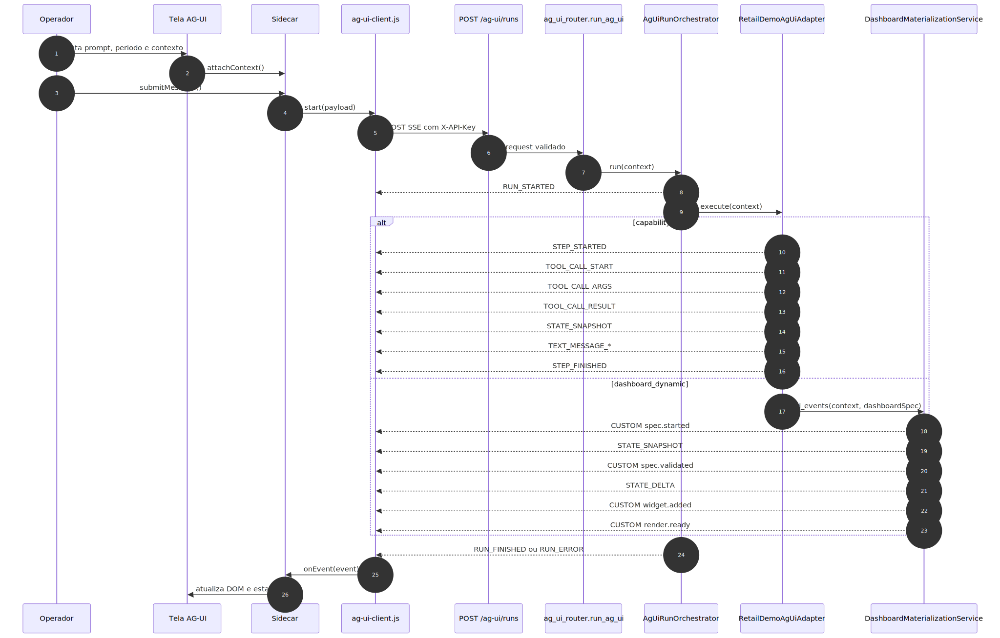

# Tutorial 101: Generative UI (AG-UI) — Como fazer o agente desenhar dashboards e cards no chat

> Leitura recomendada antes: [GUIA-COMPONENTE-WEBCHAT-EMBUTIVEL.md](GUIA-COMPONENTE-WEBCHAT-EMBUTIVEL.md) para entender o componente de chat.
> Referência técnica: [README-TECNICO-AG-UI.md](../tecnico/README-TECNICO-AG-UI.md).
> Visão de produto: [README-CONCEITUAL-AG-UI.md](../conceitual/README-CONCEITUAL-AG-UI.md).

---

## O que é Generative UI nesta plataforma

"Generative UI" (em português: interface gerada pelo agente) significa que o agente de IA, em vez de responder com texto simples, responde com uma **estrutura de dados descrevendo o que mostrar** — e o frontend transforma essa estrutura em botões, gráficos, KPIs e tabelas desenhadas de verdade na tela.

O nome "AG-UI" (Agent-Generated UI) é a sigla usada internamente. O conceito é simples: o agente devolve um "spec" (especificação), e a plataforma sabe renderizá-lo. O usuário final não vê JSON — vê um dashboard ou um painel de cards.

**Por que isso importa?** Porque a alternativa seria o agente devolver texto formatado com números, e quem integrou a plataforma teria que parsear esse texto e montar o visual por conta própria, o que é frágil e não escala. Com AG-UI, o agente define o dado e o visual juntos, de forma governada.

---

## As duas superfícies AG-UI desta plataforma

Existem dois caminhos distintos para usar AG-UI. Confundi-los é o erro mais comum de quem começa. A tabela abaixo ajuda a escolher.

| | Superfície A — Render no chat embutível | Superfície B — Borda HTTP dedicada `/ag-ui/runs` |
|---|---|---|
| **Como funciona** | O agente responde via os endpoints normais de chat (`/rag/execute`, `/agent/execute`). A resposta contém um "spec" embutido. O componente de chat detecta e desenha. | A tela abre uma conexão de streaming (SSE) com o endpoint `/ag-ui/runs`. Os eventos chegam em tempo real. |
| **Para quem é** | Quem já usa ou vai usar o WebChat v3 / componente `PrometeuEmbeddableChatRuntime`. O caminho mais simples. | Quem precisa de uma tela operacional dedicada com painel lateral, timeline de eventos, contexto visual rico. Demo varejo (PDV, vendas, checkout). |
| **Configuração** | Só YAML (subagente com `response_format`). Nenhuma alteração no código da plataforma. | Precisa de capability pack no backend + tela frontend dedicada. |
| **Formato de resposta** | Resposta HTTP normal (síncrona ou polling assíncrono). Spec chega no corpo. | Stream SSE com múltiplos eventos (RUN_STARTED, TOOL_CALL_*, STATE_SNAPSHOT, RUN_FINISHED...). |
| **Páginas de exemplo** | `ui-webchat-v3.html` (já pronto), `ui-admin-plataforma-webchat.html` | `ui-admin-plataforma-ag-ui-varejo-demo.html`, `ui-admin-plataforma-ag-ui-vendas-cockpit.html`, outras |
| **Quando usar** | Quando quiser adicionar dashboard ou capacidades ao chat existente, rapidamente, só via YAML. | Quando a experiência for uma tela operacional completa com sidebar, timeline e eventos em tempo real. |

A maior parte dos casos de uso de estagiários e consultores cai na **Superfície A**. Este tutorial foca nela. A Superfície B é coberta com mais detalhe no [README-TECNICO-AG-UI.md](../tecnico/README-TECNICO-AG-UI.md).

---

## Parte 1 — Tutorial passo a passo: "quero que meu agente responda com um dashboard"

Este é o caminho mais fácil e completamente suportado hoje: o agente DeepAgent tem um subagente especializado em dashboard, e você configura isso só no YAML.

### O que você precisa entender antes de começar

**DeepAgent** é um tipo de agente supervisor. Ele orquestra subagentes especializados. Para gerar dashboard no chat, você cria um subagente dentro do supervisor e configura ele com um `response_format` — isso é uma instrução para a LLM (o modelo de linguagem) devolver a resposta em JSON seguindo um esquema específico, em vez de texto livre.

**`response_format`** é uma chave YAML que diz ao subagente: "sua resposta deve ser um JSON que siga este esquema". Quando o esquema é o contrato `DashboardSpec 1.0`, o frontend sabe detectar e desenhar o resultado.

**Nenhuma alteração no código da plataforma é necessária.** Você só escreve YAML.

### Passo 1 — Verificar o host

O WebChat v3 (`ui-webchat-v3.html`) já carrega todos os scripts necessários para renderizar AG-UI, incluindo os gráficos (ApexCharts). Se você está usando essa página, não precisa fazer nada no frontend.

Se estiver criando uma página nova, veja a seção "Como carregar os scripts numa tela nova" mais abaixo.

### Passo 2 — Configurar o YAML do supervisor

O exemplo real do repositório é `app/yaml/rag-config-pdv-vendas-demo.yaml`. A estrutura relevante (extraída do arquivo, com simplificações para leitura) é:

```yaml
# Supervisor DeepAgent
metadata:
  name: Meu Agente com Dashboard
  execution:
    type: deepagent    # espinha dorsal DeepAgent (obrigatório)

multi_agents:
  # ... outros subagentes (perguntas e respostas, análises, etc.) ...

  # Subagente especializado em dashboard dinâmico
  - id: subdominio_dashboard_dinamico
    name: "Especialista em Dashboard"
    description: "Responde perguntas que pedem um dashboard visual com gráficos e KPIs."
    prompt: |
      Você é especialista em análise visual de dados.
      Devolva SEMPRE um JSON puro — sem texto antes, sem texto depois, sem marcação markdown.
      O JSON deve seguir exatamente o contrato DashboardSpec versão 1.0.
      Nunca inclua HTML, JavaScript, CSS ou SQL livre na resposta.
      Use apenas as queries aprovadas nas tools disponíveis.
    tools:
      - dyn_sql<minha_query_de_vendas>
      - dyn_sql<minha_query_de_kpi>
      - dyn_sql<minha_query_de_ranking>
    limits:
      max_iterations: 3
      timeout_seconds: 30
    execution:
      default_mode: direct_sync
    response_format:          # <-- AQUI está a chave
      type: object
      additionalProperties: false
      required:
        - version
        - title
        - layout
        - widgets
        - dataSources
        - narrative
        - refreshPolicy
        - safety
      properties:
        version:
          type: string
          const: "1.0"        # a plataforma exige exatamente "1.0"
        title:
          type: string
        layout:
          type: object
          properties:
            kind: { type: string, const: grid }
            columns: { type: integer, minimum: 1, maximum: 12 }
            rowHeight: { type: integer, minimum: 80, maximum: 360 }
            gap: { type: integer, minimum: 4, maximum: 32 }
        widgets:
          type: array
          minItems: 1
          items:
            type: object
        # ... demais campos do contrato DashboardSpec ...
        safety:
          type: object
          properties:
            htmlAllowed: { type: boolean, const: false }
            scriptAllowed: { type: boolean, const: false }
            freeSqlAllowed: { type: boolean, const: false }
            secretsAllowed: { type: boolean, const: false }
```

O campo `response_format` instrui a LLM a devolver exatamente o JSON daquele esquema. O frontend (`embeddable-chat-spec-runtime.js`) detecta a presença de `version: "1.0"` e `widgets` no payload, valida o contrato e renderiza o dashboard.

> **Nota:** O exemplo real completo, com os campos `dataSources`, `narrative`, `refreshPolicy` e a lista de widgets detalhada, está em `app/yaml/rag-config-pdv-vendas-demo.yaml` nas linhas 559-606+. Consulte o arquivo real antes de copiar para produção.

### Passo 3 — Testar

Com o YAML configurado e o agente apontando para ele no WebChat v3:

1. Faça uma pergunta que acione o subagente de dashboard (ex.: "Mostre o dashboard de vendas do mês").
2. A resposta deve aparecer como um painel visual — não como texto, não como JSON bruto.
3. Se aparecer texto ou JSON: veja a seção "Por que às vezes aparece texto em vez do dashboard?" mais abaixo.

### O que NÃO é necessário

- Não é necessário mexer no código da plataforma.
- Não é necessário mexer no componente `PrometeuEmbeddableChatRuntime`.
- Não é necessário criar endpoint novo ou adapter backend.
- Não é necessário abrir stream SSE.
- Se estiver usando o WebChat v3, não é necessário nem carregar scripts extras — ele já faz isso.

---

## Parte 2 — Como o painel de capacidades funciona (CapabilitiesSpec)

Quando o usuário pergunta "o que você faz?" ou "sobre o que posso te perguntar?", um supervisor DeepAgent automaticamente responde com um painel visual de capacidades — cards com grupos de assuntos e chips clicáveis de perguntas-exemplo.

Isso acontece porque a tool builtin `descrever_capacidades` é **auto-injetada em todo supervisor DeepAgent**. Você não precisa configurar nada. Basta ter um agente do tipo DeepAgent.

O painel lê os subagentes declarados em `multi_agents[]` do YAML e monta os cards a partir das descrições amigáveis de cada subagente. Por isso, a qualidade do painel depende da qualidade dos campos `name` e `description` dos seus subagentes — escreva-os como se fosse para um usuário leigo, não para um desenvolvedor.

O painel **nunca** expõe nomes internos de tool, ID de subagente, SQL ou qualquer dado técnico. Um validador no backend barra qualquer vazamento antes de emitir o spec.

---

## Parte 3 — Que tipos de componentes visuais existem

### Os três specs reconhecidos

A plataforma reconhece três tipos de "spec" AG-UI no caminho do chat embutível:

| Spec | Nome técnico interno | O que renderiza |
|---|---|---|
| Painel de capacidades | `capabilities` | Título + cards de grupos de assuntos + chips clicáveis de perguntas |
| Dashboard dinâmico | `dashboard` | KPIs, gráficos (barra, linha, rosca), tabela, ranking, alert, timeline, insight_card |
| Interface genérica governada | `uiSpec` | Delega ao renderizador oficial de UISpec (table, kpi, insight_card) |

### Widgets do DashboardSpec (confirmados no código)

Os seguintes tipos de widget estão registrados e são reconhecidos pelo renderer:

- `kpi` — número de destaque (ex.: total de vendas R$ 1,2M)
- `line_chart` — gráfico de linha (ex.: evolução de vendas por mês)
- `bar_chart` — gráfico de barras (ex.: vendas por loja)
- `donut_chart` — gráfico de rosca / pizza (ex.: mix de categorias)
- `table` — tabela com linhas e colunas
- `insight_card` — card de texto analítico (interpretação de um número)
- `alert` — destaque de alerta ou aviso
- `timeline` — sequência de eventos no tempo
- `ranking` — lista ordenada (ex.: top 5 produtos)

Gráficos (`line_chart`, `bar_chart`, `donut_chart`) são renderizados com **ApexCharts** quando o adapter está carregado na página. Se o vendor não estiver presente, o widget cai em um placeholder estático — o restante do dashboard continua funcionando. Isso é por design (falha fechada, nunca quebra a tela).

### Componentes do UISpec (confirmados no código)

- `table`
- `kpi`
- `insight_card`

---

## Parte 4 — Como dar bind em campos da tela e mandar junto com a pergunta

"Bind" aqui significa: quando o usuário digitar uma pergunta e apertar Enviar, a plataforma envia ao backend não só a pergunta digitada, mas também o contexto da tela — por exemplo, o projeto aberto, os arquivos marcados, ou o período selecionado. O usuário vê a pergunta limpa na bolha; o agente recebe a pergunta + contexto enriquecido.

Esse mecanismo existe, é estável e funciona **sem mexer no componente e sem mexer no YAML**.

### O hook `buildPayloadText`

O componente `PrometeuEmbeddableChatRuntime` expõe um hook chamado `buildPayloadText`. Você passa esse hook na criação do componente, na sua página host. A cada envio feito pelo input embutido (botão Enviar ou tecla Enter), o componente chama sua função passando o texto digitado e usa o texto que você devolver como o payload enviado ao backend.

```javascript
// Exemplo conceitual — na SUA página host
const chat = window.EmbeddableChatRuntime.createGenericEmbeddableChat({
  // ... outras configs (yaml, email, apiKey, modo) ...
  buildPayloadText: (perguntaDigitada) => {
    const contexto = obterContextoAtualDaTela();  // função da SUA página
    if (!contexto) return perguntaDigitada;       // sem contexto: envia normal
    return contexto + '\n\nPergunta do usuário:\n' + perguntaDigitada;
  },
});
```

A bolha exibe `perguntaDigitada`. O backend recebe o texto completo com o contexto.

### Exemplo real: tela de projetos DNIT

A tela `app/ui/static/js/dnit-project-detail.js` usa exatamente esse hook. Quando o usuário faz uma pergunta na aba de chat de um projeto DNIT, o componente enriquece automaticamente o payload com:

- o título do projeto aberto;
- os arquivos marcados pelo usuário na lista de documentos;
- trechos de contexto selecionados.

O código relevante (linhas 1483, 1572-1614 do arquivo):

```javascript
// registro do hook na criação do componente (dnit-project-detail.js ~L1483)
buildPayloadText: (pergunta) => this.chatComporPayloadText(pergunta),

// composição do texto enriquecido (~L1608-1614)
chatComporPayloadText(pergunta) {
  const contexto = (this._chatContextoSessao || '').trim();
  const limpa = (pergunta || '').trim();
  if (!contexto) return limpa;
  return contexto + '\n\nPergunta do usuário:\n' + limpa;
}
```

O `_chatContextoSessao` é montado previamente pela tela com título do projeto, arquivos e trechos. O usuário não vê esse contexto na bolha — ele aparece apenas no log interno com o `correlation_id`, para auditoria.

### Alternativa por chamada: `payloadText` direto

Se você chama `perguntar()` programaticamente (não pelo input embutido), pode passar o payload enriquecido diretamente:

```javascript
await chat.perguntar('Qual o status do contrato?', {
  payloadText: 'Projeto: Duplicação BR-050\nArquivos: contrato_2024.pdf\n\nQual o status do contrato?'
});
```

A bolha exibe "Qual o status do contrato?". O backend recebe o texto completo.

---

## Parte 5 — Como expandir para fazer mais

### O caminho genérico `multi_agents[].ag_ui.ui_specs`

Existe na plataforma um campo `ag_ui.ui_specs` nos modelos internos (AST, validators, compilação) que permite declarar specs de interface por subagente diretamente no YAML. Porém, ao verificar o repositório, **nenhum arquivo YAML no projeto usa esse campo hoje** — está implementado no código mas não exercitado por nenhum exemplo real. Se quiser explorar esse caminho, entre em contato com o time de plataforma para entender o contrato atual; não há exemplo documentado para copiar.

O caminho comprovado hoje é o `response_format` (Parte 1 deste tutorial).

### A Superfície B: experiências operacionais dedicadas

Para criar uma tela operacional completa — com painel lateral de contexto, timeline de eventos em tempo real, botões rápidos de ação, múltiplas capabilities encadeadas — o caminho é a Superfície B: `POST /ag-ui/runs` com SSE.

Essa superfície tem:
- um capability pack no backend definindo quais consultas e ações são permitidas;
- um adapter que recebe a requisição e emite eventos padronizados;
- um cliente SSE no frontend (`ag-ui-client.js`) que recebe e aplica cada evento;
- um sidecar visual (`ag-ui-sidecar-chat.js`) com painel lateral e histórico.

Os diagramas abaixo mostram o fluxo completo da Superfície B.

#### Diagrama 1 — Fluxo macro da Superfície B



O operador abre a tela, monta contexto e aciona o envio. A página monta o payload e faz `POST /ag-ui/runs`. O router valida permissão e o orquestrador emite `RUN_STARTED`. O adapter decide o caminho (capability fixa com `dyn_sql` aprovado, ou `dashboard_dynamic` com `DashboardSpec`). Os eventos chegam pelo stream SSE e o cliente os aplica no store. O sidecar atualiza a timeline e a página exibe o resultado.

#### Diagrama 2 — Sequência de eventos (Superfície B)



Detalhe da troca de eventos entre frontend e backend nos dois ramos: capability fixa (STEP_STARTED, TOOL_CALL_*, STATE_SNAPSHOT, TEXT_MESSAGE, STEP_FINISHED) e dashboard_dynamic (CUSTOM spec.started, STATE_SNAPSHOT, CUSTOM spec.validated, STATE_DELTA, CUSTOM widget.added, CUSTOM render.ready).

#### Diagrama 3 — Componentes do backend (Superfície B)



Mapa das camadas: entry points (router), orquestração, agents/graphs (YAML), tools e integrações (adapter, dyn_sql, materialização), contratos (schemas Pydantic), dados e UI (banco, ag-ui-client, sidecar, dashboard-dinamico).

#### Diagrama 4 — Navegação entre telas (Superfície B, demo varejo)



Hub de varejo com 4 telas (Vendas, Checkout, Catálogo, Dashboard), todas usando o mesmo `ag-ui-client.js` e chegando ao mesmo orquestrador backend.

#### Diagrama 5 — Governança de ponta a ponta



Mostra os três domínios de governança: YAML define supervisor e tools; validador bloqueia HTML/JS/SQL livre; browser não cria `correlation_id` (ele vem do backend). Princípio central: a segurança é construída nas camadas e não depende de boa vontade do cliente.

> **Importante:** todos os 5 diagramas acima descrevem a **Superfície B** (`/ag-ui/runs`, SSE, adapter). Eles **não** cobrem a Superfície A (render no chat embutível via `response_format`). Na Superfície A não há stream, não há adapter dedicado e não há sidecar — o frontend detecta o spec no corpo da resposta HTTP normal.

Para documentação técnica completa da Superfície B: [README-TECNICO-AG-UI.md](../tecnico/README-TECNICO-AG-UI.md).

---

## Como carregar os scripts numa tela host nova (Superfície A)

Se você vai criar uma nova página HTML e quer que ela suporte render AG-UI no chat embutível, carregue os scripts **nesta ordem**, antes do `embeddable-chat-runtime.js`:

```html
<!-- 1. vendor da lib de gráfico (necessário para widgets de gráfico) -->
<script src="/ui/static/js/vendor/apexcharts.min.js?v=5.14.0"></script>
<!-- 2. porta neutra de gráfico -->
<script src="/ui/static/js/shared/ag-ui-chart-adapter.js"></script>
<!-- 3. adapter ApexCharts (se auto-registra ao carregar) -->
<script src="/ui/static/js/shared/ag-ui-chart-adapter-apexcharts.js"></script>
<!-- 4. detecção de spec + registry de renderizadores + renderer de Capacidades -->
<script src="/ui/static/js/shared/embeddable-chat-spec-runtime.js"></script>
<!-- 5. bridge ESM: liga os renderizadores e publica em window.PrometeuEmbeddableChatSpecRuntime -->
<script type="module" src="/ui/static/js/shared/ag-ui-spec-render-bridge.js"></script>
<!-- 6. por fim, o componente de chat -->
<script src="/ui/static/js/shared/embeddable-chat-runtime.js"></script>
```

A ordem importa porque cada script depende do anterior. O bridge (passo 5) é `type="module"` — executa de forma diferida, mas o componente resolve o runtime de spec de forma lazy no momento de renderizar, então isso não causa problema.

O `renderStructured` vem **ligado por padrão**. Se quiser forçar 100% texto numa host específica, passe `renderStructured: false` na configuração.

O WebChat v3 (`ui-webchat-v3.html`) já inclui tudo isso. Se você parte dele, não precisa repetir.

---

## Por que às vezes aparece texto em vez do dashboard

O componente tem um **fallback duro**: se qualquer coisa der errada no render estruturado, ele mostra o texto/JSON da resposta em vez de travar. Isso é por design — nunca piora a experiência, nunca quebra a tela.

Razões para cair no fallback:

1. **Spec não reconhecido:** o agente devolveu algo que não tem `version: "1.0"` + `widgets`, nem os outros marcadores de spec. Verifique o prompt do subagente e o `response_format`.
2. **JSON com texto extra:** o agente devolveu markdown com o JSON dentro (ex.: ````json ... ````). O prompt do subagente deve proibir isso explicitamente: "Devolva APENAS o JSON, sem texto antes ou depois, sem marcação markdown."
3. **`response_format` com schema errado:** se o esquema não corresponde ao contrato `DashboardSpec 1.0`, a LLM pode devolver JSON inválido que o validador rejeita. Compare com o esquema do arquivo real.
4. **Scripts fora de ordem ou ausentes:** se `ag-ui-spec-render-bridge.js` não foi carregado ou veio antes do `embeddable-chat-spec-runtime.js`, o runtime não está disponível e o componente renderiza texto. Verifique o console do navegador — o WebChat v3 lança erro explícito nesses casos.
5. **ApexCharts ausente:** só os widgets de gráfico caem em placeholder; KPIs, tabelas e cards continuam renderizando. Se só os gráficos sumiram, o vendor não foi carregado.
6. **`renderStructured: false`:** foi desligado explicitamente na configuração. Verifique a config da host.
7. **Modo errado:** o componente em modo `qa` (pergunta-resposta sobre documentos) raramente produz dashboard; dashboard é mais natural em modo `deepagent`. Verifique o modo configurado no YAML.

---

## FAQ do estagiário

**P: Preciso mexer no código da plataforma para usar AG-UI?**
R: Não, para os caminhos suportados. Dashboard via `response_format` é 100% YAML. Painel de capacidades é automático em supervisores DeepAgent. Para embutir numa tela nova, você configura a página HTML (carrega os scripts) — isso é configuração de página, não alteração do core.

**P: Basta o YAML? Como?**
R: Sim, para o dashboard. Você adiciona um subagente dentro do `multi_agents[]` do seu supervisor DeepAgent, escreve o prompt pedindo JSON puro, lista as tools de consulta de dados (`dyn_sql`) e adiciona o `response_format` com o esquema `DashboardSpec 1.0`. O frontend detecta e renderiza automaticamente.

**P: Preciso mexer no componente de chat (`embeddable-chat-runtime.js`)?**
R: Não. O componente já suporta render AG-UI e vem com `renderStructured: true` por padrão. Você não edita o componente — você apenas configura a tela host (scripts, YAML, buildPayloadText se precisar).

**P: Além de gráficos, o que mais dá para mostrar?**
R: No DashboardSpec: kpi, line_chart, bar_chart, donut_chart, table, insight_card, alert, timeline, ranking. No CapabilitiesSpec: cards de grupos + chips de perguntas clicáveis. No UISpec: table, kpi, insight_card.

**P: Como dar bind em campos da tela e mandar junto com a pergunta?**
R: Via hook `buildPayloadText` passado na criação do componente. Sua função recebe o texto digitado e devolve o texto enriquecido. O componente envia o enriquecido ao backend e mostra o original na bolha. Veja a Parte 4 deste tutorial.

**P: Como testo se está funcionando?**
R: Abra o WebChat v3 (`/ui/static/ui-webchat-v3.html`), configure o YAML do agente com o subagente de dashboard, faça uma pergunta que acione o subagente (ex.: "mostre o dashboard"). Se aparecer UI visual (cards, gráficos), funcionou. Se aparecer texto ou JSON, leia a seção "Por que às vezes aparece texto" acima e verifique o console do navegador por erros de script.

**P: Por que às vezes vem texto em vez do gráfico?**
R: Porque o fallback duro está funcionando como esperado. O componente nunca trava — se não conseguir renderizar o spec (por JSON inválido, schema errado, scripts fora de ordem, `renderStructured: false`, ou agente que não retornou spec), ele mostra texto. Diagnose verificando: (a) a resposta bruta no log com o `correlation_id`, (b) se o JSON bate com o esquema DashboardSpec, (c) se os scripts foram carregados na ordem certa (console do navegador).

**P: Como descubro os widgets disponíveis?**
R: A lista canônica está na Parte 3 deste tutorial (confirmada lendo os arquivos `ag-ui-dashboard-renderer.js` e `ag-ui-dashboard-validator.js`). Para o esquema completo do contrato DashboardSpec 1.0, veja `src/api/schemas/ag_ui_dashboard_models.py` e o exemplo em `app/yaml/rag-config-pdv-vendas-demo.yaml`.

**P: O agente precisa ser DeepAgent para usar AG-UI?**
R: Para o CapabilitiesSpec (painel automático de capacidades): sim, porque a tool `descrever_capacidades` é auto-injetada só em supervisores DeepAgent. Para o DashboardSpec via `response_format`: tecnicamente qualquer agente com subagentes configurados pode usar, mas o modelo natural é DeepAgent com subagente especializado. Para a Superfície B (`/ag-ui/runs`): o `executionKind` é definido no capability pack, que pode ser `retail_demo`, `deepagent`, `workflow` ou outro.

**P: Qual a diferença entre a Superfície A e a Superfície B na prática?**
R: Superfície A = chat normal com resposta que vira UI. Superfície B = tela dedicada com streaming de eventos em tempo real. Para um chat corporativo simples com dashboard, use A. Para uma tela de cockpit operacional com timeline, múltiplos contextos visuais e ações rápidas, use B.

**P: Posso ter dashboard E texto na mesma conversa?**
R: Sim. Cada mensagem do assistente é avaliada individualmente. Se o subagente de dashboard responde, você vê dashboard. Se o subagente de texto responde, você vê texto. A conversa mistura os dois naturalmente.

**P: O que é `correlation_id` e por que aparece nos logs?**
R: É um identificador único gerado pelo backend para cada envio. Ele serve para rastrear o que aconteceu naquela requisição — você consegue abrir o log exato daquela interação usando `python -m src.log_analyzer <correlation_id>`. Se o agente respondeu de forma estranha, você pega o `correlation_id` do componente (`chat.obterEstadoAtual().correlationId`) e abre o log para investigar.

---

## As 10 dúvidas de um estagiário que vai criar um agente AG-UI

**1. Preciso mexer no código-fonte da plataforma para fazer dashboard funcionar?**
Não. O código da plataforma já está pronto. Você só escreve YAML (subagente com `response_format`) e, se for criar uma página nova, carrega os scripts na ordem certa. O core não é modificado.

**2. Só YAML mesmo? Qual parte do YAML?**
Sim, só YAML para o dashboard. A parte que importa é a seção `multi_agents` do seu supervisor DeepAgent. Você adiciona um subagente com `response_format` apontando para o esquema DashboardSpec 1.0. O supervisor envia as perguntas de dashboard para esse subagente, que responde com o JSON que o frontend desenha.

**3. Preciso mexer no componente de chat?**
Não. O componente `PrometeuEmbeddableChatRuntime` já tem o render AG-UI ligado por padrão (`renderStructured: true`). Você não edita o componente; você configura a tela host onde ele vive.

**4. Como faço para que a LLM não quebre o contrato e devolva texto errado?**
No prompt do subagente, seja explícito: "Devolva APENAS o JSON do DashboardSpec 1.0. Sem texto antes, sem texto depois, sem marcação markdown, sem cercas de código." E garanta que o `response_format` no YAML tenha o `const: "1.0"` no campo `version` — isso força a LLM a usar exatamente essa versão.

**5. Além de gráficos, posso mostrar KPIs e tabelas?**
Sim. O DashboardSpec suporta `kpi`, `table`, `ranking`, `insight_card`, `alert`, `timeline`, `line_chart`, `bar_chart` e `donut_chart`. Uma resposta de dashboard pode misturar widgets diferentes numa mesma grade. Você não é obrigado a ter gráficos — pode ser só KPIs e tabela.

**6. Como dar "bind" nos campos da minha tela para mandar contexto junto com a pergunta?**
Via hook `buildPayloadText`. Ao criar o componente na sua página host, você passa uma função que recebe o texto digitado e devolve o texto enriquecido com o contexto da sua tela. O componente envia o enriquecido ao backend e mostra o original na bolha. Exemplo real: tela DNIT enriquece cada pergunta com o projeto aberto e os arquivos marcados.

**7. Como testo localmente antes de colocar em produção?**
Abra `http://127.0.0.1:5555/ui/static/ui-webchat-v3.html`, carregue o YAML do seu agente (ou cole diretamente no campo), faça uma pergunta que acione o subagente de dashboard. Observe: se aparecer UI visual, funcionou. Se aparecer texto, abra o DevTools (F12) → Console para ver erros de script, e pegue o `correlation_id` do `obterEstadoAtual()` para investigar o log com `python -m src.log_analyzer`.

**8. Por que às vezes aparece texto JSON cru em vez do dashboard?**
Porque o fallback funcionou — o componente não conseguiu renderizar e caiu no texto. Causas mais comuns: (a) o agente devolveu JSON com texto antes/depois; (b) o esquema está errado e o validador rejeitou; (c) algum script não foi carregado ou está fora de ordem. Veja a seção "Por que às vezes aparece texto" acima.

**9. Precisa que o agente seja do tipo DeepAgent?**
Para o CapabilitiesSpec automático: sim. Para o DashboardSpec via `response_format`: o modelo natural é DeepAgent com subagente especializado, mas qualquer agente que consiga devolver o JSON correto funciona. Para a Superfície B (`/ag-ui/runs`): depende do `executionKind` configurado no capability pack.

**10. Se eu errar o `response_format` e a LLM devolver JSON diferente do esperado, a tela vai quebrar?**
Não. O componente tem fallback duro — em qualquer falha de validação ou renderização, ele mostra o texto/JSON bruto em vez de travar ou mostrar erro genérico. O pior caso é o usuário ver o JSON na bolha. Isso é ruim visualmente, mas não quebra a tela nem causa erro.

---

## Erros a evitar (pegadinhas)

**Esquecer o bridge ESM ou colocar fora de ordem.** Sem `ag-ui-spec-render-bridge.js`, o runtime não existe em `window.PrometeuEmbeddableChatSpecRuntime`. O componente renderiza texto sem aviso. O WebChat v3 tem uma checagem que lança erro explícito (`_exigirSpecRuntimeAgUi` em `ui-webchat-v3.js`), mas páginas customizadas não têm esse gate. Sempre carregue na ordem documentada.

**Esquecer que o bridge é `type="module"`.** Scripts `type="module"` executam de forma diferida. Se você colocar scripts dependentes do bridge antes do `DOMContentLoaded`, podem rodar antes do bridge. O componente lida com isso fazendo resolução lazy — mas se você chamar `setWelcomeCapabilities` imediatamente na criação antes do bridge terminar, o onboarding pode não funcionar. A solução é chamar dentro de um `DOMContentLoaded` ou após o evento `ready` do componente.

**`response_format` com schema parcial.** Se o schema que você colocou no YAML não cobre todos os campos obrigatórios do DashboardSpec 1.0 (`version`, `title`, `layout`, `widgets`, `dataSources`, `narrative`, `refreshPolicy`, `safety`), a LLM pode devolver um JSON que passa no `required` do seu schema mas falha no validador da plataforma. Use o exemplo real como base, não recrie do zero.

**Prompt do subagente sem instrução de formato.** Sem dizer explicitamente "devolva APENAS JSON puro", a LLM vai devolver markdown com o JSON dentro (ex.: ` ```json ... ``` `). O detector de spec não consegue parsear isso e o fallback entra. A instrução de formato no prompt é obrigatória, não opcional.

**Agente sem `tools` de dados.** Um subagente de dashboard que não tem `dyn_sql` configurado não tem como buscar dados reais. Ele pode alucinar números ou devolver um dashboard vazio. Sempre configure as tools de consulta aprovadas antes de ativar o subagente.

**Usar `renderStructured: false` acidentalmente.** Se a host page passou `renderStructured: false` (por segurança ou por cópia de outro projeto), o render AG-UI fica desligado e toda resposta vira texto, mesmo que o spec seja perfeito. Verifique a config do componente.

**Confundir as duas superfícies.** O caminho `response_format` + chat embutível (Superfície A) e o caminho `/ag-ui/runs` + SSE (Superfície B) são independentes. Não tente usar `ag-ui-client.js` ou `ag-ui-sidecar-chat.js` no chat embutível — eles são da Superfície B. Não tente detectar spec da Superfície A no stream SSE — eles são transportes diferentes.

---

## Referências cruzadas

- [GUIA-COMPONENTE-WEBCHAT-EMBUTIVEL.md](GUIA-COMPONENTE-WEBCHAT-EMBUTIVEL.md) — detalhe completo do componente, API pública, eventos, HIL, payloadText, messageActions.
- [README-TECNICO-AG-UI.md](../tecnico/README-TECNICO-AG-UI.md) — referência técnica completa: endpoints, eventos SSE, adapters, capability packs, modelos Pydantic, runtime JS da Superfície B.
- [README-CONCEITUAL-AG-UI.md](../conceitual/README-CONCEITUAL-AG-UI.md) — visão de produto, conceitos e posicionamento.
- [GUIA-AG-UI-SDK-TERCEIROS.md](GUIA-AG-UI-SDK-TERCEIROS.md) — integração via SDK para terceiros.
